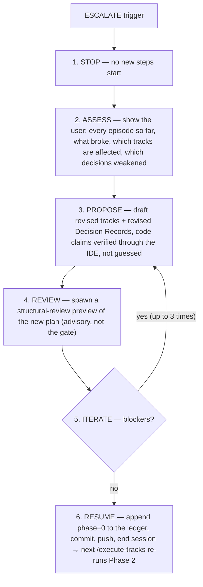
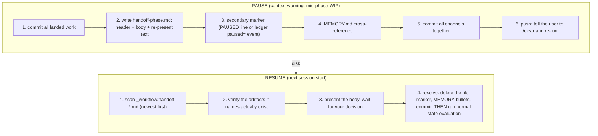

# Chapter 14 — When things change mid-flight

The happy path is a straight line: research, design, a plan that passes review, then track after track of steps that implement, test, commit, and review clean. Real runs leave that line. The plan turns out wrong once execution touches the real code. A step fails, and fails again on the retry. A session fills its context window before the phase is done. This chapter teaches the four defined recoveries for those cases. Each one is a named protocol with a fixed shape, not an improvisation: the workflow re-opens planning through one back-edge, pauses and resumes a phase through one handoff file, and gives up on a step only after a counted number of failures.

You already have the parts these recoveries act on. [Chapter 7](07-phases-sessions-phase-ledger.md) gave you the phase machine and named two things it deferred to here: the *ESCALATE* back-edge that returns a running change to planning, and the mid-phase handoff that lets a paused session resume cleanly. [Chapter 9](09-phase-a-decomposition.md) showed the Track Pre-Flight gate offering ESCALATE as one of its three choices and routed it here. Chapters [10](10-phase-b-implement-test-commit.md) through [12](12-phase-c-track-review-completion.md) gave you the implement-test-commit loop, the *episode* each step writes, the dimensional review, and track completion. This chapter is where those deferred threads get pulled: it owns the mechanics every earlier chapter named and handed forward.

## ESCALATE re-opens planning without throwing the work away

When execution proves the plan wrong, the workflow does not patch around the wrong plan and it does not start over from a blank page. It runs *inline replanning*: it stops, shows you the full situation, drafts a revised plan, previews that revision against a structural review, and resumes from the fix. The revised plan keeps every completed track and every episode written so far. Only the part the discovery invalidated gets reworked.

Three triggers route to inline replanning, and you have met all three by name. The first is the Track Pre-Flight gate from [Chapter 9](09-phase-a-decomposition.md) returning ESCALATE — either its look-back strategy panel flagged that accumulated discoveries broke the remaining plan and you accepted that verdict, or Review mode surfaced a *deep* amendment (editing a Decision Record, adding a whole new track, changing how one track's scope bleeds into another) and you chose to escalate rather than fold a redesign into a batch of light edits. The second is cross-track impact monitoring catching a foundational assumption that broke after a track already shipped: "we changed X, but track 5 still depends on the old contract." The third is a step that fails at a level no further commit can fix, where the track's whole approach is wrong rather than one step's code.

One boundary keeps ESCALATE from firing too often. *Removing* a remaining track is light, not deep: the orchestrator marks it skipped and moves on (the `[~]` skip [Chapter 9](09-phase-a-decomposition.md) mentioned, covered at the end of this chapter). *Adding* a track, by contrast, is a structural change to the plan's shape and does route to replanning. Add re-opens planning; remove does not.

The protocol runs in six moves, in order:



**Figure 14.1 — the inline-replanning cycle.** Stop, assess, propose, preview-review, iterate, then reset to plan review and end the session. The structural preview in step 4 is a fail-fast check, not the real gate.

Two of these moves carry the weight. The *assess* move is the user's window: the orchestrator lays out every track episode so far, the partial progress of any in-flight track, exactly which assumptions broke and why, which remaining tracks the break affects, and which Decision Records it weakened. You see the full damage before any rework is drafted. The *propose* move drafts the fix — new or modified tracks, reordered dependencies, removed tracks, and revised Decision Records, each with its rationale. When a replan adds a new claim about the code (a track names a class, a decision cites a method), that claim is verified the same way Phase 1 planning verified its claims: through the IDE's symbol search, not a text grep, because a missed caller becomes a fresh surprise in the revised track. A signature change whose impact reaches "callers of callers" is exactly the question a text search answers unreliably, and the most common reason a replan underestimates its own scope.

## The freeze still holds, so a replan writes into the plan

A replan can invalidate something the frozen `design.md` says. [Chapter 5](05-phase-1-design-document.md) taught you that `design.md` is frozen the moment Phase 1 ends and is never edited again, and that a Phase 3 replan records its new intent in the plan instead. This is that path. The replan does not reach back and rewrite the design, not even when the revision breaks a decision's link to a design section or would have renamed one. Instead it records the new design intent where execution already reads it: it revises the affected Decision Record in place, using a fixed revision format that keeps the original decision visible alongside what changed and what the new decision is.

The revision format is the mechanism that makes a revised decision honest. It does not overwrite the old text. It keeps the original decision in an `Original decision` field, adds a `What changed` field naming the discovery that invalidated it, and a `Revised decision` field carrying the new approach. The frozen `design.md` may now diverge from that revised record's mechanism, and that divergence is expected: Phase 4 writes a separate `design-final.md` that reconciles the design as actually built ([Chapter 13](13-phase-4-final-artifacts.md)). A replan never invokes the `edit-design` discipline from [Chapter 5](05-phase-1-design-document.md), because that discipline runs only in Phase 1 and Phase 4.

One decision can live as duplicated copies across several track files. When a replan revises such a decision, the orchestrator carries the revision to every track that holds a copy, in the same replan — there is no separate later pass. A not-yet-completed track gets the full revised record. A completed track, whose code is already merged, gets only a short supersession note appended to its decision log, naming the record that superseded it. That note touches no merged code and changes no track's completion mark, so it lands without pausing to ask you. Any other change to a completed track does pause and ask, because a completed track's code is done and a real revision to it usually means the work is actually a new follow-up track.

A mid-flight tier change rides this same path. [Chapter 3](03-tiers-and-the-tier-gate.md) promised that a tier estimate that turns out wrong does not force you to have guessed right: a `minimal` change that grows a second track, or a `lite` change that turns out to need a design, upgrades in flight. That upgrade is an inline replan like any other. There is no separate tier-upgrade machinery; ESCALATE is the carrier. The upgrade first *materializes* the artifacts the lighter tier never had (a `minimal` change has no plan file and no design, so the upgrade writes the thinned plan, and a `*`-to-`full` upgrade also writes the `design.md` seed) and then records the new tier by appending it to the phase ledger. Materialize first, then record: the order keeps the committed state consistent, so a crash mid-upgrade never leaves a recorded `full` tier pointing at a plan that was never written. A downgrade is not automatic. A review that already ran cannot be un-run.

The replan's last move resets the plan's review status. [Chapter 8](08-phase-2-plan-review.md) taught you that Phase 2 records its passing verdict by appending a `phase=A` boundary to the ledger, and that a revised plan makes that verdict stale. Inline replanning closes that gap itself: on a passing preview, it appends a `phase=0` boundary to the ledger, which the last-value-wins rule resolves as "back at plan review." The next `/execute-tracks` session re-runs the full Phase 2 against the revised plan, consistency and structural together, catching any consistency drift the replan introduced that the advisory structural preview did not look for. Then the orchestrator commits the revised plan and the ledger reset, pushes so the next implementer spawn cannot lose them to a working-tree reset, and ends the session. If three preview iterations cannot clear the structural blockers, the plan is broken below the level incremental revision can fix, and the orchestrator advises restarting from Phase 1 with the accumulated episodes as input.

## A handoff file bridges a paused phase to its successor

ESCALATE is one reason a session ends mid-stream. Running low on context is another, and it has its own protocol, because a session that stops mid-phase often holds state that is not yet written to any durable file. [Chapter 7](07-phases-sessions-phase-ledger.md) named this protocol and deferred it here.

The need is concrete. The phase machine resumes itself from the ledger and the track file's `## Progress` section, but those record landed work — committed steps, marked checkboxes, recorded review verdicts. They do not record work in flight: a half-drafted plan section, a research lead chased but not yet written down, a Phase C run sitting between the review passing and your approval of the completed track. Resume from the durable files alone and the next session re-runs the sub-agents, the gate-checks, or the research that produced that in-flight state. A *handoff file* captures exactly that volatile state so the successor session does not redo it.

A handoff is written only when both conditions hold: the context check returned `warning` or higher, and the current phase boundary has not yet landed in the durable files. If the next session could re-derive everything from the track file's `## Progress` alone, no handoff is needed. A Phase B pause right after a step commits needs none — the next session resumes from the next unchecked step naturally. A Phase C pause between the review passing and your track-completion approval does need one, because nothing on disk records that the review already passed.

The file lives at `docs/adr/<dir-name>/_workflow/handoff-<phase>.md`, named for the phase that paused. It carries a header (when it paused, which phase, the context level, the branch, the HEAD commit, the count of unpushed commits) and one of two bodies chosen by the shape of what paused, not by the phase number. A *research-shaped* body fits a Phase 0 or Phase 1 pause: what was being investigated, what was already ruled out, the most promising lead, open questions, and raw notes. A *decision-shaped* body fits a State 0, Phase A/B/C, or Phase 4 pause: the durable artifacts already on disk, the pending decision, and the field that earns the file, the *verbatim re-present text*. That text is the exact prompt the next session must show you, so it does not paraphrase a decision you were mid-way through making.

Two more channels back the file up. A *secondary marker* keyed to the phase gives a greppable pointer in case a regression skips the handoff scan: a `**PAUSED` line in the track's `## Progress` for an A/B/C pause, or a `paused=` event appended to the ledger for the two phases (State 0 and Phase 4) whose former host sections no longer exist in the plan. And a cross-reference goes into `MEMORY.md`, the user-global memory index, so the pause is visible at the next session start before any file is opened. All channels are written and committed together with a bare message like `Pause Phase C for context refresh — write handoff`, and the commit is pushed, so the handoff survives both a cleared session and a lost local disk.



**Figure 14.2 — the pause/resume handshake.** The pausing session writes the handoff and its backup pointers in one pushed commit; the resuming session finds the file first, resolves it before anything else, and only then routes to its normal resume state.

The resume side is strict about ordering. When a session starts and finds any `handoff-*.md` file, that file's existence is the authoritative pause signal. It outranks the in-file PAUSED marker, and if the two ever disagree, the file wins. The orchestrator stops before matching its normal resume state. It must not spawn a sub-agent or re-run the context check as a way to skip the handoff. It sorts the handoffs newest-first (multiple concurrent pauses are allowed), and for each one it first verifies that every artifact the handoff names still exists. If an artifact is missing, it presents the gap and three options: discard the stale handoff, proceed anyway because the missing artifact is exactly the work left to do, or abort and let you investigate. Abort is the default, because a silent fall-through would mask a real problem. Only once every handoff is resolved and its file, marker, and memory bullets are deleted does the session run its normal resume routing.

## A step gets two attempts, then it comes to you

The third deviation lives inside Phase B, where the implementer of [Chapter 10](10-phase-b-implement-test-commit.md) builds a step. A step can fail before it commits. The recovery is the same shape as the rest of this chapter: a defined response, counted, that escalates to you only after the count runs out.

When the implementer returns `FAILED`, it has already reverted its own uncommitted work, so the tree is clean at the step's base commit. The orchestrator then writes a *failed episode* — the same episode format from [Chapter 10](10-phase-b-implement-test-commit.md), but recording what was attempted, why it failed, and the impact on the remaining steps instead of a success. It flips that step's roster line from unchecked to `[!]`, the failure mark, and appends a matching failure line to the track's `## Progress`. The failed episode is the input the retry reads, so the next attempt does not repeat the approach that just failed.

Then the orchestrator inserts the next attempt as a fresh roster line, choosing between two shapes from what the implementer recommended. A *retry* keeps the failed `[!]` line and appends one new unchecked step right below it, with a description naming the different approach to try — `Add histogram header (retry: use page extension API)`. A *split* appends several new unchecked steps instead, each a smaller piece of the work the single step could not land whole, each marked `(split from failed step above)`. The disambiguator in the description is load-bearing: on resume, it is how the orchestrator tells a retry or split line apart from an unrelated step.

```markdown
## Concrete Steps

1. Add histogram header to leaf page — risk: medium [!] commit: (failed)
2. Add histogram header to leaf page (retry: use page extension API) — risk: medium [!] commit: (failed)
```

**Figure 14.3 — two consecutive `[!]` lines for one logical step.** The second line's `(retry: …)` disambiguator marks it as the same step's second attempt. Two failures in a row trip the two-failure rule.

The count is the discipline. When a second `[!]` lands for the same logical step, meaning the retry itself failed, that is *two consecutive failures*, and the rule is firm: **stop**. Do not spawn a third implementer. Present both failed episodes to you, with what was tried each time, why each failed, and the orchestrator's read of whether this is a step-level problem (this step's approach is wrong) or a track-level one (the track's whole foundation is wrong). You decide: retry with specific guidance, adjust the approach, skip the step, or escalate to a full replan. The rule holds whether the second failure happens live in one session or is discovered on resume by reading the two `[!]` lines. Two attempts is the budget; the third decision is always yours.

When the failure is bigger than one step, the orchestrator does not keep retrying steps. This is the case where repeated step failures trace to one root cause, or a foundational track assumption proved wrong. It recommends ESCALATE, and the first protocol in this chapter takes over: the track's approach is what needs reworking, not its code.

A note on a related failure mode you met in [Chapter 12](12-phase-c-track-review-completion.md). When a step has already committed and a *dimensional review* finding cannot be fixed by a small follow-up, the recovery first rolls the committed work back to the step's base commit, then writes the failed episode and inserts the retry. The rollback is deliberate: the review may have surfaced a design decision whose resolution invalidates the original approach, or a risk that the step was tagged too low for, and either way the next attempt should start clean and face the full review pressure from the top rather than stack on an implementation built under the wrong assumptions. The two-failure rule counts these post-commit failures the same as pre-commit ones.

## Context level is a table you read, not a feeling

The thread under all of this is knowing when a session is too full to continue safely. The workflow does not leave that to judgment. It defines four levels by the fraction of the context window used, and a required action for each.

| Level | Window used | Required action |
|---|---|---|
| `safe` | under 25% | Continue normally. |
| `info` | 25–39% | Continue, but prefer delegating exploration to sub-agents and avoid reading large files. |
| `warning` | 40–49% | Do not start the next unit of work. Save progress and ask for a session refresh. |
| `critical` | 50% and up | Do not start the next unit of work. Save progress and ask for a session refresh. |

**Table 14.1 — the context-consumption levels.** The agent reads its current level from a file the statusline writes and acts on the level. At `warning` or above, the next unit of work must not start.

The agent checks its level at the end of each intermediate action within a phase, after every step but the last, by reading the file the statusline maintains. A missing file reads as `safe`: the statusline may simply not have written it yet, and a missing reading must never block work. The point of the check is the cliff at `warning`. Below it the agent works normally, shedding the heaviest moves (large reads, deep exploration) once it crosses into `info`. At `warning` it stops before the next unit: no next step in Phase B, no next review iteration in Phase C, no further decomposition in Phase A. It commits all code, writes all progress to the track file, writes a handoff file if the pause leaves state the next session cannot re-derive, and then tells you in plain words to clear the session and re-run `/execute-tracks` with fresh context. This is not advice the agent may weigh against finishing one more step. It is mandatory: the cost of degraded work on a packed context window is worse than the cost of one more session boundary.

That is the connective tissue between the four deviations. A step that fails twice ends a session and writes the failure into episodes. An ESCALATE ends a session after resetting the plan to review. A `warning`-level context reading ends a session after writing a handoff. In every case the rule is the same one [Chapter 7](07-phases-sessions-phase-ledger.md) built the phase machine around: end cleanly at a recorded boundary, and let the next session resume from durable state. Each deviation is that one rule applied to a case where the straight line bends.

## Skipping a track is the light counterpart to all of this

One small protocol sits beside the heavy ones. A track can be *skipped*, marked `[~]`, when it is no longer needed: a Phase A review finds its functionality already exists, or you decide at session start that a remaining track is redundant. A track is never skipped on the agent's own authority. It always presents the rationale and waits for your confirmation. On confirmation the orchestrator writes a skip record to the plan, the track's intro plus a `Skipped:` reason, and deletes the track file from disk.

That deletion is terminal. The skip record in the plan keeps only enough context for the next Pre-Flight gate to assess the downstream impact. The track file carried all the per-track detail, and once it is deleted, un-skipping the track means re-authoring that detail from scratch — the file is not a recovery source after the skip. From the Pre-Flight gate's view a `[~]` track reads the same as a completed `[x]` one: its `Skipped:` line is the signal the look-back panel reads. Skip is the cheap deviation, the one that needs neither a replan nor a handoff: a track the run decided it does not need, removed with your sign-off and a one-line record of why.

## What to read next

You now have the four recoveries the workflow defines for a run that leaves the happy path. Inline replanning re-opens planning through the ESCALATE back-edge, keeping every completed track and resetting the plan to Phase 2. A handoff file bridges a session that pauses mid-phase, capturing the volatile state the durable files cannot. The two-failure rule gives a step two attempts and then hands the decision to you. And the context-level table fixes a hard stop at `warning`, where the session saves state and ends rather than degrading. Track skip is the light counterpart, removing a track the run no longer needs. Every one of them ends a session at a recorded boundary so the next session resumes cleanly — the same discipline the phase machine of [Chapter 7](07-phases-sessions-phase-ledger.md) is built on.

All of these assume the workflow itself is fixed: the procedures the run follows do not change underneath it. For a long-lived branch that is not true. The workflow files keep evolving on the main branch while a branch runs for weeks against an older copy of them, and the gap between what the branch was started under and what the workflow now says is a different kind of mid-flight change — one the run did not cause and cannot replan its way out of. [Chapter 15](15-drift-and-migration.md) is about that gap: the workflow-SHA stamp that records which version a branch was built against, the drift check that detects when the branch has fallen behind, and the migration that brings it current.

## Further reading

- `.claude/workflow/inline-replanning.md` — the ESCALATE protocol in full: the trigger list and the add-vs-remove boundary (§When ESCALATE triggers), the stop/assess/propose/review/iterate/resume cycle with PSI-backed code claims (§Process), the Decision-Record revision format and the cross-track propagation duty, the tier-upgrade and materialize-then-write rules (D11/D12), and the per-status file-location table for a revised track (§Updating plan and track files).
- `.claude/workflow/mid-phase-handoff.md` — the pause/resume protocol: when a handoff fires versus when the durable files suffice (§When this protocol fires), the file path and naming (§File location), the two body shapes (§Templates), the secondary marker per phase (§Secondary marker), and the strict resume ordering with the stale-handoff resolution table (§Resume protocol).
- `.claude/workflow/step-implementation-recovery.md` — step-failure handling: the failed-episode write and the retry/split roster formats (§Step Failure), the two-failure rule and its on-resume detection (§Two-Failure Rule), track-level failure escalation (§Track-Level Failure), and the post-commit rollback handlers that revert before retrying (§Post-Commit Handlers).
- `.claude/workflow/workflow.md` — the orchestrator-level view: the context-consumption level table and its mandatory `warning` stop (§Context Consumption Check), the session-end save checklist (§What to do before ending a session), and the one-paragraph triggers that point at the three full protocols (§Failure Handling, §Inline Replanning, §Track Skip).
- `.claude/workflow/track-skip.md` — the `[~]` skip: user confirmation, the skip record written to the plan, the terminal track-file deletion, and how Pre-Flight reads a skipped track like a completed one (§Process).
