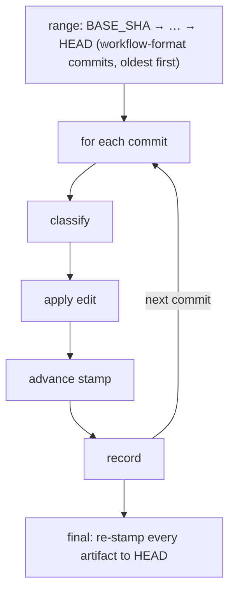

# Chapter 15 — Keeping a branch current: drift and migration

Chapter 7 taught you that a fresh session reads its state off disk: the startup routine runs a precheck, learns which phase the change is in, and puts the next session back to work. Chapter 13 added a second on-disk fact for workflow-modifying branches: the staged subtree, where edits to the workflow live until a Phase 4 promotion copies them into place. This chapter joins those ideas to a problem neither solved on its own. The workflow under your branch is not frozen. It keeps changing on `develop` while your branch runs, and your branch's `_workflow/` files were written against an older version of it. This chapter teaches the three small machines that keep a long-lived branch current: a stamp that records which version each artifact was written against, a startup check that notices when the version has moved on, and a skill that replays the changes to bring the artifacts up to date. By the end you will know how a branch that started weeks ago stays in step with a workflow that did not wait for it.

## The problem: a branch outlives the workflow it was written against

Picture a branch you opened three weeks ago. You wrote a plan, derived a set of track files, and got partway through Phase B. In those three weeks the workflow itself changed on `develop`: a required section was renamed, a track file gained a new field, a review prompt was rewritten. Your branch never saw any of it. The branch is a self-contained capsule: workflow-format commits enter its view only when *you* explicitly rebase or merge `develop` into it. Until you do, your `_workflow/` artifacts keep describing the older procedure they were born with.

That gap is harmless right up until it is not. When you finally rebase, your plan still names a section by its old heading, your track files are missing the field the schema now requires, and the next phase's machinery is built around shapes your artifacts do not have. The failure is quiet and it surfaces late: a Phase C reviewer that cannot find a section it expects, a track-completion step that trips on a missing field, an auto-resume that reads for a ledger key the branch never gained. By the time you see the symptom, the cause is buried weeks back in a workflow change you forgot happened.

The workflow's answer is to make the gap *measurable* and then *closeable*. Each artifact records the workflow version it was written against. A startup check compares that record against what the branch actually contains and tells you whether a gap has opened. And when one has, a migration replays the intervening changes onto your stale artifacts. The rest of the chapter is those three pieces, in that order.

## The stamp: every artifact records the version it was born against

The unit of measurement is one line. Every ephemeral `_workflow/**` artifact carries, on its very first line, a *workflow-SHA stamp*: an HTML comment of the exact form `<!-- workflow-sha: <40-char SHA> -->`. The H1 title of the file starts on line 2, below the stamp. The forty-character value is a git commit SHA — specifically, the workflow-format commit the artifact was written against. A plan stamped at commit `abc…` is saying, in one machine-readable line: *I describe the workflow as it stood at `abc…`; check me against that.*

```text
<!-- workflow-sha: 3e9c22298dfe68d2980646704850c781f8af88d5 -->
# Implementation plan: transactional schema
...
```

**Figure 15.1 — the stamp on line 1, the title on line 2.** The stamp is the artifact's record of which workflow version it was written against; everything downstream resolves its reference point from this line.

The value is not chosen by hand. When a writer creates an artifact, it computes the SHA from a path-scoped log over the workflow tooling itself — the most recent commit reachable from `HEAD` that touched `.claude/workflow/`, `.claude/skills/`, or `.claude/agents/`. That is the latest workflow-format change the branch has actually seen, which is exactly the version the new artifact is written against. If no commit in the branch's history ever touched those paths, the writer falls back to plain `HEAD`. The computation is one bash idiom, copied verbatim across every writer site so the fallback behaves the same everywhere; `conventions.md §1.6(b)` is its single home.

Not everything under `_workflow/` is stamped, and the exclusions are not arbitrary. Four artifact kinds carry a stamp: `implementation-plan.md`, `design.md`, the optional `design-mechanics.md`, and every `plan/track-*.md`. These are the files the phase machinery rewrites and re-derives, so a stale one matters. The append-only logs carry no stamp: the research log, the phase ledger from Chapter 7, the plan-review document, the design-mutations log. The reason is uniform across all four: nothing replays them. A consumer reads decision *content* out of a log, or keeps the last value of each key, but no machinery ever re-emits the log's format. A file that nothing replays is *replay-immune* by construction, so a stamp on it would record a version that nothing ever checks. The Phase 4 final artifacts (`design-final.md`, `adr.md`) are unstamped too, for a different reason: they survive the squash-merge into `develop`, where per-branch migration never runs, so a stamp would be stale the moment it was written. `conventions.md §1.6(f)` carries the full enumeration.

One rule about the stamp is load-bearing for everything that follows: the stamp stays on line 1 through every edit. Any tool that touches a stamped artifact (and `edit-design` mutations in particular) treats line 1 as immutable. The discipline is what keeps the stamp findable by a single anchored regex after any sequence of edits. The parser looks for the literal `workflow-sha:` anchor before the forty hex characters, precisely so it does not mistake a forty-hex run inside an H1 title (`# Backport of <SHA>: …`) for a stamp.

## Drift detection: the startup check that notices the gap

The stamp is only useful if something reads it. That something is the startup precheck from Chapter 7, in its drift-detection role. Recall how startup works: turn 1 of `/execute-tracks` (and the equivalent point in `/create-plan`) runs `workflow-startup-precheck.sh --mode full` once, and the orchestrator routes on the JSON it emits. That one JSON carries everything the startup gates need, and one of its objects is `drift`.

The detection itself is a `git log` over a range, and the range is what the stamps define. The script gathers every stamped artifact under the active plan, reads each one's line-1 SHA, and folds the set down to a single `BASE_SHA`, the oldest stamp reachable from `HEAD`, computed by a pairwise `git merge-base` walk. Then it asks one question: between `BASE_SHA` and `HEAD`, are there any commits that touched `.claude/workflow/`, `.claude/skills/`, or `.claude/agents/`? If the answer is no, every stamped artifact is already current and there is nothing to do. If the answer is yes, those commits are the gap — workflow-format changes that landed after the artifacts were written, which the branch has since pulled in by rebase or merge but which the artifacts have not caught up to.

The walk ranges against the branch's own `HEAD`, never against `develop` directly. This is the capsule property again: a workflow change is only in scope once the branch has actually absorbed it, so `HEAD` is the right upper bound. A change still sitting on `develop` that the branch has not rebased onto is not drift — it cannot affect artifacts the branch cannot see.

Before the walk even runs, three conditions short-circuit it silently, checked cheapest-first. There is nothing to check if the active plan has no `_workflow/` directory at all. There is no point checking if Phase 4 is already active — the entire `_workflow/` subtree is about to be deleted by the cleanup commit, so migrating it would be wasted work (the script reads the phase ledger's `phase` tail to decide this, since under the derived-mirror model there is no plan checkbox to read, and `minimal` has no plan at all). And there is no drift if the range comes back empty with every artifact already stamped. Any of the three returns a clean "no drift" and startup proceeds without a word. `workflow-drift-check.md §Skip conditions` orders them.

When none of the short-circuits fire and the range is non-empty, the check has found drift, and it stops to ask you what to do.

## The drift gate: migrate, defer, or suppress

A found gap is presented as a forced three-way choice. The orchestrator prints the count of workflow-touching commits in the range, the short SHA of the stamp base they sit past, and the first ten commit subjects (oldest first), then makes you pick one resolution before startup continues. There is no default; a vague answer like `yes` triggers a re-prompt, bounded at three attempts before the gate halts.

```text
Workflow drift detected: 4 commits in your branch's range touch .claude/workflow/**,
.claude/skills/**, or .claude/agents/** since stamp base 3e9c22298d.

First commits (oldest first):
  ed3fe83cda  Phase ledger and plan-as-mirror; drop the minimal-tier plan
  cbfcf74517  Bump slf4j.version ...
  ...

Resolutions:
  [migrate]   end session; user runs /migrate-workflow from this worktree
  [defer]     continue this session; deferred drift appears in the session-end summary
  [suppress]  continue this session; no session-end reminder

Pick one (no default).
```

**Figure 15.2 — the drift gate's three resolutions.** The gate detects and reports; it never migrates inline. Each resolution decides only what this session does next.

The three resolutions differ in exactly one dimension: what happens to this session and whether the residue follows you out of it.

- **Migrate now** ends the current session and tells you to re-invoke `/migrate-workflow` from this worktree. The gate deliberately does not run the migration inline. Migration is its own long-running protocol with its own context-budget loop and per-commit checkpoints, and folding two such protocols into one session risks a mid-migration context warning that triggers the wrong handoff. Ending the session is the clean boundary. No phase work has run yet at startup, so there is nothing to commit on the way out, just the one instruction line.
- **Defer** continues this session normally and records the gap so the session-end summary recites it. Concretely, it creates a todo titled `Deferred workflow drift: <count> commits since <short-base-SHA>`, and the session-end recital reads that title back verbatim so the residue is visible before you close the session. You meant to migrate; you just did not want to break out of the work you are in.
- **Suppress** continues the session and records nothing. The session-end summary stays silent about drift. The functional difference from Defer is one line of end-of-session prose; the semantic difference is "I have looked at the range and choose to ignore it for now" versus "remind me later".

One variant of the gate reads differently. If any artifact is *unstamped*, because it predates the stamp scheme or its stamp points at a commit the local repo has since pruned, the gate signals drift unconditionally, with no commit count and no range. There is no stamp base to compute a range from, so the prompt substitutes a line saying the artifacts are unstamped and that the migration's bootstrap step will gather a base SHA. The Defer todo carries the unstamped variant of its title, and the only way forward is `/migrate-workflow`, which will ask you for the base SHA directly.

## The branch-divergence gate: a different "both moved" problem

The drift gate is one of two checks the startup precheck presents, and it is easy to confuse with the other. They share a shape: both detect that two things have moved apart, both force a three-way resolution. They guard different failures, and the contrast below pins which is which.

The *branch-divergence gate* watches your branch against its own upstream. It runs in turn 1 of every `/execute-tracks` session, just before the drift gate, off the same precheck JSON. The number it reads is the ahead/behind count from `git rev-list`, and it reports divergence only when *both* counts are non-zero — when your local branch and `origin/<branch>` have each gained commits the other lacks. A branch that is purely ahead or purely behind fast-forwards cleanly and is not a divergence. The failure it prevents is mechanical and severe: a diverged branch makes every per-commit `git push` fail non-fast-forward, which silently lapses the workflow's "push every commit" backup, so the draft PR drifts behind your local work and a mid-session crash loses what was supposed to be safe.

Its three resolutions sort by which side wins:

- **Local-authoritative.** Your local rewrite (a rebase, a squash, an amend) is the one you want, and the remote is stale. Push it over the remote once at startup with `git push --force-with-lease` (never plain `--force`; the lease is what stops you clobbering a commit someone else pushed since your last fetch). Per-commit pushes then operate normally.
- **Remote-authoritative.** The remote is the one you want, and your local rewrites are disposable. After you confirm the local-only commits are unrecoverable, `git reset --hard origin/<branch>` discards them. Because this moves `HEAD`, the auto-resume decision computed earlier may no longer match, so the gate sends you back through the startup state dispatch on the fresh `HEAD`.
- **Defer.** You will resolve the divergence by hand after the session. Per-commit pushes keep failing for the rest of the session but do not block phase work, and the session-end summary reports the unpushed-commit count so the residue is visible.

The two gates answer different questions about your branch. Branch-divergence asks "has my branch's history split from its remote's?", a git-history problem about commits. Drift asks "have my `_workflow/` files fallen behind the workflow they describe?", a content problem about artifacts. The startup precheck runs both because a long-lived branch can hit either, or both, and you want each surfaced before any phase work begins. `branch-divergence-check.md` and `workflow-drift-check.md` own one gate each.

## Migration: replaying the changes onto stale artifacts

When you pick Migrate now, you clear the session and run `/migrate-workflow`. The skill's job is the one the gate cannot safely do inline: take the gap the drift check measured and close it, by replaying each intervening workflow-format change onto your stale artifacts one commit at a time.

The shape is a per-commit replay loop. The skill recomputes the same range the drift gate used, from each artifact's stamp base folded to `BASE_SHA` up to `HEAD`, and walks the workflow-format commits in that range oldest-first. For each commit, it reads the commit's diff and message, *classifies* what kind of change it is, and applies the equivalent edit to your branch's artifacts. The commit message is load-bearing here: it states the intent of the format change, which is what tells the migration what to do to your files.

The classification routes the work. A commit that renames a required section, changes a glossary term, or adds a schema field is a `format` change, and the migration applies the matching edit: rename the heading in every track file, run the global find-replace, add the missing field. A commit that only renames files records the old-to-new path mapping so later commits can follow it, but changes no content. A commit that adds a skill with no bearing on per-branch artifacts, or that only fixes a typo or whitespace, is a no-op the migration skips. Most edits are mechanical and apply without a question. The migration stops to ask you only in three concrete cases where guessing would lose data: a rename onto a section name that already exists, a deletion of a section holding content you wrote, or a new required field with no value it can infer.



**Figure 15.3 — the replay loop.** Each commit is classified, applied to the stale artifacts, and then the stamps advance to that commit's SHA before the progress file records it. The order (edit, advance, record) is what makes a crashed migration resumable.

That ordering is the heart of the design. After a commit's edits land, the migration rewrites every stamped artifact's line-1 stamp to *this commit's* SHA, and only then records the commit in a progress file at the worktree root. The sequence is always edit, advance stamp, record — never another order. The stamp advance is the crash-resume marker: a session killed mid-migration leaves the stamps pointing at the last fully-replayed commit, so the next `/migrate-workflow` reads them, recomputes the range from there, and picks up at the next unreplayed commit. The progress file is a second, finer-grained resume record, listing each replayed commit so a re-invocation skips what is already done. (This book itself is kept current by exactly this mechanism: the workflow-SHA baseline it is built against, and a drift walk over the commits since, are how an evolution run finds which chapters a workflow change has stranded.)

The skill is resumable across a `/clear` for a reason: migration runs under the same context-budget discipline Chapter 14 taught for any long session. Before each commit, it checks the context level; on `warning` or `critical` it reports progress, tells you to `/clear` and re-invoke, and ends — the progress file and the advanced stamps make the resume clean. When the loop finishes, a final batch re-stamps every artifact to `HEAD`, so that at session end every stamped artifact carries the same SHA and the next drift check reads a clean, current set.

One thing the migration deliberately does *not* do is commit. It edits your artifacts in place and leaves the worktree dirty, with a summary of what it replayed and which commits (if any) it routed to manual review. You review the diff and commit it yourself. The skill never commits on your behalf and never touches `develop`; it only brings one branch's `_workflow/` artifacts up to the version the branch has already absorbed.

## A smaller cousin: the defensive push check

The migration is the heavy machine for keeping a branch current; there is a much lighter one that keeps the branch's *backup* current, and it shares the same spirit of catching a quiet slip before it costs you. The *defensive push check* runs after every successful step implementation in Phase B and after every fix in Phase C, right when the implementer sub-agent returns success. The implementer's contract says that "success" means the commit it made has been pushed to `origin`. The defensive check is the orchestrator asserting that invariant rather than trusting it: it probes for an upstream, then checks that the implementer's commit is actually reachable from `origin`. If it is, nothing happens. If the commit is on disk but never made it to the remote (a clean-context sub-agent can run the commit and forget the push without meaning to), the orchestrator pushes the orphan itself and continues.

Auto-recovering here is safe because the push is a side-effect, not a content decision: the commit's content already passed the implementer's tests and, for a fix, the dimensional review, so there is nothing to escalate. Surfacing every dropped push to you would block on a slip the orchestrator can correct in one command. If that recovery push itself fails non-fast-forward, it routes to the same branch-divergence gate from earlier in this chapter — which is how a divergence that a stale startup fetch missed still gets caught mid-session. `defensive-push-check.md` owns the probe-and-assert recipe; both Phase B and Phase C call it with only the surrounding prose changed.

## What comes next

You now have the full picture of how a long-lived branch stays in step with a workflow that keeps moving: a stamp on each artifact records the version it was written against, the startup drift check measures the gap between that version and what the branch has absorbed, the drift gate makes you decide what to do about it, and `/migrate-workflow` replays the intervening changes to close the gap — while the branch-divergence gate and the defensive push check guard the branch's history and its backup alongside. That completes the operational story: you can run a change through every phase, handle it when the plan turns out wrong mid-flight, and keep the branch current as the ground shifts under it.

Notice what the migration kept assuming: that the workflow files are written to a standard precise enough that a section rename or a field addition can be replayed mechanically. That standard is not an accident, and it is the last thing this book has to teach. The final chapter turns from running the workflow to the writing it enforces — the house style that governs every artifact you produce, the review agent that checks your prose against it, and the reflection pass that, at the end of a session, files the issues that improve the workflow itself. The workflow that keeps your branch current also keeps improving; Chapter 16 is how.

## Further reading

- `.claude/workflow/conventions.md` — §1.6 is the single source of truth for the workflow-SHA stamp: the line-1 format and position contract (§1.6(a)), the canonical parser idioms with the `workflow-sha:` anchor (§1.6(a1)), the creation-time SHA computation (§1.6(b)), the `BASE_SHA..HEAD` range definition (§1.6(c)), the unstamped-artifact protocol (§1.6(d)), the non-rule against a silent auto-computed default (§1.6(e)), and the enumeration of stamped versus excluded artifact kinds (§1.6(f)). §1.7 owns the staging convention Chapter 13 taught, referenced here only for the staged subtree the drift walk deliberately omits.
- `.claude/workflow/workflow-drift-check.md` — the drift gate's resolution UX: the JSON fields the gate reads from the precheck script (§Detection), the three cheapest-first skip conditions (§Skip conditions), the no-default Migrate / Defer / Suppress prompt and its unstamped-short-circuit rendering (§Resolutions), and the per-resolution session behavior (§Migrate now, §Defer, §Suppress, §After the choice).
- `.claude/workflow/branch-divergence-check.md` — the three-resolution divergence gate: the ahead/behind detection the script supplies (§Detection), and the local-authoritative force-push, remote-authoritative reset, and defer resolutions (§Local-authoritative, §Remote-authoritative, §Defer).
- `.claude/skills/migrate-workflow/SKILL.md` — the per-commit replay: the resume-tracker setup (§Step 0), preflight and plan-dir resolution (§Step 1), the unstamped bootstrap (§Step 2.0), the range computation from stamps (§Step 2), the per-commit loop with its context check, classification, edit application, lockstep stamp advance, and progress record (§Step 4 and its sub-steps), the final stamp-to-HEAD batch (§Step 4.8), and the dirty-worktree no-commit contract (§Notes).
- `.claude/workflow/defensive-push-check.md` — the orchestrator-side assertion that an implementer's committed work reached `origin`: why auto-recovery is safe (§Why it exists), the probe-and-assert recipe (§Procedure), and the routing on a failed recovery push (§Recovery push failure).
