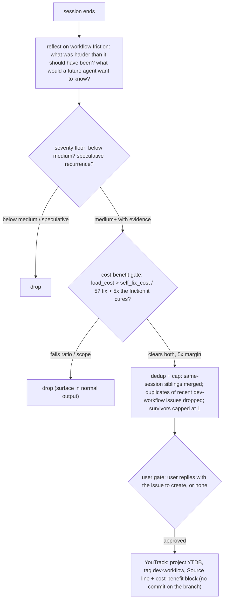

# Chapter 16 — Writing for the workflow and improving it

You have now followed a change from a first request all the way to a merged set of artifacts. You wrote a research log, a design document, a plan and its tracks, episodes, and review reports. Two facts about all that writing have been left implicit until now. First, every word of it is held to a single, enforced standard. Second, the act of running the workflow feeds back into the workflow itself: a friction you hit on one run becomes a recorded improvement for the next. This chapter teaches the writing standard and the feedback loop. They are the two cross-cutting concerns that touch every artifact and every phase you have already met.

Start with one sentence, drafted the way an unedited model writes it:

> This pivotal change leverages a robust caching layer to seamlessly unlock significant performance gains, underscoring our commitment to a comprehensive storage solution.

Now the same claim, rewritten to the project standard:

> This change cuts page-evict latency from 1.2 ms p99 to 0.4 ms p99 by batching writes per page.

The second sentence is shorter, names a number, and a reviewer can act on it in one read. The first performs depth and says almost nothing. The rule set that turns the first into the second is the project *house style*, and the rest of this chapter's first half is about where it applies and how the workflow enforces it.

## The default register is the failure mode

The standard exists because the default register of a large language model is the failure mode for technical prose. That register is verbose, hedging, list-heavy, and exhaustively parallel. It reaches for *leverage* where *use* fits, opens with *Great question!*, and strings clauses together with em dashes. A document written in it is slow to read, and reviewers ignore slow documents. The house style is the corrective: a closed set of rules that strip the register's fingerprints and push the prose toward what a senior engineer writing to peers would actually put on the page.

The canonical source is one file, `.claude/output-styles/house-style.md`. It is the single declarative home for the rules: the BLUF lead, the banned-vocabulary list, the banned sentence and analysis patterns, em-dash discipline, and the structural and document-shape rules. Every other place that mentions the style points back to that file by path rather than restating it, so the rules never fork.

The opening before-and-after showed four of those rules at once. *Pivotal*, *leverage*, *robust*, *seamlessly*, *comprehensive*, and *underscoring* are banned vocabulary. *Unlock* used metaphorically is banned. *Significant* is an adjective standing in for a number. And the whole sentence buries its claim instead of leading with it. The rewrite leads with the claim (BLUF), drops every banned word, and replaces *significant* with the measured p99 figures. That is the style in miniature: lead with the conclusion, name concrete things, and cut the words that perform without informing.

## The rules, by what they catch

BLUF, bottom line up front, is the rule the rest hang on. The first three to five sentences of any document state the decision, the change, or the symptom; context and reasoning come after. A reader who stops after the first paragraph must still be correctly oriented. A design document's Summary says what changes, what is eliminated, and the mechanism in one phrase. An issue's first paragraph says what is broken, where, and what should happen instead. A pull-request description's first paragraph says what landed and why.

The banned vocabulary is a list of words that appear at machine-anomalous frequency. It is graded into tiers by confidence, not by severity. Tier 1 is a hard ban, with no context in which any of its words is the right word for this project: *delve*, *realm*, *foster*, *showcase*, *underscore* as a verb, and a few dozen more. Tier 2 words such as *leverage* and *robust* are allowed only when the literal technical meaning is exact and no shorter word fits, and even then a one-line justification has to say why the plainer word fails. Tier 3 is promotional language, hard-banned because nothing in this repo is a marketing page. Tier 4 lists the era-specific tells current at the time of writing, updated quarterly against the public catalogue of AI-writing signs.

Below the word level, two more rule families catch the register's shape. The banned sentence patterns cut the constructions that perform thought without carrying it: negative parallelism (*it's not X, it's Y*), sycophantic openers, throat-clearing (*it's worth noting that*), closing connectives (*in conclusion*), and trailing hedges. The banned analysis patterns catch the same instinct dressed as analysis: copula avoidance (*serves as* for *is*), passive voice with no named actor, hedge stacking (*may potentially possibly*), false ranges (*anywhere from minutes to hours*), and signposting (*let's break this down*). Each pattern in the source file comes with a before-and-after rewrite, because the cure is always the same shape: state the actual mechanism, name the actual number, and delete the scaffolding.

Two structural rules round it out. Em dashes are not banned but are the strongest tell at scale, so the cap is at most one per blank-line-bounded paragraph, and the triple-clause em-dash cadence is always a finding. And bullets are reserved for lists the reader scans, not for a single thought split across three lines to look structured. This chapter's prose obeys both: the rules above are explained in paragraphs, and the bulleted lists you will meet later enumerate genuine cases.

## Where the style applies: the §1.5 tiers

A natural question after all those rules is whether they apply to code comments as strictly as to a design document. They do not, and the boundary is drawn in one place: `conventions.md` §1.5, the tier mapping. The principle is that the strictness scales with the artifact's durability and audience. A design document is read by many people over a long life; a one-line rationale comment is read in place by someone who already has the file open. The rules track that difference.

The mapping has two tiers and a silent default.

- **Full house style** governs every `*.md` file in the repo — design documents, ADRs, plans, track files, review reports, issue and PR bodies, status updates. It also governs three non-Markdown surfaces that land in durable git history: PR titles and descriptions (the squashed-commit message is built from them), commit message bodies, and YouTrack issue bodies created through the MCP tools. Every section of `house-style.md` applies.
- **The AI-tell subset** governs `*.java` and `*.kt` source, where the rules apply at code-comment scale. Only six sections carry over: Orientation, Plain language, Banned vocabulary, Banned sentence patterns, Banned analysis patterns, and the em-dash discipline. The document-shape rules (Overview-first, References footers, edge-case subsections) do not, because a comment is not a document.
- **Everything else is silent.** Other file extensions get no style rules at all.

Two carve-outs make the subset fit comment scale honestly. The Orientation rule normally says prose too terse to follow without opening the code is a finding. A comment reader has the file open by definition, so at comment scale the rule instead bans assuming context *outside* the file (a distant call site, an issue's history) and lets in-file terseness pass. The Plain-language rule keeps three of its moves at comment scale (prefer the common word, expand a non-floor acronym, avoid idioms) but drops the keep-sentences-short move, because a one-line rationale comment holds no causal chain to split.

There is a third register the §1.5 table does not list, because it governs no artifact: the chat and terminal replies you read while running the workflow. Those follow a lighter companion style, `house-conversation.md`, which applies the same six AI-tell sections to conversational replies and leaves the document-shape rules to the durable artifacts. The split is deliberate. The full rule set is for things that survive; the AI-tell subset is for things read once and discarded.

**Table 16.1 — The three writing registers and what governs each.**

| Register | Surfaces | What applies |
|---|---|---|
| Full house style | All `*.md`; PR title/description; commit body; YouTrack issue body | Every section of `house-style.md` |
| AI-tell subset | `*.java`, `*.kt` comments and Javadoc | Six sections, at comment scale (two carved down) |
| Chat register | Terminal replies while running the workflow | Six AI-tell sections via `house-conversation.md`; no document-shape rules |

## How the style is enforced, not just stated

A rule no one checks is a suggestion. The workflow enforces the house style in two ways the reader has already met under other names. The mechanical layer is a regex check, `dsc-ai-tell` in the design-mechanical-checks script, which catches the regex-detectable subset: a Tier-1 banned word, a heading on H2 or below with three or more title-cased words, three or more em dashes in a paragraph (or two unpaired ones), negative parallelism, signposting, and copula avoidance. The regex catches only gross violations and leaves the finer thresholds to the judgment layer. The em-dash regex, for instance, passes a paragraph that has a single balanced two-em-dash aside; the stricter one-em-dash-per-paragraph cap is enforced by the judgment layer instead. Likewise the title-case check deliberately passes two-word scaffold headings such as `Decision Records`, since it needs three or more title-cased words to fire. The judgment layer is the `ai-tells` skill, a second-pass checker that walks every catalogue in `house-style.md`, flags each tell with its category and a proposed replacement, scores the draft's tells-per-hundred-words, and produces a clean rewrite. You invoke it whenever a draft needs de-AI-ing; it is the procedural form of the self-check at the bottom of the style file.

Within the workflow itself, enforcement runs through an agent you met in Chapter 11. When a change touches workflow Markdown (a skill body, an agent prompt, a rule file, an ADR draft), the dimensional review fans out a `review-workflow-writing-style` agent alongside the code and consistency reviewers. That agent reads `house-style.md` once, then sweeps the changed Markdown for banned vocabulary, em-dash overuse, missing BLUF leads, title-case headings, and sections over the soft length cap that also carry padding. It reviews writing style only; it does not touch factual accuracy or cross-file consistency, which other agents own. Its findings carry the `WS` prefix and flow through the same review-iteration loop as any other dimension, so a style violation in a workflow document blocks the same way a logic bug does.

One more loop closes over the rules themselves rather than over a single document. The `readability-feedback` skill takes a finished design document, fans out audit sub-agents to find the paragraphs a reviewer has to re-read, and classifies each obscure passage as already caught by an existing rule or a genuine gap. For each gap, it drafts a new rule and, on approval, applies it across `house-style.md` and its sync set. The skill does not rewrite the audited document; it hardens the rules so the next document avoids the same trouble. That is the writing standard improving itself from real evidence — which is the same shape as the second half of this chapter.

## The session-end reflection: a worked friction

Here is a real session end. An engineer is running Phase B of a track. Three times in the session, a Phase A review sub-agent flagged the same low-value finding, and three times the orchestrator had to override it, because no upstream filter prevented the agent from raising it. The work is done and committed. The friction is small per occurrence but it will recur on every Phase A session, and nothing in the workflow stops it. What happens to that observation?

It feeds the *self-improvement reflection*, a mandatory final step at the end of every session that opts into it. The reflection asks two questions: what was harder than it should have been, and what would a future agent in this exact position want to know that the current docs do not tell them. It captures problems with the workflow itself (an ambiguous instruction, a missing rule, brittle automation, a recurring correction) and proposes zero or more improvement issues. It is process feedback, not code review and not plan correction: code findings belong to the dimensional review loop, plan flaws to inline replanning, and the reflection stays strictly on the workflow's own friction.

The recurring-reviewer friction above is exactly its kind of finding. It bit this session, it has evidence of recurrence, and a small upstream filter would cure it cheaply. So it becomes a candidate. But a candidate is not yet an issue. Two gates stand between an observation and a filed issue, and most observations do not clear them.

## The bar, and the gate that enforces it

The reflection files almost nothing, by design. Two filters keep the signal high.

The first is a severity floor. Only frictions at medium or higher are recorded. A medium friction must have bitten this session *and* have evidence of recurrence — either a prior session the agent can cite by commit SHA or handoff path, or a population argument that at least three sessions over a six-month horizon will hit the same trigger. A friction that bit once and is only plausibly recurring does not clear the bar; speculative-recurrence findings are noise.

The second is a cost-benefit gate that compares the cost of carrying a fix against the cost of leaving the friction alone. Both sides are measured in turn-equivalents over the same six-month horizon. The carry cost, `load_cost`, is the paragraphs a fix would add times a per-paragraph multiplier that depends on where the fix lands: a paragraph in an always-loaded base file such as `conventions.md` rides every session and costs roughly fifteen to twenty times more than a paragraph in an on-demand recipe. The friction cost, `self_fix_cost`, is the turns one recovery takes times the number of sessions that will hit the trigger. The gate files an issue only when the friction cost beats the carry cost by at least five times.

The recurring-reviewer case clears it. A one-paragraph upstream filter in a phase-doc reviewer prompt costs about two turn-equivalents to carry. The friction costs three turns per Phase A session across fifty sessions, or a hundred and fifty turn-equivalents. The ratio is seventy-five to one, well past the five-times margin, so the gate says record. A friction that bit one session and will plausibly bite fewer than three fails a recurrence floor before the arithmetic even runs, and a fix more than five times larger than the friction it cures fails a separate scope-match check no matter how the ratio comes out. The gates are deliberately coarse: only clear wins pass, because the queue's signal-to-noise ratio matters more than catching every paper-cut.

## Where the proposal goes, and the cap

A friction that clears both gates becomes a proposed issue, and the proposal lands in exactly one place: YouTrack, under the `YTDB` project, tagged `dev-workflow`. Nothing is committed to the branch. The reflection writes no local file and produces no diff; its only output channel is the tracker. Each issue carries a Source line naming the branch and commit SHA that produced the friction, so a triager can check out the exact session state, plus a rendered cost-benefit block showing the arithmetic the gate ran, so the verdict can be challenged by reading the math rather than re-deriving it.

Two more disciplines keep the queue clean before anything is filed. The reflection merges same-session siblings into one representative: two candidates count as siblings when their fixes land in the same file and section, or their symptoms name the same two docs or tools. Then it searches the twenty newest `dev-workflow` issues and drops any candidate that is a duplicate of one already open or recently closed. Whatever survives is capped at one issue per session. The cap is a ceiling, not a target: zero findings is the expected outcome on most sessions, one should feel exceptional, and inventing a finding to fill the slot is a worse failure than filing nothing, because it costs the triager turns and dilutes the queue.

The user holds the final gate. The reflection presents its surviving proposal and waits; it never auto-creates an issue. Only on the user's reply does it call the tracker, set the issue type and priority from the drafted severity, and add the `dev-workflow` tag. If the YouTrack MCP server is unreachable, the whole step is skipped with a one-line notice — the reflection is best-effort, not load-bearing, and there is no local fallback.

**Figure 16.1 — From a session-end observation to a filed issue.**

## The loop closes, and so does the book

The two halves of this chapter are the same shape seen twice. The house style is a standard the workflow enforces on what an engineer writes; the readability-feedback skill lets a real document harden that standard. The self-improvement reflection is a standard the workflow holds itself to; each session that hits friction files the evidence that improves the next session. Both are feedback loops in which running the workflow makes the workflow better — once over the prose rules, once over the procedures.

This book is itself caught in the second loop. It is produced and kept current by the same discipline it documents: a generator builds it from the workflow source, a baseline commit pins what every claim is true against, and an evolution run walks the commits since that baseline to find what drifted and rewrite only the chapters a change touched. When the workflow you have just read about changes, the book changes with it, by the workflow.

You now have the whole shape. You know the five phases and the rule that each runs in its own session (Chapter 1), you have watched a minimal change run end to end (Chapter 2), and you can place your own change in a tier (Chapter 3). You know how research becomes a frozen design and a derived plan (Chapters 4 through 6), how the phase ledger resumes a cleared session (Chapter 7), and how a plan clears review before any code is written (Chapter 8). You can decompose a track into steps, drive the implement-test-commit loop, and read a dimensional review report (Chapters 9 through 12). And you know what survives the merge, how the workflow handles a change that goes wrong mid-flight, and how a long-lived branch stays current with a workflow that keeps moving under it (Chapters 13 through 15). The last thing left is to run a change yourself. Pick a small one, take the minimal tier, and start the loop. The workflow, and this book with it, will improve from what you find.

## Further reading

- `.claude/output-styles/house-style.md` — the canonical rule set: BLUF lead, banned vocabulary (Tiers 1–4), banned sentence and analysis patterns, em-dash discipline, structural and document-shape rules, and the self-check.
- `.claude/workflow/conventions.md` §1.5 — the tier mapping: full house style for Markdown and the three durable non-Markdown surfaces; the AI-tell subset for `*.java`/`*.kt` comments with the two comment-scale carve-outs.
- `.claude/skills/ai-tells/SKILL.md` — the audit-and-rewrite skill that walks the `house-style.md` catalogues and scores a draft.
- `.claude/agents/review-workflow-writing-style.md` — the dimensional agent that enforces the house style on changed workflow Markdown (the `WS` findings).
- `.claude/skills/readability-feedback/SKILL.md` — the loop that hardens the rules from a real design document.
- `.claude/workflow/self-improvement-reflection.md` — the session-end reflection: the severity floor, the cost-benefit gate, the dedup-and-cap, and the YouTrack `dev-workflow` sink.
- `.claude/output-styles/house-conversation.md` — the chat-register companion style for terminal replies.
