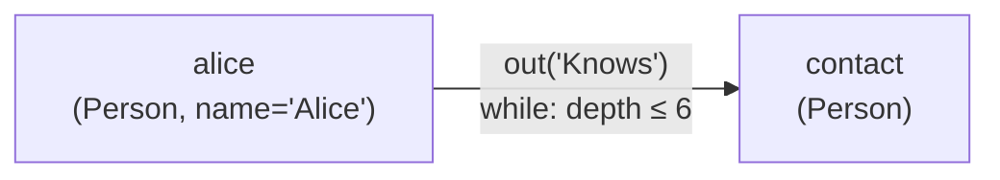
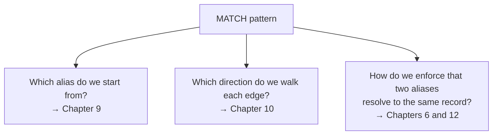

# Chapter 1 — Why a Graph Database Has Its Own Query Engine

## The question a social network asks every second

Imagine a company building a professional networking site. Every hour, a product manager asks the engineering team some variant of the same question: "For every person named Alice, find her direct contacts, and among those contacts, show only the ones who live in Berlin."

That question is concrete, answerable, and — on the surface — easy. There are people, there are relationships between people, and there are cities. Any system that can store those three things and filter them by name should be able to answer it.

## What SQL says

A relational schema for this domain is straightforward. A `Person` table holds names. A `Knows` table holds pairs of `Person` identifiers — one for the person, one for their contact. A `Lives` table links a person to a city. A `City` table holds city names.

The query writes out cleanly:

```sql
SELECT me.name, friend.name, city.name
  FROM Person   me
  JOIN Knows    k      ON k.person_id  = me.id
  JOIN Person   friend ON friend.id    = k.contact_id
  JOIN Lives    l      ON l.person_id  = friend.id
  JOIN City     city   ON city.id      = l.city_id
 WHERE me.name   = 'Alice'
   AND city.name = 'Berlin'
```

A reader who knows SQL can follow every line. There are four joins, two filters, and the shape of the result is a flat table with three columns. A relational planner knows how to handle this: estimate the number of rows each table contributes, pick an order that keeps intermediate results small, choose an index where one exists. The machinery is well understood and has been refined over four decades.

The trouble appears the moment the question changes shape.

## The question SQL cannot answer

A few months later, the product manager comes back with a new requirement: "Find every pair of people who are connected by a chain of anywhere from one to six Knows relationships." Not just direct contacts — second-degree, third-degree, up to sixth-degree connections.

Try to write that as a fixed SQL `SELECT`. A one-hop chain needs one join. A two-hop chain needs two joins. A six-hop chain needs six. But a query that handles *any depth from one to six* would need six separate `SELECT` statements united by `UNION`, each with a different number of joins — and even that does not generalise cleanly to "up to N hops" when N is not known at query-write time.

The problem is structural. A relational query describes a fixed shape: a fixed number of tables, a fixed number of joins, a fixed set of columns in the result. When the shape of the question depends on the data itself — "how many hops does this particular chain have?" — a fixed-shape query cannot express it.

This is not a limitation of SQL as a language. It is a fundamental mismatch between the *tabular* model and the *reachability* model. Relational algebra operates on fixed schemas; graph reachability is inherently recursive.

## The shape of a graph pattern

The natural way to express the reachability question is to describe the *pattern* and let the engine figure out the shape:

```sql
MATCH {class: Person, as: alice, where: (name = 'Alice')}
        .out('Knows'){as: contact, while: ($depth <= 6)}
RETURN alice.name, contact.name
```

Even without knowing the full syntax, a reader can see what this says: start from a `Person` named Alice, call that starting record `alice`; walk outgoing `Knows` edges repeatedly, calling the far end `contact`, stopping when depth exceeds six. Return a row for every `(alice, contact)` pair the engine finds.

Three pieces of vocabulary appear here. The curly-brace block — `{class: Person, as: alice, where: (name = 'Alice')}` — is a *pattern node*: it describes a record the engine must find and names it so the query can refer to it later. The `.out('Knows')` is a *pattern edge*: it describes a relationship to walk. The word after `as:` — `alice`, `contact` — is an *alias*: a name the query attaches to a matched record so other parts of the query can refer back to it.



**Figure 1.1 — The graph pattern expressed by the MATCH query above. Each box is a pattern node; the arrow is a pattern edge; the labels are aliases.**

The MATCH statement expresses the query the SQL version could not: variable-length traversal, written once, evaluated against the actual structure of the data.

## Three questions the engine must answer

The SQL planner's job is well defined: order the joins, pick the index. A MATCH planner faces the same two problems and three more.

The first new problem is where to *start*. A relational query has an implicit anchor — the first table in the `FROM` clause, typically the one with the most selective filter. A MATCH pattern has no `FROM` clause. Every named node is a potential starting point, and the cost difference between starting from the right alias and the wrong one can be enormous. Starting from `alice` — a `Person` whose name is `Alice` — might match a handful of records. Starting from `contact` — every `Person` in the database — could mean iterating millions. Chapter 9 is devoted to this choice: how the planner estimates cardinality for each alias and uses those estimates to pick the root.

The second new problem is edge *direction*. The pattern says `.out('Knows')`, meaning "walk edges in the forward direction". But if the planner entered the pattern through `contact` rather than `alice`, it would need to walk those same edges *backward* — from contact to alice. Whether that reversal is safe — whether it produces the same results and whether the data structure supports it — is not obvious. Chapter 10 explains when the planner can flip an edge's direction and how it does so.

The third new problem is *back-references*. Some patterns use the same alias more than once:

```sql
MATCH {as: p}.out('Knows'){as: q},
      {as: p}.out('Colleague'){as: q}
```

Here `p` appears as the start of two separate paths, and `q` appears as the end of both. The engine must guarantee that both uses of `p` resolve to the *same* record, and likewise for `q`. This is not a filter — it is a join condition that binds two parts of the pattern together. Chapter 6 shows how the pattern graph data structure makes these shared aliases explicit, and Chapter 12 shows how the runtime enforces them during traversal.



**Figure 1.2 — The three questions a MATCH planner must answer that a relational planner does not face.**

These three questions are why a graph database needs its own query engine. A relational planner transplanted into a graph database would handle join ordering and index selection. It would not know how to answer any of the three questions above. The rest of this book is the answer.

## What comes next

Before we follow a MATCH query through the engine, we need to understand what the engine is operating on. YouTrackDB stores vertices, edges, and properties in a way that makes one-hop traversal cheap — O(1) rather than O(log n) — and that directly shapes how the MATCH executor walks patterns. Chapter 2 gives you that picture: records, record identifiers, and the two ways the engine can represent an edge between two vertices.
