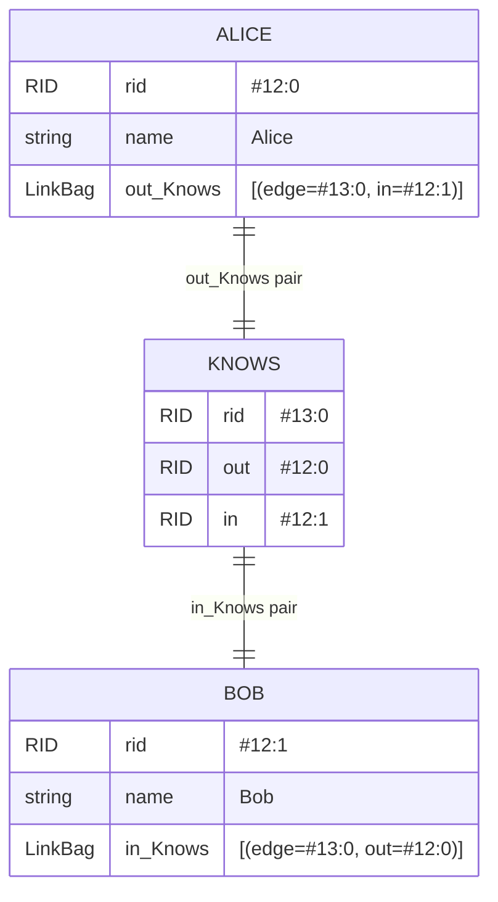
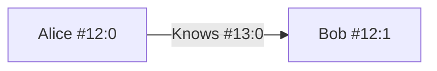

# Chapter 2 — A Tour of YouTrackDB Storage

Chapter 1 left you with a question: why does the query engine look so different from a relational
one? The answer starts here, in the data model. Before the planner can choose a traversal order,
it has to know what it is traversing. This chapter gives you that picture.

## 2.1 Everything is a record

In a relational database, your mental model of data is a spreadsheet: tables full of rows, rows
full of typed columns. When you open `java.sql.ResultSet` you are pulling rows from those tables,
one at a time.

YouTrackDB's mental model is different. Think instead of a `Map<String, Object>` — a bag of named
properties with no fixed schema requirement. Each such bag is a ***record***. Vertices are records.
Edges are records. Every piece of persistent data in the database is a record. There is no hidden
distinction between "graph data" and "document data" at the storage level. They are the same
thing.

What makes records useful as a foundation is that every one of them carries a stable identity
from the moment it is written. That identity is the ***RID***(record id).

## 2.2 RIDs: physical addresses that double as primary keys

A **_RID_** (record identifier) is written as `#collectionId:position`. The value `#12:0` means
"the record at position 0 in collection 12". Two small integers encode everything the storage
engine needs to find the bytes on disk.

This design gives lookup a useful property: it is O(1). The collection id is a direct index into a
table of files. The position is a logical sequence number, not a raw byte offset; it is resolved
through a flat position-map file (`.cpm`) in two bounded arithmetic steps — a small indirection
via the position map yields a page index and slot number, and then the engine reads that page to
retrieve the record. Two page reads, both O(1). No B-tree, no hash bucket chain, no secondary
index to consult.

Because RIDs are stable across restarts — a record keeps its RID for its entire life unless
explicitly migrated — they can be stored as foreign keys inside other records without any
indirection layer. A vertex can hold the RID of an adjacent vertex directly in one of its fields.
When the traversal engine follows that field, it resolves the RID to bytes in one step.

The `RID` interface lives at
`core/src/main/java/com/jetbrains/youtrackdb/internal/core/db/record/record/RID.java`.
It exposes `getCollectionId()` and `getCollectionPosition()` — the two numbers behind every
`#12:0` you will ever see in a query plan or a debug log.

## 2.3 Classes and collections

Every record belongs to a ***class***. A class is YouTrackDB's equivalent of a SQL table: it
groups records that share a type, optionally enforces a schema on their properties, and participates
in class hierarchies (a `Person` class can extend a base `Vertex` class, so a query that targets
`Vertex` will also match `Person` records).

A class is divided into one or more ***collections***. A collection is a physical storage unit — a
file on disk. When you write a new `Person` record, the engine selects one of the collections that
belongs to `Person` class and appends the record there. The collection id embedded in the resulting RID
tells every future reader which file to open.

> **Terminology note:** the source code and Java API use "collection" throughout —
> `getCollectionId()`, `StorageCollection`, `PaginatedCollection`, `SchemaClass.getCollectionIds()`.
> Older documentation and some community resources use "cluster" for the same concept.
> This book uses "collection" to match the API.

The mapping is worth making explicit:

- **Class** — a logical grouping. Roughly analogous to a Java class (it has a name, optional
  supertypes, and declared properties).
- **Collection** — a physical file. Roughly analogous to a shard or a partition. A single class
  can spread across many collections; a RID always points at exactly one.

This means a full class scan — "give me every `Person`" — visits every collection assigned to
`Person` class in turn. The engine knows those collection ids from the schema, not from the data.

## 2.4 Vertices are just records

There is nothing structurally special about a vertex in storage. A `Person` vertex is a record
whose class extends `V` (the built-in vertex base class), and whose bytes on disk look like any
other record: a class name, a set of property name/value pairs, and some bookkeeping fields. The
query engine treats it as a vertex because its class lineage says so, not because of any special
byte marker.

What *is* special is what gets stored alongside the vertex's own properties. When edges connect
to a vertex, the engine writes adjacency information directly into that vertex record. That is
the subject of the next section.

## 2.5 How edges are stored

Consider the relationship `Alice --Knows--> Bob`. Every edge in YouTrackDB is its own record:
the `Knows` edge has its own RID and belongs to a class that extends `E` (the built-in edge
base class). The edge record carries two special properties — `out`, holding the RID of its
tail vertex (Alice), and `in`, holding the RID of its head vertex (Bob) — plus any user-defined
properties (a timestamp, a weight, a label).

The edge record alone is not enough for fast traversal. If "give me Alice's neighbours" required
scanning the `Knows` collection for every edge whose `out` field equals `#12:0`, every hop would
cost O(|Knows|). YouTrackDB sidesteps that by also writing an adjacency entry into each endpoint:
Alice's record gains an `out_Knows` field, Bob's record gains an `in_Knows` field. Each entry is
a **pair** of RIDs — the edge record's RID and the opposite vertex's RID — stored together in
a `LinkBag` (`Iterable<RidPair>`). One pair per edge, written on both sides at creation time.

The pair carries the neighbour RID alongside the edge RID for a reason: a traversal that doesn't
read edge properties never has to load the edge record. The engine reads Alice's `out_Knows`,
takes the neighbour RID from each pair, and resolves directly to Bob. The edge record is only
fetched when the query touches one of its properties.



**Figure 2.1 — Three records: Alice, Bob, and the `Knows` edge between them. Alice's `out_Knows` LinkBag holds one pair `(edge=#13:0, in=#12:1)`; Bob's `in_Knows` LinkBag holds the symmetric pair `(edge=#13:0, out=#12:0)`. The edge record carries the canonical `out`/`in` fields plus any user-defined edge properties.**



**Figure 2.2 — The same relationship as a logical graph. Two vertices and one edge — the same content as Figure 2.1, with the storage-level structure (LinkBag pairs, `out`/`in` fields) abstracted away. The arrow direction matches the `out_Knows` / `in_Knows` field naming: `out` is the tail, `in` is the head; the edge label includes the edge record's RID so it can be cross-referenced with Figure 2.1.**

## 2.6 Why one hop is O(degree), not O(|graph|)

This is the most important property in this chapter, and the one the rest of the book relies on.

In a relational database, finding all of Alice's friends requires a join. The engine scans the
`Knows` table — or probes an index on `Knows.out_id` — comparing every row against Alice's
primary key. The cost grows with the size of the `Knows` table, not with Alice's personal
friend count.

In YouTrackDB, Alice's adjacency list is stored *inside Alice's own record*. The `out_Knows`
field (a `LinkBag`) contains one entry per outgoing `Knows` edge — each entry a pair of the
edge record's RID and the neighbour vertex's RID. To answer "give me all of Alice's Knows
neighbours", the engine:

1. Looks up Alice by her RID (`#12:0`) — O(1), as described in §2.2.
2. Reads her `out_Knows` field — already in the record, no secondary lookup.
3. Iterates the pairs, taking the neighbour RID from each — O(degree(Alice)). The edge record
   itself is not loaded unless the query reads an edge property.

The total cost is O(1 + degree(Alice)). It does not depend on how many people are in the database,
how many `Knows` edges exist globally, or how large the `Knows` collection is. The engine never
looks at any other vertex's record — or at the `Knows` collection itself — to resolve Alice's
neighbourhood.

This is the design decision that makes graph traversal fast in YouTrackDB, and it is why the
query planner treats fan-out — the average degree — as its primary cost signal when scheduling
traversal order. A hop through an alias with high fan-out is expensive; a hop through an alias
with low fan-out is cheap. Chapter 8 explains how the planner measures and uses these estimates.

## 2.7 Three pictures of the same two records

Here is the same `Alice --Knows--> Bob` relationship from three angles.

**(a) As records with RIDs** — Figure 2.1 above.

**(b) As a graph** — Figure 2.2 above.

**(c) As bytes on disk (conceptually).** Both records live in collection 12. Alice is at position 0;
Bob is at position 1. Each record, when serialised, looks roughly like this:

```
// Alice's record at #12:0 (schematic — actual binary format not shown)
class:    "Person"
name:     "Alice"
out_Knows: [(edge=#13:0, in=#12:1)]   // a LinkBag of RID pairs

// The Knows edge record at #13:0
class:    "Knows"
out:      #12:0      // Alice
in:       #12:1      // Bob

// Bob's record at #12:1
class:    "Person"
name:     "Bob"
in_Knows: [(edge=#13:0, out=#12:0)]   // a LinkBag of RID pairs
```

The `LinkBag` itself has more structure than the schematic above suggests — small bags are
stored inline in the vertex record, large bags migrate to a B-tree–backed form that shares a
single file across all vertices — but those storage mechanics are deferred to a later chapter.
For the purposes of this tour, iterating the `out_Knows` field of a vertex record gives you
the full set of outgoing `Knows` neighbours, regardless of how the bag is physically backed.

---

With that picture in hand — records identified by RIDs, adjacency lists embedded directly in
vertex records, produce O(1) hops because there is no secondary index to consult — you have everything
you need to follow a query through the engine. Chapter 3 traces a plain
`SELECT FROM Person WHERE name='Alice'` end-to-end through all four pipeline stages, building
the mental model of pull-based execution that every later chapter will depend on.
