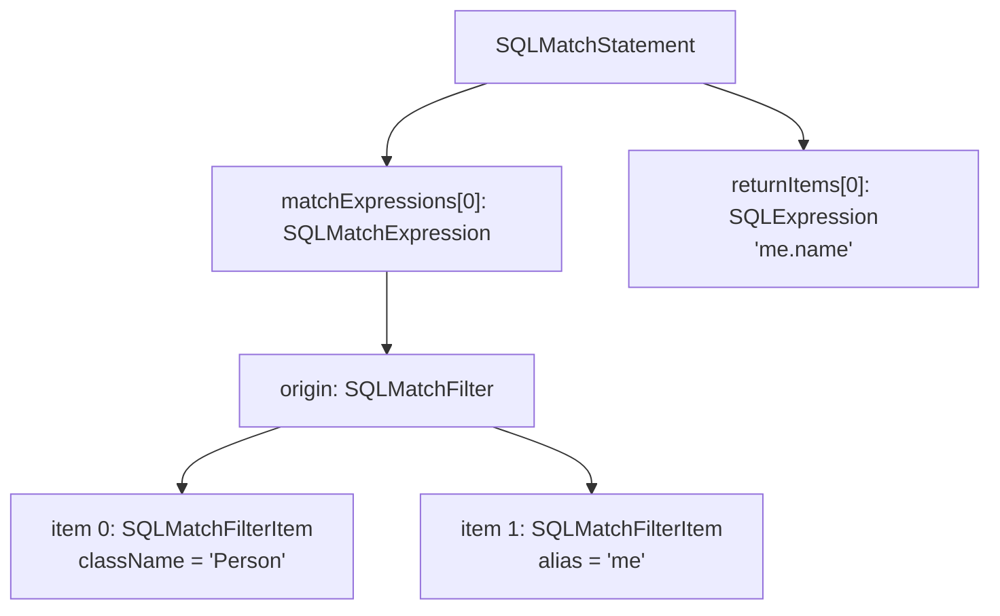
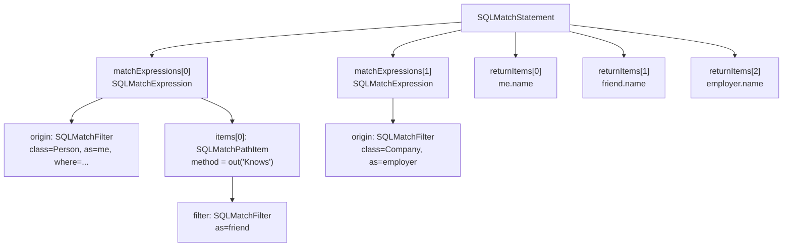

# Chapter 4 — The Parser and the AST

Chapter 3 followed a `SELECT FROM Person WHERE name = 'Alice'` through the engine's four stages —
parse, plan, execute, return — without pausing at any of them. This chapter pauses at the first.
Before the planner can estimate costs or choose a traversal order, it needs a data structure it
can inspect. That data structure is the *abstract syntax tree*, and the code that builds it is
the *parser*. By the end of this chapter you will be able to open the AST classes for a MATCH
query and read them the way the planner does.

## What a parser is, and why YouTrackDB writes its own

A hand-written parser for a language as large as YouTrackDB SQL would be thousands of lines of
tedious, error-prone character-pushing. YouTrackDB sidesteps that by using *JavaCC* — a parser
generator. The author writes a grammar in a `.jjt` file; the generator produces Java source files
that implement the parser. The grammar is both the specification of what SQL text is legal and the
blueprint for the Java classes the parser will emit. The *abstract syntax tree* is the tree of
those Java objects; the *planner* is the code that walks them. This is all the theory
you need. The rest of this chapter is concrete.

## A grammar rule and the class it produces

The grammar lives in
`core/src/main/grammar/YouTrackDBSql.jjt`. you find the rule that handles the
`MATCH` keyword:

```text
// core/src/main/grammar/YouTrackDBSql.jjt:1245
SQLMatchStatement MatchStatement():
{
    SQLMatchExpression lastMatchExpr = null;
    SQLExpression      lastReturn    = null;
    ...
}
{
    (
        <MATCH>
        lastMatchExpr = MatchExpression() { jjtThis.addMatchExpression(lastMatchExpr); }
        (
            <COMMA>
            (
               lastMatchExpr = MatchExpression() { jjtThis.addMatchExpression(lastMatchExpr); }
               |
               <NOT> lastMatchExpr = MatchExpression() { jjtThis.addNotMatchExpression(lastMatchExpr); }
            )
        )*
        <RETURN>
        ( ... lastReturn = Expression() ... )
        [ <AS> lastReturnAlias = Identifier() ]
        { jjtThis.addReturnItem(lastReturn); ... }
        (
            <COMMA>
            lastReturn = Expression() ...
            [ <AS> lastReturnAlias = Identifier() ]
            { jjtThis.addReturnItem(lastReturn); ... }
        )*
        [ jjtThis.groupBy = GroupBy() ]
        [ jjtThis.orderBy = OrderBy() ]
        ...
    ){ return jjtThis; }
}
```

The rule is named `MatchStatement` and its return type is `SQLMatchStatement`. `jjtThis` is
JavaCC's name for the node being built — the equivalent of `this` on the object the rule is
constructing. Every time the parser matches a `MatchExpression()` sub-rule it calls
`jjtThis.addMatchExpression(...)`, accumulating chain after chain into a list. The `RETURN` clause
uses the same accumulator pattern for the projection list: each comma-separated `Expression()` is
appended to `returnItems` via `jjtThis.addReturnItem(...)`. The two `addReturnItem` call sites in
the grammar (lines 1284 and 1295) are calls to the same one-line method on `SQLMatchStatement` —
one for the first return expression and one inside the comma-repetition loop:

```java
// core/src/main/java/com/jetbrains/youtrackdb/internal/core/sql/parser/SQLMatchStatement.java:31
private List<SQLExpression> returnItems = new ArrayList<>();

// core/src/main/java/com/jetbrains/youtrackdb/internal/core/sql/parser/SQLMatchStatement.java:73
public void addReturnItem(SQLExpression item) {
  this.returnItems.add(item);
}
```

Every optional clause — `GROUP BY`, `ORDER BY`, and the rest — assigns directly to a field of the
same name on `jjtThis`.

The insight this rule makes vivid is that **the grammar is the AST schema**. The fields of
`SQLMatchStatement` exist because the grammar author put them there. The class is generated, not
hand-written; its header reads `/* Generated By:JJTree: Do not edit this line. */`. Any change to
the MATCH syntax must go into `YouTrackDBSql.jjt`, not into the Java file.

The entry point for all statement types is `QueryStatement()` at
`core/src/main/grammar/YouTrackDBSql.jjt`. When it sees the `MATCH` keyword it delegates to
`MatchStatement()`.

## Walking a query through the tree by hand

The simplest MATCH query that exercises both the pattern chain and the return list is:

```sql
MATCH {class: Person, as: me} RETURN me.name
```

Let's build its AST node-by-node.

The parser sees `MATCH`. It enters `MatchStatement()` and creates an `SQLMatchStatement`. Then it
calls `MatchExpression()`, which is the rule for one pattern chain
(`core/src/main/grammar/YouTrackDBSql.jjt:3398`). That rule immediately calls `MatchFilter()` for
the leading `{…}` block and assigns the result to `jjtThis.origin`. There are no further path
items after the closing `}`, so `items` stays empty. The result — one `SQLMatchExpression` — is
appended to `matchExpressions`. Then the parser sees `RETURN`, parses `me.name` as an
`SQLExpression`, and appends it to `returnItems` via `jjtThis.addReturnItem(lastReturn)` at
`core/src/main/grammar/YouTrackDBSql.jjt:1284`.


The resulting tree looks like this:



**Figure 4.1 — AST for `MATCH {class: Person, as: me} RETURN me.name`.**

The tree has four kinds of node you will see over and over:

- `SQLMatchStatement` — the root. Owns the list of chains and the return list.
- `SQLMatchExpression` — one pattern chain. Owns an `origin` filter and a list of path items. (Path items will be described in more details later in this chapter)
- `SQLMatchFilter` — the `{…}` block. Holds a list of `SQLMatchFilterItem` objects.
- `SQLMatchPathItem` — one edge step, such as `.out('Knows'){…}`. Not present in this minimal
  query, but appears whenever a chain has more than one node.

Notice that `SQLMatchFilter` does not carry a `class` field or an `alias` field directly. It
carries a *list* of `SQLMatchFilterItem` objects, each with exactly one non-null field. The block
`{class: Person, as: me}` therefore becomes two items: one where `className` is set to `"Person"`
and one where `alias` is set to `"me"`. This is the most common stumbling block for first-time
readers of this code, and it has its own section below.

## The `{…}` block: a list of one-field items

The natural expectation for the `{…}` block is a struct:

```java
// The shape you expect — but it does not exist
class SQLMatchFilter {
    String alias;
    String className;
    SQLWhereClause filter;
    ...
}
```

The actual class (`core/src/main/java/com/jetbrains/youtrackdb/internal/core/sql/parser/SQLMatchFilter.java:17`)
holds a list instead:

```java
// core/src/main/java/com/jetbrains/youtrackdb/internal/core/sql/parser/SQLMatchFilter.java:17
protected List<SQLMatchFilterItem> items = new ArrayList<>();
```

And `SQLMatchFilterItem`
(`core/src/main/java/com/jetbrains/youtrackdb/internal/core/sql/parser/SQLMatchFilterItem.java:11`):

```java
// core/src/main/java/com/jetbrains/youtrackdb/internal/core/sql/parser/SQLMatchFilterItem.java:11
protected SQLExpression          className;
protected SQLExpression          classNames;
protected SQLIdentifier          collectionName;
protected SQLInteger             collectionId;
protected SQLRid                 rid;
protected SQLIdentifier          alias;
protected SQLWhereClause         filter;
protected SQLWhereClause         whileCondition;
protected SQLArrayRangeSelector  depth;
protected SQLInteger             maxDepth;
protected Boolean                optional;
protected SQLIdentifier          depthAlias;
protected SQLIdentifier          pathAlias;
```

In any given instance of `SQLMatchFilterItem`, exactly one of these fields is non-null. The block
`{class: Person, as: me, where: (name = 'Alice')}` parses into three items stored in one
`SQLMatchFilter`:

- item 0: `className = SQLExpression("Person")`, all others null
- item 1: `alias = SQLIdentifier("me")`, all others null
- item 2: `filter = SQLWhereClause(name = 'Alice')`, all others null

Why this design? The grammar rule `MatchFilterItem`
(`core/src/main/grammar/YouTrackDBSql.jjt:3523`) is an alternation of ten mutually exclusive
alternatives. Each alternative sets exactly one field on the node it produces. JavaCC builds items
one alternative at a time, so a flat list of one-field objects is the natural shape. The file even
carries a self-aware comment at line 16: `// TODO transform in a map`. Until that refactoring
happens, the correct way to read a filter's alias is `filter.getAlias()`, not
`filter.items.get(0).alias` — because you have no guarantee which item carries the alias, or
whether one is present at all.

## A realistic query: two chains, four return items

Now add a second chain and edge traversals:

```sql
MATCH
  {class: Person, as: me, where: (name = 'Alice')}.out('Knows'){as: friend},
  {class: Company, as: employer}
RETURN me.name, friend.name, employer.name
```

The comma between the two `{…}` chains means two calls to `MatchExpression()`, producing two
`SQLMatchExpression` entries in `matchExpressions`. The first chain has one path item —
`.out('Knows'){as: friend}` — stored as an `SQLMatchPathItem` with `method.methodName = "out"` and
`method.params = [SQLExpression("Knows")]`. The second chain is a single node with no path items
at all.



**Figure 4.2 — AST for a two-chain MATCH with one edge traversal.**

Two structural facts worth noting:

- **Two chains = two disjoint components.** The planner will later join them via a Cartesian
  product step, because the two sub-patterns share no alias. That is a planning concern, not a
  parsing concern; the parser simply stores what it sees.
- **`pattern` is null at this point.** `SQLMatchStatement` has a field called `pattern`
  (`core/src/main/java/com/jetbrains/youtrackdb/internal/core/sql/parser/SQLMatchStatement.java:42`),
  but the parser never fills it in, and neither does the statement's own `buildPatterns()` method
  at line 211 — that method has no production callers and is used only in tests. During planning,
  the planner calls its own private `MatchExecutionPlanner.buildPatterns(CommandContext)` at
  `core/src/main/java/com/jetbrains/youtrackdb/internal/core/sql/executor/match/MatchExecutionPlanner.java:4600`,
  which populates a `Pattern` field on the planner itself (not on the AST). At the end of parsing,
  only syntax is present.

Arrow syntax — `{as: me}-Knows->{as: friend}` — produces the same `SQLMatchPathItem` as the
method-call form. The grammar rules `OutPathItem`, `InPathItem`, and `BothPathItem` (starting at
`core/src/main/grammar/YouTrackDBSql.jjt:3583`) call the helpers `outPath()`, `inPath()`, and
`bothPath()` on `SQLMatchPathItem`
(`core/src/main/java/com/jetbrains/youtrackdb/internal/core/sql/parser/SQLMatchPathItem.java:46–56`),
which synthesise an `SQLMethodCall` from the edge identifier and direction string. After parsing,
the two surface forms are indistinguishable.

## What the AST cannot tell you

The parser is deliberately *structural*. It converts text to a tree whose shape mirrors the
query's grammar — nothing more. Schema resolution is absent: `class: Person` is stored as an
`SQLExpression` wrapping the string `"Person"`, and whether that class exists, is not checked
until the planner calls `filter.getClassName(context)` during Phase 1. Alias unification is
absent: if `p` appears in two `{…}` blocks, the parser emits two independent `SQLMatchFilter`
objects with no link between them; merging them into one `PatternNode` happens in
`buildPatterns(CommandContext)` at `MatchExecutionPlanner.java:4600` (Chapter 6). Default alias
assignment is absent: nodes without an `as:` key return null from `getAlias()` until
`assignDefaultAliases()` runs inside `buildPatterns()`. Execution direction is absent:
`.out('Knows')` is stored exactly as written, and the scheduler (Chapter 10) is free to reverse
it if cost estimation favours the opposite direction. Cardinality is absent: `where: (name = 'Alice')`
is an expression tree with no selectivity estimate attached.

Every semantic interpretation belongs to Phase 1 and beyond.

## Visitors: how the planner reads the tree

The planner does not walk the AST by calling `getMatchExpressions()` and then iterating into
`getItems()` and then calling `getFilter()` everywhere. For operations that need to touch every
node — building the pattern graph, printing the plan for `EXPLAIN`, checking whether a query is
cacheable — it uses a *visitor*: an object that implements one `visit` method per node type. The
grammar declares `VISITOR=true`
(`core/src/main/grammar/YouTrackDBSql.jjt:24`), which instructs JavaCC to generate `jjtAccept`
methods on every node class. Each generated `jjtAccept` dispatches to the matching `visit` method
on the visitor object, letting the visitor accumulate whatever it needs without the caller having
to know the tree's shape.

Chapter 6 will show a real visitor in action: the pass that walks every `SQLMatchExpression` and
constructs `PatternNode` and `PatternEdge` objects for the planner's internal pattern graph.

## The deep-copy on planner entry

There is one non-obvious thing the planner does before it reads a single node: it makes a complete
copy of the AST.

`MatchExecutionPlanner`'s constructor
(`core/src/main/java/com/jetbrains/youtrackdb/internal/core/sql/executor/match/MatchExecutionPlanner.java:432`)
opens with this:

```java
// core/.../sql/executor/match/MatchExecutionPlanner.java:434
// Deep-copy all mutable AST components to allow safe in-place mutation during planning
this.matchExpressions =
        stm.getMatchExpressions().stream().map(SQLMatchExpression::copy).collect(Collectors.toList());
        this.notMatchExpressions = stm.getNotMatchExpressions().stream().map(SQLMatchExpression::copy).collect(Collectors.toList());
        this.returnItems = stm.getReturnItems().stream().map(SQLExpression::copy).collect(Collectors.toList());
// … returnAliases, returnNestedProjections, limit, skip, and optional clauses follow
```

Why? Because the `SQLMatchStatement` that the planner receives may have come from the statement
cache — `YqlStatementCache`
(`core/src/main/java/com/jetbrains/youtrackdb/internal/core/sql/parser/YqlStatementCache.java`),
an LRU cache keyed by SQL text. When the same statement string is executed a second time, the
cache returns the same parsed `SQLMatchStatement` object, shared across all callers. Planning is
not a read-only operation: it assigns default aliases, merges filters, and rewrites traversal
directions. If the planner mutated the cached object, the next execution of the same query would
start from a partially planned state and produce wrong results. The deep-copy gives the planner a
private working copy while leaving the cached AST pristine.

This is the one place where knowing about the statement cache matters for understanding the parser
and planner boundary. The full cache story — the second cache that stores finished execution plans,
the copy-on-read contract, eviction rules, and concurrent sharing — is covered in §7.9.

## The four classes to recognise

You will see these four class names throughout Parts III–VI. Every other AST class is either
generated infrastructure or a fine-grained detail that appears only in the specific chapter that
needs it.

`SQLMatchStatement` — the root produced by a `MATCH … RETURN …` query. Lives at
`core/src/main/java/com/jetbrains/youtrackdb/internal/core/sql/parser/SQLMatchStatement.java`.

`SQLMatchExpression` — one comma-separated pattern chain. Holds an `origin` filter and a list of
path items. Lives at
`core/src/main/java/com/jetbrains/youtrackdb/internal/core/sql/parser/SQLMatchExpression.java`.

`SQLMatchPathItem` — one edge step. Its `method` field names the direction and edge label; its
`filter` field is the destination `{…}` block. Subclasses `SQLMultiMatchPathItem` (a
parenthesised multi-step pipeline, always non-invertible) and `SQLFieldMatchPathItem` (a property
walk, always non-invertible) cover the less common forms. All live in
`core/src/main/java/com/jetbrains/youtrackdb/internal/core/sql/parser/`.

`SQLMatchFilter` — the `{…}` block, used for both origin nodes and path-item destinations. Access
its content only through the typed accessor methods (`getAlias()`, `getFilter()`,
`getClassName(ctx)`, and so on) — never by reading `SQLMatchFilterItem` fields directly.

## What comes next

The parser has done its job. It has turned the YQL text into an `SQLMatchStatement` — a tree of
Java objects whose shape exactly mirrors the query's grammar. At this point the engine knows
*what* the user wrote, but not *what it means* as a graph pattern. There are no `PatternNode`
objects yet, no edges, no alias-to-class mapping, and no root candidate. Chapter 5 introduces
the MATCH AST as a whole — what each field means in terms of the query the user wrote, and the
three planning decisions that make MATCH harder than SELECT. Chapter 6 then shows how the planner
transforms that flat list of chains into the pattern graph it operates on.
