# Chapter 5 — Meet MATCH: A Graph Pattern in Source Code

Chapter 4 followed a MATCH query through the JavaCC grammar and ended with the parser handing a freshly constructed `SQLMatchStatement` to the planner. That handoff was a milestone: everything before it — tokenising, rule reductions, AST node allocation — is now behind the reader. What lies ahead is the planner. But before the planner can be understood, we need to understand what it actually receives. This chapter answers one question: what is inside an `SQLMatchStatement`, and what does each field mean in terms of the query the user wrote?

## 5.1 A concrete query to work with

Abstract description of AST fields tends to blur into a field-by-field list. Let us instead start with a concrete query and map it onto the AST by hand.

```sql
MATCH
  {class: Person, as: me,     where: (name = 'Alice')}
      .out('Knows') {as: friend}
      .out('Lives') {as: city,  where: (name = 'Berlin')}
RETURN me.name, friend.name, city.name
```

Reading this left to right, the query is saying five things:

1. Start with a `Person` record. Call it `me`. Keep only those where `name = 'Alice'`.
2. Walk each outgoing `Knows` edge from `me`.
3. Wherever that edge leads, call that record `friend`.
4. From `friend`, walk each outgoing `Lives` edge.
5. Wherever that edge leads, call it `city`. Keep only those where `name = 'Berlin'`.

Each named token has a precise meaning that maps directly onto a field in the AST.

**Pattern node.** The curly-brace block `{class: Person, as: me, where: (name = 'Alice')}` is a *pattern node*. It restricts what records may be bound to the alias `me`: only `Person` records where `name = 'Alice'` qualify. In the AST, a pattern node is represented by an `SQLMatchFilter` object. The `class:` value becomes one of the filter's items, the `as:` value is the *alias*, and the `where:` clause is an `SQLWhereClause` attached to the same filter.

**Pattern edge.** The fragment `.out('Knows')` is a *pattern edge*. It declares the traversal method: follow outgoing edges of class `Knows`. In the AST, a pattern edge is carried by an `SQLMatchPathItem`. Each path item holds the traversal method — `.out(...)`, `.in(...)`, `.both(...)`, or several others — and a reference to the `SQLMatchFilter` of the node at the far end.

**Alias.** The `as: me` declaration names the record bound at this step. Aliases are strings, and they are the shared currency of the entire system: the planner uses them to identify nodes, the executor uses them to store intermediate results, and the `RETURN` clause uses them to project fields. Every node in a legal MATCH query eventually carries an alias, even if the user did not write one — the planner assigns a synthetic name to anonymous nodes before any planning begins.

**WHERE on a node.** The `where: (name = 'Alice')` predicate attaches a filter directly to the pattern node. Unlike a SQL `WHERE` that is a single clause at the end, each pattern node in MATCH carries its own filter. After parsing, the planner AND-merges the predicates for any alias that appears more than once, so the executor always sees one unified condition per alias.

## 5.2 The AST in one diagram

With those four fragments named, the `SQLMatchStatement` for the query from the example looks like this:

```mermaid
graph TD
    S["SQLMatchStatement"]
    S -->|"matchExpressions[0]"| E0["SQLMatchExpression"]
    S -->|"returnItems"| RET["me.name, friend.name, city.name"]

    E0 -->|"origin"| F_me["SQLMatchFilter<br/>alias: me<br/>class: Person<br/>where: name=&#39;Alice&#39;"]
    E0 -->|"items[0]"| I0["SQLMatchPathItem<br/>method: .out(&#39;Knows&#39;)"]
    E0 -->|"items[1]"| I1["SQLMatchPathItem<br/>method: .out(&#39;Lives&#39;)"]

    I0 -->|"filter"| F_friend["SQLMatchFilter<br/>alias: friend"]
    I1 -->|"filter"| F_city["SQLMatchFilter<br/>alias: city<br/>where: name=&#39;Berlin&#39;"]
```



**Figure 5.1 — AST for the two-edge example query.**

`matchExpressions` is a `List<SQLMatchExpression>`. Our query has one expression — one unbroken chain — so the list has one element. A query with two comma-separated chains would have two. The companion list `notMatchExpressions` holds any `NOT { … }` sub-patterns declared in the same query; it is empty here.

Each `SQLMatchExpression` has two parts: an `origin` field of type `SQLMatchFilter` (the leftmost node in the chain), and an `items` list of `SQLMatchPathItem` objects (one per edge-and-node pair that follows). For our query, `origin` is the `me` filter and `items` contains two entries: the `.out('Knows')` step leading to `friend`, and the `.out('Lives')` step leading to `city`.

`returnItems` is a `List<SQLExpression>` that holds the things the user wrote after `RETURN` — here, `me.name`, `friend.name`, and `city.name`. The companion `returnAliases` list holds any `AS` labels the user added to rename output columns; it is absent here. The four predicate methods `returnsElements()`, `returnsPaths()`, `returnsPatterns()`, and `returnsPathElements()` inspect `returnItems` for the special tokens `$elements`, `$paths`, `$patterns`, and `$pathElements`; if none of these special tokens is present, the planner uses a plain projection step. Note that `returnsPatterns()` also recognises `$matches` as a legacy alias for `$patterns` (`core/src/main/java/com/jetbrains/youtrackdb/internal/core/sql/parser/SQLMatchStatement.java:289`).

The remaining fields — `groupBy`, `orderBy`, `unwind`, `skip`, `limit` — are optional clauses that follow RETURN. They mirror what a SELECT statement carries and are handled by the same planner machinery after the MATCH-specific steps are built.

There is one more field not shown in the diagram: `pattern`, of type `Pattern`. This field is `null` when the parser first hands off the `SQLMatchStatement`. The planner fills it in during its second stage, when it converts the flat list of `SQLMatchExpression` objects into a proper graph data structure. That conversion is the subject of Chapter 6.

## 5.3 A row that grows

A SELECT statement produces a row with a fixed shape: four columns in, four columns out, regardless of what the query touches. MATCH works differently. The result row is not a fixed-width tuple — it is an *alias-keyed map* that grows as the engine walks each edge.

Picture the row at three points during execution of the example query. In the snippet below, `P#N` denotes some Person record and `C#N` some City record; the integer is a tag for the reader's benefit, not the actual RID. A real YouTrackDB RID has the form `#<clusterId>:<position>` (e.g. `#12:3`).

```
After binding me:      {me: P#3}
After crossing Knows:  {me: P#3, friend: P#7}
After crossing Lives:  {me: P#3, friend: P#7, city: C#1}
```

The row starts with one entry and gains one entry per traversal step. The executor never copies the whole map — it builds a *chain* where each new step stores its single alias–value pair and points back to the parent for everything else. This is why the executor class that advances the row one step at a time is called `MatchStep` rather than `MatchJoin`: it extends the row rather than merging two fixed-width sets.

The class that implements this chain structure is `MatchResultRow`
(`core/src/main/java/com/jetbrains/youtrackdb/internal/core/sql/executor/match/MatchResultRow.java:38`).
Each instance in the chain holds exactly one alias and its bound record; lookups for earlier aliases walk up the chain to the appropriate parent. This makes the step-by-step row extension cheap — no copying, no allocation beyond one node per step.

Chapter 11 covers the mechanics of `MatchResultRow` in full, including how the `$matched`, `$currentMatch`, and `$current` context variables are layered on top of the chain so that filters referencing earlier aliases work without additional lookup cost.

## 5.4 The three decisions MATCH forces

The AST and the growing row are the what. The harder question is how the planner turns that AST into an execution plan. Three decisions arise that have no direct analogue in a pure relational planner.

**Decision 1: which alias to start from.** In the example query, the planner could start by scanning all `Person` records where `name = 'Alice'`, or it could start by scanning all `City` records where `name = 'Berlin'` and walk backwards. Neither approach is obvious from the query text. The cost formula is approximately `rows_at_root × fan_out_per_step × number_of_steps`: choosing a root with a tight filter keeps `rows_at_root` small and compresses every downstream cost proportionally. Choosing the wrong root — one that matches a million records — multiplies that million through every subsequent traversal. The planner must estimate cardinality for every alias and pick the most selective starting point. Chapter 9 is devoted to this decision.

**Decision 2: which direction to walk each edge.** Our query says `.out('Knows')` — follow outgoing `Knows` edges from `me`. But if the planner chose `friend` as the root instead, it would need to arrive at `me` by walking *inbound* `Knows` edges — the opposite direction to what the query text says. This is legal: the planner can reverse any edge that lacks `while`, `maxdepth`, or `optional` modifiers. Deciding which edges to run forward and which to reverse is called *direction scheduling*, and it interacts with root selection: the traversal direction of every edge falls out of the choice of root. Chapter 10 covers this.

**Decision 3: how to enforce back-references.** The two decisions above are well-posed for our simple linear example. They become harder when an alias appears more than once. Consider a query where `me` appears both at the start of one chain and in the middle of another. The parser records `me` as two separate `SQLMatchFilter` objects with the same alias string — there is nothing in the AST that physically connects them. The planner must detect this reuse and ensure that, at runtime, both occurrences resolve to the *same* record. A back-reference is not a filter predicate — it is a join condition that reaches back into the partially built row and compares one alias against another. Enforcing it correctly requires the planner to recognise back-references before it can even reason about traversal order. That recognition is the job of the *pattern graph*, and building that graph is what Chapter 6 covers.

## 5.5 A glance at the territory ahead

The three decisions in §5.4 govern the core of every MATCH query. `SQLMatchStatement` also carries
features that go beyond them, each with its own planning code path and execution step. This is not
the place to define them — later chapters do that — but naming them here gives you a map before the
territory arrives.

A node marked `optional: true` tells the engine to emit a row even when the edge leads nowhere,
filling the alias with `null`. It is the graph equivalent of a LEFT JOIN, and it gets its own step
class (Chapter 11). A `while: (condition)` or `maxdepth: N` modifier turns a single edge step into
bounded recursion — walk as long as the condition holds, up to a given depth — which is how
reachability queries are expressed; it also makes the edge non-invertible (Chapters 10 and 12). A
`NOT { … }` sub-pattern asserts that a shape must *not* exist; it is parsed into
`notMatchExpressions` and handled separately from positive expressions (Chapter 11).

When comma-separated chains share no alias, the pattern graph is disconnected; each component is
planned independently and their rows combined by a Cartesian product (Chapter 6). A
`$matched.X` reference inside a `WHERE` predicate creates an implicit ordering constraint — the
alias `X` must already be bound when that filter runs — and the scheduler respects it (Chapter 12).
Finally, `$elements`, `$paths`, `$patterns`, and `$pathElements` are special tokens after `RETURN`
that request a non-standard output shape; the planner detects which was used and emits a matching
step (Chapter 11).

## 5.6 Bridge to Chapter 6

The reader can now open `SQLMatchStatement` and navigate it. `matchExpressions` is the list of pattern chains; `notMatchExpressions` holds negative sub-patterns; `returnItems` carries the RETURN clause; `pattern` will be filled by the planner. `SQLMatchExpression` is one chain: an `origin` filter and a list of `SQLMatchPathItem` objects, each carrying a traversal method and the filter of the node at the far end.

But the planner cannot reason about back-references by staring at this linear structure. When `me` appears in two separate `SQLMatchExpression` objects, the AST has two disconnected `SQLMatchFilter` instances with the same alias string and nothing that connects them. Before any cost estimation, any root selection, or any direction scheduling can happen, the planner must transform the flat list of expressions into a graph — one that makes shared aliases into shared nodes, and makes every edge explicit with both endpoints named. That graph is the `Pattern`, and building it is what Chapter 6 covers.
