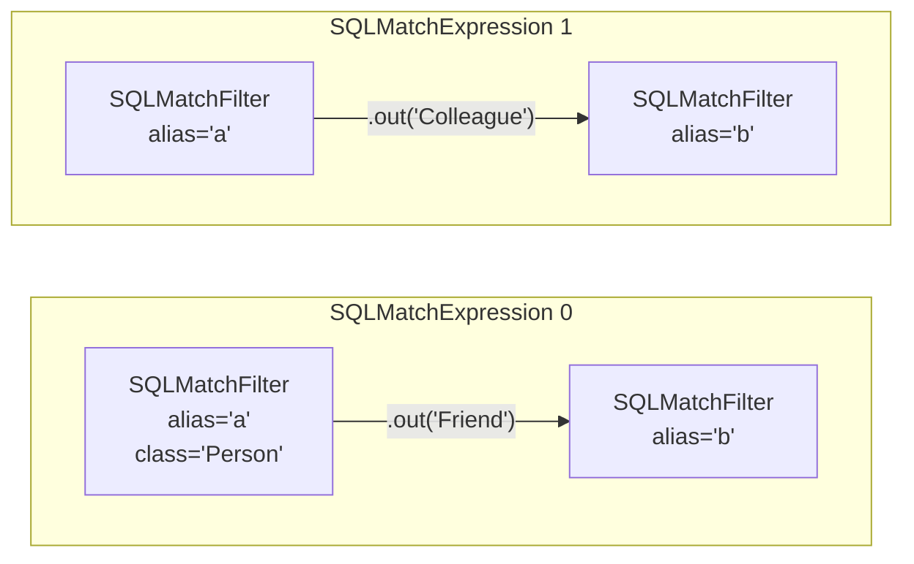
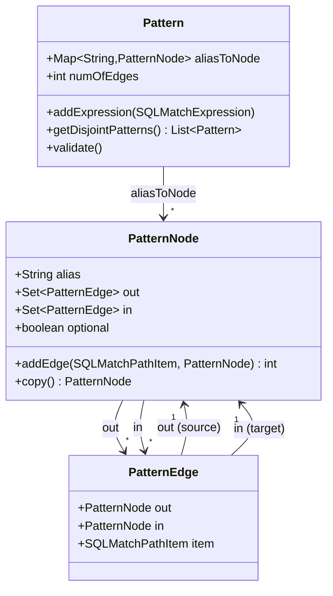
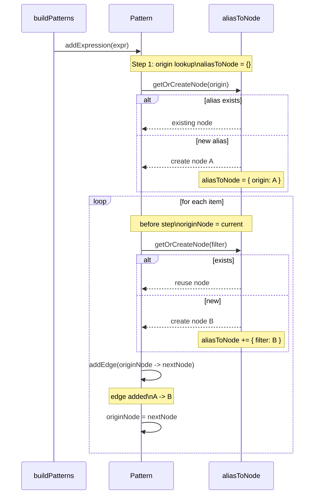
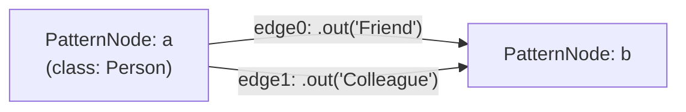

# Chapter 6 — From Linear AST to Pattern Graph

Chapter 5 gave you the MATCH AST: an `SQLMatchStatement` that holds its pattern as a plain Java `List` of `SQLMatchExpression` objects. Each expression is a chain — an origin node followed by zero or more traversal steps, each step carrying the method call and a filter for the next node. That list faithfully preserves what the user wrote, in the order they wrote it.

The planner cannot work from that list directly. This chapter explains why, introduces the three data structures that replace it, and walks through the construction step by step. When you finish reading, you will be able to sketch the *pattern graph* for any MATCH query on paper — and understand why that graph is the object all subsequent planning phases consume.

---

## 6.1 Why a list is the wrong shape

Here is a small query with a back-reference:

```sql
MATCH {class: Person, as: a}.out('Friend'){as: b},
      {as: a}.out('Colleague'){as: b}
RETURN a, b
```

The AST represents this as two expressions in a list. Expression 0 starts at `a` and walks a `Friend` edge to `b`. Expression 1 starts at `a` again and walks a `Colleague` edge to `b` again.



**Figure 6.1 — The MATCH AST: two independent `SQLMatchExpression` chains. Aliases `a` and `b` appear twice each, but the list has no way to express that the two `a` references are the same node.**

The list is structural: `f0` and `f2` are separate `SQLMatchFilter` objects with no connection between them. Nothing in the AST says "these two filters describe the same node". The same is true for `f1` and `f3`.

The planner needs to know that `a` in expression 0 and `a` in expression 1 are the same record. When the executor eventually traverses this pattern, any candidate it binds to `a` must satisfy *both* the `Person` class constraint *and* any predicates that arrive via either expression. And whatever gets bound to `b` must be reachable from `a` via *both* a `Friend` edge and a `Colleague` edge — that is not two separate walks, it is one shared node with two incoming constraints.

A second problem: the list encodes edges by position. "The edge between expression 0's item 0 and expression 1's origin" has no explicit representation. The scheduler — which needs to enumerate a node's neighbours and choose whether to walk an edge forward or backward — cannot do that from a positional list without scanning every expression every time.

Both problems have one solution: build a graph whose nodes are keyed by alias. Alias unification then becomes a map lookup. Neighbour enumeration becomes O(1) per edge. The list becomes a graph.

---

## 6.2 Three small classes, one big idea

The pattern graph is built from three container classes listed below; these classes carry data only. Behavior lives in `MatchExecutionPlanner`.

**`Pattern`** is the top-level adjacency map. Its central field is:

```java
public Map<String, PatternNode> aliasToNode = new LinkedHashMap<>();
```

The map is insertion-ordered so that iteration over aliases is deterministic across planning runs.

(`core/src/main/java/com/jetbrains/youtrackdb/internal/core/sql/parser/Pattern.java:50–53`)

**`PatternNode`** represents one alias. It holds the alias string, two adjacency sets (`out` for edges leaving this node, `in` for edges arriving), and an `optional` flag. Both sets are `LinkedHashSet` instances — insertion-ordered, to keep scheduling deterministic.

(`core/src/main/java/com/jetbrains/youtrackdb/internal/core/sql/executor/match/PatternNode.java:49–62`)

**`PatternEdge`** represents one traversal step between two nodes. It holds a reference to its source node (`out`), its target node (`in`), and the `SQLMatchPathItem` that carries the traversal method, any label, and any filter.

(`core/src/main/java/com/jetbrains/youtrackdb/internal/core/sql/executor/match/PatternEdge.java:39–49`)

One naming note before going further: on `PatternEdge`, `out` means *source* and `in` means *target* — the direction as written by the user in the query. This is *syntactic* direction, not runtime direction. The scheduler in phase 5 may decide to walk an edge backward; when it does, it records that choice on a separate `EdgeTraversal` object and leaves `PatternEdge` unchanged. `PatternEdge` is stable across all scheduling decisions.



**Figure 6.2 — The three pattern graph classes. `Pattern` is the container; `PatternNode` and `PatternEdge` are the vertices and edges. Each edge is registered in both the source node's `out` set and the target node's `in` set.**

---

## 6.3 Building the graph: `buildPatterns()`

`MatchExecutionPlanner.buildPatterns()` is the method that performs this transformation. It is called at the start of phase 1, immediately after the planner is constructed.

(`core/src/main/java/com/jetbrains/youtrackdb/internal/core/sql/executor/match/MatchExecutionPlanner.java:497–498`)

The method is idempotent — if `this.pattern` is already non-null, it returns immediately (line 4601). Constructor overloads that accept a pre-built `Pattern` (used by the hash join planner and GQL integration) rely on this to bypass graph construction entirely.

Construction happens in three sub-steps.

### Step 1 — Assign default aliases

Before anything else, `assignDefaultAliases()` walks every expression — both positive MATCH expressions and `NOT` expressions — and gives each nameless node a synthetic alias of the form `$YOUTRACKDB_DEFAULT_ALIAS_N`. If a node filter object is absent entirely, a blank `SQLMatchFilter` is created first.

(`core/src/main/java/com/jetbrains/youtrackdb/internal/core/sql/executor/match/MatchExecutionPlanner.java:5156–5171`)

After this step, every node in every expression has a non-null alias string. All downstream code can rely on this invariant. These synthetic aliases are invisible to the user: the return-projection step strips them from result rows before they reach the caller.

### Step 2 — Walk the expressions into the graph

`buildPatterns()` iterates `matchExpressions` and calls `pattern.addExpression(expr)` for each one. `addExpression` processes a single chain:

1. Call `getOrCreateNode(expression.origin)` — look up the origin alias in `aliasToNode`; create a new `PatternNode` if the alias is new, or reuse the existing one if it was already seen.
2. For each `SQLMatchPathItem` in `expression.items`, call `getOrCreateNode(item.filter)` to obtain the target node, then call `originNode.addEdge(item, nextNode)`. Advance `originNode` to `nextNode` and continue.

(`core/src/main/java/com/jetbrains/youtrackdb/internal/core/sql/parser/Pattern.java:65–75`)



`addEdge` creates a `PatternEdge`, sets `edge.out = this` and `edge.in = to`, then adds the edge to `this.out` and to `to.in` in a single call, returning `1` so `addExpression` can add it to `numOfEdges`.

(`core/src/main/java/com/jetbrains/youtrackdb/internal/core/sql/executor/match/PatternNode.java:73–82`)

`getOrCreateNode` is where alias unification happens. The method body is a plain map lookup:

```java
private PatternNode getOrCreateNode(SQLMatchFilter origin) {
    var originNode = get(origin.getAlias());
    if (originNode == null) {
        originNode = new PatternNode();
        originNode.alias = origin.getAlias();
        aliasToNode.put(originNode.alias, originNode);
    }
    if (origin.isOptional()) {
        originNode.optional = true;
    }
    return originNode;
}
```

(`core/src/main/java/com/jetbrains/youtrackdb/internal/core/sql/parser/Pattern.java:81–92`)

This is the chapter's pivot. There is no special-case code for back-references. The second time
an alias is seen, `aliasToNode.get(alias)` simply returns the node that was already inserted, and
that node's adjacency sets grow. The problem that seemed to require a dedicated "back-reference
detection" pass dissolves into an ordinary map lookup. Unification is an automatic consequence of
using a keyed map.

### Step 3 — Populate per-alias metadata

After the graph is built, `buildPatterns()` calls `addAliases(expr, ...)` for each positive expression to populate three auxiliary maps:

- `aliasFilters` — the merged `WHERE` predicate for each alias
- `aliasClasses` — the schema class name for each alias
- `aliasPinnedRids` — the pinned RIDs for aliases declared with `{rid: #N:M}` (a list per alias: one RID for a single `= #N:M` pin, several for a multi-RID `IN [...]` pin)

These maps live on `MatchExecutionPlanner`, not inside `Pattern`. They hold information derived from `SQLMatchFilter` content rather than from graph topology, and phases 3, 4, and 5 need them in O(1) form.

When the same alias appears with a `WHERE` clause in multiple expressions, the predicates are AND-combined into a single `SQLAndBlock`. When the same alias appears with different `class:` declarations, the more specific subclass is kept; if neither class is a subclass of the other, a `CommandExecutionException` is thrown at planning time.

(`core/src/main/java/com/jetbrains/youtrackdb/internal/core/sql/executor/match/MatchExecutionPlanner.java:5054–5095`)

After metadata collection, `rebindFilters()` pushes each merged predicate back into every `SQLMatchFilter` that references the alias, so traversal steps see the unified predicate rather than a partial one.

(`core/src/main/java/com/jetbrains/youtrackdb/internal/core/sql/executor/match/MatchExecutionPlanner.java:4838–4848`)

---

## 6.4 Worked example: back-reference unification

Return to the query from section 6.1:

```sql
MATCH {class: Person, as: a}.out('Friend'){as: b},
      {as: a}.out('Colleague'){as: b}
RETURN a, b
```

The AST gives `buildPatterns()` two expressions. Processing expression 0:

1. `getOrCreateNode({class:Person, as:a})` — `aliasToNode` is empty; creates `PatternNode("a")`.
2. Item 0: `.out('Friend'){as:b}` — `getOrCreateNode({as:b})` creates `PatternNode("b")`; `a.addEdge(item0, b)` creates `edge0`.

State after expression 0: two nodes, one edge.

Processing expression 1:

1. `getOrCreateNode({as:a})` — `aliasToNode.get("a")` finds the existing `PatternNode("a")`. No new node is created.
2. Item 0: `.out('Colleague'){as:b}` — `getOrCreateNode({as:b})` finds the existing `PatternNode("b")`. `a.addEdge(item1, b)` creates `edge1` — a second edge between the same two nodes.

Final state:

```text
Pattern
  aliasToNode:
    "a" → PatternNode(alias=a, out=[edge0, edge1], in=[])
    "b" → PatternNode(alias=b, out=[],             in=[edge0, edge1])
  numOfEdges: 2

  edge0: out=a, in=b, item=.out('Friend')
  edge1: out=a, in=b, item=.out('Colleague')

aliasClasses:    { "a" → "Person" }
aliasFilters:    (empty)
aliasPinnedRids: (empty)
```

The pattern graph looks like this:



**Figure 6.3 — Pattern graph for the back-reference example. Two expressions in the AST become two nodes and two parallel edges. The `a` in expression 1 unified silently with the `a` from expression 0 because `aliasToNode.get("a")` returned the existing node.**

The linear AST had four `SQLMatchFilter` objects. The pattern graph has two nodes. That collapse is the whole point of the transformation. When the scheduler later assigns a traversal order, it works on this graph — it sees two aliases and two constraints between them, not four separate filters spread across two expressions.

---

## 6.5 `$matched` references and scheduling hints

Not every back-reference appears as a repeated alias in the MATCH clauses. A `WHERE` predicate can reference an alias that was already bound earlier in the traversal:

```sql
MATCH {class: Person, as: x}.out('Knows'){as: y, where: ($matched.x.age < age)}
RETURN x, y
```

The filter on `y` reads `$matched.x` — the record already bound to alias `x`. At the time `y`'s `WHERE` predicate is evaluated, `x` must already exist in the current row. If the scheduler were to try visiting `y` before `x`, the filter would fail or produce undefined results.

`buildPatterns()` does not resolve `$matched` references itself — `WHERE` predicates are treated as opaque text during graph construction. However, the `dependsOnExecutionContext()` check in phase 1 (`MatchExecutionPlanner.java:521`) identifies aliases whose filters contain `$matched` references and marks them as ineligible for prefetching. More importantly, the scheduler in phase 5 respects these ordering constraints when it builds the traversal sequence: an alias with a `$matched.x` filter must be scheduled *after* `x`. Chapter 10 covers exactly how that ordering constraint is enforced.

For now, the key point is that `$matched` references are an implicit back-reference on the *filter* side, not the *topology* side. They do not change the pattern graph's nodes or edges — the graph reflects topology only. But they impose a happens-before ordering on the scheduler, and that ordering is only visible because the per-alias metadata (`aliasFilters`) was collected alongside the graph.

---

## 6.6 From one graph to many: disjoint components

A MATCH statement can list expressions that share no alias at all. When that happens, the pattern graph is disconnected — two or more clusters of nodes with no edge between them.

Consider adding an unrelated alias to the earlier example:

```sql
MATCH {class: Person, as: a}.out('Friend'){as: b},
      {as: a}.out('Colleague'){as: b},
      {class: Company, as: c}
RETURN a, b, c
```

After `buildPatterns()`, the graph has three nodes: `a` and `b` are connected by two edges; `c` is isolated. The engine cannot schedule a single traversal that visits all three nodes — there is no path from `c` to `a` or `b`.

`splitDisjointPatterns()` calls `Pattern.getDisjointPatterns()` to partition the graph into its connected components using a flood-fill:

1. Pick any unvisited node; add it to a worklist.
2. Expand the worklist by following every edge in both directions (outgoing via `edge.in`, incoming via `edge.out`) until no new nodes are found.
3. All nodes reached in one expansion form one component; remove them from the pool and start a new component.

(`core/src/main/java/com/jetbrains/youtrackdb/internal/core/sql/parser/Pattern.java:162–199`)

For the example above, the flood-fill produces two components:

```text
Pattern_1  aliases={a, b},  numOfEdges=2
Pattern_2  aliases={c},     numOfEdges=0
```

Each component is planned independently. When there is more than one component, `createExecutionPlan()` wraps all component plans in a `CartesianProductStep` (line 540) — meaning the result set is the cross product of every row from component 1 with every row from component 2. If component 1 produces *M* rows and component 2 produces *N* rows, the result has *M × N* rows.

This is not an error. A disconnected MATCH pattern is the intentional mechanism for expressing an inline cross product. It is also one of the most common sources of accidental query blowup — a mistyped alias that silently disconnects two components can turn a predictable query into a combinatorial explosion. The planner does not warn about it.

---

## 6.7 What the graph enables: a recap

The transformation from `SQLMatchStatement` to `Pattern` is a single planning pass, but it unlocks everything that follows.

Before the graph existed, the planner had a list of chains. Answering "how many edges does alias `b` participate in?" required scanning all expressions. Answering "which aliases are reachable from `a`?" required the same scan. There was no data structure to express "these two references are the same node."

After the graph exists, every downstream phase operates on a clean, keyed, bidirectional adjacency structure. Phase 3 looks up each alias's cost estimate in O(1). Phase 5's depth-first scheduler traverses the graph's edges directly. The `getDisjointPatterns()` flood-fill runs in O(nodes + edges). Each of these would be significantly harder — or impossible — on the original list.

The pattern graph is phase 1 of an eight-phase planner. Chapter 7 names all eight phases and places each one in the sequence, so you have a map before Chapters 8, 9, and 10 zoom in on cost estimation, root selection, and scheduling.

---

## Further reading

- `core/src/main/java/com/jetbrains/youtrackdb/internal/core/sql/parser/Pattern.java` — pattern graph container; `addExpression` at line 65, `getOrCreateNode` at line 81, `validate` at line 115, `getDisjointPatterns` at line 162.
- `core/src/main/java/com/jetbrains/youtrackdb/internal/core/sql/executor/match/PatternNode.java` — per-alias node; `addEdge` at line 73, `copy` at line 105.
- `core/src/main/java/com/jetbrains/youtrackdb/internal/core/sql/executor/match/PatternEdge.java` — per-step edge; syntactic direction, `executeTraversal` at line 61.
- `core/src/main/java/com/jetbrains/youtrackdb/internal/core/sql/executor/match/MatchExecutionPlanner.java` — `buildPatterns` at line 4600; `assignDefaultAliases` at line 5156; `addAliases` (filter form) at line 5054; `splitDisjointPatterns` at line 4407; `rebindFilters` at line 4838.
