# Chapter 7 — The Eight Phases of the Planner

Chapter 6 built the pattern graph. Now that structure needs to become a runnable plan.

The planner is one method: `MatchExecutionPlanner.createExecutionPlan()`. It has eight
phases. Before we zoom into any of them, we need to see the whole sequence, because each
phase produces an artifact that a later phase consumes. Think of this chapter as a
corridor with eight doors. We will open each door just enough to name what is inside,
then point you to the chapter where the door swings wide.

There is one artifact already in hand before the planner begins: the *pattern graph*.
Chapter 6 followed its construction — the walk over `SQLMatchStatement`, the
materialisation of `PatternNode` and `PatternEdge` objects, and the alias-unification pass
that merges repeated names into shared nodes. By the time `createExecutionPlan()` runs,
the pattern graph is waiting. The eight phases transform it, in order, into a
`SelectExecutionPlan` ready for pull-based execution.

---

## 7.1 Phase 1 — Building the Pattern Graph

The planner opens by calling `buildPatterns()`, which walks each `SQLMatchExpression` in
the parsed statement and populates five alias-keyed metadata maps: the unified pattern
graph itself, `aliasClasses` (the declared `class:` constraint per alias),
`aliasCollections` (the declared collection-name constraint per alias),
`aliasRids` (the `@rid:` pin per alias), and `aliasFilters` (the merged WHERE clause per
alias). Unnamed pattern nodes receive a synthetic `$YOUTRACKDB_DEFAULT_ALIAS_` prefix so
they can participate in scheduling and traversal without appearing in the final output.
The artifact produced is the pattern graph paired with its metadata maps — the structural
raw material that every subsequent phase reads. Chapter 6 already covered this phase in
detail; it is included here so the sequence is complete.

## 7.2 Phase 2 — Splitting Disjoint Patterns

A MATCH query can contain two or more sub-graphs with no shared alias — two independent
friend-of-friend chains, say, joined only by their appearance in the same statement.
`splitDisjointPatterns()` calls `Pattern.getDisjointPatterns()` and partitions the pattern
graph into its connected components. When more than one component exists, the planner
wraps each component's independently-planned pipeline in a `CartesianProductStep`, which
cross-joins their output streams. The artifact is either a single connected `pattern`
object or a `subPatterns` list; all later phases branch on that distinction. Splitting
first keeps every downstream decision — root selection, edge scheduling, step generation
— scoped to a single connected component and free from "which sub-graph am I in?" state.

## 7.3 Phase 3 — Estimating Root Cardinalities

Before the planner can decide where to start a traversal, it needs a rough count for
each alias: how many records are likely to match? `estimateRootEntries()` answers this by
inspecting each alias's constraints and returning a `Map<String, Long>` from alias name
to estimated record count. A pinned `@rid` returns `1`; a class with a WHERE clause
returns the lesser of the filter's selectivity estimate and the class count; a bare class
returns `classCount + 1`; an alias with no constraint at all is absent from the map. The
planner also inflates cardinalities for aliases in `inferredWhileExprAliases` to
`Long.MAX_VALUE` immediately after the method returns, preventing a
low-cardinality inferred class from being promoted to root of a WHILE sub-expression.
This cardinality map is the planner's cost oracle: phases 4 and 5 both read it to make
their decisions. Chapter 9 opens this phase in full, including the filter-selectivity
mechanics and the short-circuit that emits an `EmptyStep` when any non-optional alias has
an estimated count of zero.

## 7.4 Phase 4 — Prefetching Small Alias Sets

Armed with cardinality estimates, the planner identifies aliases small enough to be worth
materialising in advance. `addPrefetchSteps()` prepends a `MatchPrefetchStep` for each
alias whose estimated count is strictly below `THRESHOLD = 100` and whose WHERE clause
does not reference `$matched` or `$parent`. Each `MatchPrefetchStep` executes a SELECT
sub-plan, collects every matching record into an in-memory list, and stores it in the
execution context under a well-known key. Downstream `MatchFirstStep`s check for that key
before running their own sub-plan; if the list is present they iterate it rather than
re-scanning storage. The optimization matters because in a nested-loop traversal the inner
alias is rescanned once per outer row — prefetching converts those repeated O(scan)
operations into O(1) list reads while keeping the memory cost bounded. The artifact
produced is a set of alias names that were prefetched, which phase 5 uses to avoid
duplicating work. Chapter 11 covers how `MatchFirstStep` consumes the prefetch cache at
runtime.

## 7.5 Phase 5 — Topological Scheduling and Step Generation

This is the most consequential phase. `getTopologicalSortedSchedule()` runs a
cost-guided, dependency-aware topological sort over the pattern graph's edges and returns
a `List<EdgeTraversal>`, one entry per edge, in the order the planner has decided to walk
them. Each `EdgeTraversal` carries the runtime direction (forward or reversed), source and
target metadata, and an optional `RidFilterDescriptor` for index-assisted pre-filtering.

Phase 5 does not end with a schedule. Before step emission, `createPlanForPattern()`
runs four more passes over the scheduled edges:

- `optimizeScheduleWithIntersections()` — attaches pre-filters to edges where an index
  exists (Chapter 14).
- `rebindFilters()` — re-routes WHERE clauses that originally targeted one alias onto
  the alias that actually binds them under the chosen schedule.
- edge annotation — records per-edge direction, class, RID, and filter metadata.
- `identifyHashJoinBranches()` — decides which scheduled branches qualify for a
  hash-join substitution (Chapter 13).

Only then does the method emit one execution step per edge: `MatchFirstStep` for the
root alias, then `MatchStep` or `OptionalMatchStep` for each subsequent edge, or
`HashJoinMatchStep` for hash-join branches. The artifact is the step sequence that
forms the body of the pipeline. Chapter 10 opens the scheduling algorithm, and Chapter
13 covers hash-join branch selection.

## 7.6 Phase 6 — Managing NOT Patterns

`MATCH … NOT { … }` sub-expressions are anti-join predicates, not traversal steps.
`manageNotPatterns()` converts each one into either a `HashJoinMatchStep` in anti-join
mode or a `FilterNotMatchPatternStep`, depending on whether the sub-pattern can be
evaluated once up front or must be re-executed per upstream row. The hash anti-join
materialises the NOT sub-pattern once, keys the results on the shared aliases, and probes
each upstream row in O(1) time; the nested-loop fallback re-runs the sub-pattern for
every row and drops any row for which it finds a match. Multiple NOT blocks compose as a
conjunction: each appends exactly one step to the pipeline. The artifact is the pipeline
extended with the anti-join filter steps. Chapter 13 covers both strategies in detail.

## 7.7 Phase 7 — Removing Empty Optional Sentinels

Optional edges that match nothing at runtime emit a special sentinel value rather than
`null`, so downstream steps can distinguish "nothing matched" from "matched a record whose
field is null". Once all traversal steps are in place, the planner checks whether any
`optional: true` node was encountered during phase 5. If so, it chains a
`RemoveEmptyOptionalsStep`, which replaces every sentinel value with a real `null` before
the row flows forward. For queries with no optional nodes this phase is a no-op and no
step is appended. The artifact is the pipeline extended with the sentinel-cleanup step
where needed.

## 7.8 Phase 8 — RETURN Projection

The final phase appends the step or steps that turn the alias-keyed rows produced by
the traversal pipeline into the output the caller expects. Five RETURN forms are
supported: `$elements` (each aliased node as its own output row, via
`ReturnMatchElementsStep`), `$paths` (`ReturnMatchPathsStep`), `$patterns`
(`ReturnMatchPatternsStep`), `$pathElements` (`ReturnMatchPathElementsStep`), and a
custom expression list, which delegates to `SelectExecutionPlanner.handleProjectionsBlock()`
and reuses the full SELECT planner's projection, GROUP BY, ORDER BY, UNWIND, SKIP, and
LIMIT infrastructure. Any of DISTINCT, ORDER BY, GROUP BY, UNWIND, SKIP, or LIMIT
appearing in the query are appended after the projection step using the same execution
step classes as SELECT — the MATCH planner does not reimplement them. The artifact is the
complete `SelectExecutionPlan`, ready to be handed to the execution engine.

---

## The full sequence as a diagram

```mermaid
flowchart LR
    PG["Pattern graph\n(from Chapter 6)"]
    P1["1. buildPatterns()\n——\nPatternNodes,\nPatternEdges,\nalias metadata maps"]
    P2["2. splitDisjointPatterns()\n——\nconnected components\n(pattern | subPatterns list)"]
    P3["3. estimateRootEntries()\n——\nMap&lt;String, Long&gt;\ncardinality oracle"]
    P4["4. addPrefetchSteps()\n——\nMatchPrefetchStep per\nsmall alias + prefetch set"]
    P5["5. getTopologicalSortedSchedule()\n+ createPlanForPattern()\n——\nList&lt;EdgeTraversal&gt;\n+ MatchFirstStep / MatchStep\n/ OptionalMatchStep\n/ HashJoinMatchStep"]
    P6["6. manageNotPatterns()\n——\nHashJoinMatchStep(ANTI_JOIN)\nor FilterNotMatchPatternStep"]
    P7["7. RemoveEmptyOptionalsStep\n——\nsentinel → null\n(conditional)"]
    P8["8. RETURN projection\n——\nReturnMatch*Step\nor SELECT projection\n+ ORDER BY, LIMIT …"]
    PLAN["SelectExecutionPlan"]

    PG --> P1 --> P2 --> P3 --> P4 --> P5 --> P6 --> P7 --> P8 --> PLAN

    style P3 fill:#e8eeff,stroke:#7080cc
    style P5 fill:#fff0e8,stroke:#cc8040
    style P8 fill:#e8fff0,stroke:#40aa60
```



**Figure 7.1 — The eight planning phases and the artifact each produces.**

Phases 3 and 5 (blue and orange) receive full chapter treatments in Part IV. Phase 8
(green) is opened further in Chapter 11. Phases 1 and 2 were covered in Chapter 6;
phases 4, 6, and 7 are self-contained enough that their full mechanics can be found in
Chapters 11 and 13.

---

## 7.9 The plan lifecycle — what's cached and what isn't

This section is a short detour from the eight-phase tour, because one question keeps
returning whenever the planner is discussed: what happens to the plan after it leaves
the planner? A reader who wants only the phase overview can skip ahead to the "Looking
ahead" section and return here later; a reader who wants to understand plan lifetime,
caching, and sharing across sessions should stay.

Chapter 4 mentioned `YqlStatementCache` as the reason the planner deep-copies its input
AST. That is half the story. There is a second cache — `YqlExecutionPlanCache` — that
sits one level deeper and stores the finished `SelectExecutionPlan` after all eight phases
have run. Understanding both caches answers the question of whether the first execution
of a query template pays a one-time planning cost, and what happens when multiple sessions
run the same query concurrently.

### The two-cache design

The two caches live as fields of `SharedContext`
(`core/src/main/java/com/jetbrains/youtrackdb/internal/core/db/SharedContext.java` lines 41 and 43),
which is one instance per database — so both caches are shared across all sessions open
against the same database.

`YqlStatementCache` stores parsed `SQLStatement` objects, keyed by the raw SQL text. Its
role is to avoid re-running the JavaCC parser on every invocation. Because the parser is
pure — the same text always produces the same AST — the result is safe to cache
indefinitely subject to eviction. `YqlExecutionPlanCache` stores the fully assembled
`SelectExecutionPlan`, again keyed by raw SQL text. Its role is to skip all eight
planning phases when a structurally identical query arrives a second time.

The two caches share one configuration knob:

```java
// core/.../api/config/GlobalConfiguration.java:952
STATEMENT_CACHE_SIZE(
    "youtrackdb.statement.cacheSize",
    "Number of parsed SQL statements kept in cache. Zero means cache disabled",
    Integer.class,
    100)
```

Both `YqlStatementCache` and `YqlExecutionPlanCache` are constructed with
`GlobalConfiguration.STATEMENT_CACHE_SIZE` as their capacity. Default is 100 entries.
Setting it to 0 disables both caches entirely.

### The cache key and what it implies

The key is the *raw SQL text as submitted by the caller* — no normalisation, no parameter
stripping. `MATCH {class: Person, as: p} RETURN p` and
`match {class:Person,as:p} RETURN p` hash to different keys. A query executed with a
literal value embedded in the WHERE clause (`where: (name = 'Alice')`) gets its own cache
slot, separate from the slot for `where: (name = 'Bob')`. Applications that want plan
reuse should use named parameters (`:name`) or positional parameters (`:0`) — queries that
contain SQL input parameters are treated as non-cacheable by `isCacheable()` on the AST
nodes, so the execution-plan cache is bypassed for them, but the statement cache still
applies. If you find your high-throughput queries missing the plan cache, the diagnostic
is simple: log the `statement.getOriginalStatement()` that reaches the planner and check
whether it varies by run.

### Concurrent sharing and the copy-on-read contract

A `SelectExecutionPlan` contains mutable state — the execution context, iterator
positions, the prefetch lists — that changes as each call to `next()` drives the pipeline
forward. Sharing a single live plan across threads would cause data races. The cache avoids
this by never handing out the stored object directly.

On the *write* path, `YqlExecutionPlanCache.putInternal()` copies the freshly assembled
plan (calling `InternalExecutionPlan.copy()`) before storing it
(`core/src/main/java/com/jetbrains/youtrackdb/internal/core/sql/parser/YqlExecutionPlanCache.java:104`).
That stored copy is then immediately closed, leaving it in a quiescent, zero-resource
state. It exists only as a template.

On the *read* path, `getInternal()` calls `result.copy(ctx)` on the stored template before
returning it to the caller
(`YqlExecutionPlanCache.java:138`).
The caller receives a fresh, fully independent copy every time, wired to its own
`CommandContext`. Two sessions executing the same MATCH query simultaneously each hold
their own copy of the plan and cannot interfere with each other.

The deep-copy on planner entry (Chapter 4's AST copy) and the copy-on-read here serve
complementary purposes: the AST copy protects the statement cache from planner mutation;
the plan copy protects the execution-plan cache from runtime mutation.

### When the plan cache is bypassed

Three conditions cause `MatchExecutionPlanner.createExecutionPlan()` to skip the plan
cache entirely:

- **Profiling is enabled.** When the caller passes `enableProfiling = true`, the planner
  never consults or populates the cache. Timing instrumentation would otherwise be attached
  to a shared template.
- **The statement is not cacheable.** `SQLMatchStatement.executinPlanCanBeCached()` walks
  every expression and path item and returns `false` if any node signals
  non-cacheability. SQL input parameters are the most common cause.
- **The assembled plan itself is not cacheable.** After all eight phases complete, the
  planner calls `result.canBeCached()` (`SelectExecutionPlan.canBeCached()`, line 280),
  which walks every step in the assembled plan and returns `false` if any step signals
  non-cacheability. A plan containing a step that embeds session-specific or
  non-reproducible state cannot safely be stored as a shared template and is therefore
  discarded rather than put into the cache (`MatchExecutionPlanner.java:627–631`).
- **Schema changed during planning.** After assembling the plan, the planner compares
  `YqlExecutionPlanCache.getLastInvalidation(session)` against the timestamp taken before
  Phase 1 began
  (`MatchExecutionPlanner.java:627–631`).
  If the schema was modified concurrently — another session created a class, updated an
  index, or changed a function — `lastInvalidation` will be greater than `planningStart`
  and the plan is discarded rather than stored, preventing a stale plan from being served
  to future callers.

The four conditions above operate per query, at assembly time. There is also a
cache-wide invalidation mechanism. `YqlExecutionPlanCache` implements
`MetadataUpdateListener` and receives schema, index, function-library, sequence-library,
and storage-configuration update notifications. The whole cache is cleared on any such
event — there is no per-class or per-index granularity. A schema migration that touches
one class invalidates plans for every query against that database.

One additional trigger: if `GlobalConfiguration.COMMAND_TIMEOUT` changes at runtime,
`getInternal()` detects the change by comparing the stored `lastGlobalTimeout` against the
current setting and clears the cache before returning
(`YqlExecutionPlanCache.java:121–126`).
Cached plans embed a timeout step whose threshold was fixed at planning time; a changed
timeout makes every cached plan incorrect.

### What this means in practice

The first execution of a new MATCH query template pays the full eight-phase planning cost.
Every subsequent execution with the same raw SQL text retrieves a template from the plan
cache and calls `copy()` on it — the overhead is one deep-copy rather than a full
replanning cycle. The copy cost grows with plan complexity (number of steps, number of
prefetch sub-plans) but is bounded and deterministic.

A schema migration clears the cache completely. The first query of each template after a
migration pays the full planning cost again, and only after that first execution does the
plan re-enter the cache. If your application schema evolves at runtime — adding indexes to
support new query patterns, for example — plan migrations to occur during a low-traffic
window and warm the cache by running representative queries immediately afterward.

The configuration knobs mentioned here are collected in Table 17.2 of Chapter 17.

### A third cache — results, not plans

Both caches so far are *compile-phase*: `YqlStatementCache` skips the parser,
`YqlExecutionPlanCache` skips the eight planning phases. Neither touches execution. Once a
caller holds a plan, running it — pulling rows through every step, scanning storage,
filtering, projecting — happens in full, every time.

Consider a transaction that issues the same query twice:

```
begin;
  select from Person where city = 'Berlin';   -- runs the whole pipeline
  -- … unrelated work …
  select from Person where city = 'Berlin';   -- runs it again, start to finish
commit;
```

The plan cache makes the second call cheap to *plan* — it copies a template instead of
replanning — but the copied plan still executes end to end. If nothing the transaction did
between the two calls could have changed the answer, that second execution is pure
repetition.

The *transaction-scoped query-result cache* addresses exactly this. Unlike the two
compile-phase caches it does not live on `SharedContext` and is not shared across sessions:
it is a single `QueryResultCache` held per transaction, a field on `FrontendTransactionImpl`
(`core/.../tx/FrontendTransactionImpl.java:142`), and it sits *in front of* the whole
pipeline. Before a statement reaches the planner, `DatabaseSessionEmbedded` routes it
through `serveThroughCache()` (`core/.../db/DatabaseSessionEmbedded.java:679` and `:721`),
which looks the query up (`:817`) and, on a hit, returns a cached view immediately (`:834`)
— the eight phases of this chapter, and every step they would have produced, are skipped.

The feature is off by default. It is gated by `QUERY_TX_RESULT_CACHE_ENABLED`
(`core/.../api/config/GlobalConfiguration.java:961`), a `Boolean` defaulting to `false`;
while the flag is off, `getQueryResultCache()` returns `null` and `serveThroughCache()`
falls straight through to normal execution. Enabled, the cache is bounded by
`QUERY_TX_RESULT_CACHE_MAX_ENTRIES` (default 200, `GlobalConfiguration.java:971`) and
evicts least-recently-used entries when full.

Caching results is harder than caching plans, because a plan is inert and a result is not.
If the transaction mutates a `Person` row between the two identical selects, replaying the
stored rows verbatim would be wrong — so a *delta* mechanism (`DeltaBuilder`, yielding a
`TxDeltaCursor`) reconciles a stored result against the mutations made since it was
recorded, keeping a hit identical to what a fresh execution would return. To know what
"the same kind of result" even means, the cache first sorts each query into a *shape* — the
result category it knows how to store and reconcile, computed by `ShapeClassifier` into a
`CacheableShape` (`core/.../sql/executor/cache/CacheableShape.java:30`); queries whose shape
it does not recognise are not cached. And a query that is non-deterministic by design — one
calling `sysdate()` or `uuid()`, or referencing a per-row `$` variable — is refused outright
by `NonDeterministicQueryDetector`
(`core/.../sql/executor/cache/NonDeterministicQueryDetector.java:51`), since freezing its
output would be a bug, not an optimisation.

The cache's lifetime is the transaction's: it is cleared when the transaction ends and when
one re-begins (`FrontendTransactionImpl.clear()`, `:1038`), so nothing survives a commit or
rollback. Because a bulk operation can invalidate more than the delta machinery can cheaply
reconcile, `TRUNCATE CLASS` discards the whole cache in one call to
`QueryResultCache.invalidateAll()` (`core/.../sql/executor/cache/QueryResultCache.java:318`).
Entries whose shape makes per-mutation reconciliation impractical are retired instead by a
strike-based scheme, gated by two threshold knobs also collected in Table 17.2.

The contrast is the whole point. The compile-phase caches save the cost of *preparing* to
run a query and are shared, long-lived, and keyed by SQL text; the query-result cache saves
the cost of *running* one, is private to a single transaction, and is correct only because
it actively reconciles against that transaction's own mutations.

---

## Looking ahead

Eight phases, but three of them make all the interesting decisions. Before the planner
can pick a root alias or order the edges, it needs a shared vocabulary of numbers.
Chapter 8 introduces that vocabulary — cardinality, selectivity, fan-out — as a
self-contained unit before the planning proper begins. Chapter 9 then takes phase 3
under the microscope: the estimation rules, the `MAX_VALUE` inflation that protects
non-invertible edges, and how a single indexed predicate can flip the root choice.
Chapter 10 does the same for phase 5, tracing the scheduling algorithm from the first
greedy DFS step to the finished `EdgeTraversal` list, including the dependency tracking
that keeps `$matched` references from being evaluated before they are bound.
