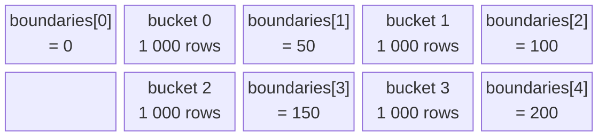
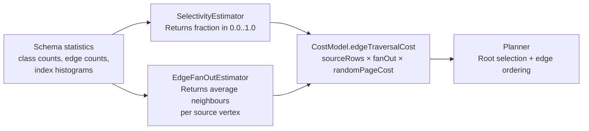

# Chapter 8 — Counting Without Counting: Cardinality, Selectivity, and Fan-out

Chapter 7 showed you the planner's eight phases and named cost-based planning as the
mechanism that picks a root alias and orders the edge traversals. This chapter opens
those phases from the inside, but only the numbers — the estimates the planner uses as
raw material. Chapters 9 and 10 will show what the planner *does* with those numbers.

---

## A question the planner must answer before touching a single record

Consider the pattern below, which asks for people named Alice who know someone living
in Berlin.

```sql
MATCH
  {class: Person, as: me,     where: (name = 'Alice')},
  {class: Person, as: friend, where: (city = 'Berlin')}
    .out('Knows')
  {class: Person, as: me}
RETURN me, friend
```

There are two named aliases, `me` and `friend`. The planner must start the traversal
from one of them. Starting from `me` means first collecting every `Person` named Alice,
then following each `Knows` edge to find Berliners. Starting from `friend` means
collecting every Berliner first, then following `Knows` edges in reverse to find
Alices.

If there are 5 people named Alice and 80,000 people living in Berlin, starting from
`me` is obviously better — it generates a tiny initial set and a small number of
traversals. But the planner does not know those numbers; it has never read a single
record. It needs to *estimate* them from schema statistics, and it needs to do so at
plan time, before execution begins.

That is the problem this chapter solves. The planner has three numerical tools: a
***cardinality*** estimate, a ***selectivity*** ratio, and an ***edge fan-out***. Each
one is a signal. Together they let the planner rank plans without running any of them.

---

## Cardinality: how many records will match?

***Cardinality*** is the number of records expected to match a particular condition.
It is an absolute count, not a ratio.

Take a concrete example. The `Person` class has 100,000 records. An equality condition
`name = 'Alice'` applies to a column that has an index. The index reports 3 distinct
matching entries. The cardinality for that condition is **3**.

The planner uses cardinality as the primary number for deciding which alias to start
from. The alias with the lowest cardinality becomes the root of the traversal — it
produces the smallest initial set of records and therefore drives the fewest subsequent
hops.

Cardinality is computed by `MatchExecutionPlanner.estimateRootEntries()`
(`core/.../sql/executor/match/MatchExecutionPlanner.java:5192`), which returns a
`Map<String, Long>` keyed by alias name. The method follows a straightforward
priority order for each alias:

- If the alias is pinned to a single RID literal (e.g., `{where: (@rid = #23:1)}`),
  the cardinality is exactly **1** — no estimate required.
- If the alias has a class and a WHERE filter, the cardinality is
  `min(filter.estimate(...), classCount)` — the filter's estimate, capped at the full
  class size so a pathological estimate cannot exceed the total.
- If the alias has a class but no filter, the cardinality is `classCount + 1`.

The `+ 1` in the unfiltered case is a deliberate bias
(`MatchExecutionPlanner.java:5236`). When two aliases have the same class size, the
`+ 1` ensures the filtered alias always wins as root, even if the filter estimate
happens to equal the class count. Filtering at the root avoids materialising records
that the filter would immediately discard inside the nested loop; the planner encodes
that preference directly into the cardinality arithmetic.

An alias that has no class declaration and no RID is omitted from the map entirely —
it cannot be a root.

---

## Selectivity: the fraction that passes

***Selectivity*** is the ratio of matching records to total records. Where cardinality
is an absolute count, selectivity is a dimensionless number between 0.0 and 1.0.

Using the same numbers as before: 3 matching records out of 100,000 total gives a
selectivity of 0.00003. A condition that matches half the table has selectivity 0.5.
The lower the selectivity, the more tightly the predicate filters.

Selectivity is what `SelectivityEstimator` computes
(`core/.../core/index/engine/SelectivityEstimator.java`). The class is shared between
the `SELECT` and `MATCH` planners; the MATCH planner reaches it through the
package-private static helper `estimateFilterSelectivity()` (`MatchExecutionPlanner.java:2795`),
which walks the WHERE AST and assembles per-condition selectivity into a compound selectivity for
the whole filter. (A separate `private` overload at line 2430 handles simpler single-predicate
delegation; the AND/OR composition logic described here lives in the line-2795 overload.)

`SelectivityEstimator` works in three tiers, resolved in priority order. Each public
estimation method — `estimateEquality`, `estimateGreaterThan`, `estimateLessThan`, and
the rest — opens with the same three-way conditional before doing any predicate-specific
arithmetic. The rules below capture that shared structure; the table that follows maps
each tier to its precise conditions and return value.

**Rule 1 (Empty).** If the index holds no records at all (`stats.totalCount() == 0`),
return `0.0` immediately. An empty index means nothing can match.

**Rule 2 (Uniform).** If the index has entries but no `EquiDepthHistogram` has been built
yet (the histogram argument is `null`, which happens when `nonNullCount` is below
`QUERY_STATS_HISTOGRAM_MIN_SIZE`, default 1,000 entries per
`GlobalConfiguration.java:1255`), use summary counters — total count, null count,
distinct count — under uniform-distribution assumptions. For equality the formula is
`1 / distinctCount`. For unbounded range predicates (e.g., `age > 30`) the estimator
returns one-third — the same default PostgreSQL uses for the same situation.

**Rule 3 (Histogram).** When an `EquiDepthHistogram` is available (`histogram != null`),
use bucket-level interpolation with three fast-path shortcuts: an out-of-range key
returns `1 / nonNullCount` (near-zero rather than exactly zero, to prevent
division-by-zero in cost formulas); a key that matches the most common value returns
its exact frequency fraction; a bucket containing only one distinct value uses discrete
logic instead of continuous interpolation.

In all cases the result is clamped to `[0.0, 1.0]` before returning
(`SelectivityEstimator.java:708`), guarding against small negative or greater-than-one
results from incremental statistics drift.

**Table 8.1 — `SelectivityEstimator` tier-selection rules.**

| # | Condition | Tier used | Return value / behaviour | Line reference |
|---|---|---|---|---|
| 1 | `stats.totalCount() == 0` | Empty | `0.0` — nothing can match | e.g. `SelectivityEstimator.java:116` |
| 2 | `histogram == null` | Uniform | Equality: `1 / distinctCount`; unbounded range: `1/3` | e.g. `SelectivityEstimator.java:122` |
| 3 | `histogram != null` | Histogram | Bucket interpolation with MCV, out-of-range, and single-value shortcuts; clamped to `[0.0, 1.0]` | e.g. `SelectivityEstimator.java:119–121`, clamp at line 708 |

Compound filters are assembled by `estimateFilterSelectivity()` using two composition
rules: AND predicates multiply their individual selectivities
(`sel(A AND B) = sel(A) × sel(B)`); OR predicates use inclusion-exclusion
(`sel(A OR B) = 1 − (1 − sel(A)) × (1 − sel(B))`). Both rules assume the predicates
are statistically independent — they are not always, but the approximation keeps the
formula O(number of predicates) and avoids the need for joint histograms.

---

## Inside the histogram tier — bucket-level interpolation

Rule 3 is where estimation stops being arithmetic on totals and becomes arithmetic on
shape. When an `EquiDepthHistogram` is present the estimator has more than summary
statistics — it has a picture of how values are distributed across the data range. The
question is: what arithmetic does `EquiDepthHistogram` actually supply, and what
assumptions does that arithmetic make?

### Bucket structure

An equi-depth histogram is built so that each bucket holds approximately the same
*count* of records, not the same *range* of values. A bucket whose values are densely
packed will span a narrow value range; a sparse bucket will span a wide one. The
boundary array stores `bucketCount + 1` sorted values (`EquiDepthHistogram.java:49–53`):
`boundaries[0]` is the minimum key, `boundaries[bucketCount]` is the maximum, and
each `boundaries[i]` / `boundaries[i+1]` pair encloses bucket `i`. Alongside the
boundaries, `frequencies[i]` records how many index entries fall in bucket `i`, and
`distinctCounts[i]` records the number of distinct values in that bucket.



**Figure 8.1 — Four equi-depth buckets, each holding 1 000 records. Boundaries are
at values 0, 50, 100, 150, 200.**

### The interpolation formula for a range predicate

For `estimateGreaterThan(age > 75)`, `SelectivityEstimator` (`SelectivityEstimator.java:191–203`)
does the following.

First, it calls `findBucket(75)` to locate bucket `b`. `findBucket` returns the index
of the bucket whose span `[boundaries[b], boundaries[b+1])` contains the key
(`EquiDepthHistogram.java:112–133`).

Second, it computes how much of bucket `b` lies *above* the query bound using linear
interpolation (`SelectivityEstimator.java:552–617`). Before the arithmetic can begin,
every key is converted to a `double` by `ScalarConversion.scalarize()`
(`ScalarConversion.java:63–77`) — the identity for numeric types and a lexicographic
numeric mapping for strings and dates, so that all key types share the same arithmetic.
The fractional position of the query bound within the bucket is:

```
fraction = (scalarize(key) − scalarize(lower(b)))
         / (scalarize(upper(b)) − scalarize(lower(b)))
```

The count of records in bucket `b` that are *above* the query bound is therefore:

```
remainingInB = (1.0 − fraction) × frequencies[b]
```

(`SelectivityEstimator.java:200`)

Third, all buckets above `b` contribute their full counts
(`SelectivityEstimator.java:201`):

```
aboveBuckets = Σ frequencies[i]  for i in (b+1 .. bucketCount−1)
```

The selectivity is the sum divided by `nonNullCount`
(`SelectivityEstimator.java:202`):

```
selectivity = (remainingInB + aboveBuckets) / nonNullCount
```

The interpolation in step 2 is mediated by the `fractionOf` helper
(`SelectivityEstimator.java:552`). For a single-value bucket (`distinctCounts[b] == 1`),
`fractionOf` short-circuits and returns a fixed value instead of running
`continuousFraction`: `1.0` for a strict-above predicate (`GT`/`GTE`), `0.0` for a
strict-below predicate (`LT`/`LTE`), or `0.5` for a range midpoint — the three cases
of the `FractionMode` enum. The worked example below uses multi-value buckets, so
`continuousFraction` always runs there.

For equality predicates (`col = x`), `estimateEquality` consults the most-common-values
list first and falls back to bucket lookup only when the value is outside that list; see
`SelectivityEstimator.estimateEquality` and its private helper `estimateEqualityHistogram`.

### A word on the approximation

Two implementation details qualify the formula above. In the code, `remainingInB` is
computed as `(1.0 - fraction) * Math.max(h.frequencies()[b], 0)`. The `Math.max(..., 0)`
guard clamps the bucket count to zero when deletes have driven it negative through drift
without a histogram rebalance — an edge case the formula glosses over, but one that
matters in long-lived databases with heavy write workloads.

The formula also assumes that values are *uniformly distributed within each bucket*. That
is almost never exactly true. An equi-depth bucket whose boundary spans 50–100 may
hold 1 000 records, but if 800 of them cluster around 95, the linear estimate for
`age > 75` will over-count the portion above 75 — the interpolation thinks half the
bucket is above 75, while the actual fraction is closer to 80%. The error is bounded
by the width of one bucket, but a bucket whose real distribution is heavily skewed
toward one boundary can cause the histogram estimate to be off by a factor of two or
more for a predicate that lands in the middle of that bucket. This is the honest
cost of a compact, statically-built histogram without per-bucket distribution detail.

### Worked example

Four buckets, 1 000 records each, boundaries at 0 / 50 / 100 / 150 / 200. Predicate:
`age > 75`. `nonNullCount` = 4 000.

**Table 8.2 — Step-by-step selectivity computation for `age > 75`.**

| Step | Operation | Value |
|---|---|---|
| 1 | `findBucket(75)` — key 75 lies in `[50, 100)` | `b = 1` |
| 2 | `scalarize(75)` = 75.0, lo = 50.0, hi = 100.0 | — |
| 3 | fraction = (75 − 50) / (100 − 50) = 25 / 50 | **0.5** |
| 4 | `remainingInB` = (1.0 − 0.5) × 1 000 | **500** |
| 5 | `aboveBuckets` = frequencies[2] + frequencies[3] = 1 000 + 1 000 | **2 000** |
| 6 | selectivity = (500 + 2 000) / 4 000 = 2 500 / 4 000 | **0.625** |

The estimate says 62.5% of non-null `age` values exceed 75 — a reasonable figure for a
uniform distribution over [0, 200]. Had the 1 000 records in bucket 1 clustered near 99
instead of spreading evenly across [50, 100), the true selectivity would be closer to
72.5%, and the histogram would under-estimate by 10 percentage points, all from the
linear assumption inside a single bucket.

This is why a histogram estimate is a *ranking signal*, not a prediction — which is
exactly what the planner needs it to be, as the next section explains.

---

## Fan-out: how many neighbours does a vertex have?

***Fan-out*** is the average number of target vertices reachable from a single source
vertex along one edge type in a given direction.

A concrete worked estimate: suppose the database holds 50,000 `Person` records and
800,000 `Knows` edges. Each `Person` has, on average,
`800,000 / 50,000 = 16` `Knows` neighbours. The OUT fan-out of `Person` along `Knows`
is 16. If the planner is scheduled to start from an alias with estimated cardinality
5, traversing `Knows` will expand those 5 records to roughly
`5 × 16 = 80` candidates.

`EdgeFanOutEstimator.estimateFanOut()` (`EdgeFanOutEstimator.java:74`) accepts the
edge class name, the source vertex class name, the traversal direction (OUT, IN, or
BOTH), and the OUT and IN vertex classes declared in the edge schema. For OUT and IN
directions the formula is simply `edgeCount / sourceCount`. The BOTH direction is
trickier: if neither vertex class is declared in the schema (schema-less or
mixed-mode graphs), the estimator uses `2 × edgeCount / sourceCount`, assuming the
source vertex can appear on both ends. When the schema *does* declare vertex classes,
the estimator checks whether the source class is a subclass of the OUT endpoint's
class and of the IN endpoint's class separately, and sums only the sides that apply.
This matters for directed edges like `Person→Works→Company`: from the `Person` side,
the OUT fan-out is `edgeCount / personCount`, but the IN fan-out is zero because
`Person` is not the IN-endpoint of `Works`. Without the subclass check, BOTH would
double-count.

All cardinality lookups inside the estimator use
`SchemaClassInternal.approximateCount()`, which is O(1) and polymorphic — it counts
records across the class and all its subclasses without scanning.

---

## The classes in one picture

The three concepts map to three classes, each with a well-defined role.



**Figure 8.2 — Data flow from schema statistics through the three estimators into the planner.**

`SelectivityEstimator` converts index statistics into a ratio. `EdgeFanOutEstimator`
converts schema counts into an average neighbourhood size. `CostModel` combines them
into a single cost number the planner can compare across candidate plans.

---

## Fallback constants: planning without statistics

A freshly-created database has no query statistics. No histograms have been computed.
Some edge classes may not yet have enough records to cross the histogram threshold.
The planner must still make a choice.

Every estimator has a fallback constant that fires when the information needed for a
real estimate is missing.

**Table 8.3 — Fallback constants, the situations that trigger them, and their configuration keys.**

| Situation | Fallback value | Configuration key (`GlobalConfiguration`) |
|---|---|---|
| Alias has no estimate in `estimateRootEntries` | 100 (`THRESHOLD`, `MatchExecutionPlanner.java:336`) | Not configurable |
| Edge or source class missing from schema | 10.0 (`QUERY_STATS_DEFAULT_FAN_OUT`, `GlobalConfiguration.java:1240`) | `youtrackdb.query.stats.defaultFanOut` |
| Non-indexed or unrecognised predicate | 0.1 (`QUERY_STATS_DEFAULT_SELECTIVITY`, `GlobalConfiguration.java:1233`) | `youtrackdb.query.stats.defaultSelectivity` |
| Target has no WHERE filter and no cardinality entry | 1.0 (no reduction applied) | N/A |

These constants exist because the planner must always produce a plan. A planner that
refuses to work until statistics are available would be useless on a new installation
or during a bulk data load before statistics have been gathered. The constants are
calibrated to be *conservative rather than optimistic*: the default fan-out of 10.0
makes unknown edges look moderately expensive, which biases the scheduler away from
them rather than toward them; the default selectivity of 0.1 (10%) means an
unindexed predicate is treated as moderately selective, which is a reasonable middle
ground for most real-world distributions. Neither value is claimed to be accurate; they
are designed to produce a reasonable plan in the absence of evidence.

All fan-out and selectivity configuration values are read from `GlobalConfiguration`
at each call, not cached at startup
(`EdgeFanOutEstimator.java:43`, `SelectivityEstimator.java:89`). A database
administrator can adjust them at runtime and the next query will immediately use the
new values.

---

## These numbers are signals, not predictions

This point deserves its own paragraph because it changes how you should read every
scheduling decision in the next two chapters.

The planner uses cardinality, selectivity, and fan-out to *rank* candidate plans, not
to predict actual runtime. A plan whose estimated cost is 100 is preferred over a
plan with estimated cost 1,000 — but the actual execution times may be 50 ms and
200 ms, or they may be 20 ms and 25 ms, or something else entirely. The numbers are
ordering signals.

What guarantees this is safe is that the estimates are *non-adversarial*: a wrong
estimate can produce a suboptimal plan, but never an incorrect result. The execution
engine does not consult the estimate during traversal; it reads whatever the traversers
actually find. If the planner guesses that 5 records match `name = 'Alice'` and there
are actually 50, the execution engine will produce all 50 results — it just does so
in an order the planner did not anticipate as most efficient. The cost of a bad
estimate is a slower query, not a wrong answer.

This is a deliberate design choice. Because estimates do not gate row production, the
planner can skip runtime re-planning entirely. There is no adaptive execution loop,
no plan switching mid-query. The plan chosen at plan time runs to completion.

---

## `CostModel`: combining the numbers into one cost

The planner needs one number it can compare across candidates. `CostModel`
(`core/.../sql/executor/CostModel.java`) provides it — a small utility class shared by
both the `SELECT` and `MATCH` planners that expresses all costs in abstract units where
one sequential page read equals 1.0. The method the MATCH planner calls for edge
traversal is `edgeTraversalCost()` (`CostModel.java:150`):

```
costPerSource = avgFanOut × randomPageReadCost
totalCost     = sourceRows × costPerSource
```

Or, written out in full:

```
edgeTraversalCost = sourceRows × avgFanOut × randomPageReadCost
```

The `QUERY_STATS_COST_RANDOM_PAGE_READ` configuration constant (accessed via the
`CostModel.randomPageReadCost()` accessor) defaults to 4.0 (`GlobalConfiguration.java:1322`).
It reflects a physical reality: neighbouring vertices in a graph are rarely stored on
the same page; each hop typically requires a random I/O rather than a sequential one.
A sequential read costs 1.0 in the model; a random read costs 4.0. The planner uses
this ratio to express that edge traversals are more expensive per row than full table
scans.

This raw edge cost feeds into two further adjustments that `MatchExecutionPlanner`
applies on top of it. `applyTargetSelectivity()` (`MatchExecutionPlanner.java:2491`)
multiplies the cost by the selectivity of the target alias's WHERE filter — a more
selective target means fewer rows to process after the hop, so the cost is discounted.
`applyDepthMultiplier()` (`MatchExecutionPlanner.java:3058`) inflates the cost for
recursive edges with a `while:` clause: when no explicit `maxdepth:` is set the
multiplier is 10 (the `DEFAULT_WHILE_DEPTH` constant, line 3074), ensuring the
planner never treats a potentially unbounded traversal as cheap. Those adjustments
belong to the scheduling phase; Chapter 10 works through them in detail.

---

## What comes next

This chapter has given you the three numbers the planner works with — cardinality,
selectivity, and fan-out — and the classes that compute them. But those numbers are only
useful if the planner applies them carefully. As the next chapter shows, there is one
case where the obvious rule — "pick the alias with the smallest estimate" — would choose
an alias the traversal engine can never legally start from.

Chapter 9 opens phase 3 to show exactly how the estimates are computed and ranked, then
turns to that edge case: a class that the planner inferred, not declared, whose low
cardinality would misdirect the root choice without a specific protective trick to stop
it.
