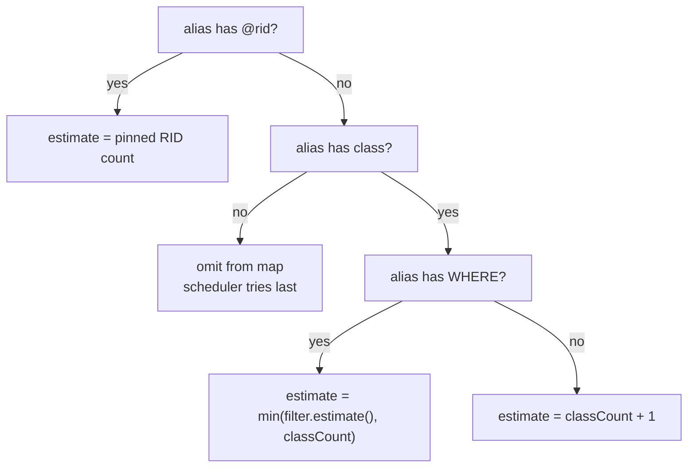
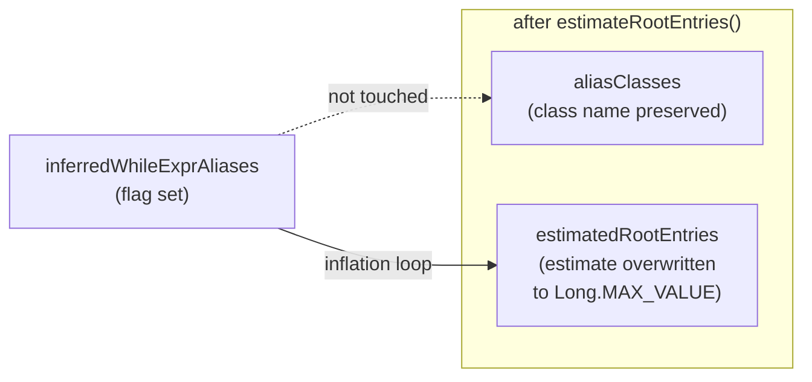

# Chapter 9 — Choosing Where to Start: Root Selection

Here is a question the planner must answer before it can do anything else: in the query

```sql
MATCH {class: Person, as: me, where: (name = 'Alice')}
      .out('Knows'){as: friend}
RETURN me, friend
```

should the engine start by finding every `Person` named Alice — and then follow `Knows` edges
forward to their friends — or should it start from every `Person` in the `friend` alias and
walk the `Knows` edges in reverse?

Intuitively, the first choice is better. The `where: (name = 'Alice')` filter is highly
selective: there are probably very few people named Alice, maybe one. Starting there means the
engine fetches a tiny set of records and follows a handful of edges. Starting from `friend`
means fetching every `Person` in the database and traversing the edge in reverse — likely a
full table scan.

The planner has no way to ask "how many people are named Alice?" at planning time — there is no
lookup oracle built into the planning pass. What it does instead is *estimate* a cardinality
for every alias, then pick the alias with the smallest estimate as its starting point. This
chapter shows exactly how those estimates are computed, why the picking rule works, and one
important edge case where the rule needs a deliberate correction to stay safe.

The mechanics live in phase 3 of `MatchExecutionPlanner.createExecutionPlan()`. The reader
already knows, from Chapter 8, that the planner uses `SelectivityEstimator` and
`SQLWhereClause.estimate()` to translate filter predicates into numeric signals. Phase 3 is
where those signals first enter the picture.

---

## 9.1 The estimation pass

The planner needs one number per alias: a rough record count that reflects how many records
that alias is likely to match. The method that produces these numbers is the static helper
`estimateRootEntries()`, declared in `MatchExecutionPlanner`
(`MatchExecutionPlanner.java:5192`):

```java
static Map<String, Long> estimateRootEntries(
    Map<String, String> aliasClasses,
    Map<String, List<SQLRid>> aliasPinnedRids,
    Map<String, SQLWhereClause> aliasFilters,
    CommandContext ctx)
```

It takes the three alias-keyed metadata maps that `buildPatterns()` assembled in phase 1, and
returns a `Map<String, Long>` from alias name to estimated record count.

The method unions the keys from all three maps, then iterates every alias once. For each alias
it applies four rules in priority order:

**Rule 1: pinned RID, estimate = number of pinned RIDs.** When an alias carries a literal
`@rid` constraint, the engine looks those records up directly at execution time. There is no
scanning involved; each pinned RID either resolves to a record or it does not. The RIDs a
query pins for an alias are held in a list, so the estimate is that list's size — exactly 1
for a single-RID equality such as `me = #12:0`, and a small handful for a multi-RID pin such
as `me IN [#12:0, #12:1]`. Because that count is tiny — the list holds only the RIDs the query
named — a pinned alias is almost always the cheapest root available, and wins the root
competition (`MatchExecutionPlanner.java:5207–5209`).

**Rule 2: declared class with WHERE filter, estimate = min(filter estimate, class count).**
When an alias has both a `class:` declaration and a WHERE clause, the method asks
`SQLWhereClause.estimate()` how many records the filter is likely to return, then caps the
answer against the raw class count. The cap is important: the `estimate()` heuristic can
occasionally overshoot, and without the cap a filtered alias could accidentally score higher
than an unfiltered one of the same class (`MatchExecutionPlanner.java:5232`):

```java
upperBound = Math.min(filter.estimate(oClass, THRESHOLD, ctx), classCount);
```

The `estimate()` method on `SQLWhereClause` (`SQLWhereClause.java:86`) runs a three-tier
strategy. First, if the class is empty it returns 0 immediately. Second, it computes a
conservative default of `classCount / 2` — a guess that requires no index and assumes roughly
half the records survive the filter. Third, if the WHERE clause contains equality or range
conditions that match an available index, the method probes the index's key count or, when a
histogram is present, uses `SelectivityEstimator` to interpolate across histogram buckets. The
constant `THRESHOLD` (100) is passed as the second parameter: when the default estimate is
already below this threshold, `estimate()` skips the index probes entirely, because any alias
with fewer than 100 estimated records is small enough to prefetch regardless of the precise
number.

**Rule 3: declared class without WHERE filter, estimate = classCount + 1.** A bare class scan
with no filter adds a one-record bias to the class's approximate count
(`MatchExecutionPlanner.java:5236`):

```java
upperBound = classCount + 1;
```

The `+1` is not cosmetic. It guarantees that a filtered alias from the same class — whose
estimate bottoms out at `classCount / 2` — always receives a strictly smaller number than the
unfiltered alias. Without the bias, two aliases with the same class and no filter between them
would produce equal estimates, and the tiebreaker would fall through to insertion order rather
than anything semantically meaningful.

**Rule 4: no class and no RID, alias omitted.** An alias with neither a class declaration nor
a RID pin does not appear in the returned map at all. The scheduler will still consider it as
a root candidate — it appends all aliases from `pattern.aliasToNode.keySet()` after the
estimated ones at line 1999 — but it will always be tried last, after every alias that has an
estimate.

For the opening example, the estimation pass produces roughly:

| Alias    | Constraint                             | Estimate         |
| -------- | -------------------------------------- | ---------------- |
| `me`     | `class: Person, where: (name='Alice')` | ~1 (index hit)   |
| `friend` | no class declared, no filter           | omitted (tried last) |

The winner is `me` — which is the intuitive answer.



**Figure 9.1 — The four estimation rules applied per alias in `estimateRootEntries()`.**

---

## 9.2 Picking the root

Once `estimateRootEntries()` returns, the scheduler in phase 5 reads the map and builds a
list of `(estimate, aliasName)` pairs, one per alias:

```java
List<PairLongObject<String>> rootWeights = new ArrayList<>();
for (var root : estimatedRootEntries.entrySet()) {
    rootWeights.add(new PairLongObject<>(root.getValue(), root.getKey()));
}
Collections.sort(rootWeights);
```

(`MatchExecutionPlanner.java:1987–1991`)

`PairLongObject` sorts ascending on its `long` field. The result is a list of candidate roots
ordered from smallest to largest estimated cardinality. Aliases absent from the map — those
with no class and no RID — are appended at the end via `remainingStarts.addAll(...)` at line
1999. The depth-first traversal then starts from the first alias in this list whose
`$matched` dependencies have already been satisfied.

The picking rule is therefore: **the alias with the smallest cardinality estimate becomes the
DFS root**, subject to dependency constraints. Everything that follows — the order in which
edges are scheduled, whether each edge is walked forward or in reverse — flows from that one
choice.

---

## 9.3 The MAX\_VALUE trick: protecting against an unresolvable root

So far the rule is simple: sort ascending, start smallest. But there is a class of aliases
for which this rule breaks down — aliases whose class the planner *inferred* rather than
*read from the query*.

### 9.3.1 Class inference

When the query does not declare a `class:` for an alias, the planner sometimes knows the
class anyway. If the edge leading to that alias is typed — say `.out('Knows')` where
`Knows` is a schema edge whose `in`-endpoint is declared as `Person` — then
`inferClassFromEdgeSchema()` (`MatchExecutionPlanner.java:4974`) reads the LINK property from
the edge schema and injects the class name into `aliasClasses`. This is valuable: a known
class enables cluster-ID pre-filtering, prefetch eligibility, and accurate fan-out estimation
for further edges. None of that works without a class name.

The inference is intentionally narrow. Aliases that appear as the origin of a recursive
`while:` traversal — and the alias immediately associated with the `while:` path item itself
— are collected into a protected set called `whileAliases` by
`collectAliasesFromWhilePatterns()` (`MatchExecutionPlanner.java:4854`). Only aliases
*outside* that recursive zone, downstream in the same expression, are candidates for
inference. When inference succeeds for a downstream alias, two things happen in
`addAliases()`:

```java
aliasClasses.put(alias, inferred);
inferredWhileExprAliases.add(alias);
```

(`MatchExecutionPlanner.java:4936–4937`)

The class name lands in `aliasClasses` for all the optimisations listed above. The alias name
lands in `inferredWhileExprAliases` as a flag.

### 9.3.2 Why a low-cardinality inferred class can cause a planning failure

Suppose inference finds that a downstream alias's class has only 3 records. After
`estimateRootEntries()` runs, that alias receives an estimate of 4 (`classCount + 1 = 3 + 1`)
— lower than the origin alias that might have 10 000 records. The sort puts the inferred
alias first. The planner selects it as root.

Now the scheduler must reach the rest of the pattern. The only path back to the origin passes
through the `while:`-bearing edge — which is *non-invertible*. An edge is non-invertible when
it carries a `while:` condition, a `maxdepth:` bound, or an `optional: true` flag
(`SQLMatchPathItem.isBidirectional()`, `SQLMatchPathItem.java:58–68`). Reversing such an edge
at runtime is not legal: the traverser strategies for `while:` patterns only walk in the
declared direction.

The scheduler detects the impasse and throws:

```
CommandExecutionException: "This query contains MATCH conditions that cannot be evaluated,
like an undefined alias or a circular dependency on a $matched condition."
```

(`MatchExecutionPlanner.java:2029–2031`)

In a less-detectable variant the plan builds silently and the query returns zero rows.

### 9.3.3 The inflation

The fix is applied immediately after `estimateRootEntries()` returns
(`MatchExecutionPlanner.java:511–514`):

```java
for (var alias : inferredWhileExprAliases) {
    if (estimatedRootEntries.containsKey(alias)) {
        estimatedRootEntries.put(alias, Long.MAX_VALUE);
    }
}
```

Every alias in `inferredWhileExprAliases` has its estimate overwritten with
`Long.MAX_VALUE`. When the scheduler sorts the candidate list ascending, `Long.MAX_VALUE`
sorts last — behind every real count, behind any unconstrained alias that was appended to the
end of the list, behind everything. An inferred alias will never be chosen as root as long as
any explicitly constrained alias exists.

Crucially, the inflation touches only `estimatedRootEntries`. The class name in `aliasClasses`
is left alone. The two concerns — root priority and class membership — share one input but
write to different data structures, and only the root-priority structure needs patching.



**Figure 9.2 — The inflation loop overwrites the cardinality estimate but leaves the class
name intact. Cluster pre-filtering, prefetch eligibility, and fan-out estimation all read
`aliasClasses` and are unaffected.**

---

## 9.4 Worked example: class selectivity dominates

Consider:

```sql
MATCH {class: Person, as: p}
      .out('MemberOf'){as: g, class: Group}
RETURN p, g
```

Suppose the database has 10 000 `Person` records and 50 `Group` records. Neither alias has a
WHERE filter, and neither class is inferred.

Estimation:

| Alias | Rule applied               | Estimate     |
| ----- | -------------------------- | ------------ |
| `p`   | class, no filter           | 10 000 + 1 = 10 001 |
| `g`   | class, no filter           | 50 + 1 = 51  |

The sort puts `g` first. The planner chooses `g` as root. At runtime the engine iterates all
50 `Group` records and, for each one, walks `MemberOf` edges in reverse to reach the `Person`
side. Total work is proportional to 50 × (average number of members per group), which in a
well-structured social graph is much smaller than 10 000 × (average groups per person).

If `MemberOf` is non-invertible — say because the pattern declared `maxdepth:` on it — then
`g` becomes the inferred alias for a `while`-adjacent expression and the inflation would
protect against choosing it. But in this plain bidirectional case no inflation is needed, and
the class cardinality difference alone gives the planner the right answer.

---

## 9.5 Worked example: an indexed WHERE predicate flips the choice

Now change the query so both sides are the same class:

```sql
MATCH {class: Person, as: sender, where: (email = 'alice@example.com')}
      .out('Sent'){as: recipient, class: Person}
RETURN sender, recipient
```

Suppose `Person` has 10 000 records and there is a unique index on `Person.email`.

Estimation for `sender`:

1. `SQLWhereClause.estimate()` is called with the `email = 'alice@example.com'` condition.
2. The default estimate is `10 000 / 2 = 5 000`, which is above `THRESHOLD = 100`.
3. The method finds a matching equality index on `email`, probes the index's key count, and
   returns `1` (unique index, one matching key).
4. `Math.min(1, 10 000) = 1`.

Estimation for `recipient`:

- Declared `class: Person`, no WHERE filter.
- Estimate = `10 000 + 1 = 10 001`.

| Alias       | Estimate |
| ----------- | -------- |
| `sender`    | 1        |
| `recipient` | 10 001   |

The planner picks `sender`. The engine resolves the single `alice@example.com` record via the
index and follows `Sent` edges forward. Without the index-aware tier in
`SQLWhereClause.estimate()`, both aliases would receive estimates proportional to 10 000 and
the tiebreaker would be less predictable. The index probe is what collapses the sender's
estimate from 5 000 down to 1, giving the planner a clear signal.

---

## 9.6 Tie-breaking

When two aliases produce the same cardinality estimate, `Collections.sort()` preserves their
relative order in the `rootWeights` list, because `PairLongObject` sorts on the `long` field
only. The insertion order into `rootWeights` comes from the iteration order of
`estimatedRootEntries`, which is a `LinkedHashMap` — the map preserves the order in which
aliases were added during `estimateRootEntries()`. That order, in turn, reflects the union
iteration of `aliasClasses`, `aliasFilters`, and `aliasPinnedRids` inside the method. In practice
this means ties are broken by the order aliases were encountered during `buildPatterns()` —
roughly the textual order of match expressions. For most real queries the estimates are
distinct enough that tie-breaking is academic, but it is worth knowing that the planner does
not randomise here: given the same query the same root is always chosen.

---

## 9.7 The zero-cardinality short-circuit

One more result of the estimation pass deserves a mention before we leave phase 3. After the
inflation loop, the planner scans the map for any non-optional alias with an estimate of zero:

```java
for (var entry : estimatedRootEntries.entrySet()) {
    if (entry.getValue() == 0L && !isOptional(entry.getKey())) {
        result.chain(new EmptyStep(context, enableProfiling));
        return result;
    }
}
```

(`MatchExecutionPlanner.java:527–531`)

An estimate of zero is returned by `SQLWhereClause.estimate()` only when
`schemaClass.approximateCount()` returns zero or less — the class genuinely has no records.
Because every alias in the MATCH pattern is a conjunction (all aliases must match for a row to
appear in the result), a non-optional alias with no records is a guarantee that the whole
query returns nothing. Rather than build a full execution plan that will produce zero rows, the
planner emits a single `EmptyStep` and returns immediately. Optional aliases are exempt
because an absent optional match produces a null column, not an empty result set.

This short-circuit is not part of the root-selection logic per se, but it sits in the same
phase and uses the same estimate map, so it is natural to cover it here.

---

## 9.8 Putting phase 3 together

The diagram below shows phase 3 as a sequence of transformations, from the alias metadata
maps produced by `buildPatterns()` to the cardinality map consumed by phases 4 and 5.

Phase 3 opens with `estimateRootEntries()`, which applies the four rules (pinned RID →
class+filter → bare class → omit) and produces a first-draft map. The inflation loop then
overwrites inferred-class entries with `Long.MAX_VALUE`, neutralising the risk of a
non-invertible-edge root. The zero-cardinality short-circuit checks for guaranteed-empty
queries and may terminate planning early. Whatever survives flows to phase 4 (prefetch gate)
and phase 5 (topological scheduler).

For any query without a while-adjacent inferred alias and without an empty class, the phase
reduces to: compute estimates, sort ascending, pick smallest. The MAX\_VALUE machinery is
invisible in the common case — it is a correctness guard that fires only when class inference
and non-invertible edges combine in the same pattern.

---

## Looking ahead

Root selection closes once the planner has committed to a starting alias. But committing to a
root only names the first node; it does not order the remaining edges, and it does not say
which end of each edge to start from. Those questions belong to phase 5. The root choice
matters there too: whichever alias the planner just pinned is the only "already known" node at
the start of the depth-first search, and that determines which direction each adjacent edge
can legally be walked. Chapter 10 opens phase 5 and traces that reasoning step by step —
from the first cost comparison through to the finished `List<EdgeTraversal>` that the pipeline
assembler consumes.

---

*Further reading*

- `core/src/main/java/com/jetbrains/youtrackdb/internal/core/sql/executor/match/MatchExecutionPlanner.java`
  — `estimateRootEntries()` (line 5192); inflation loop (lines 511–514);
  `getTopologicalSortedSchedule()` (line 1976); zero-cardinality short-circuit (lines 527–531);
  `inferClassFromEdgeSchema()` (line 4974); `collectAliasesFromWhilePatterns()` (line 4854).
- `core/src/main/java/com/jetbrains/youtrackdb/internal/core/sql/parser/SQLWhereClause.java`
  — `estimate()` (line 86): the three-tier index-aware estimator.
- `core/src/main/java/com/jetbrains/youtrackdb/internal/core/sql/parser/SQLMatchPathItem.java`
  — `isBidirectional()` (line 58): the predicate that determines whether the scheduler may
  reverse an edge.
