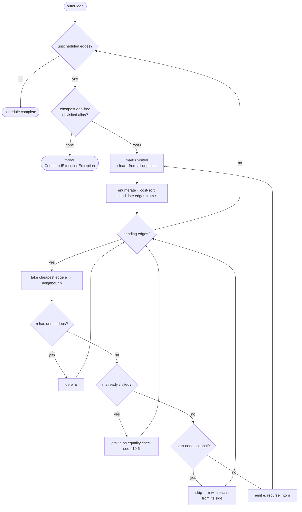
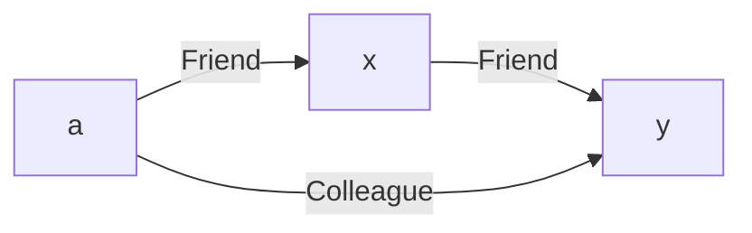
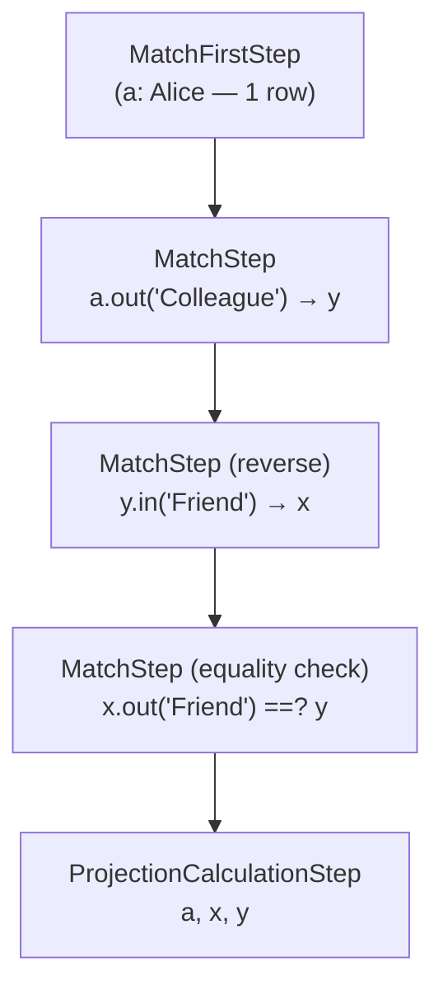

# Chapter 10 — Scheduling the Walk: Order and Direction

Chapter 9 closed with the planner holding a root alias. That root is the
starting point for every traversal in the query, chosen because it carries
the smallest estimated cardinality. But knowing where to start is only
half the problem. The planner must also decide, for each of the remaining
edges in the pattern, *which edge to walk next* and *which end of that
edge to start from*. Those two intertwined decisions — order and direction
— are the subject of this chapter.

By the end, you will be able to sit down with any small MATCH query, look
at its schema statistics, and predict exactly which `EdgeTraversal` list
the planner produces: which edges come first, which are walked forward,
which are walked in reverse, and which are deferred because a WHERE clause
demands it.

---

## 10.1 The Problem: n! Orderings, One Plan

Take a three-edge pattern.

```sql
MATCH {class: Person, as: a}
        .out('Knows') {as: b}
        .out('Likes') {as: c}
        .out('Wrote') {as: d}
RETURN a, b, c, d
```

Ignoring direction for the moment, three edges can be scheduled in 3! = 6
different orderings. With a four-edge pattern you get 24; with six you get
720. The number explodes well before you reach a realistic analytical query.

A full search over all orderings — the approach a classical query planner
might take for a handful of joins — is impractical here. Instead, the
planner uses a local strategy: starting from the chosen root alias, it
picks the cheapest available edge, marks the newly reached alias as bound,
and repeats until every edge has been scheduled. Because each choice depends
only on what is already bound, not on what comes later, this is a
*greedy depth-first search* (DFS). The result is not globally optimal, but
it is locally optimal at each step and always runs in polynomial time.

The output of this search is a `List<EdgeTraversal>` — the *schedule*. Each
`EdgeTraversal` records the `PatternEdge` being traversed and a boolean
`out` flag that says whether the runtime should walk forward (from the
syntactic source) or in reverse (from the syntactic target). That list is
built by `getTopologicalSortedSchedule` in `MatchExecutionPlanner`
(`core/.../match/MatchExecutionPlanner.java:1976`).

---

## 10.2 The Two-Level Loop

The scheduler is structured as two nested loops.

### 10.2.1 The outer loop

The outer loop runs until every edge in the pattern has been scheduled
(`MatchExecutionPlanner.java:2001`). On each iteration it picks the
cheapest, unvisited, dependency-free alias from the set `remainingStarts`
and starts a DFS from it.

`remainingStarts` is a `LinkedHashSet<String>` built in two steps
(`MatchExecutionPlanner.java:1991–1999`):

1. All aliases that have known cardinality estimates are sorted ascending by
   estimate and added first.
2. Then every alias in `pattern.aliasToNode` is appended with
   `addAll`, giving unestimated aliases a slot at the end.

Because `LinkedHashSet` preserves insertion order, an estimated alias always
wins over an unestimated one in a tie.

An alias is skipped as a root candidate if it has already been visited by a
prior DFS pass, or if its `remainingDependencies` entry is non-empty (a
`$matched` reference is not yet resolved — more on this in §10.5). When no
candidate survives both checks but unscheduled edges remain, the outer loop
throws `CommandExecutionException` with the message:

```
"This query contains MATCH conditions that cannot be evaluated, like an
 undefined alias or a circular dependency on a $matched condition."
```

(`MatchExecutionPlanner.java:2029`).

### 10.2.2 The inner DFS

The inner function `updateScheduleStartingAt`
(`MatchExecutionPlanner.java:2063`) does the actual work. Given a start
node, it:

1. Marks the start node visited and clears it from every
   `remainingDependencies` entry (`MatchExecutionPlanner.java:2098–2100`).
2. Enumerates candidate edges: all out-edges of the start node, plus any
   in-edges that are *invertible* (§10.3), plus non-invertible in-edges
   whose syntactic source is already visited (`MatchExecutionPlanner.java:2105–2127`).
3. Scores and sorts each candidate by estimated cost (§10.4).
4. Processes candidates in cost order: skips those whose neighbour still has
   unresolved dependencies, emits those that are ready, and recurses into
   each newly bound alias.

The inner loop does not throw when it stalls — it returns silently and
defers to the outer loop.



**Figure 10.1 — The two-level scheduling loop.**

---

## 10.3 Direction: Can This Edge Be Walked in Reverse?

For every candidate edge, the scheduler faces a second sub-decision: should
it walk the edge forward (from its syntactic source to its target) or in
reverse? Reverse traversal is appealing when the DFS frontier is sitting at
the *target* side of an edge and the target has a cheaper cardinality than
the source.

The question the scheduler asks is: is this edge *invertible*?

### 10.3.1 The invertibility check

Invertibility is tested by `SQLMatchPathItem.isBidirectional()`
(`core/.../sql/parser/SQLMatchPathItem.java:58`):

```java
public boolean isBidirectional() {
  if (filter.getWhileCondition() != null) {
    return false;
  }
  if (filter.getMaxDepth() != null) {
    return false;
  }
  if (filter.isOptional()) {
    return false;
  }
  return method.isBidirectional();
}
```

Three modifiers kill invertibility:

- **`while: (condition)`** — recursive traversal semantics are tied to the
  syntactic direction; the engine does not know how to run the recursion
  backwards.
- **`maxdepth: N`** — same reason: the depth counter counts hops in the
  forward direction only.
- **`optional: true`** on the far-end node — an optional node must always be
  reached *from* its already-bound non-optional neighbour, never the other
  way around.

The `method.isBidirectional()` check at the end ensures that the raw graph
method (`out`, `in`, or `both`) is itself traversable in both directions.
`out('X')` and `in('X')` are both invertible — `out` becomes `in` and vice
versa at runtime. `both('X')` is inherently symmetric. Field traversal and
multi-step path items override `isBidirectional()` to return `false`
unconditionally.

### 10.3.2 The direction-decision matrix

The scheduler applies the following rules when emitting an edge into the
schedule:

| Frontier is at | Neighbour state | Invertible? | `EdgeTraversal.out` | Runtime traverser |
|---|---|---|---|---|
| `edge.out` (syntactic source) | unvisited | — | `true` | `MatchEdgeTraverser` |
| `edge.in` (syntactic target) | unvisited | yes | `false` | `MatchReverseEdgeTraverser` |
| `edge.in` (syntactic target) | unvisited | no | — | hazard (see §10.3.3) |
| either | both endpoints visited | — | flipped if invertible or optional | equality check |

**Table 10.1 — Direction decisions at schedule time.**

When `EdgeTraversal.out` is `false`, the runtime creates a
`MatchReverseEdgeTraverser`, which swaps source and target aliases and
calls `item.getMethod().executeReverse()` instead of `execute()`. The
original source node's class and RID constraints travel with the
`EdgeTraversal` as `leftClass` and `leftRid` fields that the reverse
traverser uses to validate candidates
(`core/.../match/EdgeTraversal.java:55–64`).

### 10.3.3 The non-invertible hazard

If the DFS arrives at the *target* side of a non-invertible edge — a
`while:` or `maxdepth:` edge — there is no legal traversal direction: the
source alias is unbound (so the forward walk has nowhere to start) and the
edge cannot be reversed. This situation is prevented upstream by the root
selection phase described in Chapter 9, which assigns `Long.MAX_VALUE` as
the cardinality estimate for any alias that sits on the target side of a
`while:` edge. No rational cost function will pick a `MAX_VALUE` alias as
root, so the scheduler always enters such edges from the correct side.

---

## 10.4 Cost: Choosing Among Competing Edges

At each DFS step the scheduler may have several candidate edges available.
It picks the cheapest. The formula is:

```
edge_cost = base_cost × target_selectivity × depth_multiplier
```

where `base_cost = source_rows × fan_out × COST_RANDOM_PAGE_READ`
(`CostModel.edgeTraversalCost`, `core/.../executor/CostModel.java:150`).

### 10.4.1 Source rows

`source_rows` is `estimatedRootEntries.getOrDefault(sourceAlias, THRESHOLD)`
(`MatchExecutionPlanner.java:2137`). `THRESHOLD = 100`
(`MatchExecutionPlanner.java:336`) is the fallback for aliases that carry no
`class:` constraint. It is the same constant used for the prefetch decision
in the previous planning phase — a deliberate choice that makes unestimated
aliases appear as neither artificially cheap nor artificially expensive.

### 10.4.2 Fan-out

`EdgeFanOutEstimator.estimateFanOut`
(`core/.../match/EdgeFanOutEstimator.java:74`) divides the edge class's
approximate record count by the source class's approximate record count:

```
fan_out(OUT or IN) = edgeCount / sourceCount
fan_out(BOTH)      = outFanOut + inFanOut
```

When the schema does not contain either class, the estimator falls back to
`GlobalConfiguration.QUERY_STATS_DEFAULT_FAN_OUT` (default 10.0). A `BOTH`
edge whose schema declares neither vertex class on either end falls back to
`2.0 × edgeCount / sourceCount` — avoiding a spurious zero that would make
schema-less `BOTH` edges look free.

### 10.4.3 Target selectivity

`applyTargetSelectivity` (`MatchExecutionPlanner.java:2491`) scales the
base cost down when the *neighbour* alias carries a WHERE clause that
filters aggressively. It inspects the WHERE AST shape: a simple equality
reduces the cost by roughly `1 / distinctCount`; an inequality reduces it
by `(distinctCount - 1) / distinctCount`. When an index covers the filter,
`SelectivityEstimator` reads the histogram for a tighter estimate.

When the neighbour is already in `visitedNodes`, the cost is set to `0.0`
(`MatchExecutionPlanner.java:2147`). No new rows are produced — the edge
becomes a pure equality check (§10.6).

### 10.4.4 Depth multiplier

`applyDepthMultiplier` (`MatchExecutionPlanner.java:3058`) penalises
recursive edges:

- Plain single-hop edge: multiplier = 1 (no change).
- `while:` with `maxdepth: N`: multiply by N.
- `while:` without `maxdepth:`: multiply by `DEFAULT_WHILE_DEPTH = 10`
  (`MatchExecutionPlanner.java:3074`).

The default of 10 is pessimistic by design. One upstream row in a recursive
edge can fan out into an entire reachability subtree; scheduling it early
would amplify every subsequent step by that factor.

### 10.4.5 A concrete scheduling decision

Take a three-alias pattern with two candidate edges from the root:

```sql
MATCH {class: Person, where: (name='Alice'), as: a}
        .out('Colleague') {as: y},
      {as: a}.out('Friend') {as: x}
```

Assume `a` has estimate 1 (the name filter resolves to exactly one record).
Schema statistics give:

| Edge | Fan-out |
|---|---|
| `a` → `Colleague` → `y` | 30 |
| `a` → `Friend` → `x` | 150 |

**Table 10.2 — Fan-outs for the two-candidate example.**

```
cost(a -Colleague- y) = 1 × 30  × 4.0 = 120
cost(a -Friend-    x) = 1 × 150 × 4.0 = 600
```

The scheduler emits `Colleague` first. After binding `y`, there are no
further edges to emit from `y`, so the DFS stack returns to `a` and emits
`Friend` next. The schedule is:

```
[ EdgeTraversal(a-Colleague-y, forward),
  EdgeTraversal(a-Friend-x,   forward) ]
```

Had the two fan-outs been reversed, the order would flip.

---

## 10.5 `$matched` Dependencies: When Cost Must Yield

The greedy cost rule is overridden by one hard constraint: if an alias's
WHERE clause references `$matched.X`, that clause cannot be evaluated until
`X` is bound. The scheduler must honour this dependency even if it means
picking a more expensive edge.

### 10.5.1 Building the dependency map

`getDependencies(pattern)` (`MatchExecutionPlanner.java:4382`) scans every
alias's WHERE clause for `$matched.X` references. It returns a map from
each alias to the set of other aliases it requires:

```text
remainingDependencies = {
  author : {},          // no $matched references
  book   : {},
  reader : { "author" } // reader's WHERE contains $matched.author
}
```

The map is initialised once, before the outer loop starts
(`MatchExecutionPlanner.java:1981`).

### 10.5.2 Satisfying dependencies during the DFS

When the inner loop processes candidate edges in cost order, it checks
whether the *neighbour*'s dependency set is empty before emitting the edge
(`MatchExecutionPlanner.java:2181–2189`):

```java
var deps = remainingDependencies.get(neighboringNode.alias);
if (!deps.isEmpty()) {
  deferred.add(edgeData);  // try again next pass
  continue;
}
```

The key invariant: the moment a node is marked visited, it is removed from
*every* dependency set in the map (`MatchExecutionPlanner.java:2099–2100`).
This removal happens *before* the inner loop evaluates any of the start
node's candidate edges. As a consequence, if `author` is the DFS root and
is marked visited first, `reader`'s dependency on `"author"` is cleared
before the loop ever reaches the `reader` edge. In the common case, no
actual deferral is necessary.

Deferral is necessary only when the depended-upon alias is in a *different*
connected branch of the pattern that the current DFS pass cannot reach. In
that case the inner loop drains silently, and the outer loop picks a new
root that eventually satisfies the dependency.

### 10.5.3 Worked example: $matched dependency in action

```sql
MATCH {class: Person, where: (verified=true), as: author}
        .out('Wrote') {as: book},
      {class: Person, as: reader,
       where: ($matched.author.country = reader.country)}
        .out('Read') {as: book}
RETURN author, book, reader
```

The dependency map:

```text
remainingDependencies = { author: {}, book: {}, reader: { "author" } }
```

Estimates: `{ author: 10, reader: 100 000, book: 500 000 }`.

The outer loop sorts starts as `[author:10, reader:100000, book:500000]`.
`author` has no dependencies; it becomes root.

**DFS from `author`:** The start node is marked visited immediately, which
removes `"author"` from `reader`'s dependency set. The inner loop now sees
`reader`'s deps as empty. It emits `author -Wrote-> book` (forward), then
— because `book` is on the `Read` edge's in-side, and that edge is
invertible — emits `reader -Read-> book` in reverse (`out=false`). Both
edges are scheduled in a single DFS pass; no deferral occurs.

**Final schedule:**

```text
[ EdgeTraversal(author-Wrote-book, forward),
  EdgeTraversal(reader-Read-book,  reverse) ]
```

**Resulting pipeline:**

```text
MatchFirstStep(author, SELECT FROM Person WHERE verified=true)   // ~10 rows
MatchStep(author.out('Wrote') → book)                           // ~50 rows per author
MatchStep(book.in('Read') → reader
          WHERE $matched.author.country = reader.country)
ProjectionCalculationStep(author, book, reader)
```

When the third step evaluates the `$matched.author.country` expression,
`author` is already in the row — the invariant the scheduler enforced.

---

## 10.6 Back-References: The Equality Check

A pattern that reuses the same alias on two separate paths forces the
scheduler to handle an edge where *both endpoints are already visited*. No
new binding can be produced — the purpose of traversing the edge is simply
to verify that the connection exists.

The scheduler assigns such an edge a cost of `0.0` and emits it as a
zero-cost `EdgeTraversal`. At runtime, the traverser iterates the source's
neighbours and emits the row only when one of them equals the already-bound
target alias. No new alias enters the row; the step acts as a filter.

The direction of the check edge follows this rule
(`MatchExecutionPlanner.java:2236–2241`):

```java
boolean traversalDirection;
if (startNode.optional || edge.item.isBidirectional()) {
  traversalDirection = !isOutbound;  // enter from the already-visited side
} else {
  traversalDirection = isOutbound;   // keep syntactic direction
}
```

The flip for invertible edges ensures the traverser starts from the
already-bound source rather than from `startNode`, which may not yet be
available in the upstream row at that point.

An alternative implementation exists for patterns where the back-reference
join is large: the planner may attach a `SemiJoinDescriptor` to the
`EdgeTraversal`, in which case `EdgeTraversal.isConsumed()` returns `true`
and `addStepsFor` skips the edge entirely
(`MatchExecutionPlanner.java:4466`). A `BackRefHashJoinStep` on the
adjacent edge covers it instead. This hash-join variant is examined in
Chapter 13.

---

## 10.7 Disjoint Components

A MATCH query may contain multiple comma-separated pattern expressions that
share no alias:

```sql
MATCH {class: Person, as: p},
      {class: City,   as: c}
RETURN p, c
```

These two patterns have no connection. The scheduler cannot traverse from
one to the other. The planner detects this situation by calling
`splitDisjointPatterns()` (`MatchExecutionPlanner.java:4407`), which
delegates to `pattern.getDisjointPatterns()` to compute the connected
components of the pattern graph.

When `subPatterns.size() > 1`, the planner schedules each component
independently via `createPlanForPattern`, then joins their independent row
streams through a `CartesianProductStep`
(`MatchExecutionPlanner.java:538–546`):

```java
if (subPatterns.size() > 1) {
  var step = new CartesianProductStep(context, enableProfiling);
  for (var subPattern : subPatterns) {
    step.addSubPlan(
        createPlanForPattern(subPattern, context, …));
  }
  result.chain(step);
}
```

The result is a cross product of both result sets. For the example above
that means one output row per `(Person, City)` pair — every person paired
with every city. The scheduler does nothing special; it simply notices the
disconnection and runs two independent instances of the scheduling
algorithm.

---

## 10.8 WHILE Patterns

An edge with a `while:` clause is a bounded recursive traversal. The
scheduler treats it like any other edge during cost estimation — with the
depth multiplier of §10.4.4 penalising it appropriately — but two
consequences follow:

1. **Invertibility is lost** (§10.3.1). The scheduler can only ever enter
   the edge from its syntactic source. Root selection (Chapter 9) ensures
   this by inflating the cardinality estimate of the edge's *target* alias
   to `Long.MAX_VALUE`, making it prohibitively expensive as a root.

2. **A different runtime step is emitted.** `addStepsFor`
   (`MatchExecutionPlanner.java:4489`) detects `while:` edges and may
   substitute an `InvertedWhileHashJoinStep` when the planner determines
   the reachability set can be pre-materialised. If it cannot, a plain
   `MatchStep` with `MatchEdgeTraverser` handles the recursion via its
   `while:` loop at traversal time.

The step-catalogue mechanics belong to Chapter 11. What matters here is
that the scheduler's responsibility ends at emitting the `EdgeTraversal`
with the correct forward direction; it does not choose between step
variants itself.

---

## 10.9 Step Generation: Turning the Schedule into a Pipeline

Immediately after `getTopologicalSortedSchedule` returns its list,
`createPlanForPattern` (`MatchExecutionPlanner.java:1790`) calls
`addStepsFor` (`MatchExecutionPlanner.java:4435`) once for each
`EdgeTraversal`:

- **First edge** (`first=true`): a `MatchFirstStep` is prepended. The
  `MatchFirstStep` emits the initial record set for the root alias by
  running a synthesised `SELECT` statement (or reusing a prefetch cache if
  the alias was prefetched in phase 4).
- **Subsequent edges** (`first=false`): only a `MatchStep` — or an
  `OptionalMatchStep` when the target alias is declared `optional: true` —
  is appended.
- **Consumed edges** (`edge.isConsumed() == true`): skipped entirely. A
  hash-join step on the adjacent edge covers them (Chapter 13).

The `EdgeTraversal.out` boolean flows directly into `MatchStep`, which uses
it to choose between `MatchEdgeTraverser` (forward) and
`MatchReverseEdgeTraverser` (reverse) at step construction time.

---

## 10.10 End-to-End Example

Take the running example from Chapter 9 and carry it through to a complete
schedule:

```sql
MATCH {class: Person, where: (name='Alice'), as: a}
        .out('Friend') {as: x}
        .out('Friend') {as: y},
      {as: a}.out('Colleague') {as: y}
RETURN a, x, y
```

The alias `y` appears twice; after `buildPatterns` it is one `PatternNode`
with two incoming edges. The pattern graph is:



**Figure 10.2 — Pattern graph: `a` reaches `y` via two paths.**

Schema statistics: `a` estimate = 1 (name equality via index), `x` and `y`
are unconstrained (`THRESHOLD = 100` fallback). Fan-outs: `Friend` ≈ 150,
`Colleague` ≈ 30.

**Phase 1 — root pick.** `remainingStarts` sorts as `[a:1, x:100, y:100]`.
`a` has no dependencies. It becomes root.

**Phase 2 — DFS from `a`.** The start node is marked visited immediately.
Candidate edges from `a`:

```text
cost(a -Colleague- y) = 1 × 30  × 4.0 = 120
cost(a -Friend-    x) = 1 × 150 × 4.0 = 600
```

`Colleague` wins. Emit `EdgeTraversal(a-Colleague-y, out=true)`. Mark `y`
visited. The DFS recurses into `y`.

**From `y`.** `y`'s only unscheduled neighbour via a candidate edge is via
the `x -Friend-> y` in-edge. This in-edge is invertible (no `while`, no
`optional`). But `x` is unvisited. Cost from `y`'s side:

```text
cost(y ←Friend- x) = 100 × 150 × 4.0 = 60 000
```

Emit `EdgeTraversal(x-Friend-y, out=false)` — reverse walk from `y` to
`x`. Mark `x` visited. Recurse into `x`.

**From `x`.** The only unscheduled edge from `x` is `x -Friend-> y`. Both
`x` and `y` are visited. Cost = 0. This is a back-reference: both endpoints
are bound. Emit as equality check, direction `out=true` (keep syntactic
direction; edge is not optional, `x` is the syntactic source).

**Outer loop completes.** All three edges are scheduled. Back to the outer
loop: no unscheduled edges remain.

**Final schedule:**

```text
[ EdgeTraversal(a-Colleague-y,  out=true,  forward)
  EdgeTraversal(x-Friend-y,     out=false, reverse, a's DFS recurse)
  EdgeTraversal(x-Friend-y,     out=true,  equality check) ]
```

**Resulting pipeline:**

```text
MatchFirstStep(a, SELECT FROM Person WHERE name='Alice')
MatchStep(a.out('Colleague') → y)         // binds y
MatchStep(y.in('Friend')     → x)         // reverse: binds x
MatchStep(x.out('Friend') ==? y)          // equality check only
ProjectionCalculationStep(a, x, y)
```



**Figure 10.3 — Execution pipeline for the end-to-end example.**

The second step binds `y` before `x`, exploiting the cheaper fan-out.
The third step walks backwards along `Friend` to find `x` records that are
friends of `y`. The fourth step enforces the back-reference: it confirms
that each `x` is also a friend of `y` via the `a -Friend-> x -Friend-> y`
path. No new alias enters the row at the fourth step; it is a pure filter.

---

## 10.11 What the Scheduler Cannot Do

One limitation is worth naming explicitly before moving to Chapter 11.
The greedy DFS does not backtrack globally. If the first local choice turns
out to be globally expensive — say, because the `Colleague` fan-out was
mis-estimated and is actually 30 000 rather than 30 — the scheduler has
already committed to that edge and will carry the cost forward. There is no
second-pass re-optimisation once the schedule is built.

The planner compensates with two mechanisms: the depth multiplier for
`while:` edges (§10.4.4) discourages early commitment to recursive
traversals; and the hash-join variants in Chapters 13 and 14 can replace
expensive nested-loop steps *after* the schedule is built, without
disturbing the ordering.

The most important of these safety nets is the hash-join threshold described
in Chapter 13. When the greedy DFS commits to an edge ordering and that
committed order later turns out to produce a very high fan-out on a
particular edge, there is no global backtracking — the schedule stands. But
if the high-fan-out edge is eligible for hash-join treatment (it must be a
back-reference edge whose build side fits within the configured size limit),
the planner substitutes a `BackRefHashJoinStep` in place of the nested-loop
`MatchStep`. That substitution converts what would be an unbounded per-row
penalty — the cost grows linearly with each row the bad ordering funnels
through the edge — into a bounded cost: one hash-table build paid once, then
O(1) probes per row. A truly optimal plan might avoid the fan-out problem
altogether by choosing a different root or a different schedule, but the
hash-join threshold is the single largest mechanism the planner has for
containing the damage when its own greedy choice turns out to be wrong. See
Chapter 13 §"The required back-reference: semi-joins and anti-joins" —
specifically its "Where it gets chosen" discussion of the
intersection-optimization sweep — for how the planner selects this
substitution and the size threshold that controls when it fires.

---

## Summary

The scheduler converts a `Pattern` into a `List<EdgeTraversal>` through a
two-level greedy DFS. The outer loop maintains a sorted frontier of root
candidates, ordered by estimated cardinality. The inner DFS expands from
each root, cost-sorting its candidate edges and emitting the cheapest ready
edge at each step. The two-level structure ensures that `$matched`
dependencies and disjoint components are handled without a global
backtracking search.

Three direction cases arise at emit time: a forward traversal (`MatchEdgeTraverser`),
a reverse traversal when the DFS sits at the syntactic target of an
invertible edge (`MatchReverseEdgeTraverser`), and a zero-cost equality
check when both endpoints are already bound — no new alias enters the row;
the step acts as a join filter.

Invertibility is governed by `SQLMatchPathItem.isBidirectional()`, which
returns `false` for any edge carrying `while:`, `maxdepth:`, or `optional:`
modifiers. WHILE edges are also penalised by a depth multiplier to prevent
them from being scheduled before simpler alternatives.

Once the schedule is complete, step generation is immediate: the first
`EdgeTraversal` produces a `MatchFirstStep`; each subsequent entry produces
one `MatchStep` or `OptionalMatchStep`. That step pipeline is the subject
of Chapter 11.

---

## Further Reading

- `core/src/main/java/com/jetbrains/youtrackdb/internal/core/sql/executor/match/MatchExecutionPlanner.java`
  — `getTopologicalSortedSchedule()` (line 1976), `updateScheduleStartingAt()`
  (line 2063), `estimateEdgeCost()` (line 2322), `applyTargetSelectivity()`
  (line 2491), `applyDepthMultiplier()` (line 3058), `getDependencies()`
  (line 4382), `addStepsFor()` (line 4435), `splitDisjointPatterns()`
  (line 4407).
- `core/src/main/java/com/jetbrains/youtrackdb/internal/core/sql/executor/match/EdgeTraversal.java`
  — The scheduled edge record: direction flag, left-side constraints,
  `isConsumed()` (line 504).
- `core/src/main/java/com/jetbrains/youtrackdb/internal/core/sql/parser/SQLMatchPathItem.java`
  — `isBidirectional()` (line 58): the invertibility predicate.
- `core/src/main/java/com/jetbrains/youtrackdb/internal/core/sql/executor/match/EdgeFanOutEstimator.java`
  — Schema-based fan-out estimation, with `BOTH`-direction handling.
- `core/src/main/java/com/jetbrains/youtrackdb/internal/core/sql/executor/CostModel.java`
  — `edgeTraversalCost()` (line 150) and the other cost primitives.
- Chapter 9 — How `estimateRootEntries` produces the cardinality map the
  scheduler consumes, including the `Long.MAX_VALUE` inflation for
  non-invertible-edge targets.
- Chapter 11 — The execution steps the scheduler emits: `MatchFirstStep`,
  `MatchStep`, `OptionalMatchStep`, and the return-projection family.
- Chapter 13 — Hash-join variants: how `BackRefHashJoinStep` and
  `InvertedWhileHashJoinStep` replace parts of the nested-loop schedule.
