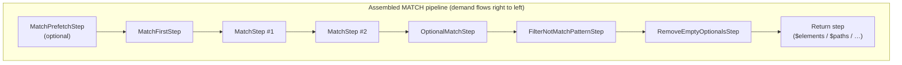
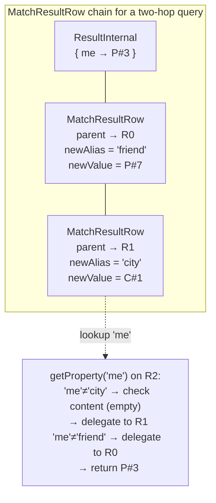

# Chapter 11 — The Step Pipeline: How the Plan Becomes Code

Chapter 10 left you with a fully scheduled edge list: the planner has decided which alias
is the root, in what order to walk the edges, and which direction each traversal runs.
That schedule is a data structure. Before any query result can be returned, the planner
must translate it into executable machinery. This chapter is about that translation.

## 11.1 The plan is a chain of pull iterators

The planner's output is a `SelectExecutionPlan` — an ordered list of `ExecutionStep`
objects. Every step is a pull iterator: it exposes a stream (via `internalStart(ctx)`)
that requests rows from the step before it and yields rows to the step after it. When the
executor wants the first result row, it calls `start()` on the *last* step in the list.
That last step asks its predecessor for a row, which asks its predecessor, and so on, until
the request reaches the first step — the only one with no predecessor — which produces a
row from scratch. Rows flow left to right through the chain; demand flows right to left.

This is the same pull-based model Chapter 3 demonstrated for a plain `SELECT`. The
difference is that a MATCH plan is assembled from a richer menu of step types, each
tailored to one aspect of pattern-matching behaviour. The sections that follow introduce
each type in the order it appears in a typical plan.



**Figure 11.1 — A MATCH pipeline with all optional step types shown. Not every query uses
every slot; the planner assembles the minimum set required.**

Not every query needs every step type. `MatchPrefetchStep` appears only when an alias is
small enough to cache. `OptionalMatchStep` appears only when a node carries `optional:
true`. `FilterNotMatchPatternStep` appears only when the query contains a `NOT { … }`
sub-pattern. The planner omits any step whose condition is not met.

## 11.2 `MatchFirstStep` — seeding the pipeline

Every MATCH pipeline needs a starting point: something that produces the first row for the
engine to extend. That something is `MatchFirstStep`.

The step corresponds to the root alias chosen during planning. It is not a traversal step —
it does not walk any edge. Instead, it scans the record set for one pattern node and wraps
each record it finds into a one-property row of the form `{alias → record}`.

The step's `internalStart()` method begins by looking up a context variable:

```java
// MatchFirstStep.java:102–106
var matchedNodes =
    (List<Result>) ctx.getVariable(MatchPrefetchStep.PREFETCHED_MATCH_ALIAS_PREFIX + alias);
if (matchedNodes != null) {
  data = ExecutionStream.resultIterator(matchedNodes.iterator());
} else {
  data = executionPlan.start();
}
```

If a preceding `MatchPrefetchStep` placed a cached list under that key, the step reads from
the cache. Otherwise it executes its own sub-plan — a synthetic `SELECT` generated by the
planner at assembly time. Either way, each record it obtains is wrapped in a fresh
`ResultInternal` that stores the record under the alias name
(`MatchFirstStep.java:110–116`), and the context variable `$matched` is set to that row so
that downstream `WHERE` clauses can reference already-bound aliases via `$matched.<alias>`.

A correctly assembled plan always provides exactly one of the two sources. A step that
received neither would throw a `NullPointerException` when `executionPlan.start()` was
called on a null reference — but the planner guarantees that cannot happen.

## 11.3 `MatchStep` — one edge, one alias added

For each edge in the scheduled order, the planner emits one `MatchStep`. This step takes
a stream of rows from upstream and — for each upstream row — emits zero or more extended
rows, each of which is the upstream row plus one new alias binding.

The implementation is minimal (`MatchStep.java:87–93`):

```java
@Override
public ExecutionStream internalStart(CommandContext ctx) throws TimeoutException {
  assert MatchAssertions.checkNotNull(prev, "previous step");

  var resultSet = prev.start(ctx);
  return resultSet.flatMap(this::createNextResultSet);
}
```

`flatMap` asks upstream for one row at a time, passes it to `createNextResultSet`, and
stitches the resulting per-row streams into a single output stream. `createNextResultSet`
delegates immediately to `createTraverser()`, which instantiates the appropriate traverser
strategy based on the edge's type and scheduled direction
(`MatchStep.java:108–119`):

```java
protected MatchEdgeTraverser createTraverser(Result lastUpstreamRecord) {
  if (edge.edge.item instanceof SQLMultiMatchPathItem) {
    return new MatchMultiEdgeTraverser(lastUpstreamRecord, edge);
  } else if (edge.edge.item instanceof SQLFieldMatchPathItem) {
    return new MatchFieldTraverser(lastUpstreamRecord, edge);
  } else if (edge.out) {
    return new MatchEdgeTraverser(lastUpstreamRecord, edge);
  } else {
    return new MatchReverseEdgeTraverser(lastUpstreamRecord, edge);
  }
}
```

The traverser itself is an `ExecutionStream`: `flatMap` drives it directly, pulling
candidates one at a time, applying class, RID, and WHERE filters, and yielding the ones
that pass. Each passing candidate is wrapped with the new alias and emitted as the next row
in the output.

The four traverser strategies named above are the subject of Chapter 12. What matters here
is the contract: a `MatchStep` adds exactly one alias to every row it emits. After the
first `MatchStep` the row holds two aliases; after the second, three; and so on until the
final traversal step has bound every alias in the pattern.

## 11.4 The alias-keyed row: `MatchResultRow`

Chapter 5 introduced alias-keyed rows at an intuitive level: a row that grows one alias
at a time as each edge is traversed. Now that the pipeline shape is clear, the time has
come to see how those rows are actually represented.

The naive implementation would allocate a fresh `HashMap`, copy all upstream bindings into
it, and add the new alias. For a ten-hop query that means ten copies of a growing map per
output row — unbearable for the fan-out patterns that MATCH queries regularly produce.

`MatchResultRow` solves the problem by forming a *linked chain* instead of copying. Each
instance stores only three fields plus a lazily-allocated override map
(`MatchResultRow.java:46–48`):

```java
private final Result parent;
private final String newAlias;
private Object newValue;
```

A lookup walks the chain until it finds the layer that owns the requested alias
(`MatchResultRow.java:88–99`):

```java
public <T> T getProperty(@Nonnull String name) {
  // (session check elided)
  if (name.equals(newAlias)) {
    return newAliasRemoved ? null : (T) newValue;
  }
  if (content != null && content.containsKey(name)) {
    var val = content.get(name);
    return val == REMOVED_SENTINEL ? null : (T) val;
  }
  return parent.getProperty(name);
}
```

The first check handles the alias this layer owns. The second handles any late writes
stored in the `content` map (described below). The third delegates upward to the parent.



**Figure 11.2 — `MatchResultRow` chain after two traversal steps. Each layer stores one
alias; lookups for earlier aliases walk upward through the parent chain.**

Each `MatchStep` allocates exactly one `MatchResultRow` per emitted candidate — one small
object rather than one full `HashMap` copy. The cost of a property lookup is O(depth),
but projection reads each alias once at the very end of the pipeline, so the total lookup
cost across all steps is negligible compared to the traversal itself.

Two special-case mechanisms sit on top of this basic structure:

**Late writes.** A WHILE traversal adds `depthAlias` and `pathAlias` keys mid-pipeline.
Those go into the lazily-allocated `content` map rather than growing the chain; they are
found by the second branch of `getProperty`.

**Removals.** When `ReturnMatchPatternsStep` strips auto-generated aliases at the end of
the pipeline, it calls `removeProperty`. Because the value being removed may live in a
parent layer, the step cannot actually delete it there. Instead it stores a private
`REMOVED_SENTINEL` object (`MatchResultRow.java:44`) in the local `content` map to shadow
the parent entry. The identity comparison in `getProperty` turns that sentinel into a
returned `null`.

If a property lookup returns an unexpected `null` during debugging, checking whether a
sentinel is shadowing the key in some intermediate layer is the right first diagnostic
step.

## 11.5 `MatchPrefetchStep` — caching small alias record sets

The prefetch step is an optimisation, not a different join algorithm. Understanding it
requires understanding the cost it avoids.

In a plan with two disconnected pattern components (two separate patterns joined by a
`CartesianProductStep`), the inner component's `MatchFirstStep` is called once for every
row the outer component produces. If the inner alias has ten thousand records and the outer
component produces five hundred rows, the inner alias is scanned five hundred times.
Prefetching converts those five hundred scans into one.

`MatchPrefetchStep` runs before any `MatchFirstStep`. It executes its own sub-plan, drains
it completely into a `List<Result>`, and stores that list in the execution context under the
key `PREFETCHED_MATCH_ALIAS_PREFIX + alias` (`MatchPrefetchStep.java:100`). The step then
returns an *empty* stream — it is a side-effect-only step that produces no rows of its
own. Downstream `MatchFirstStep`s find the list in the context and read from it directly,
bypassing their sub-plans entirely.

The planner applies this optimisation only when it estimates that the alias has fewer than
`THRESHOLD` (100) records and carries no `$matched` dependency that would make its record
set vary per row. Large alias record sets are not prefetched; for those, on-demand scanning
is the correct choice.

## 11.6 `OptionalMatchStep` and `RemoveEmptyOptionalsStep` — the LEFT JOIN pair

A node marked `optional: true` in the pattern introduces a LEFT JOIN requirement: even if
no neighbour satisfies the edge's filters, the upstream row must still be emitted — with
`null` in the optional alias's slot.

Two steps implement this together.

`OptionalMatchStep` is a direct subclass of `MatchStep`. It overrides only one method
(`OptionalMatchStep.java:32`):

```java
@Override
protected MatchEdgeTraverser createTraverser(Result lastUpstreamRecord) {
  return new OptionalMatchEdgeTraverser(lastUpstreamRecord, edge);
}
```

`OptionalMatchEdgeTraverser` behaves like the standard traverser, but when it exhausts the
neighbour list without finding a passing candidate, it emits one final row containing a
private `EMPTY_OPTIONAL` sentinel value rather than emitting nothing at all. The result:
every upstream row produces *at least* one output row. The invariant is identical to a SQL
`LEFT JOIN` — no upstream row is discarded.

The sentinel cannot simply be `null`, because `null` is a legal value that a property might
already carry. A distinct sentinel object makes the two cases distinguishable by identity
comparison.

`RemoveEmptyOptionalsStep` runs after all traversals are complete. It scans every property
name in every row and replaces each `EMPTY_OPTIONAL` sentinel with genuine `null`
(`RemoveEmptyOptionalsStep.java:42–47`). The planner appends exactly one of these steps to
the plan whenever at least one node in the pattern is optional.

After `RemoveEmptyOptionalsStep`, every `null` property value in a row is a genuine
absence. Before it, a `null` and a sentinel mean different things and should not be
confused.

## 11.7 `FilterNotMatchPatternStep` — NOT EXISTS in a nested loop

The `NOT { … }` construct asks the engine to retain only those rows for which the negative
sub-pattern matches *nothing* in the database — the SQL `NOT EXISTS` equivalent.

`FilterNotMatchPatternStep` implements this with a nested-loop strategy. For each upstream
row, it builds a temporary `SelectExecutionPlan` consisting of a `ChainStep` that injects a
shallow copy of the current row as the starting point, followed by the NOT pattern's own
`MatchStep`s (`FilterNotMatchPatternStep.java:100–107`). It then probes that plan with
`hasNext()`. If the plan produces any result, the NOT pattern matched and the upstream row
is discarded. If it produces no result, the row passes through.

The shallow copy is deliberate: the NOT sub-plan reads property values from the injected
row to resolve `$matched` references in its WHERE clauses, but it never mutates those
values. Shallow copy is safe and avoids the cost of a deep clone on every iteration.

The runtime cost of this approach is O(|upstream| × cost(NOT sub-pattern)). For a NOT
sub-pattern that requires a full class scan per upstream row, that degrades badly. The
`HashJoinMatchStep` variant described in Chapter 13 converts the same operation to
O(build + |upstream|) when the NOT side can be materialised independently — but
`FilterNotMatchPatternStep` remains the correct choice when a `$matched` dependency makes
independent materialisation impossible.

## 11.8 The return-step family

Every MATCH pipeline ends with exactly one return step. Its job is to shape the alias-keyed
row into whatever form the `RETURN` clause requested. The planner selects among four
variants based on the return keyword (`MatchExecutionPlanner.addReturnStep()`):

**`ReturnMatchElementsStep` — `RETURN $elements`.** Iterates the property names of each
row, skips any name that starts with `MatchExecutionPlanner.DEFAULT_ALIAS_PREFIX` (the
auto-generated alias prefix the planner uses for unnamed nodes), and emits each remaining
value as a separate result row. A three-alias row `{me: P#3, friend: P#7, city: C#1}`
becomes three result rows, one per record. Scalar values that are neither `Identifiable`
nor `Result` are silently skipped.

**`ReturnMatchPathsStep` — `RETURN $paths`.** Does nothing at all beyond forwarding the
upstream stream unchanged. The full alias-keyed row, including auto-generated aliases,
is the output. The step exists as a distinct type so that the planner's branching code has
a concrete class to chain; all logic lives in upstream steps.

**`ReturnMatchPatternsStep` — `RETURN $patterns`.** Maps over the upstream stream and
removes every property whose name starts with the default alias prefix
(`ReturnMatchPatternsStep.java:48–55`). Because rows at this point are `MatchResultRow`
instances, `removeProperty` stores `REMOVED_SENTINEL` in the local `content` map rather
than mutating a parent layer. The result is a row that exposes only the user-defined
aliases.

**`ReturnMatchPathElementsStep` — `RETURN $pathElements`.** Identical to
`ReturnMatchElementsStep` but skips the prefix filter, so auto-generated aliases are
unrolled alongside user-defined ones. This gives a flat list of every record on the
matched path, including intermediate nodes the user did not explicitly name.

When the user writes a conventional `RETURN me.name, friend.name, city.name` rather than
one of the four `$` forms, the planner appends a `ProjectionCalculationStep` that evaluates
each expression against the alias-keyed row and emits a flat property map.

## 11.9 Lazy by design

The pull model is not just a convenience — it changes the cost profile of the entire
pipeline in ways that matter for real queries.

The pipeline is *lazy*. Nothing is computed until a row is demanded. When the executor
calls `start()` on the last step, that step calls `start()` on its predecessor, and so
the demand propagates backward until the `MatchFirstStep` finally yields its first record.
A `LIMIT 10` clause stops pulling after ten rows, which causes the entire chain to stop
— no traversal work is done for the rows that were never requested. On a large graph this
is not a courtesy; it is a fundamental cost guarantee.

The pipeline is also *cancellable*. Because each step yields control back to the caller
between rows, a timeout, a user cancellation, or an exception thrown by a traversal error
propagates without requiring any special cleanup inside the steps. The caller stops pulling;
the steps stop executing.

These two properties — laziness and cancellability — are not accidents. They are the direct
consequences of the pull model, and they are the reason the MATCH execution engine
inherits them from the same `ExecutionStream` abstraction that Chapter 3 introduced for
plain `SELECT`.

## 11.10 Putting the pipeline together: a traced example

Start with the two-hop query that appeared in Chapter 5:

```sql
MATCH {class: Person, as: me, where: (name = 'Alice')}
        .out('Knows') {as: friend}
        .out('Lives') {as: city, where: (name = 'Berlin')}
RETURN me.name, friend.name, city.name
```

Assume the planner selected `me` as the root alias (it carries a highly selective
`name = 'Alice'` filter) and scheduled the two edges in the written order. The assembled
plan is:

```
MatchPrefetchStep(me)        ← me is tiny; pre-load into context
MatchFirstStep(me)           ← reads from prefetch cache; emits {me: P#3}
MatchStep(me → friend)       ← flatMaps {me:P#3} through MatchEdgeTraverser
MatchStep(friend → city)     ← flatMaps through a second MatchEdgeTraverser
ProjectionCalculationStep    ← evaluates me.name, friend.name, city.name
```

The row evolution step by step:

```
MatchFirstStep          →  ResultInternal { me: P#3 }
MatchStep #1 emits      →  MatchResultRow(parent={me:P#3}, newAlias="friend", newValue=P#7)
MatchStep #2 emits      →  MatchResultRow(parent=↑, newAlias="city", newValue=C#1)
ProjectionCalculationStep → { "me.name": "Alice", "friend.name": "Bob", "city.name": "Berlin" }
```

Each `MatchResultRow` in the middle two rows is one small object. The projection step reads
`me`, `friend`, and `city` from the chain by walking the parent links, then discards the
chain entirely. No map copying occurs between `MatchFirstStep` and projection.

---

The step catalogue is now complete. Every step in the pipeline has been named, its contract
described, and its interaction with `MatchResultRow` traced. One question has been held
back deliberately: this chapter described `MatchStep` as a step that "delegates to a
traverser" without saying what that traverser does. The traverser is where the actual edge
walking happens, and it comes in six variants depending on edge type, direction, and whether
the target alias is already bound. Chapter 12 opens all six.

---

## Further reading

- `core/src/main/java/com/jetbrains/youtrackdb/internal/core/sql/executor/match/MatchFirstStep.java` —
  root alias data source; data-source selection at line 102; `$matched` assignment at
  lines 110–116.
- `core/src/main/java/com/jetbrains/youtrackdb/internal/core/sql/executor/match/MatchStep.java` —
  `internalStart` pull loop at line 87; `createTraverser` factory at line 108.
- `core/src/main/java/com/jetbrains/youtrackdb/internal/core/sql/executor/match/MatchPrefetchStep.java` —
  context variable write at line 100; `PREFETCHED_MATCH_ALIAS_PREFIX` constant at line 54.
- `core/src/main/java/com/jetbrains/youtrackdb/internal/core/sql/executor/match/MatchResultRow.java` —
  field declarations at lines 46–48; `getProperty` chain walk at lines 88–99;
  `REMOVED_SENTINEL` at line 44.
- `core/src/main/java/com/jetbrains/youtrackdb/internal/core/sql/executor/match/OptionalMatchStep.java` —
  `createTraverser` override at line 32.
- `core/src/main/java/com/jetbrains/youtrackdb/internal/core/sql/executor/match/RemoveEmptyOptionalsStep.java` —
  sentinel-to-null replacement at lines 42–47.
- `core/src/main/java/com/jetbrains/youtrackdb/internal/core/sql/executor/match/FilterNotMatchPatternStep.java` —
  NOT sub-plan construction at lines 100–107.
- `core/src/main/java/com/jetbrains/youtrackdb/internal/core/sql/executor/match/ReturnMatchElementsStep.java`,
  `ReturnMatchPathsStep.java`, `ReturnMatchPatternsStep.java`,
  `ReturnMatchPathElementsStep.java` — the four return-step variants.
