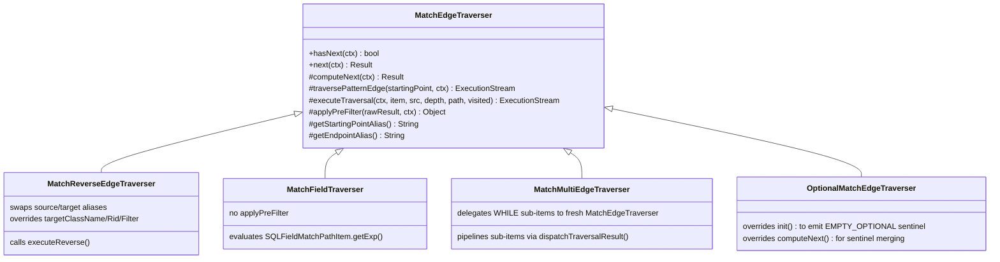

# Chapter 12 — Traversers: Six Ways to Walk an Edge

Chapter 11 left us with a chain of `MatchStep` instances — one per scheduled edge in
the pattern. Each step knows which edge to walk next, but the chapter stopped short of
explaining *how* an edge is actually walked at runtime. That is the question this
chapter answers.

The short version: `MatchStep` does not contain any traversal logic of its own. For
each incoming result row it calls a single factory method, gets back a strategy object
— the *traverser* — and flatmaps that object into the downstream row stream. Everything
interesting is inside the traverser.

There are six distinct traverser strategies. Which one is chosen depends on two things:
the AST type of the path item and the direction flag the scheduler recorded in the edge
descriptor. Both are known at plan time, so the choice is frozen before execution
begins. At runtime, `MatchStep` makes no decisions — it just asks the traverser for its
next result.

---

## 12.1 The strategy pattern, concretely

Open `MatchStep.java` and look at `internalStart` (line 87):

```java
var resultSet = prev.start(ctx);
return resultSet.flatMap(this::createNextResultSet);
```

`flatMap` calls `createNextResultSet` once per upstream row. That method does exactly
one thing:

```java
// MatchStep.java:99–101
public ExecutionStream createNextResultSet(Result lastUpstreamRecord, CommandContext ctx) {
  return createTraverser(lastUpstreamRecord);
}
```

`createTraverser` (line 108) is the factory:

```java
// MatchStep.java:108–119
protected MatchEdgeTraverser createTraverser(Result lastUpstreamRecord) {
  if (edge.edge.item instanceof SQLMultiMatchPathItem)
    return new MatchMultiEdgeTraverser(lastUpstreamRecord, edge);
  else if (edge.edge.item instanceof SQLFieldMatchPathItem)
    return new MatchFieldTraverser(lastUpstreamRecord, edge);
  else if (edge.out)
    return new MatchEdgeTraverser(lastUpstreamRecord, edge);
  else
    return new MatchReverseEdgeTraverser(lastUpstreamRecord, edge);
}
```

That is the entire dispatch table for four of the six strategies. The fifth and sixth
arrive via subclassing: `OptionalMatchStep` overrides `createTraverser` to return an
`OptionalMatchEdgeTraverser`, and back-reference enforcement is not a separate traverser
class at all — it is a runtime behaviour embedded in the base class that surfaces only
when the target alias is already bound.

The returned traverser implements `ExecutionStream` directly, so the `flatMap` call
treats it as a lazy source of result rows. Traversers are not shared: a new instance is
created for every upstream row, every time. This trades one small allocation per step
per row for total freedom from synchronisation and state leaks between unrelated queries.

---

## 12.2 The base traverser: `MatchEdgeTraverser`

`MatchEdgeTraverser` (`MatchEdgeTraverser.java`) is simultaneously the base class for
the traverser hierarchy and the concrete implementation used for plain forward edges.
Understanding it means understanding all six variants, because each variant either
extends or wraps it.

The class hierarchy is flat:



**Figure 12.1 — The traverser class hierarchy. `MatchEdgeTraverser` is both the root
and the concrete forward-traversal implementation.**

The `ExecutionStream` contract requires `hasNext` and `next`. `MatchEdgeTraverser`
implements both with a single key rule: `computeNext` may return `null` to signal that
a candidate was rejected; `hasNext` loops, calling `computeNext` repeatedly, and only
returns `true` when a non-null result has been buffered. Rejected candidates are silently
discarded. This null-returning convention is how the back-reference equality check
(§12.7) works without any external filtering layer.

The traversal lifecycle for one upstream row is:

1. `MatchStep.createTraverser(upstreamRow)` — a new traverser is constructed; the
   downstream stream is `null` (lazy init).
2. `hasNext(ctx)` — calls `init(ctx)` on first invocation. `init` extracts the source
   record from the upstream row using `getStartingPointAlias()`, then calls
   `executeTraversal(...)` to open the storage stream.
3. `executeTraversal` — for a plain single-hop edge (no `while:` or `maxDepth`), it
   calls `traversePatternEdge` to fetch the raw neighbour iterable, applies
   `applyPreFilter`, and returns the result as an `ExecutionStream`. For a recursive
   edge, it hands off to `LazyRecursiveTraversalStream` instead.
4. `computeNext(ctx)` — consumes one candidate from the downstream stream, performs the
   consistency check, and builds a `MatchResultRow` if the candidate passes.
5. `next(ctx)` — returns the buffered result and writes `$matched` on `CommandContext`
   (line 190) so downstream WHERE clauses can see the current row.

---

## 12.3 Standard forward traversal

The most common case is the simplest: the edge in the query is written `.out('Knows')`,
the scheduler agrees that walking forward is cheaper, and at runtime the traverser walks
exactly as written. For this case `EdgeTraversal.out` is `true` and `createTraverser`
instantiates a plain `MatchEdgeTraverser`.

`traversePatternEdge` (line 531) does three things. It saves the current value of
`$current` on `CommandContext`, sets `$current` to the source record (so that the
traversal method — `out()`, `in()`, `both()` — can reference it internally), calls
`this.item.getMethod().execute(startingPoint, iCommandContext)` to get the raw adjacency
result, then restores `$current` in a `finally` block. The raw result is then passed to
`applyPreFilter` (described in Chapter 14) and converted to an `ExecutionStream` via
`toExecutionStream`.

`toExecutionStream` handles the heterogeneous return type of graph traversal methods:
`null` becomes an empty stream; a single `Identifiable` or `ResultInternal` becomes a
singleton stream; an `Iterable` (including `RidBag` adjacency lists) becomes a
per-element stream; any other type becomes an empty stream. The result is a uniform pull
stream from which `hasNext` can pull candidates.

For each candidate, `computeNext` performs the consistency check (more on this in §12.7)
and, if the candidate passes, wraps the upstream row and the new alias binding in a
`MatchResultRow`.

---

## 12.4 Reverse traversal: `MatchReverseEdgeTraverser`

In Chapter 10, the scheduler considered whether the cheaper starting point for an edge
sits at the syntactic source or the syntactic target. When it picks the syntactic target,
the edge must be walked backwards — from `edge.in` to `edge.out`. At that point
`EdgeTraversal.out` is set to `false`, and `createTraverser` returns a
`MatchReverseEdgeTraverser`.

The reverse traverser extends `MatchEdgeTraverser` and overrides exactly three groups of
methods:

**Alias swap.** The constructor (line 41 in `MatchReverseEdgeTraverser.java`) stores the
swapped aliases:

```java
this.startingPointAlias = edge.edge.in.alias;   // syntactic target → actual source
this.endPointAlias      = edge.edge.out.alias;  // syntactic source → actual endpoint
```

`getStartingPointAlias()` and `getEndpointAlias()` return these stored values, so
`init()` in the parent class will extract the *in* alias's record as the starting point.

**Traversal direction.** `traversePatternEdge` (line 76) replaces the forward
`execute()` call with `executeReverse()`:

```java
var qR = this.item.getMethod().executeReverse(startingPoint, iCommandContext);
```

`executeReverse` is the method contract that graph traversal verbs (`out()`, `in()`,
`both()`) must implement to walk in the opposite logical direction. No other changes are
needed: `applyPreFilter` and `toExecutionStream` work identically in both directions.

**Target-node constraints.** In forward mode, the target node's `class`, `rid`, and
`WHERE` come from the AST path item's filter. In reverse mode the target is the
*original source* node, whose constraints were saved on the `EdgeTraversal` object by
the planner as `leftClass`, `leftRid`, and `leftFilter`. The three overriding methods
`targetClassName`, `targetRid`, and `getTargetFilter` (lines 52–66) redirect constraint
lookups to these planner-provided fields.

The net effect is transparent: the same `executeTraversal` / `computeNext` pipeline runs
unchanged, but it walks backwards and validates the original source node's class and
filter instead of the target node's.

---

## 12.5 Optional traversal: `OptionalMatchEdgeTraverser`

MATCH's `optional: true` attribute is the graph equivalent of a SQL LEFT JOIN: the
upstream row must be preserved even when no neighbour satisfies the edge.

When the target node is declared optional, `OptionalMatchStep` is used in place of
`MatchStep`. Its `createTraverser` override returns an `OptionalMatchEdgeTraverser`
(`OptionalMatchStep.java:32`), which extends `MatchEdgeTraverser` and overrides two
methods.

The key idea is a *sentinel value*. `OptionalMatchEdgeTraverser` declares:

```java
// OptionalMatchEdgeTraverser.java:52
public static final Result EMPTY_OPTIONAL = new ResultInternal(null);
```

`EMPTY_OPTIONAL` is compared by identity, not by `equals`. It is never stored in the
database; it exists only as an in-flight row marker.

**`init` override (line 64).** After the base class initialises the downstream stream,
this override immediately checks whether the stream is empty:

```java
super.init(ctx);
if (!downstream.hasNext(ctx)) {
  downstream = ExecutionStream.singleton(EMPTY_OPTIONAL);
}
```

When no neighbour exists, the empty stream is replaced by a singleton carrying the
sentinel. This ensures that `hasNext` on the traverser returns `true` exactly once, and
`computeNext` is called exactly once — with `EMPTY_OPTIONAL` as the downstream value.

**`computeNext` override (line 80).** The override applies the merging rules from its
Javadoc: if the target alias was already bound to a real record and the new traversal
disagrees, the row is rejected (`null` returned). If the new traversal produced
`EMPTY_OPTIONAL` (no match found), the alias is set to `null` in the output row. If
the new traversal produced a real record, it is bound normally.

At the end of the step pipeline, `RemoveEmptyOptionalsStep` scans each output row and
replaces any remaining `EMPTY_OPTIONAL` sentinels with `null`. The sentinel therefore
has a clearly defined lifetime: born in `init`, propagated through `computeNext`,
eliminated in the final pipeline step.

---

## 12.6 Field traversal: `MatchFieldTraverser`

Not every MATCH edge follows a graph edge class. The `.fieldName` syntax navigates a
*record property*, not a stored edge. The AST represents this as a
`SQLFieldMatchPathItem`, and `createTraverser` returns a `MatchFieldTraverser`.

Consider:

```sql
MATCH {class: Person, as: p}.address{as: addr}
RETURN p, addr
```

The pattern `.address` asks the engine to read the `address` property of each matched
`Person` and treat its value as the next matched node.

`MatchFieldTraverser` overrides only `traversePatternEdge` (line 45 in
`MatchFieldTraverser.java`). The override saves and restores `$current` (identical to
the forward case — so that the expression can reference it), then evaluates the stored
expression via `((SQLFieldMatchPathItem) this.item).getExp().execute(startingPoint, ctx)`
and passes the raw result directly to `toExecutionStream`.

Two consequences follow from the field traversal's result normalisation rules (inherited
from `toExecutionStream` in the base class):

- A `null` field and a missing property are indistinguishable. Both produce an empty
  stream, and the upstream row is dropped unless the target has `optional: true`.
- A collection-valued field auto-flattens. A `List<String>` property produces one
  candidate per element, yielding multiple output rows rather than one row carrying the
  whole list. To keep the list intact as a single row value, use a RETURN projection
  instead of a field traversal.

`MatchFieldTraverser` does *not* call `applyPreFilter`. The pre-filter optimisation
(Chapter 14) applies only to graph edges backed by link bags; field expressions carry no
`RidFilterDescriptor` and are always evaluated in full. For the same reason, the
scheduler never attempts to reverse a field traversal: `SQLFieldMatchPathItem`'s
`isBidirectional()` returns `false` unconditionally.

---

## 12.7 Multi-step traversal: `MatchMultiEdgeTraverser`

The `.(sub1.sub2.…)` syntax groups several sub-traversals into a single logical edge.
Each sub-item's output feeds the next sub-item's input, making the whole group a
sequential pipeline.

```sql
MATCH {class: Person, as: p}
        .(out('Knows'){where: (age > 25)}.out('Lives')){as: city}
RETURN p, city
```

Here the two sub-items are: (1) `out('Knows')` with a WHERE filter, and (2) `out('Lives')`
with no filter. The traverser starts with `p` as the single-element input set, expands
it through sub-item 1 to produce an intermediate set, then expands *that* through
sub-item 2 to produce the final set bound to `city`.

`MatchMultiEdgeTraverser.traversePatternEdge` (line 74 in `MatchMultiEdgeTraverser.java`)
implements the pipeline as a two-level loop. The outer loop iterates sub-items; the
inner loop iterates the current left-side set:

```java
List<Result> nextStep = new ArrayList<>();
nextStep.add(startingPoint);            // stage 0: just the source record

for (var sub : item.getItems()) {
  List<ResultInternal> rightSide = new ArrayList<>();
  for (var o : nextStep) {
    if (sub has a while condition) {
      // Delegate recursive expansion to a fresh MatchEdgeTraverser sub-instance
      var subtraverser = new MatchEdgeTraverser(null, sub);
      // ... drain subtraverser into rightSide
    } else {
      // Simple single-hop via the sub-item's method
      iCommandContext.setSystemVariable(CommandContext.VAR_CURRENT, o);
      var nextSteps = method.execute(o, possibleResults, iCommandContext);
      dispatchTraversalResult(nextSteps, db, sub.getFilter(), iCommandContext, rightSide);
    }
  }
  nextStep = (List) rightSide;         // right side becomes left side for next stage
}
```

`dispatchTraversalResult` (line 150) normalises the heterogeneous return type of a graph
method — `Collection`, `Identifiable`, `ResultInternal`, generic `Iterable`, or
`Iterator` — into `ResultInternal` instances, applying the sub-item's WHERE clause via
`SQLWhereClause.matchesFilters` as it goes. Sub-items with no filter pass every
candidate.

When a sub-item carries a `while:` clause, the traverser does not attempt to re-implement
recursion. It delegates to a freshly constructed `MatchEdgeTraverser`, calling
`executeTraversal` with that sub-item as the starting state. The full recursion
machinery — depth counter, `$matchPath` accumulator, visited-RID deduplication via
`LazyRecursiveTraversalStream` — runs exactly as it would for a top-level recursive edge.

Three properties of multi-step traversal are worth keeping in mind:

- **The starting record is not itself a result.** The source record is strictly the input
  to the first sub-item. Unlike `WHILE` traversal in single-hop mode, it is never
  emitted at depth 0.
- **Multi-paths are never reversed by the scheduler.** `SQLMultiMatchPathItem`'s
  `isBidirectional()` returns `false`. If the pattern must be walked the other way, it
  must be written the other way.
- **Intermediate stages are fully materialised.** Each `rightSide` is a plain
  `ArrayList`. A multi-path that fans out widely and then filters back down still pays
  the memory cost of the large intermediate set. Splitting the group into separate path
  items avoids this by letting the engine stream and prune between stages.

### 12.7.1 The recursive engine: `LazyRecursiveTraversalStream`

The two-level pipeline in `MatchMultiEdgeTraverser` handles finite, statically-known
sequences of hops. Unbounded repetition is a different problem entirely. When a path
item carries `while:` or `maxDepth`, the single-hop expansion described above is not
enough. Consider:

```sql
MATCH {class: Person, as: start}
        .out('Knows'){while: ($depth < 3), as: reachable}
RETURN reachable
```

The engine must follow `out('Knows')` repeatedly, emitting every `Person` reachable
within three hops. Each emitted node can itself be a starting point for the next hop.
In a graph with cycles — Alice knows Bob knows Alice — this recursion never terminates
unless the engine tracks where it has already been.

This is *bounded recursion*, and it is the job of `LazyRecursiveTraversalStream`
(`LazyRecursiveTraversalStream.java`).

**The hand-off.** Back in `MatchEdgeTraverser.executeTraversal` (line 348), the
non-recursive and recursive branches diverge at line 369:

```java
// MatchEdgeTraverser.java:369–413
if (whileCondition == null && maxDepth == null) {
  // single-hop path — described in §12.3
} else {
  var hasPathAlias = item.getFilter().getPathAlias() != null;
  var dedupVisited = hasPathAlias ? null : visited;

  return new LazyRecursiveTraversalStream(
      this, iCommandContext, startingPoint, depth, pathToHere,
      filter, whileCondition, maxDepth, className, targetRid,
      hasPathAlias, dedupVisited);
}
```

`executeTraversal` does not recurse itself. It constructs one
`LazyRecursiveTraversalStream` and returns it immediately. All the depth-first
expansion, cycle detection, and result emission happens lazily inside that object as the
downstream consumer calls `hasNext` and `next`.

**DFS with an explicit parallel-array stack.** The stream keeps its own stack, not the
Java call stack. Each slot in the stack represents a node being visited at a given
depth. Processing a slot has two sequential phases:

1. *SELF phase*: evaluate the node against the target filter, class, and RID. If it
   passes, store it in `selfResults[top]` so it will be returned before the node's
   children are expanded.
2. *NEIGHBORS phase*: call `traversePatternEdge` to get the node's immediate
   neighbours, then push each new neighbour onto the stack as a fresh slot.

The result is a depth-first, pre-order traversal: a node is emitted before any of its
descendants. The `advance` method (line 156) drives this loop iteratively, popping a
slot only after its self-result has been yielded *and* its neighbour stream has been
fully consumed. Because the stack is explicit, the traversal depth is limited by the
stack size, not the JVM call-stack depth — graph chains thousands of hops long are safe.

**Visited-RID deduplication.** A graph is not a tree. Two paths from `start` can reach
the same `Person` vertex, and without bookkeeping the engine would emit that vertex
twice and then expand it twice, potentially emitting its descendants twice as well. In a
graph with cycles, naive DFS does not terminate.

`LazyRecursiveTraversalStream` prevents this with a `RidSet` (`dedupVisited`) passed in
from `executeTraversal`. When `dedupVisited` is non-null, every new neighbour is tested
with a single `add` call (line 230): if `add` returns `false`, the RID was already in
the set, and the neighbour is skipped. If it returns `true`, the RID is now in the set
and the neighbour is pushed onto the stack. The root node is also added to the set in
`pushFrame` (line 280) so it is never re-visited as a neighbour of a later node.

The key the set uses is the RID itself — the `#clusterId:position` pair that uniquely
identifies a stored record. This means the deduplication is per-*vertex*: each reachable
vertex is emitted exactly once regardless of how many paths lead to it.

**The `pathAlias` opt-out.** The deduplication above is correct when the user wants
reachable *vertices*. But consider:

```sql
MATCH {class: Person, as: start}
        .out('Knows'){while: ($depth < 3), as: reachable, pathAlias: p}
RETURN reachable, p
```

Here the user has declared `pathAlias: p`, asking for the actual sequence of nodes on
each path. Alice-Bob-Carol and Alice-Dave-Carol are two different paths to the same
vertex Carol, and both are valid answers. Deduplicating by vertex would suppress the
second path entirely.

`executeTraversal` detects this case at line 406:

```java
var hasPathAlias = item.getFilter().getPathAlias() != null;
var dedupVisited = hasPathAlias ? null : visited;
```

When `pathAlias` is declared, `dedupVisited` is set to `null` and passed as such to the
stream. Inside `LazyRecursiveTraversalStream`, every `if (dedupVisited != null)` guard
(lines 227, 280) is skipped. The stream emits a result for every path, even when two
paths lead to the same vertex. The `pathToHere` cons-cell chain — built lazily as
`PathNode` objects — is materialised into a list and attached to the result as
`$matchPath` metadata when the self-result is prepared in `pushFrame` (line 302). That
list is a `List<Result>`, one element per node on the path in traversal order (oldest
first), and it is stored under the alias name — `p` in the example above — so that
`RETURN p` returns the full traversal path rather than a single vertex.

There is no secondary cycle guard when `pathAlias` is active. With `dedupVisited` set
to `null`, the stream will re-visit vertices it has already traversed, and termination
depends entirely on `maxDepth` or on a `while:` condition that eventually returns
`false`. On a cyclic graph with a `while:` predicate that never becomes false — for
example, `while: ($depth >= 0)` — the traversal does not terminate. The rule is
straightforward: always pair `pathAlias` with a finite `maxDepth` when the graph may
contain cycles.

**Depth bounding.** Two independent knobs limit expansion. `maxDepth`, read directly
from the filter, is the user's explicit cap: a node is not expanded if
`depths[idx] >= maxDepth`. `whileCondition` is a predicate evaluated against each node:
expansion stops when it returns `false`. Both checks live in `shouldExpand` (line 317):

```java
private boolean shouldExpand(int idx) {
  return startingPoints[idx] != null
      && (maxDepth == null || depths[idx] < maxDepth)
      && (whileCondition == null || whileCondition.matchesFilters(startingPoints[idx], ctx));
}
```

When neither is present in the AST, `executeTraversal` never reaches the recursive
branch at all — the `whileCondition == null && maxDepth == null` guard at line 369
sends all such edges down the single-hop path. For cost-estimation purposes the planner
treats an unbounded WHILE edge as having an expected depth of `DEFAULT_WHILE_DEPTH = 10`
(`MatchExecutionPlanner.java:3074`), but at runtime the only hard stops are `maxDepth`
and the `while:` predicate itself.

**A two-level worked example.** Suppose `start` is `Alice (#1:1)`, `while: ($depth < 2)`,
and her Knows neighbours are Bob and Carol (at depth 1), with Bob's Knows neighbours
being Dave (depth 2):

```
stack push: Alice (#1:1), depth=0
  → SELF: passes filter → emit Alice
  → NEIGHBORS: shouldExpand? depth(0) < 2 → yes
      push Bob (#1:2), depth=1
        → SELF: passes filter → emit Bob
        → NEIGHBORS: depth(1) < 2 → yes
            push Dave (#1:3), depth=2
              → SELF: passes filter → emit Dave
              → NEIGHBORS: depth(2) < 2 → NO → skip expansion
            pop Dave
        pop Bob
      push Carol (#1:4), depth=1
        → SELF: passes filter → emit Carol
        → NEIGHBORS: depth(1) < 2 → yes
            (Carol has no Knows edges)
        pop Carol
  pop Alice

stream emits: Alice, Bob, Dave, Carol   (pre-order DFS)
```

RID deduplication would prevent Dave from appearing twice if both Bob and Carol knew him
— only the first-encountered path to Dave pushes a slot; the second is skipped by the
`add` return-value check.

**Why WHILE edges are not invertible.** The recursive DFS described here starts from
the *source* vertex and fans outward. There is no corresponding operation that starts
from the *destination* and fans inward: the planner has no way to know in advance which
nodes would be reached at which depths, making the reverse traversal order undefined.
This is why the scheduler (Chapter 10) never reverses a WHILE edge, and why
`InvertedWhileHashJoinStep` (Chapter 13) exists as a separate mechanism — it bypasses
the recursive traversal entirely and handles the inversion at the hash-join layer.

---

## 12.8 Back-reference enforcement

Imagine a pattern where alias `y` is reached by two separate paths: once through
`a.out('Colleague')` and again through `x.out('Friend')`. By the time the traverser
walks the second edge, `y` is already bound in the upstream row — it cannot be a free
variable. The traverser's job on that second edge is no longer to discover a new record;
it is to confirm that the friend it finds is the same `y` that was bound earlier.

There is no dedicated traverser class for this situation. The enforcement is a two-line
check inside `MatchEdgeTraverser.computeNext` (lines 231–232):

```java
var prevValue = ResultInternal.toResult(
    sourceRecord.getProperty(endPointAlias), session);
if (prevValue != null && !Objects.equals(nextR, prevValue)) {
  return null;   // mismatch — caller's hasNext loop discards this candidate
}
```

`sourceRecord` here is the *upstream row* — a `Result` whose properties are alias-to-record
bindings accumulated so far. `sourceRecord.getProperty(endPointAlias)` reads whatever is
already bound to this alias, or `null` if the alias is being bound for the first time.

- **First binding (`prevValue == null`).** The check is skipped entirely. Every candidate
  that passes the target's class and WHERE filters is accepted and grows the row.
- **Back-reference (`prevValue != null`).** Each candidate from the traversal is tested
  with `Objects.equals`. Only the candidate that matches the already-bound RID passes;
  all others return `null` and are silently discarded by `hasNext`.

Suppose the upstream row carries `{a: A#1, x: X#7, y: Y#9}` and the next scheduled
edge walks `x.out('Friend')` with back-reference target `y`:

```
step input:         {a: A#1, x: X#7, y: Y#9}
traverser enters:   sourceRecord = row, endPointAlias = "y", prevValue = Y#9
out('Friend') of X#7 yields candidates: [Y#5, Y#9, Y#12]

  Y#5  → Y#5  != Y#9 → computeNext returns null → discarded
  Y#9  → Y#9  == Y#9 → MatchResultRow built and passed downstream
  Y#12 → Y#12 != Y#9 → computeNext returns null → discarded

step output:        {a: A#1, x: X#7, y: Y#9}   (same binding, confirmed)
```

The edge is still a full adjacency-list scan. The scheduler's decision that both
endpoints are bound (Chapter 10's Case C) does not convert the traversal into a pure
existence check. What keeps cardinality in check is that `prevValue` pins the endpoint
to a single RID, so at most one candidate can survive the equality test regardless of
the fan-out of `Friend`.

---

## 12.9 Context variables: `$matched`, `$currentMatch`, `$current`

Three variables on `CommandContext` change frequently during the inner traversal loop.
Their purposes are distinct and easy to confuse. The `CommandContext` interface declares
them as integer constants (`VAR_MATCHED = 2`, `VAR_CURRENT_MATCH = 1`, `VAR_CURRENT = 0`)
and routes writes and reads through a fast int-keyed map rather than a string-keyed one.
SQL expressions that reference these variables by name — `$matched.person`, for instance
— still work through the string-keyed `getVariable` path; the integer API is an
internal optimisation.

**`$matched` — the current result row.**
Written by `MatchEdgeTraverser.next` (line 190) immediately after a result is consumed
by the caller:

```java
ctx.setSystemVariable(CommandContext.VAR_MATCHED, result);
```

The value is the most recently accepted `MatchResultRow` — the entire partially-built
row, with all aliases bound so far. It is read by WHERE clauses on subsequent edges that
contain `$matched.<alias>` expressions (for example, `where: ($matched.p.age > 30)`).
The invariant is that by the time any such WHERE clause is evaluated, `$matched` has
already been updated to the row that was just accepted upstream.

**`$currentMatch` — the candidate under evaluation.**
Written immediately before calling `matchesFilters` (line 435) and restored immediately
after (lines 439, 442):

```java
iCommandContext.setSystemVariable(CommandContext.VAR_CURRENT_MATCH, next);
// ... evaluate filter ...
ctx.setSystemVariable(CommandContext.VAR_CURRENT_MATCH, previousMatch);
```

Its scope is a single filter evaluation. Expressions written as
`where: ($currentMatch.age > 25)` inside a path item's filter block reference this
variable to inspect the candidate being considered. The save-and-restore discipline means
nested calls to `matchesFilters` — for instance inside a `WHILE` predicate — see the
correct candidate at each level.

**`$current` — the source record for the current expansion.**
Written by `traversePatternEdge` (line 534) before the traversal method is called and
restored in a `finally` block (line 539):

```java
var prevCurrent = iCommandContext.getSystemVariable(CommandContext.VAR_CURRENT);
iCommandContext.setSystemVariable(CommandContext.VAR_CURRENT, startingPoint);
try {
  qR = this.item.getMethod().execute(startingPoint, iCommandContext);
} finally {
  iCommandContext.setSystemVariable(CommandContext.VAR_CURRENT, prevCurrent);
}
```

The variable exists so that the traversal method implementation can access the record it
is being called on. It is not normally referenced in user-written WHERE clauses; it is
an internal plumbing variable.

The three variables have non-overlapping lifetimes within one `hasNext` call: `$current`
is set and restored inside `traversePatternEdge`; `$currentMatch` is set and restored
inside `filter`; `$matched` is updated only after `next` has been called and a result
has been handed to the consumer. They interact only in the sense that a WHERE clause can
read `$matched` (the row accepted on the *previous* `next` call) while `$currentMatch`
holds the candidate being tested on the *current* `hasNext` call.

---

## 12.10 Looking ahead

The machinery described in this chapter — six traverser strategies inside a nested-loop
`MatchStep` chain — handles every MATCH query the engine can receive. For most queries
it is fast enough.

But the nested-loop model has a fundamental cost: when a late stage of the pattern is
highly selective, the engine has already paid the full scan cost of all the earlier
stages to get there. If a pattern includes a `NOT` clause, an `OPTIONAL` with a back
reference, a required back reference, or an inverted `WHILE`, the nested-loop structure
cannot prune early without restructuring the plan.

Chapter 13 introduces the four hash-join variants the planner substitutes in those
cases: `HashJoinMatchStep` for `NOT` patterns, `CorrelatedOptionalHashJoinStep` for
`OPTIONAL` with a back reference, `BackRefHashJoinStep` for required back references
(its semi-join sub-shapes replace one or two `MatchStep`s, while its anti-join sub-shape
runs as a post-filter after a `MatchStep`), and `InvertedWhileHashJoinStep` for inverted
`WHILE` patterns. Each variant is introduced not by its class name but by the specific
nested-loop failure mode it repairs.

---

## Further reading

- `core/src/main/java/com/jetbrains/youtrackdb/internal/core/sql/executor/match/MatchEdgeTraverser.java`
  — base traverser and forward edge traversal; hosts `computeNext` (line 213),
  `executeTraversal` (line 348), `traversePatternEdge` (line 531), and `applyPreFilter`
  (line 557)
- `core/src/main/java/com/jetbrains/youtrackdb/internal/core/sql/executor/match/MatchReverseEdgeTraverser.java`
  — alias swap (constructor line 41), `traversePatternEdge` override (line 76),
  constraint-redirect overrides (lines 52–66)
- `core/src/main/java/com/jetbrains/youtrackdb/internal/core/sql/executor/match/MatchFieldTraverser.java`
  — field-expression traversal (line 45)
- `core/src/main/java/com/jetbrains/youtrackdb/internal/core/sql/executor/match/MatchMultiEdgeTraverser.java`
  — multi-step pipeline (line 74), `dispatchTraversalResult` (line 150)
- `core/src/main/java/com/jetbrains/youtrackdb/internal/core/sql/executor/match/OptionalMatchEdgeTraverser.java`
  — sentinel constant (line 52), `init` override (line 64), `computeNext` override
  (line 80)
- `core/src/main/java/com/jetbrains/youtrackdb/internal/core/sql/executor/match/OptionalMatchStep.java`
  — `createTraverser` override that always returns `OptionalMatchEdgeTraverser` (line 32)
- `core/src/main/java/com/jetbrains/youtrackdb/internal/core/sql/executor/match/MatchStep.java`
  — `internalStart` (line 87), `createTraverser` factory (line 108)
- `core/src/main/java/com/jetbrains/youtrackdb/internal/core/command/CommandContext.java`
  — `VAR_CURRENT` (line 41), `VAR_CURRENT_MATCH` (line 43), `VAR_MATCHED` (line 45)
- `core/src/main/java/com/jetbrains/youtrackdb/internal/core/sql/executor/match/LazyRecursiveTraversalStream.java`
  — parallel-array DFS stack (class intro line 37), `advance` loop (line 156),
  `pushNextNeighbor` dedup via `RidSet.add` (line 213), `pushFrame` self-evaluation and
  path construction (line 256), `shouldExpand` guard (line 317)
- `core/src/main/java/com/jetbrains/youtrackdb/internal/core/sql/executor/match/MatchResultRow.java`
  — layered row wrapper that stores only the new alias and delegates upstream lookups
- Chapter 11 (*The Step Pipeline*) — establishes `MatchStep`, `OptionalMatchStep`, and
  how steps are chained
- Chapter 13 (*Hash Joins*) — the four hash-join variants the planner substitutes for
  `NOT`, `OPTIONAL`-with-back-reference, required-back-reference, and inverted-`WHILE`
  patterns (the anti-join shape of the required-back-reference variant
  `BackRefHashJoinStep` is a post-filter, not a `MatchStep` replacement)
- Chapter 14 (*Index-Assisted Traversal*) — explains `RidFilterDescriptor` and how
  `applyPreFilter` uses it
