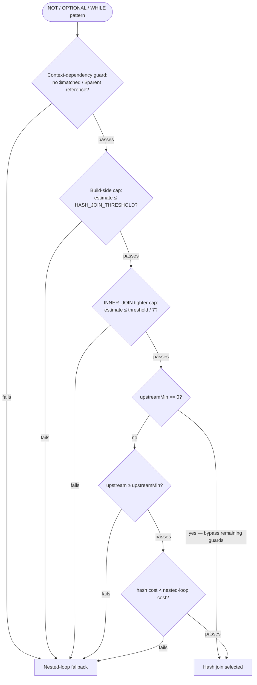

# Chapter 13 — When Nested Loops Aren't Enough: Hash Joins

The previous two chapters built up the execution pipeline piece by piece. Chapter 11
showed how the planner assembles a chain of steps that grow a result row one alias at a
time. Chapter 12 showed the six traverser strategies `MatchStep` can delegate to when
walking an edge. By the end of those chapters you had a complete mental model of a
nested-loop MATCH executor: for every upstream row, re-run the inner sub-plan from
scratch, collect its results, and continue.

That model is correct. It is also, in the wrong query, catastrophically slow.

This chapter introduces the four hash-join variants the planner substitutes when the
nested-loop cost is unacceptable: `HashJoinMatchStep`, `CorrelatedOptionalHashJoinStep`,
`BackRefHashJoinStep`, and `InvertedWhileHashJoinStep`. Each variant is introduced by the
problem it was built to solve, not by the class name. The chapter closes by cataloguing
the configuration knobs that gate the choice, and by pointing toward Chapter 14, where the
engine attacks a different flavour of the same problem.

---

## The scenario that makes nested loops hurt

Imagine a social graph with five million `Person` vertices. A security feature needs to
filter the result: exclude anyone who has issued a `Blocked` edge toward a specific
administrator account. In MATCH syntax that looks like this:

```sql
MATCH {class: Person, as: p}
NOT   {as: p}.out('Blocked'){class: Person, where: (name = 'admin')}
RETURN p
```

The `NOT` sub-pattern says: "traverse from `p` along `Blocked` edges and check whether
any neighbour is the admin." The nested-loop execution is straightforward to describe and
painful to run:

1. Scan all five million `Person` records.
2. For each person, re-execute the `NOT` sub-plan: traverse outgoing `Blocked` edges and
   check whether any target has `name = 'admin'`.
3. Discard rows where the sub-plan finds a match.

If the `Blocked` relationship exists for even one percent of those five million people,
the engine re-runs the sub-plan five million times. Most of those runs produce no result
— they are pure wasted traversal. The engine has no memory between rows. It cannot
remember which people have already been seen blocking the admin; it must ask again for
each one.

The fundamental problem is that the cost scales as *outer × inner*. With five million
outer rows and an average of, say, two blocked targets per person, the engine examines
ten million edge destinations. Filtering a graph for a membership condition that the
engine could have resolved in one pass instead takes O(N) re-executions.

---

## The hash join idea

The engine can do better if it is willing to spend some memory up front.

The `NOT` sub-plan has no dependency on which specific outer row is being evaluated. The
admin's RID is fixed for the entire query. So instead of re-running the sub-plan once per
outer row, the engine can run it once, collect all `Person` RIDs that *do* block the
admin into a hash set, and then check each outer row against that set in O(1).

The two-phase shape is:

1. **Build phase.** Execute the sub-plan once, extract a *join key* from every result row
   (in this case, the `p` alias's RID), and load all keys into a hash structure.
2. **Probe phase.** Consume the outer stream. For each row, extract the same join key and
   probe the hash structure. The check is O(1).

The cost changes from O(outer × inner) to O(build + outer). On the five-million-person
query that is the difference between ten million edge traversals and roughly as many
traversals as there are people who block the admin — often a fraction of a percent of the
total.

The trade-off is memory: the entire build side must fit in a hash structure before the
first outer row is processed. The planner enforces this through a series of guards
described next.

---

## When the planner picks a hash join

The planner does not always choose a hash join. It applies up to four guards in sequence.
All four are evaluated in `MatchExecutionPlanner` before a hash strategy is committed.



**Figure 13.1 — Hash-join eligibility decision tree.**

### Guard 1: Context dependency

A sub-pattern or branch that references `$matched` or `$parent` inside any of its `WHERE`
filters cannot be independently materialised. Its result depends on *which* upstream row
is currently being evaluated — so it must be re-executed for each one.

The planner checks this in `MatchExecutionPlanner.notPatternDependsOnMatched()`
(`MatchExecutionPlanner.java:754`). If any filter in the expression contains a `$matched.`
or `$parent.` reference, hash join is rejected and the planner falls back to the
nested-loop `FilterNotMatchPatternStep`, which re-executes the sub-plan in the current
context on each outer row.

### Guard 2: Build-side cardinality cap

If the planner's estimate of how many rows the build side will produce exceeds
`QUERY_MATCH_HASH_JOIN_THRESHOLD` (default 10,000), the hash structure could consume too
much heap. The planner rejects hash join and falls back to nested loops
(`MatchExecutionPlanner.java:1203–1205`; `GlobalConfiguration.java:863`).

Setting this threshold to zero disables hash join entirely across all four variants.

### Guard 2b: Tighter cap for INNER_JOIN

An anti-join or semi-join build side stores only lightweight keys in a `HashSet<JoinKey>`.
An inner join build side stores flattened `ResultInternal` rows — every property of every
matched alias — in a `HashMap<JoinKey, List<Result>>`. The memory difference is
approximately seven to one per entry.

When the join mode is `INNER_JOIN`, the planner applies a tighter cardinality limit:
`threshold / INNER_JOIN_MEMORY_WEIGHT`, where `INNER_JOIN_MEMORY_WEIGHT` is the constant
7 (`MatchExecutionPlanner.java:366`, checked at lines 1209–1210). An inner join that
would pass the general cap may still fail this stricter check.

### Guards 3 and 4: Upstream size and cost comparison

These two guards are bypassed entirely when `QUERY_MATCH_HASH_JOIN_UPSTREAM_MIN` is set
to zero. When it is non-zero (default 5):

- **Guard 3 (minimum upstream).** If the estimated number of outer rows is below
  `upstreamMin`, the build cost will not amortise over a small probe side. The planner
  falls back.
- **Guard 4 (cost comparison).** The planner estimates both strategies:

  ```
  hashJoinCost   = build_cardinality + upstream_cardinality
  nestedLoopCost = upstream_cardinality × branch_fan_out × num_branch_hops
  ```

  If `hashJoinCost >= nestedLoopCost`, the extra build work does not pay off and the
  planner falls back (`MatchExecutionPlanner.java:1229–1237`).

All four guards are statically evaluated at planning time using the cardinality estimates
from Chapter 8. Even when all four pass, a runtime overflow path provides a final safety
net — if the build side turns out larger than expected at execution time, the step falls
back to per-row evaluation without producing wrong results.

---

## Three join modes for the generic step

`HashJoinMatchStep` is parameterised by a `JoinMode` enum (`JoinMode.java:15`):

```java
enum JoinMode { ANTI_JOIN, SEMI_JOIN, INNER_JOIN }
```

The mode determines what the hash structure stores and what a probe result means.

**Table 13.1 — `JoinMode` semantics.**

| Mode | Hash structure | Key found | Key absent |
|---|---|---|---|
| `ANTI_JOIN` | `HashSet<JoinKey>` | discard upstream row | keep upstream row |
| `SEMI_JOIN` | `HashSet<JoinKey>` | keep upstream row | discard upstream row |
| `INNER_JOIN` | `HashMap<JoinKey, List<Result>>` | emit one merged row per match | discard upstream row |

`ANTI_JOIN` is the `NOT` pattern mode: the engine builds a set of keys that *are* present
in the forbidden sub-pattern, then keeps only the outer rows whose keys are *absent* from
that set.

`SEMI_JOIN` is the existence-check mode: when a back-tracking branch's intermediate
aliases are not referenced downstream, the engine only needs to know whether a match
exists — not what the match looks like. Storing lightweight keys instead of full rows
saves memory and avoids materialising properties that will never be projected.

`INNER_JOIN` is the branch-enrichment mode: the branch carries intermediate aliases that
a downstream `RETURN` or `ORDER BY` references. The build side stores full `ResultInternal`
rows and merges them into the upstream row on every probe hit.

One edge case worth knowing: if the join key cannot be extracted from an upstream row
(because a shared alias is null), `ANTI_JOIN` conservatively keeps the row — the absence
of evidence is not evidence of absence — while `SEMI_JOIN` discards it
(`HashJoinMatchStep.java:273–274`).

---

## Excluding forbidden rows: the `NOT` variant

Consider the blocking query from the opening. At planning time, `MatchExecutionPlanner`
calls `canUseHashJoin()` on the `NOT` expression (`MatchExecutionPlanner.java:903`).
There is no `$matched` reference in the NOT clause, the origin alias `p` has a known
class, and the estimated cardinality of the NOT sub-pattern is below the threshold. Hash
join is selected.

At execution time, `HashJoinMatchStep.internalStart()` runs the build phase before
opening the outer stream (`HashJoinMatchStep.java:90`). It copies the build-side
`SelectExecutionPlan` with an isolated `BasicCommandContext` — a child context whose
parent chain is preserved so later lookups still work, but whose own `$matched` bindings
are empty. This isolation prevents the build-side `MatchStep` instances from seeing
stale binding state from a previous outer row.

The build phase walks the build plan's stream, extracts a `JoinKey` from each result, and
inserts it into a `HashSet<JoinKey>`. If the set size exceeds the runtime threshold before
the plan finishes, `buildHashSet()` returns null and the step switches to per-row
nested-loop evaluation on the fly — correctness is preserved, only performance degrades
(`HashJoinMatchStep.java:142–167`).

Once the build is complete, the probe phase opens the outer stream and applies a filter
lambda. For each outer row, `extractKey()` reads the shared alias value. If the value is
a `RID` (the common case), it creates a `JoinKey.SINGLE_RID` in one allocation. If
multiple aliases are shared and all hold RIDs, it creates a `JoinKey.RID_ARRAY`. The
`OBJECT_ARRAY` fallback handles the rare case of non-RID alias values
(`JoinKey.java:52`, `63`, `76`). (Note: `SINGLE_RID`, `RID_ARRAY`, and `OBJECT_ARRAY`
are values of a `private enum Kind` inside `JoinKey`; the public surface consists of
the static factory methods `ofRid()`, `ofRids()`, and `ofObjects()`.)

The `JoinKey` class is deliberately not a Java record. Java records auto-generate
reference equality for arrays, which would break composite key comparison. `JoinKey`
precomputes the hash code at construction time and short-circuits equality first on hash
mismatch, then on kind mismatch (`JoinKey.java:113–123`).

Resulting cost: one pass over the blocked-admin traversal during the build, then one O(1)
hash lookup per `Person` during the probe. The quadratic blowup is gone.

The eligibility tree above governs the *first* variant — `HashJoinMatchStep` in its
`ANTI_JOIN`, `SEMI_JOIN`, and `INNER_JOIN` modes. The next three variants are not reached
through that tree. `CorrelatedOptionalHashJoinStep` triggers on OPTIONAL edges whose
`WHERE` clause contains a `$matched` back-reference — a shape the context-dependency
guard explicitly rejects for the generic step. `BackRefHashJoinStep` triggers on that
same back-reference shape when the target is *required* rather than optional, and on the
`NOT IN` anti-join shape; it is chosen in a separate scheduler sweep gated only by the
threshold. `InvertedWhileHashJoinStep` triggers on `WHILE` patterns that the scheduler
has placed in the uninvertible direction; no threshold comparison is involved. When
reading the next three sections, do not try to map their triggers onto the guards above —
each variant has its own separate entry path.

---

## The optional back-reference: when the build side depends on the current row

The second variant handles a shape that the generic step cannot: an optional edge whose
`WHERE` clause compares the traversal target to an already-bound alias via a `$matched`
reference. The class that implements this pattern is `CorrelatedOptionalHashJoinStep`.

The canonical example is LDBC Interactive Complex query 7: find the people who liked a
post and check whether each liker is also a friend of the post's author. In MATCH syntax a
simplified version looks like:

```sql
MATCH {class: Person, as: startPerson}
      .in('HAS_CREATOR'){class: Post, as: post}
      .in('LIKES'){class: Person, as: liker}
OPTIONAL {as: liker}.out('KNOWS')
         {where: (@rid = $matched.startPerson.@rid), as: likerFriend}
RETURN liker, likerFriend
```

The optional edge asks: "from `liker`, follow `KNOWS` outward; does any neighbour equal
the already-bound `startPerson`?" The `$matched.startPerson.@rid` reference means the
generic `HashJoinMatchStep` cannot be used — the `$matched` guard would reject it. The
build side depends on *which* `startPerson` the current upstream row holds.

But the shape is still exploitable. For a given `startPerson` vertex, the engine can
collect all vertices reachable via `startPerson.in('KNOWS')` — that is, everyone who
knows `startPerson` — into a set, then check each `liker` against that set. The key
insight is that the edge direction is inverted: the original edge runs outward from
`liker`, so walking inward from `startPerson` gives the same reachable set.

`CorrelatedOptionalHashJoinStep` implements this pattern. It maintains an LRU cache keyed
by the correlated vertex's RID (`CorrelatedOptionalHashJoinStep.java:60`). The cache is a
`LinkedHashMap<RID, NeighborEntry>` with access-order eviction, sized by
`QUERY_MATCH_CORRELATED_CACHE_SIZE` (default 16,
`GlobalConfiguration.java:884`). The LRU design matters when upstream rows interleave
among several distinct `startPerson` values — without it, the neighbour set would be
rebuilt on every row alternation.

For each upstream row, the step proceeds as follows:

1. Extract the `correlatedAlias` RID from the row (here, `startPerson`).
2. On LRU cache miss, query the database for all neighbours via the inverse edge
   direction. The query is a single `SELECT expand(in('KNOWS')) FROM ?`. Collected RIDs
   fill a `RidSet`. If the count reaches the threshold, the entry is stored as *truncated*
   (`CorrelatedOptionalHashJoinStep.java:163–164`, `176`).
3. Extract the `probeAlias` RID from the row (here, `liker`).
4. If the probe RID is in the neighbour set — a hit — bind `targetAlias` to the
   correlated vertex and emit the enriched row.
5. If the neighbour set was truncated and the probe RID is absent, run a per-row SQL
   fallback that checks the edge directly. This `checkEdgeFallback` call prevents false
   negatives that would arise from an incomplete set (`CorrelatedOptionalHashJoinStep.java:123–130`).
6. Otherwise — a definitive miss — emit the row with `targetAlias` set to null. The
   optional semantics require that all upstream rows pass through; `RemoveEmptyOptionalsStep`,
   placed later in the plan, strips the placeholder rows that the query is not interested
   in.

---

## The required back-reference: semi-joins and anti-joins

The optional back-reference in the previous section has a forgiving contract. A `liker`
who turns out not to know the `startPerson` still survives — the step binds the target to
null and moves on. Every upstream row passes through.

Make that same edge *required* and the contract inverts. A row that fails the
back-reference check must now be *dropped*, not kept with a null. This is a *semi-join*:
the edge exists only to test membership, and the row lives or dies on whether the test
passes.

The query shape is otherwise identical to the optional case. Drop the `OPTIONAL` keyword
and the target `likerFriend` becomes required:

```sql
MATCH {class: Person, as: startPerson}
      .in('HAS_CREATOR'){class: Post, as: post}
      .in('LIKES'){class: Person, as: liker}
{as: liker}.out('KNOWS')
         {where: (@rid = $matched.startPerson.@rid), as: likerFriend}
RETURN liker, likerFriend
```

The `WHERE` clause is the same `@rid = $matched.startPerson.@rid` back-reference you saw
one section ago, and the edge runs in the same direction. The only difference is the
missing `OPTIONAL` keyword. And that single bit is the *entire* discriminator between the
two steps. The planner makes exactly this test: the correlated-optional detector bails
out unless the target node is optional (`MatchExecutionPlanner.java:4166`), while the
semi-join detector requires it to be *non*-optional (`MatchExecutionPlanner.java:3348`).
An optional target routes to `CorrelatedOptionalHashJoinStep` with LEFT-join semantics —
a miss yields null and the row survives. A required target routes to
`BackRefHashJoinStep` with semi-join semantics — a miss drops the row.

### Building the set from the record, not from a query

Both steps split the work into a build phase and a probe phase, but they build the
membership set differently. `CorrelatedOptionalHashJoinStep` runs a `SELECT expand(...)`
query to gather the neighbour set. `BackRefHashJoinStep` skips SQL entirely: it loads the
back-referenced entity once and reads its edge link-bag field straight off the record
(`BackRefHashJoinStep.java:561`). The link bag *is* the adjacency list — there is nothing
to query. The step walks that bag once into a hash structure, then probes each upstream
row's source RID against it in O(1).

Like the correlated step, it caches the built structure per distinct back-reference
binding so that interleaved upstream rows do not rebuild it. But the cache size is not
configurable. It is a fixed-capacity LRU holding `CACHE_CAPACITY = 256` entries
(`BackRefHashJoinStep.java:51`), hard-coded rather than exposed through a
`GlobalConfiguration` knob the way `QUERY_MATCH_CORRELATED_CACHE_SIZE` governs the
correlated step.

The step shares the generic build-side threshold rather than owning one of its own. It
reads `QUERY_MATCH_HASH_JOIN_THRESHOLD` through `getHashJoinThreshold()` while building
each table (`BackRefHashJoinStep.java:566`). Setting that threshold to zero disables the
step, exactly as it disables the other three variants. If a link bag exceeds the
threshold at runtime, the build returns null and the step falls back to per-row
evaluation — correctness holds, only speed degrades. For the two semi-join variations
that fallback is a nested-loop traversal through `nestedLoopFallback()`
(`BackRefHashJoinStep.java:420`), reusing the original edge the planner kept in reserve.
The anti-join has no reserved edge; it instead re-evaluates the stored `NOT IN` condition
per row through `handleAntiJoinBuildFailure()` (`BackRefHashJoinStep.java:332`, `397`).

### Three variations of the back-reference

The step recognises three variations, each backed by a record in the sealed
`SemiJoinDescriptor` hierarchy (`SemiJoinDescriptor.java:26`).

*Single-edge semi-join* (`SingleEdgeSemiJoin`) is the plain case above: one edge, one
back-reference. The build stores source RID → edge count in an `Object2IntOpenHashMap<RID>`
(`BackRefHashJoinStep.java:572`) rather than a plain set, so that parallel edges of the
same class between the same pair of vertices still emit the right number of rows. A probe
with a positive count keeps the row; a zero count drops it
(`BackRefHashJoinStep.java:282`). This variation *replaces* the target's `MatchStep`
outright.

*Chain semi-join* (`ChainSemiJoin`) applies when the pattern reaches the target through
an edge-then-vertex hop written as `.outE('E').inV()`. This variation replaces *two*
`MatchStep`s: the planner skips the predecessor edge it marked as consumed
(`MatchExecutionPlanner.java:4466`), then chains a single `BackRefHashJoinStep` for the
pair (`MatchExecutionPlanner.java:4530`). The build stores source RID → list of edge rows
in a `HashMap<RID, List<Result>>` (`BackRefHashJoinStep.java:738`), because the
intermediate edge alias may still be projected downstream; each probe fans that list back
out into one row per edge (`BackRefHashJoinStep.java:350`).

*Anti-join* (`AntiSemiJoin`) is the one shape the correlated optional step has no answer
for. It handles the exclusion filter `$currentMatch NOT IN $matched.X.out('E')` — "keep
this row only if the current vertex is *not* among the anchor's neighbours." The build
collects the forbidden neighbours into a `RidSet` (`BackRefHashJoinStep.java:796`), and
the probe keeps a row exactly when its RID is *absent* from that set
(`BackRefHashJoinStep.java:325`). Note the structural difference from the other two: an
anti-join is not a replacement. The planner leaves the normal `MatchStep` in place and
chains the `BackRefHashJoinStep` *after* it as a post-filter, having stripped only the
`NOT IN` term from the MatchStep's `WHERE` clause at plan time
(`MatchExecutionPlanner.java:4522`). Single-edge and chain semi-joins take the
MatchStep's place; the anti-join stands behind it.

There is no inner-join mode here. Unlike the generic `HashJoinMatchStep` with its three
`JoinMode` values, `BackRefHashJoinStep` only ever runs the two membership semantics
above — semi (keep on hit) and anti (keep on miss).

### Where it gets chosen

The last thing to know about this variant is *where* it is selected, because it is not
the eligibility tree. All three variations are detected in
`optimizeScheduleWithIntersections()` (`MatchExecutionPlanner.java:3254`) — the same
schedule-optimization sweep Chapter 14 describes for attaching index pre-filters to
edges. That sweep does not consult the four guards of Figure 13.1 at all; it gates the
back-reference join on one thing only, the threshold (`isSemiJoinCandidate` returns false
when the threshold is zero, `MatchExecutionPlanner.java:3474`). So do not look for
`BackRefHashJoinStep` anywhere in that decision tree — the tree governs `HashJoinMatchStep`
alone.

In EXPLAIN output the step announces itself with `+ BACK-REF HASH JOIN` for the two
semi-join variations and `+ BACK-REF HASH JOIN ANTI` for the anti-join
(`BackRefHashJoinStep.java:850`, `863`). Chapter 16 shows how to read those lines inside
a full plan.

---

## Recursive edges that cannot be reversed: materialising the full reachability set

The fourth variant handles `WHILE` edges. The class that implements it is `InvertedWhileHashJoinStep`. Recall from Chapter 10 that a `WHILE` edge
declares a recursive traversal over some predicate — for example, "follow
`IS_SUBCLASS_OF` edges until the target `TagClass` has `name = :tagClass`." The scheduler
may schedule this edge in the direction opposite to the written one: instead of starting
from a concrete post tag and climbing to the root class, the engine would prefer to start
from the named root class and descend to all tags that belong to it.

The normal invertibility mechanism handles this for non-recursive edges: Chapter 12
described `MatchReverseEdgeTraverser`, which simply traverses the edge in reverse. But
there is no corresponding `MatchReverseWhileTraverser`. A `WHILE` edge is not invertible
in the general case because the recursion termination condition — the WHERE clause on the
target — is expressed relative to the traversal target vertex, and flipping the edge
direction changes which vertex is the target.

`InvertedWhileHashJoinStep` sidesteps this by materialising the answer. Instead of
trying to invert the recursive traversal, the step asks: "what is the set of all vertices
that can reach any qualifying anchor via the `WHILE` edge?" It builds that set once, then
probes upstream rows against it.

### The build phase

The step first calls `findAnchorVertices()` to locate all vertices that satisfy the WHILE
target's WHERE clause — these are the recursion endpoints (`InvertedWhileHashJoinStep.java:185`).
It runs a `SELECT FROM anchorClass WHERE ...` in a child context. If the count of anchors
reaches the threshold, `findAnchorVertices` returns null and the step falls back to
per-row WHILE traversal via its `fallbackEdge` reference, which the planner preserves
exactly for this purpose.

For each anchor, `collectDescendantRids()` runs a level-by-level BFS in the inverse edge
direction (`InvertedWhileHashJoinStep.java:219`). The entire frontier is passed as a
single `List<RID>` parameter to the SQL query — `SELECT expand(in('IS_SUBCLASS_OF'))
FROM ?` — avoiding the N+1 query overhead of querying each frontier vertex separately.
Each reached RID is added to a `RidSet` (`reachableRids`) and to a multimap
(`ridToAnchors`) that records which anchor or anchors each descendant can reach.

The step adds the anchor's own RID to `reachableRids` before descending — a probe vertex
equal to the anchor is a valid match.

A cumulative overflow guard checks the total `reachableRids` size across all anchors
after each BFS round. If the combined set reaches the threshold, the step abandons the
build and falls back to per-row traversal.

### The probe phase

For each upstream row, the step extracts the `probeAlias` RID and checks
`reachableRids.contains(rid)`. On a hit, it looks up `ridToAnchors.get(rid)` and emits
one `MatchResultRow` per matching anchor, with `targetAlias` bound to that anchor vertex.
One probe RID can map to multiple anchors — a tag can descend from several `TagClass`
ancestors — so the step emits multiple rows per upstream row when needed.

On a miss against a complete build, the probe vertex has no path to any qualifying anchor
and is discarded. On a miss against a *truncated* build, the step calls
`forwardBfsToAnchors()`, which walks forward from the probe vertex in the original edge
direction until it reaches vertices already in the built set, then traces those back to
their anchors via `ridToAnchors`. This prevents false negatives when the BFS did not
explore the full hierarchy.

**Table 13.2 — Fallback conditions in `InvertedWhileHashJoinStep`.**

| Condition | Response |
|---|---|
| Anchor count reaches threshold | Full per-row WHILE traversal via `fallbackEdge` |
| Cumulative `reachableRids` reaches threshold | Full per-row WHILE traversal via `fallbackEdge` |
| Build complete but BFS was truncated; probe RID absent | Forward BFS from probe vertex to find reachable anchors |

---

## The nested-loop fallback: `FilterNotMatchPatternStep`

When the planner chooses not to use a hash join — because the NOT expression references
`$matched`, the build-side estimate is too large, or the cost comparison favours nested
loops — it chains a `FilterNotMatchPatternStep` instead.

This step is a filter over the upstream stream. For each upstream row it constructs a
fresh `SelectExecutionPlan` containing a `ChainStep` (which emits a shallow copy of the
upstream row as a singleton stream) followed by the NOT-pattern `MatchStep` chain
(`FilterNotMatchPatternStep.java:100–108`). It then calls `rs.hasNext(ctx)`: if any
result is produced the NOT pattern matched and the upstream row is discarded. The step
stops at the first result, so it never enumerates the full NOT sub-pattern for rows that
do fail the check (`FilterNotMatchPatternStep.java:88–94`).

Three structural details drive its cost:

- Every upstream row gets its own freshly allocated `SelectExecutionPlan`. There is no
  caching of intermediate traversal state between rows.
- `ChainStep` makes a shallow copy of the upstream row: property names and metadata keys
  are copied, but the referenced records are shared. This is sufficient because the NOT
  sub-plan only reads property values, never writes them.
- A row that has no blocking relationship at all pays the full cost of an unsuccessful
  traversal — it walks as far into the NOT pattern as the graph allows before giving up.

The hash-join path pays both the plan-rebuild overhead and the sub-pattern traversal cost
exactly once, during the build phase, and then probes in O(1) per upstream row.

---

## Configuration knobs

**Table 13.3 — Hash-join configuration properties.**

| Property key | `GlobalConfiguration` constant | Default | Effect |
|---|---|---|---|
| `youtrackdb.query.match.hashJoinThreshold` | `QUERY_MATCH_HASH_JOIN_THRESHOLD` | `10000` | Maximum estimated build-side rows before falling back to nested loops. Set to `0` to disable hash join entirely. |
| `youtrackdb.query.match.hashJoinUpstreamMin` | `QUERY_MATCH_HASH_JOIN_UPSTREAM_MIN` | `5` | Minimum upstream rows for hash join to be worthwhile. Set to `0` to bypass Guards 3 and 4; only the build-side cap applies. |
| `youtrackdb.query.match.correlatedCacheSize` | `QUERY_MATCH_CORRELATED_CACHE_SIZE` | `16` | LRU cache entries in `CorrelatedOptionalHashJoinStep`. Increase if upstream rows interleave many distinct correlated vertices. |

The `INNER_JOIN_MEMORY_WEIGHT` constant (value 7, `MatchExecutionPlanner.java:366`) is
not externally configurable — it reflects an empirically measured memory ratio between
materialising full `ResultInternal` rows and lightweight `JoinKey` entries, and is not
expected to change with query shape.

All three properties are hot-configurable at runtime: they are read at query planning time
via `GlobalConfiguration.getValueAsLong()` / `getValueAsInteger()`, not cached at server
startup. Adjusting them takes effect on the next query without a restart.

When diagnosing a slow MATCH that involves `NOT`, `OPTIONAL`, a `$matched` back-reference,
or a `WHILE` edge, the first diagnostic step is to verify whether the planner chose a
hash join or fell back to nested loops. The EXPLAIN output emits `HASH ANTI_JOIN`, `HASH SEMI_JOIN`,
`CORRELATED OPTIONAL HASH JOIN`, `BACK-REF HASH JOIN` (or `BACK-REF HASH JOIN ANTI`), or
`INVERTED WHILE HASH JOIN` prefixes on the relevant step when the hash path was chosen.
Absence of those prefixes on a large query is the signal that the planner fell back to
nested loops — because one of the four guards rejected the generic step, or the threshold
ruled out a back-reference join — and the threshold properties are the primary levers.

---

## What comes next

Hash joins solve the *row count* problem: they prevent the engine from re-executing a
sub-plan once for every outer row. Chapter 14 attacks a different problem: the engine
spends time loading adjacency-list entries that could have been excluded before any
traversal began. Index-assisted traversal attaches a pre-filter to an `EdgeTraversal` so
the traverser can skip non-matching adjacency-list entries before loading the target
record — reducing the number of edges considered rather than the number of sub-plan
executions.

---

## Further reading

- `core/src/main/java/com/jetbrains/youtrackdb/internal/core/sql/executor/match/HashJoinMatchStep.java` —
  generic hash-join step; build phases at lines 142–167 (ANTI/SEMI) and 173–204
  (INNER); probe filter at line 130; nested-loop fallback at lines 337 and 373.
- `core/src/main/java/com/jetbrains/youtrackdb/internal/core/sql/executor/match/CorrelatedOptionalHashJoinStep.java` —
  LRU-cached correlated optional join; neighbour build at line 148; truncation fallback
  at lines 123–130; inverse-direction SQL at lines 163–164.
- `core/src/main/java/com/jetbrains/youtrackdb/internal/core/sql/executor/match/BackRefHashJoinStep.java` —
  required back-reference semi-join and anti-join; hard-coded `CACHE_CAPACITY` (256) at
  line 51; link-bag read off the loaded record at line 561; single-edge build
  (`Object2IntOpenHashMap`) at line 572 and probe at line 282; chain build
  (`HashMap<RID, List<Result>>`) at line 738 and probe at line 350; anti-join build
  (`RidSet`) at line 796 and probe at line 325; nested-loop fallback at line 420; EXPLAIN
  prefixes at lines 850 and 863.
- `core/src/main/java/com/jetbrains/youtrackdb/internal/core/sql/executor/match/SemiJoinDescriptor.java` —
  sealed descriptor hierarchy for the three back-reference variations at line 26
  (`SingleEdgeSemiJoin`, `ChainSemiJoin`, `AntiSemiJoin`).
- `core/src/main/java/com/jetbrains/youtrackdb/internal/core/sql/executor/match/InvertedWhileHashJoinStep.java` —
  inverted-WHILE join; anchor discovery at line 185; level-by-level BFS at line 219;
  forward-BFS fallback at line 256.
- `core/src/main/java/com/jetbrains/youtrackdb/internal/core/sql/executor/match/FilterNotMatchPatternStep.java` —
  nested-loop fallback for NOT patterns; ChainStep row injection at line 174.
- `core/src/main/java/com/jetbrains/youtrackdb/internal/core/sql/executor/match/JoinKey.java` —
  composite hash key; `SINGLE_RID` fast path at line 52; `RID_ARRAY` at line 63;
  `OBJECT_ARRAY` fallback at line 76; equality short-circuits at lines 113–123.
  (`SINGLE_RID`, `RID_ARRAY`, `OBJECT_ARRAY` are values of `private enum Kind`; public
  API uses static factory methods `ofRid()`, `ofRids()`, `ofObjects()`.)
- `core/src/main/java/com/jetbrains/youtrackdb/internal/core/sql/executor/match/JoinMode.java` —
  `ANTI_JOIN`, `SEMI_JOIN`, `INNER_JOIN` enum at line 15.
- `core/src/main/java/com/jetbrains/youtrackdb/internal/core/sql/executor/match/MatchExecutionPlanner.java` —
  `canUseHashJoin` at line 903; `notPatternDependsOnMatched` at line 754;
  `traceBackwardBranch` at line 1160; `INNER_JOIN_MEMORY_WEIGHT` constant at line 366;
  cardinality and cost guards at lines 1198–1237; `getHashJoinThreshold` at line 345;
  back-reference semi-join detection in `optimizeScheduleWithIntersections` at line 3254;
  optionality discriminator at lines 3348 and 4166.
- `core/src/main/java/com/jetbrains/youtrackdb/api/config/GlobalConfiguration.java` —
  `QUERY_MATCH_HASH_JOIN_THRESHOLD` at line 863;
  `QUERY_MATCH_HASH_JOIN_UPSTREAM_MIN` at line 873;
  `QUERY_MATCH_CORRELATED_CACHE_SIZE` at line 884.
