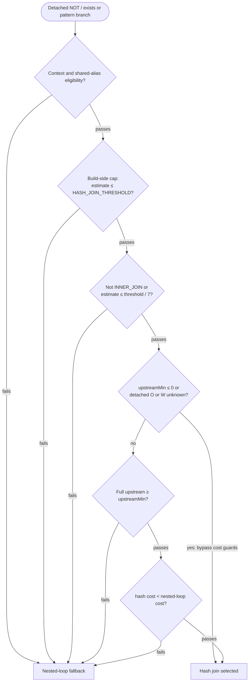

# Chapter 13 — When Nested Loops Aren't Enough: Hash Joins

The previous two chapters built up the execution pipeline piece by piece. Chapter 11
showed how the planner assembles a chain of steps that grow a result row one alias at a
time. Chapter 12 showed the six traverser strategies `MatchStep` can delegate to when
walking an edge. By the end of those chapters you had a complete mental model of a
nested-loop MATCH executor: for every upstream row, re-run the inner sub-plan from
scratch, collect its results, and continue.

That model is correct. It is also, in the wrong query, catastrophically slow.

This chapter introduces the four hash-join variants the planner substitutes when the
nested-loop cost is unacceptable: `HashJoinMatchStep`, `CorrelatedOptionalHashJoinStep`,
`BackRefHashJoinStep`, and `InvertedWhileHashJoinStep`. Each variant is introduced by the
problem it was built to solve, not by the class name. The chapter closes by cataloguing
the configuration knobs that gate the choice, and by pointing toward Chapter 14, where the
engine attacks a different flavour of the same problem.

---

## The scenario that makes nested loops hurt

Imagine a social graph with five million `Person` vertices. A security feature needs to
filter the result: exclude anyone who has issued a `Blocked` edge toward a specific
administrator account. In MATCH syntax that looks like this:

```sql
MATCH {class: Person, as: p}
NOT   {as: p}.out('Blocked'){class: Person, where: (name = 'admin')}
RETURN p
```

The `NOT` sub-pattern says: "traverse from `p` along `Blocked` edges and check whether
any neighbour is the admin." The nested-loop execution is straightforward to describe and
painful to run:

1. Scan all five million `Person` records.
2. For each person, re-execute the `NOT` sub-plan: traverse outgoing `Blocked` edges and
   check whether any target has `name = 'admin'`.
3. Discard rows where the sub-plan finds a match.

If the `Blocked` relationship exists for even one percent of those five million people,
the engine re-runs the sub-plan five million times. Most of those runs produce no result
— they are pure wasted traversal. The engine has no memory between rows. It cannot
remember which people have already been seen blocking the admin; it must ask again for
each one.

The fundamental problem is that the cost scales as *outer × inner*. With five million
outer rows and an average of, say, two blocked targets per person, the engine examines
ten million edge destinations. Filtering a graph for a membership condition that the
engine could have resolved in one pass instead takes O(N) re-executions.

---

## The hash join idea

The engine can do better if it is willing to spend some memory up front.

The `NOT` check starts at `p`, its *origin alias*. It reads no other outer-row context.
The hash path scans possible origins and collects the record identifiers (RIDs) of those
with a matching path. It then tests each outer row against that set in O(1)
(`HashJoinMatchStep.java:151–195`).

The two-phase shape is:

1. **Build phase.** Execute the sub-plan once, extract a *join key* from every result row
   (in this case, the `p` alias's RID), and load all keys into a hash structure.
2. **Probe phase.** Consume the outer stream. For each row, extract the same join key and
   probe the hash structure. The check is O(1).

The cost changes from O(outer × inner) to O(build + outer). The build includes scanning
origins that have no matching path. If the outer scan visits each origin only once,
repeated per-row work may be too small to justify a hash build
(`MatchExecutionPlanner.java:1468–1489`).

The trade-off is memory: the entire build side must fit in a hash structure before the
first outer row is processed. The planner enforces this through a series of guards
described next.

---

## When the planner picks a hash join

`HashJoinMatchStep` serves detached checks and positive-pattern branches.
A *detached check* filters positive-pattern rows without adding its internal aliases.
NOT rejects matching rows. Exists keeps matching rows. Both use the same path-choice rule
(`MatchExecutionPlanner.java:1128–1181`). Branch costs use a separate rule.


```mermaid
flowchart TB
    Start([Detached NOT / exists or pattern branch]) --> G0{Context and shared-alias eligibility?}
    G0 -->|fails| NL[Nested-loop fallback]
    G0 -->|passes| G1{Build-side cap:\nestimate ≤ HASH_JOIN_THRESHOLD?}
    G1 -->|fails| NL
    G1 -->|passes| G1b{Not INNER_JOIN or\nestimate ≤ threshold / 7?}
    G1b -->|fails| NL
    G1b -->|passes| G2{upstreamMin ≤ 0 or\ndetached O or W unknown?}
    G2 -->|yes: bypass cost guards| HJ[Hash join selected]
    G2 -->|no| G3{Full upstream ≥ upstreamMin?}
    G3 -->|fails| NL
    G3 -->|passes| G4{hash cost < nested-loop cost?}
    G4 -->|fails| NL
    G4 -->|passes| HJ
```

**Figure 13.1 — Hash-join eligibility decision tree.**

### Guard 1: Context dependency

Detached eligibility rejects check `WHERE` or `WHILE` conditions that read `$matched` or
`$parent`. It also rejects a positive origin filter that reads that context
(`MatchExecutionPlanner.java:1234–1261`, `1397–1411`). The origin needs a known class.
A zero-hop check has no edges after its origin. Later shared aliases cannot be optional.
An optional origin rejects hash for a zero-hop check, but not automatically for a check
with hops (`MatchExecutionPlanner.java:1412–1426`).

Branch eligibility checks context dependencies and optional nodes separately
(`MatchExecutionPlanner.java:2127–2179`).

### Guard 2: Build-side cardinality cap

If the planner's estimate of how many rows the build side will produce exceeds
`QUERY_MATCH_HASH_JOIN_THRESHOLD` (default 10,000), the hash structure could consume too
much heap. The planner rejects hash join and falls back to nested loops
(`MatchExecutionPlanner.java:1423–1426`, `1995–1999`, `GlobalConfiguration.java:883–891`).

Setting this threshold to zero disables new hash selection
(`MatchExecutionPlanner.java:383–385`, `1423–1426`).

### Guard 2b: Tighter cap for INNER_JOIN

An anti-join or semi-join build side stores only lightweight keys in a `HashSet<JoinKey>`.
An inner join build side stores flattened `ResultInternal` rows — every property of every
matched alias — in a `HashMap<JoinKey, List<Result>>`. The memory difference is
approximately seven to one per entry.

When the join mode is `INNER_JOIN`, the planner applies a tighter cardinality limit:
`threshold / INNER_JOIN_MEMORY_WEIGHT`, where `INNER_JOIN_MEMORY_WEIGHT` is the constant
7 (`MatchExecutionPlanner.java:414`, `2003–2006`). An inner join that
would pass the general cap may still fail this stricter check.

### Guards 3 and 4: Upstream size and cost comparison

A non-positive `QUERY_MATCH_HASH_JOIN_UPSTREAM_MIN` disables both cost guards, not
eligibility or the build cap (`MatchExecutionPlanner.java:393–404`). Its default is 5
(`GlobalConfiguration.java:893–902`). For positive-pattern branches:

- **Guard 3 (minimum upstream).** If the estimated number of outer rows is below
  `upstreamMin`, the build cost will not amortise over a small probe side. The planner
  falls back.
- **Guard 4 (cost comparison).** The planner estimates both strategies:

  ```
  hashJoinCost   = build_cardinality + upstream_cardinality
  nestedLoopCost = upstream_cardinality × branch_fan_out × num_branch_hops
  ```

  If `hashJoinCost >= nestedLoopCost`, the extra build work does not pay off and the
  planner falls back (`MatchExecutionPlanner.java:2011–2035`).

Detached NOT and exists use different cost inputs. **O** is the estimated positive output
before checks. **B** is the estimated origins scanned by the build. **W** counts candidate
visits in one complete check walk, before each hop's filter. Target filters use the reached
class, not the source class (`MatchExecutionPlanner.java:1594–1649`).

Unknown O or W bypasses both cost guards after eligibility. Otherwise, O must reach the
minimum and hash must be strictly cheaper. Ties choose the per-row path
(`MatchExecutionPlanner.java:1442–1489`):

```text
nested cost = O × W
hash cost   = B + B × W + O
```

A usable literal LIMIT discounts the rows probed, not the build. Define **K** as literal
LIMIT + literal SKIP, with absent SKIP equal to zero. The *pass fraction* **q** estimates
the share of origins that pass.

For checks with hops, **lambda** estimates matching paths
per origin. The planner uses q = 1 − exp(−lambda) for exists and q = exp(−lambda) for NOT.
`exp(x)` computes e raised to x, where e is approximately 2.718.
Zero-hop checks use exact q = 1 for exists and q = 0 for NOT
(`MatchExecutionPlanner.java:1493–1528`, `1540–1551`).

Rows with one origin share its check result. The rule charges complete origin groups
(`MatchExecutionPlanner.java:1554–1582`). Here, **m** estimates outer rows per origin.
**P** counts passing origins needed for K rows. **S** estimates origins scanned to find P
passing origins.

`ceil(x)` rounds x up to the smallest integer at least x.
Origins are indivisible, so P and S round up to charge complete groups:

```text
m = max(1, O / B)                 # outer rows per origin
P = ceil(K / m)                   # passing origins needed
S = ceil(P / q)                   # origins scanned
R = O if S > B, otherwise min(O, m × S)
nested cost = R × W
hash cost   = B + B × W + R
```

Guard 3 still uses O. Only Guard 4 uses **R**, the estimated outer rows probed.
Neither cost discounts work saved by stopping within a probe
(`MatchExecutionPlanner.java:1475–1489`, `1594–1628`). The pass fraction is a heuristic.
Default selectivity can supply its inputs when measured statistics are absent
(`MatchExecutionPlanner.java:1621–1624`, `3439–3468`).

The discount needs one detached check and an origin-only key. The full-input comparison
uses R = O for wider keys, multiple checks, or any of these cases:

- Missing LIMIT, LIMIT −1, or parameter LIMIT or SKIP, even when bound.
- ORDER BY, GROUP BY, aggregates, DISTINCT including `distinct(x)`, UNWIND, or EXPAND.
- `$elements` or `$pathElements` return modes.
- Unknown q, unusable B, arithmetic overflow, or saturated estimates.

Zero q also uses R = O. Positive q with K = 0 uses R = 0. Unknown q alone does not bypass
the guards (`MatchExecutionPlanner.java:1453–1458`, `1493–1582`). Cached plans retain their
chosen path. Cache hits return before planning, and bound slice parameters never supply
this discount (`MatchExecutionPlanner.java:626–630`, `1510–1528`).

---

## Three join modes for the generic step

`HashJoinMatchStep` is parameterised by a `JoinMode` enum (`JoinMode.java:15`):

```java
enum JoinMode { ANTI_JOIN, SEMI_JOIN, INNER_JOIN }
```

The mode determines what the hash structure stores and what a probe result means.

**Table 13.1 — `JoinMode` semantics.**

| Mode | Hash structure | Key found | Key absent |
|---|---|---|---|
| `ANTI_JOIN` | `HashSet<JoinKey>` | discard upstream row | keep upstream row |
| `SEMI_JOIN` | `HashSet<JoinKey>` | keep upstream row | discard upstream row |
| `INNER_JOIN` | `HashMap<JoinKey, List<Result>>` | emit one merged row per match | discard upstream row |

`ANTI_JOIN` is the `NOT` pattern mode: the engine builds a set of keys that *are* present
in the forbidden sub-pattern, then keeps only the outer rows whose keys are *absent* from
that set.

`SEMI_JOIN` is the existence-check mode: when a back-tracking branch's intermediate
aliases are not referenced downstream, the engine only needs to know whether a match
exists — not what the match looks like. Storing lightweight keys instead of full rows
saves memory and avoids materialising properties that will never be projected.

`INNER_JOIN` is the branch-enrichment mode: the branch carries intermediate aliases that
a downstream `RETURN` or `ORDER BY` references. The build side stores full `ResultInternal`
rows and merges them into the upstream row on every probe hit.

`SEMI_JOIN` also serves detached exists checks (`MatchExecutionPlanner.java:1173–1179`).
Alias retention includes shared positive bindings and positive aliases read by detached
check `WHERE` and `WHILE` text. Branches must retain those aliases even when RETURN does
not read them (`MatchExecutionPlanner.java:1719–1725`, `1762–1790`).

One edge case worth knowing: if the join key cannot be extracted from an upstream row
(because a shared alias is null), `ANTI_JOIN` conservatively keeps the row — the absence
of evidence is not evidence of absence — while `SEMI_JOIN` discards it
(`HashJoinMatchStep.java:294–304`).

---

## Excluding forbidden rows: the `NOT` variant

Consider the blocking query from the opening. At planning time, `MatchExecutionPlanner`
calls `canUseHashJoin()` on the `NOT` expression (`MatchExecutionPlanner.java:1138–1154`).
Eligibility alone does not select hash. The cost guards must also pass unless disabled
or bypassed by unknown O or W (`MatchExecutionPlanner.java:1442–1489`).

At execution time, `HashJoinMatchStep.internalStart()` runs the build phase before
opening the outer stream (`HashJoinMatchStep.java:128–143`). LIMIT cannot stop this eager
build early. The build uses an isolated child context. For an origin-only detached key,
it scans origins and probes each one until the first match. Wider keys enumerate all
paths because each path can contribute a different key (`HashJoinMatchStep.java:155–185`).

The build stores matching keys in a `HashSet<JoinKey>`. If its distinct-key count exceeds
the positive runtime threshold, the step abandons the set. Detached NOT and exists then use
`DetachedMatchPatternProbe.matches` on each outer row, rather than repeating the full
build plan (`HashJoinMatchStep.java:181–184`, `362–365`).

Once the build is complete, the probe phase opens the outer stream and applies a filter
lambda. For each outer row, `extractKey()` reads the shared alias value. If the value is
a `RID` (the common case), it creates a `JoinKey.SINGLE_RID` in one allocation. If
multiple aliases are shared and all hold RIDs, it creates a `JoinKey.RID_ARRAY`. The
`OBJECT_ARRAY` fallback handles the rare case of non-RID alias values
(`JoinKey.java:52`, `63`, `76`). (Note: `SINGLE_RID`, `RID_ARRAY`, and `OBJECT_ARRAY`
are values of a `private enum Kind` inside `JoinKey`; the public surface consists of
the static factory methods `ofRid()`, `ofRids()`, and `ofObjects()`.)

The `JoinKey` class is deliberately not a Java record. Java records auto-generate
reference equality for arrays, which would break composite key comparison. `JoinKey`
precomputes the hash code at construction time and short-circuits equality first on hash
mismatch, then on kind mismatch (`JoinKey.java:113–123`).

The completed build supports one O(1) lookup per outer row
(`HashJoinMatchStep.java:141–143`, `294–304`). Its cost includes unsuccessful origin probes.

The eligibility tree above governs `HashJoinMatchStep` in its
`ANTI_JOIN`, `SEMI_JOIN`, and `INNER_JOIN` modes. The next three variants are not reached
through that tree. `CorrelatedOptionalHashJoinStep` triggers on OPTIONAL edges whose
`WHERE` clause contains a `$matched` back-reference — a shape the context-dependency
guard explicitly rejects for the generic step. `BackRefHashJoinStep` triggers on that
same back-reference shape when the target is *required* rather than optional, and on the
`NOT IN` anti-join shape; it is chosen in a separate scheduler sweep gated only by the
threshold. `InvertedWhileHashJoinStep` triggers on `WHILE` patterns that the scheduler
has placed in the uninvertible direction; no threshold comparison is involved. When
reading the next three sections, do not try to map their triggers onto the guards above —
each variant has its own separate entry path.

---

## The optional back-reference: when the build side depends on the current row

The second variant handles a shape that the generic step cannot: an optional edge whose
`WHERE` clause compares the traversal target to an already-bound alias via a `$matched`
reference. The class that implements this pattern is `CorrelatedOptionalHashJoinStep`.

The canonical example is LDBC Interactive Complex query 7: find the people who liked a
post and check whether each liker is also a friend of the post's author. In MATCH syntax a
simplified version looks like:

```sql
MATCH {class: Person, as: startPerson}
      .in('HAS_CREATOR'){class: Post, as: post}
      .in('LIKES'){class: Person, as: liker}
OPTIONAL {as: liker}.out('KNOWS')
         {where: (@rid = $matched.startPerson.@rid), as: likerFriend}
RETURN liker, likerFriend
```

The optional edge asks: "from `liker`, follow `KNOWS` outward; does any neighbour equal
the already-bound `startPerson`?" The `$matched.startPerson.@rid` reference means the
generic `HashJoinMatchStep` cannot be used — the `$matched` guard would reject it. The
build side depends on *which* `startPerson` the current upstream row holds.

But the shape is still exploitable. For a given `startPerson` vertex, the engine can
collect all vertices reachable via `startPerson.in('KNOWS')` — that is, everyone who
knows `startPerson` — into a set, then check each `liker` against that set. The key
insight is that the edge direction is inverted: the original edge runs outward from
`liker`, so walking inward from `startPerson` gives the same reachable set.

`CorrelatedOptionalHashJoinStep` implements this pattern. It maintains an LRU cache keyed
by the correlated vertex's RID (`CorrelatedOptionalHashJoinStep.java:60`). The cache is a
`LinkedHashMap<RID, NeighborEntry>` with access-order eviction, sized by
`QUERY_MATCH_CORRELATED_CACHE_SIZE` (default 16,
`GlobalConfiguration.java:884`). The LRU design matters when upstream rows interleave
among several distinct `startPerson` values — without it, the neighbour set would be
rebuilt on every row alternation.

For each upstream row, the step proceeds as follows:

1. Extract the `correlatedAlias` RID from the row (here, `startPerson`).
2. On LRU cache miss, query the database for all neighbours via the inverse edge
   direction. The query is a single `SELECT expand(in('KNOWS')) FROM ?`. Collected RIDs
   fill a `RidSet`. If the count reaches the threshold, the entry is stored as *truncated*
   (`CorrelatedOptionalHashJoinStep.java:163–164`, `176`).
3. Extract the `probeAlias` RID from the row (here, `liker`).
4. If the probe RID is in the neighbour set — a hit — bind `targetAlias` to the
   correlated vertex and emit the enriched row.
5. If the neighbour set was truncated and the probe RID is absent, run a per-row SQL
   fallback that checks the edge directly. This `checkEdgeFallback` call prevents false
   negatives that would arise from an incomplete set (`CorrelatedOptionalHashJoinStep.java:123–130`).
6. Otherwise — a definitive miss — emit the row with `targetAlias` set to null. The
   optional semantics require that all upstream rows pass through; `RemoveEmptyOptionalsStep`,
   placed later in the plan, strips the placeholder rows that the query is not interested
   in.

---

## The required back-reference: semi-joins and anti-joins

The optional back-reference in the previous section has a forgiving contract. A `liker`
who turns out not to know the `startPerson` still survives — the step binds the target to
null and moves on. Every upstream row passes through.

Make that same edge *required* and the contract inverts. A row that fails the
back-reference check must now be *dropped*, not kept with a null. This is a *semi-join*:
the edge exists only to test membership, and the row lives or dies on whether the test
passes.

The query shape is otherwise identical to the optional case. Drop the `OPTIONAL` keyword
and the target `likerFriend` becomes required:

```sql
MATCH {class: Person, as: startPerson}
      .in('HAS_CREATOR'){class: Post, as: post}
      .in('LIKES'){class: Person, as: liker}
{as: liker}.out('KNOWS')
         {where: (@rid = $matched.startPerson.@rid), as: likerFriend}
RETURN liker, likerFriend
```

The `WHERE` clause is the same `@rid = $matched.startPerson.@rid` back-reference you saw
one section ago, and the edge runs in the same direction. The only difference is the
missing `OPTIONAL` keyword. And that single bit is the *entire* discriminator between the
two steps. The planner makes exactly this test: the correlated-optional detector bails
out unless the target node is optional (`MatchExecutionPlanner.java:4166`), while the
semi-join detector requires it to be *non*-optional (`MatchExecutionPlanner.java:3348`).
An optional target routes to `CorrelatedOptionalHashJoinStep` with LEFT-join semantics —
a miss yields null and the row survives. A required target routes to
`BackRefHashJoinStep` with semi-join semantics — a miss drops the row.

### Building the set from the record, not from a query

Both steps split the work into a build phase and a probe phase, but they build the
membership set differently. `CorrelatedOptionalHashJoinStep` runs a `SELECT expand(...)`
query to gather the neighbour set. `BackRefHashJoinStep` skips SQL entirely: it loads the
back-referenced entity once and reads its edge link-bag field straight off the record
(`BackRefHashJoinStep.java:561`). The link bag *is* the adjacency list — there is nothing
to query. The step walks that bag once into a hash structure, then probes each upstream
row's source RID against it in O(1).

Like the correlated step, it caches the built structure per distinct back-reference
binding so that interleaved upstream rows do not rebuild it. But the cache size is not
configurable. It is a fixed-capacity LRU holding `CACHE_CAPACITY = 256` entries
(`BackRefHashJoinStep.java:51`), hard-coded rather than exposed through a
`GlobalConfiguration` knob the way `QUERY_MATCH_CORRELATED_CACHE_SIZE` governs the
correlated step.

The step shares the generic build-side threshold rather than owning one of its own. It
reads `QUERY_MATCH_HASH_JOIN_THRESHOLD` through `getHashJoinThreshold()` while building
each table (`BackRefHashJoinStep.java:566`). Setting that threshold to zero disables the
step, exactly as it disables the other three variants. If a link bag exceeds the
threshold at runtime, the build returns null and the step falls back to per-row
evaluation — correctness holds, only speed degrades. For the two semi-join variations
that fallback is a nested-loop traversal through `nestedLoopFallback()`
(`BackRefHashJoinStep.java:420`), reusing the original edge the planner kept in reserve.
The anti-join has no reserved edge; it instead re-evaluates the stored `NOT IN` condition
per row through `handleAntiJoinBuildFailure()` (`BackRefHashJoinStep.java:332`, `397`).

### Three variations of the back-reference

The step recognises three variations, each backed by a record in the sealed
`SemiJoinDescriptor` hierarchy (`SemiJoinDescriptor.java:26`).

*Single-edge semi-join* (`SingleEdgeSemiJoin`) is the plain case above: one edge, one
back-reference. The build stores source RID → edge count in an `Object2IntOpenHashMap<RID>`
(`BackRefHashJoinStep.java:572`) rather than a plain set, so that parallel edges of the
same class between the same pair of vertices still emit the right number of rows. A probe
with a positive count keeps the row; a zero count drops it
(`BackRefHashJoinStep.java:282`). This variation *replaces* the target's `MatchStep`
outright.

*Chain semi-join* (`ChainSemiJoin`) applies when the pattern reaches the target through
an edge-then-vertex hop written as `.outE('E').inV()`. This variation replaces *two*
`MatchStep`s: the planner skips the predecessor edge it marked as consumed
(`MatchExecutionPlanner.java:4466`), then chains a single `BackRefHashJoinStep` for the
pair (`MatchExecutionPlanner.java:4530`). The build stores source RID → list of edge rows
in a `HashMap<RID, List<Result>>` (`BackRefHashJoinStep.java:738`), because the
intermediate edge alias may still be projected downstream; each probe fans that list back
out into one row per edge (`BackRefHashJoinStep.java:350`).

*Anti-join* (`AntiSemiJoin`) is the one shape the correlated optional step has no answer
for. It handles the exclusion filter `$currentMatch NOT IN $matched.X.out('E')` — "keep
this row only if the current vertex is *not* among the anchor's neighbours." The build
collects the forbidden neighbours into a `RidSet` (`BackRefHashJoinStep.java:796`), and
the probe keeps a row exactly when its RID is *absent* from that set
(`BackRefHashJoinStep.java:325`). Note the structural difference from the other two: an
anti-join is not a replacement. The planner leaves the normal `MatchStep` in place and
chains the `BackRefHashJoinStep` *after* it as a post-filter, having stripped only the
`NOT IN` term from the MatchStep's `WHERE` clause at plan time
(`MatchExecutionPlanner.java:4522`). Single-edge and chain semi-joins take the
MatchStep's place; the anti-join stands behind it.

There is no inner-join mode here. Unlike the generic `HashJoinMatchStep` with its three
`JoinMode` values, `BackRefHashJoinStep` only ever runs the two membership semantics
above — semi (keep on hit) and anti (keep on miss).

### Where it gets chosen

The last thing to know about this variant is *where* it is selected, because it is not
the eligibility tree. All three variations are detected in
`optimizeScheduleWithIntersections()` (`MatchExecutionPlanner.java:3254`) — the same
schedule-optimization sweep Chapter 14 describes for attaching index pre-filters to
edges. That sweep does not consult the four guards of Figure 13.1 at all; it gates the
back-reference join on one thing only, the threshold (`isSemiJoinCandidate` returns false
when the threshold is zero, `MatchExecutionPlanner.java:3474`). So do not look for
`BackRefHashJoinStep` anywhere in that decision tree — the tree governs `HashJoinMatchStep`
alone.

In EXPLAIN output the step announces itself with `+ BACK-REF HASH JOIN` for the two
semi-join variations and `+ BACK-REF HASH JOIN ANTI` for the anti-join
(`BackRefHashJoinStep.java:850`, `863`). Chapter 16 shows how to read those lines inside
a full plan.

---

## Recursive edges that cannot be reversed: materialising the full reachability set

The fourth variant handles `WHILE` edges. The class that implements it is `InvertedWhileHashJoinStep`. Recall from Chapter 10 that a `WHILE` edge
declares a recursive traversal over some predicate — for example, "follow
`IS_SUBCLASS_OF` edges until the target `TagClass` has `name = :tagClass`." The scheduler
may schedule this edge in the direction opposite to the written one: instead of starting
from a concrete post tag and climbing to the root class, the engine would prefer to start
from the named root class and descend to all tags that belong to it.

The normal invertibility mechanism handles this for non-recursive edges: Chapter 12
described `MatchReverseEdgeTraverser`, which simply traverses the edge in reverse. But
there is no corresponding `MatchReverseWhileTraverser`. A `WHILE` edge is not invertible
in the general case because the recursion termination condition — the WHERE clause on the
target — is expressed relative to the traversal target vertex, and flipping the edge
direction changes which vertex is the target.

`InvertedWhileHashJoinStep` sidesteps this by materialising the answer. Instead of
trying to invert the recursive traversal, the step asks: "what is the set of all vertices
that can reach any qualifying anchor via the `WHILE` edge?" It builds that set once, then
probes upstream rows against it.

### The build phase

The step first calls `findAnchorVertices()` to locate all vertices that satisfy the WHILE
target's WHERE clause — these are the recursion endpoints (`InvertedWhileHashJoinStep.java:185`).
It runs a `SELECT FROM anchorClass WHERE ...` in a child context. If the count of anchors
reaches the threshold, `findAnchorVertices` returns null and the step falls back to
per-row WHILE traversal via its `fallbackEdge` reference, which the planner preserves
exactly for this purpose.

For each anchor, `collectDescendantRids()` runs a level-by-level BFS in the inverse edge
direction (`InvertedWhileHashJoinStep.java:219`). The entire frontier is passed as a
single `List<RID>` parameter to the SQL query — `SELECT expand(in('IS_SUBCLASS_OF'))
FROM ?` — avoiding the N+1 query overhead of querying each frontier vertex separately.
Each reached RID is added to a `RidSet` (`reachableRids`) and to a multimap
(`ridToAnchors`) that records which anchor or anchors each descendant can reach.

The step adds the anchor's own RID to `reachableRids` before descending — a probe vertex
equal to the anchor is a valid match.

A cumulative overflow guard checks the total `reachableRids` size across all anchors
after each BFS round. If the combined set reaches the threshold, the step abandons the
build and falls back to per-row traversal.

### The probe phase

For each upstream row, the step extracts the `probeAlias` RID and checks
`reachableRids.contains(rid)`. On a hit, it looks up `ridToAnchors.get(rid)` and emits
one `MatchResultRow` per matching anchor, with `targetAlias` bound to that anchor vertex.
One probe RID can map to multiple anchors — a tag can descend from several `TagClass`
ancestors — so the step emits multiple rows per upstream row when needed.

On a miss against a complete build, the probe vertex has no path to any qualifying anchor
and is discarded. On a miss against a *truncated* build, the step calls
`forwardBfsToAnchors()`, which walks forward from the probe vertex in the original edge
direction until it reaches vertices already in the built set, then traces those back to
their anchors via `ridToAnchors`. This prevents false negatives when the BFS did not
explore the full hierarchy.

**Table 13.2 — Fallback conditions in `InvertedWhileHashJoinStep`.**

| Condition | Response |
|---|---|
| Anchor count reaches threshold | Full per-row WHILE traversal via `fallbackEdge` |
| Cumulative `reachableRids` reaches threshold | Full per-row WHILE traversal via `fallbackEdge` |
| Build complete but BFS was truncated; probe RID absent | Forward BFS from probe vertex to find reachable anchors |

---

## The nested-loop fallback: `FilterNotMatchPatternStep`

The per-row path uses `FilterNotMatchPatternStep` for NOT and
`FilterExistsMatchPatternStep` for exists (`MatchExecutionPlanner.java:1149–1154`, `1176–1179`).
Both call `DetachedMatchPatternProbe.matches`. The helper copies the outer row into a
fresh plan and runs the check's traversal steps. It asks only whether the stream has a
first result, then closes the stream (`DetachedMatchPatternProbe.java:20–63`).

NOT discards a row on a match. Exists keeps it once, including each duplicate incoming
row (`FilterNotMatchPatternStep.java:70–83`, `FilterExistsMatchPatternStep.java:38–39`).

An unsuccessful probe walks the full reachable check. A successful probe stops early.
LIMIT can stop further outer pulls on this path. In contrast, `HashJoinMatchStep` with
an origin-only detached key performs one probe per scanned origin before opening the outer stream
(`HashJoinMatchStep.java:128–185`, `LimitedExecutionStream.java:18–23`).

---

## Configuration knobs

**Table 13.3 — Hash-join configuration properties.**

| Property key | `GlobalConfiguration` constant | Default | Effect |
|---|---|---|---|
| `youtrackdb.query.match.hashJoinThreshold` | `QUERY_MATCH_HASH_JOIN_THRESHOLD` | `10000` | Planning cap on estimated build rows. Detached ANTI/SEMI_JOIN runtime overflow counts distinct keys. Set to `0` to disable hash selection. (`MatchExecutionPlanner.java:383–385`, `1423–1426`, `HashJoinMatchStep.java:181–184`) |
| `youtrackdb.query.match.hashJoinUpstreamMin` | `QUERY_MATCH_HASH_JOIN_UPSTREAM_MIN` | `5` | Minimum full positive output O for detached checks. Non-positive values disable both cost guards, but retain eligibility and the build cap. (`MatchExecutionPlanner.java:393–404`, `1468–1489`) |
| `youtrackdb.query.match.correlatedCacheSize` | `QUERY_MATCH_CORRELATED_CACHE_SIZE` | `16` | LRU cache entries in `CorrelatedOptionalHashJoinStep`. Increase if upstream rows interleave many distinct correlated vertices. |

The `INNER_JOIN_MEMORY_WEIGHT` constant (value 7, `MatchExecutionPlanner.java:414`) is
not externally configurable — it reflects an empirically measured memory ratio between
materialising full `ResultInternal` rows and lightweight `JoinKey` entries, and is not
expected to change with query shape.

Hash path selection reads the current settings when planning. Reusing a cached plan keeps
its chosen path (`MatchExecutionPlanner.java:383–404`, `626–630`). Each `HashJoinMatchStep`
execution builds a fresh hash structure and reads the runtime threshold
(`HashJoinMatchStep.java:151–231`, `475–479`).

When diagnosing a slow MATCH that involves `NOT`, `OPTIONAL`, a `$matched` back-reference,
or a `WHILE` edge, the first diagnostic step is to verify whether the planner chose a
hash join or fell back to nested loops. The EXPLAIN output emits `HASH ANTI_JOIN`, `HASH SEMI_JOIN`,
`CORRELATED OPTIONAL HASH JOIN`, `BACK-REF HASH JOIN` (or `BACK-REF HASH JOIN ANTI`), or
`INVERTED WHILE HASH JOIN` prefixes on the relevant step when the hash path was chosen.
For detached checks, `+ NOT` and `+ EXISTS` identify the per-row path
(`FilterNotMatchPatternStep.java:99–107`, `FilterExistsMatchPatternStep.java:55–59`).
That path can be cheaper even with a large full input, especially with a small literal
LIMIT. Check eligibility, estimates, slice shape, and cache reuse before changing settings.

---

## What comes next

Hash joins solve the *row count* problem: they prevent the engine from re-executing a
sub-plan once for every outer row. Chapter 14 attacks a different problem: the engine
spends time loading adjacency-list entries that could have been excluded before any
traversal began. Index-assisted traversal attaches a pre-filter to an `EdgeTraversal` so
the traverser can skip non-matching adjacency-list entries before loading the target
record — reducing the number of edges considered rather than the number of sub-plan
executions.

---

## Further reading

- `core/src/main/java/com/jetbrains/youtrackdb/internal/core/sql/executor/match/HashJoinMatchStep.java` —
  generic hash-join step. Eager build at lines 128–143, detached build at 151–195,
  detached overflow fallback at 362–365, and plan copying at 475–479.
- `core/src/main/java/com/jetbrains/youtrackdb/internal/core/sql/executor/match/CorrelatedOptionalHashJoinStep.java` —
  LRU-cached correlated optional join; neighbour build at line 148; truncation fallback
  at lines 123–130; inverse-direction SQL at lines 163–164.
- `core/src/main/java/com/jetbrains/youtrackdb/internal/core/sql/executor/match/BackRefHashJoinStep.java` —
  required back-reference semi-join and anti-join; hard-coded `CACHE_CAPACITY` (256) at
  line 51; link-bag read off the loaded record at line 561; single-edge build
  (`Object2IntOpenHashMap`) at line 572 and probe at line 282; chain build
  (`HashMap<RID, List<Result>>`) at line 738 and probe at line 350; anti-join build
  (`RidSet`) at line 796 and probe at line 325; nested-loop fallback at line 420; EXPLAIN
  prefixes at lines 850 and 863.
- `core/src/main/java/com/jetbrains/youtrackdb/internal/core/sql/executor/match/SemiJoinDescriptor.java` —
  sealed descriptor hierarchy for the three back-reference variations at line 26
  (`SingleEdgeSemiJoin`, `ChainSemiJoin`, `AntiSemiJoin`).
- `core/src/main/java/com/jetbrains/youtrackdb/internal/core/sql/executor/match/InvertedWhileHashJoinStep.java` —
  inverted-WHILE join; anchor discovery at line 185; level-by-level BFS at line 219;
  forward-BFS fallback at line 256.
- `core/src/main/java/com/jetbrains/youtrackdb/internal/core/sql/executor/match/FilterNotMatchPatternStep.java` —
  per-row NOT filter at lines 70–83.
- `core/src/main/java/com/jetbrains/youtrackdb/internal/core/sql/executor/match/FilterExistsMatchPatternStep.java` —
  per-row exists filter at lines 38–39, EXPLAIN text at 55–59.
- `core/src/main/java/com/jetbrains/youtrackdb/internal/core/sql/executor/match/DetachedMatchPatternProbe.java` —
  copied-row probe, early stop, and context restoration at lines 20–63.
- `core/src/main/java/com/jetbrains/youtrackdb/internal/core/sql/executor/match/JoinKey.java` —
  composite hash key; `SINGLE_RID` fast path at line 52; `RID_ARRAY` at line 63;
  `OBJECT_ARRAY` fallback at line 76; equality short-circuits at lines 113–123.
  (`SINGLE_RID`, `RID_ARRAY`, `OBJECT_ARRAY` are values of `private enum Kind`; public
  API uses static factory methods `ofRid()`, `ofRids()`, `ofObjects()`.)
- `core/src/main/java/com/jetbrains/youtrackdb/internal/core/sql/executor/match/JoinMode.java` —
  `ANTI_JOIN`, `SEMI_JOIN`, `INNER_JOIN` enum at line 15.
- `core/src/main/java/com/jetbrains/youtrackdb/internal/core/sql/executor/match/MatchExecutionPlanner.java` —
  detached eligibility at lines 1397–1426, costs and slicing at 1442–1582,
  alias retention at 1719–1790, and branch guards at 1995–2035.
  Back-reference semi-join detection in `optimizeScheduleWithIntersections` at line 4945.
  Optionality checks at lines 5039 and 5857.
- `core/src/main/java/com/jetbrains/youtrackdb/api/config/GlobalConfiguration.java` —
  `QUERY_MATCH_HASH_JOIN_THRESHOLD` at lines 883–891,
  `QUERY_MATCH_HASH_JOIN_UPSTREAM_MIN` at 893–902,
  `QUERY_MATCH_CORRELATED_CACHE_SIZE` at 904–914.
