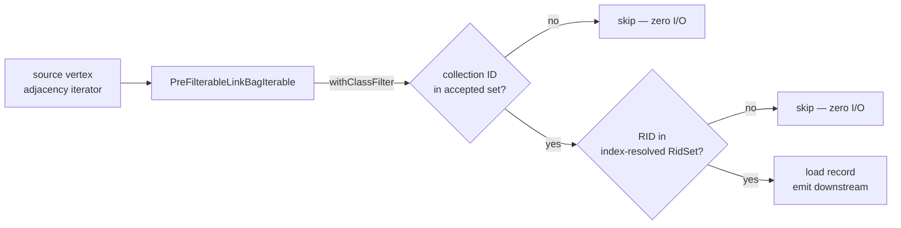
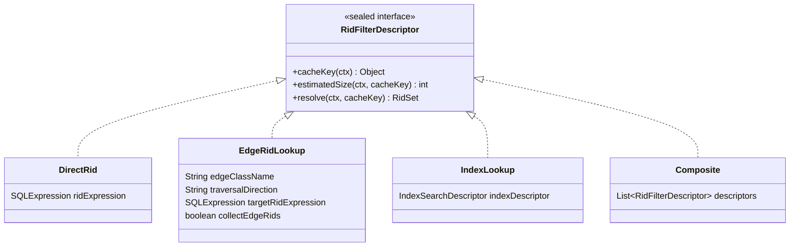

# Chapter 14 — Index-Assisted Traversal: Pre-Filtering Adjacency Lists

Chapter 13 showed how the hash-join variants eliminate full nested-loop scans for
back-reference patterns. This chapter covers the second optimisation layer — one that operates
at a finer grain. Instead of replacing an entire join, it makes each individual edge traversal
smarter: it lets the traverser skip adjacency-list entries that cannot possibly match the
target alias's `WHERE` clause, *before* loading any record from disk.

---

## The cost problem

Picture a social-media graph where a prolific user named Alice has written 40 000 posts. A
MATCH query asks for her recent ones:

```sql
MATCH {class: Person, where: (@rid = #10:0), as: alice}
      .out('Wrote') {class: Post, where: (timestamp > :lastWeek)}
RETURN post.title, post.timestamp
```

The nested-loop engine walks Alice's `Wrote` adjacency list. For each entry it loads the
`Post` record from disk, evaluates `timestamp > :lastWeek`, and either emits a row or
discards the record. Only 12 posts were written in the last week — so the engine performs
39 988 disk loads, evaluates the predicate on each one, and throws all 39 988 away. Every
record crosses the page cache boundary. Every cache line it evicts could have served a
useful read.

That waste scales with two independent factors: the fan-out of the edge (how many
neighbours the source vertex has) and the selectivity of the WHERE clause (how few
neighbours survive). When both are large, the cost is severe. For the LDBC benchmark query
IC2 ("most recent messages by friends"), which touches every message of every friend, this
is precisely the bottleneck.

The remedy is conceptually simple: resolve the set of matching `Post` RIDs *once* from an
index, then consult that set while scanning the adjacency list. A neighbour whose RID is
absent from the set is skipped without any record load. Non-matching entries cost nothing but
a set-membership test.

---

## From idea to mechanism

The key insight is that a RID encodes more information than just a record address. Its leading
integer — the *collection ID*, the `12` in `#12:0` — identifies the collection that stores the
record, and every collection belongs to exactly one class. The collection-to-class mapping is pure
schema metadata, available at plan time, requiring no I/O.

That observation enables a *class filter*: before even consulting an index, the traverser can
discard any adjacency-list entry whose collection ID does not belong to the target class. If the
target alias is `{class: Post}`, any RID with a collection ID that is not a Post collection is
eliminated in a single integer comparison — zero disk access.

An index filter adds the second layer. If the target alias has a `WHERE` clause that matches
an available index, the planner can materialise the set of matching RIDs at query start by
running one index scan. That set is then applied to the adjacency iterator: only RIDs that
survive the class check *and* appear in the set are passed downstream.

The diagram below shows how these two layers sit in the execution path:



**Figure 14.1 — Two independent pre-filter layers on a `PreFilterableLinkBagIterable`.**

Both layers are optional and orthogonal. Either can be present without the other.
The class filter is always applied when the target alias has a known class; the RID-set filter
is applied only when an index (or reverse-edge lookup) was found at plan time and passes
runtime size guards described later in this chapter.

---

## The descriptor: encoding the filter at plan time

The planner needs a way to record, at plan time, *how* to materialise the RID set at runtime.
That recording is a `RidFilterDescriptor` — a sealed interface with four permitted
implementations, each representing a different strategy for producing the set.



**Figure 14.2 — The four implementations of `RidFilterDescriptor`.**

The three methods on the interface divide the work:

- `cacheKey(ctx)` returns a key that uniquely identifies what the RID set will contain, so the
  same set can be reused across multiple source vertices. Returns `null` when caching is not
  worthwhile.
- `estimatedSize(ctx, cacheKey)` returns a cheap upper-bound estimate of the set size, used
  to skip materialisation when the estimate already exceeds the safety cap. Returns `-1` when
  no estimate is available.
- `resolve(ctx, cacheKey)` materialises and returns the full `RidSet`, or `null` if
  materialisation should be skipped.

`RidFilterDescriptor` is defined in
`core/src/main/java/com/jetbrains/youtrackdb/internal/core/sql/executor/RidFilterDescriptor.java:27`.

**`DirectRid`** (`RidFilterDescriptor.java:97`) covers the case where the WHERE clause is
simply `@rid = #12:5` — a literal or named-parameter RID. `resolve` evaluates the expression
and returns a singleton `RidSet`. `estimatedSize` is always 1. `cacheKey` returns `null`
because a singleton set is trivial to rebuild each time and caching is not worth the overhead.

**`EdgeRidLookup`** (`RidFilterDescriptor.java:141`) covers back-reference intersection.
When the target alias's WHERE clause contains `@rid = $matched.X.@rid`, the set of matching
vertices is exactly the set of neighbours that alias `X` is connected to via the reverse
edge. `resolve` loads the target vertex (the already-bound `X`), reads its reverse link bag
for the given edge class — for `out('HAS_CREATOR')`, that is the `in_HAS_CREATOR` field on
the target — and collects vertex RIDs into a `RidSet`. `estimatedSize` reads the reverse
link-bag size via `TraversalPreFilterHelper.reverseLinkBagSize`, which is an O(1) stored-field
read. `cacheKey` returns the resolved target RID, so the cache entry is reused across all
source vertices that share the same `$matched.X` binding.

**`IndexLookup`** (`RidFilterDescriptor.java:200`) covers field conditions that can be
served by an index — equality, range, membership. `resolve` calls
`TraversalPreFilterHelper.resolveIndexToRidSet`, which runs the index scan and accumulates
results. `estimatedSize` returns a histogram-based estimate from the index descriptor.
`cacheKey` returns the index name: because the query parameters are literals or named
parameters (never `$matched` references), the index result is the same for every source
vertex in the query, and a single resolve suffices for the entire execution.

**`Composite`** (`RidFilterDescriptor.java:239`) combines two or more descriptors by
intersecting their results. `resolve` resolves each child and intersects the resulting
`RidSet`s at the bitmap level via `TraversalPreFilterHelper.intersect`. `estimatedSize`
returns the minimum of child estimates, since an intersection is bounded by its smallest
input. `cacheKey` returns `null` if any child returns `null`, disabling caching for the
whole composite.

The following code snippet shows the exact shape of the interface as implemented, including
the `record` syntax used for each variant:

```java
// RidFilterDescriptor.java:27
public sealed interface RidFilterDescriptor {
  int estimatedSize(CommandContext ctx, @Nullable Object cacheKey);
  @Nullable RidSet resolve(CommandContext ctx, @Nullable Object cacheKey);
  @Nullable Object cacheKey(CommandContext ctx);

  record DirectRid(SQLExpression ridExpression)
      implements RidFilterDescriptor { ... }

  record EdgeRidLookup(
      String edgeClassName, String traversalDirection,
      SQLExpression targetRidExpression, boolean collectEdgeRids)
      implements RidFilterDescriptor { ... }

  record IndexLookup(IndexSearchDescriptor indexDescriptor)
      implements RidFilterDescriptor { ... }

  record Composite(List<RidFilterDescriptor> descriptors)
      implements RidFilterDescriptor { ... }
}
```

---

## How the planner attaches the descriptor

Pre-filter attachment is a post-scheduling pass. After the planner's topological scheduler
returns the ordered list of `EdgeTraversal` objects (Chapter 10), the method
`MatchExecutionPlanner.optimizeScheduleWithIntersections` makes a single left-to-right sweep
over that list (`MatchExecutionPlanner.java:3010`). As it walks, it maintains a
`boundAliases` set — the aliases that have already been produced by earlier edges and are
therefore available to back-reference expressions.

For each edge whose target alias carries a `WHERE` clause, the pass checks three cases in
sequence:

**Case 1 — RID equality in the WHERE clause.** The pass calls
`targetFilter.findRidEquality()`. If the expression references a bound alias via
`$matched.X.@rid`, the pass checks whether the back-reference pattern qualifies for the
semi-join hash-table path described in Chapter 13. If it does, a `SemiJoinDescriptor` is
attached instead of a `RidFilterDescriptor`, and the `EdgeRidLookup` path is skipped. If it
does not qualify for a semi-join, an `EdgeRidLookup` descriptor is attached to the producing
edge so that the forward adjacency list is intersected with the reverse-edge set of the
referenced alias. When the RID expression is a literal or parameter with no alias reference,
a `DirectRid` descriptor is attached directly to the current edge (`MatchExecutionPlanner.java:3149`).

**Case 2 — NOT IN anti-semi-join.** If no semi-join descriptor was attached in Case 1, the
pass calls `detectNotInAntiJoin`. A pattern of the form
`$currentMatch NOT IN $matched.X.out('E')` produces an `AntiSemiJoinDescriptor`, which is
the domain of the `BackRefHashJoinStep` covered in Chapter 13.

**Case 3 — Index-eligible field condition.** After the back-reference and anti-join checks,
the pass looks for an index. It calls `targetFilter.splitByMatchedReference()` to isolate the
portion of the WHERE clause that does not reference `$matched` — only that portion can be
served by a static index lookup. The non-`$matched` fragment is handed to
`TraversalPreFilterHelper.findIndexForFilter`, which normalises the clause and delegates to
`SelectExecutionPlanner.findBestIndexFor` to select the best available index. If a usable
index is found, an `IndexLookup` descriptor is attached via `addIntersectionDescriptor`
(`MatchExecutionPlanner.java:3194–3198`).

When `addIntersectionDescriptor` is called a second time on the same edge, the existing
descriptor and the new one are wrapped in a `Composite` (`EdgeTraversal.java:162`):

```java
// EdgeTraversal.java:162
public void addIntersectionDescriptor(RidFilterDescriptor descriptor) {
  if (intersectionDescriptor == null) {
    intersectionDescriptor = descriptor;
  } else {
    intersectionDescriptor = new RidFilterDescriptor.Composite(
        List.of(intersectionDescriptor, descriptor));
  }
}
```

The composition is always intersection. OR-combined predicates that cannot be expressed as a
single flat branch are not pre-filterable and fall back to post-load evaluation. This is a
deliberate simplification: an OR-based RID union across different index types can easily
become more expensive than the original adjacency scan.

The class filter is attached in a separate, subsequent pass by
`attachCollectionIdFilters` (`MatchExecutionPlanner.java:3905`). For each edge whose target
alias has a known class, the planner calls
`TraversalPreFilterHelper.collectionIdsForClass(schemaClass)`, which collects all collection IDs
owned by that class and its subclasses via `SchemaClass.getPolymorphicCollectionIds()`
(`TraversalPreFilterHelper.java:69`). The resulting `IntSet` is stored as
`EdgeTraversal.acceptedCollectionIds`.

### Class inference: enabling both filters without explicit schema declarations

For the class filter and the index filter to engage, the target alias's class must be known at
plan time. The class may be stated explicitly (`class: Post`) or inferred from the edge
schema. Inference is performed by `MatchExecutionPlanner.inferClassFromEdgeSchema`
(`MatchExecutionPlanner.java:4558`):

- `out('X')` / `in('X')`: the target vertex class is read from the LINK-type property on
  edge class `X` — the `in` property for `out('X')`, the `out` property for `in('X')`.
- `outE('X')` / `inE('X')`: the alias class is the edge class `X` itself.
- `inV()` / `outV()`: the vertex class is looked up by reading the `in` or `out` LINK property
  on the preceding edge class.

When inference succeeds the alias is added to `aliasClasses`, making it eligible for both
the class filter and the index pre-filter. When inference fails — typically because the edge
class is absent from the schema, or because the LINK property has no declared type — neither
optimisation is applied, and execution falls back to standard post-load filtering.

---

## What happens at runtime

The class filter and the RID-set filter are applied inside
`MatchEdgeTraverser.applyPreFilter` (`MatchEdgeTraverser.java:556`), called immediately after
the graph method (`out()`, `in()`, `both()`) returns the raw adjacency object.

The method first checks whether the result is a `PreFilterableLinkBagIterable`. If it is not
— for example, when the traversal method does not produce a link-bag iterator — the method
returns the object unchanged. The pre-filter is silently a no-op in that case.

When the result is a `PreFilterableLinkBagIterable`, two filter layers are applied
independently:

**Class filter** (`MatchEdgeTraverser.java:565`): if `edge.getAcceptedCollectionIds()` is
non-null, `pfli.withClassFilter(collectionIds)` is called immediately. This requires no
descriptor and costs no I/O — the collection ID is embedded in the RID.

**RID-set filter** (`MatchEdgeTraverser.java:574`): applied only when the edge has an
`intersectionDescriptor` and two runtime guards both pass.

The first guard is the **link-bag size guard**: the forward link-bag size must be at least
`TraversalPreFilterHelper.minLinkBagSize()`, controlled by
`GlobalConfiguration.QUERY_PREFILTER_MIN_LINKBAG_SIZE` (default 50). Walking five neighbours
raw is cheaper than resolving an index and performing five set-membership tests; the guard
prevents the optimisation from being applied to tiny adjacency lists where it would add
overhead rather than remove it.

The second guard is the **ratio guard**: after the descriptor resolves to a `RidSet`,
`TraversalPreFilterHelper.passesRatioCheck(ridSet.size(), linkBagSize)` must return `true`
(`TraversalPreFilterHelper.java:351`). The check fails when
`ridSetSize / linkBagSize > maxSelectivityRatio()`, controlled by
`GlobalConfiguration.QUERY_PREFILTER_MAX_SELECTIVITY_RATIO` (default 0.8). A filter that
lets through 80% of the adjacency list provides little benefit and the overhead of
`contains()` calls is not justified.

Both guards are applied twice — once inside `EdgeTraversal.resolveWithCache` against the
estimated size (fast, before full materialisation), and once in `applyPreFilter` against the
actual materialised `RidSet` size. The two checks use different inputs: the estimate check
can fail on a large estimate and allow a later vertex to trigger resolution, while the actual
check can fail because the real set turned out larger than estimated.

`EdgeTraversal.resolveWithCache` (`EdgeTraversal.java:229`) manages the full resolution
logic with a fixed-capacity lazy cache. On first use the method checks for a cache hit, then
obtains the cheap size estimate, applies the absolute cap guard
(`GlobalConfiguration.QUERY_PREFILTER_MAX_RIDSET_SIZE`, default 100 000), applies the per-vertex
ratio guard against the estimate, and finally calls `descriptor.resolve()`. Successful
resolutions are stored in the cache keyed by `descriptor.cacheKey()`. The cache has a fixed
capacity of 64 entries (`EdgeTraversal.java:88`); once full, new entries are silently dropped.
There is no eviction and no LRU bookkeeping — the number of distinct descriptor keys across
a single query is small enough that a fixed-capacity map is sufficient.

To prevent unbounded materialisation, `TraversalPreFilterHelper.resolveIndexToRidSet` and
`resolveReverseEdgeLookup` check every 1024 elements (bitmask `0x3FF`,
`TraversalPreFilterHelper.java:58`) against `maxRidSetSize()` and abort early if the
intermediate result is already too large. An over-budget descriptor does not stall the query;
it simply returns `null`, and the traverser falls back to post-load evaluation for that vertex.

---

## An end-to-end example

A single query illustrates how all three stages compose.

```sql
CREATE INDEX Post.timestamp ON Post(timestamp) NOTUNIQUE;

MATCH {class: Person, where: (@rid = #10:0), as: alice}
      .out('Wrote') {class: Post, where: (timestamp > :lastWeek)}
RETURN post.title
```

**Stage 1 — parsing and pattern graph.** The parser produces a `SQLMatchStatement`
with two pattern nodes (`alice` and an unnamed `Post` node) and one pattern edge (`Wrote`,
directed `out`). The planner's first two phases build the `PatternNode` and `PatternEdge`
objects and unify aliases across expressions (Chapter 6).

**Stage 2 — scheduling and descriptor attachment.** Root selection (Chapter 9) picks
`alice` as the root because the `@rid = #10:0` predicate makes it a singleton. The scheduler
(Chapter 10) emits a single `EdgeTraversal`: walk `out('Wrote')` from `alice` to the unnamed
`Post` node.

`optimizeScheduleWithIntersections` examines the `Post` node's filter
`(timestamp > :lastWeek)`. Case 1 finds no RID equality. Case 2 finds no NOT-IN pattern. Case
3 finds that `Post` has a `timestamp` index. `TraversalPreFilterHelper.findIndexForFilter`
returns an `IndexLookup` descriptor wrapping that index. The descriptor is attached to the
`EdgeTraversal` via `addIntersectionDescriptor`.

`attachCollectionIdFilters` then calls `collectionIdsForClass` for the `Post` class and stores
the resulting `IntSet` as `acceptedCollectionIds` on the same `EdgeTraversal`.

**Stage 3 — runtime.** The traverser calls `out('Wrote')` on Alice's vertex. The result is a
`PreFilterableLinkBagIterable`. `applyPreFilter` first calls `withClassFilter(postCollectionIds)`,
narrowing the iterator to Post RIDs only. Alice's adjacency list may contain entries from
other classes if the `Wrote` edge class is not strictly typed; the class filter eliminates
them.

The link-bag size is, say, 40 000. That exceeds `minLinkBagSize()` of 50. The traverser calls
`resolveWithCache`. The `IndexLookup` descriptor scans the `Post.timestamp` index for entries
after `:lastWeek` and materialises a `RidSet` of, say, 12 matching posts. The ratio check:
12 / 40 000 = 0.0003, well below 0.8. The `RidSet` is cached under the index name.
`withRidFilter(ridSet)` wraps the iterable.

The iterator now yields at most 12 RIDs. The traverser loads each, evaluates the full WHERE
clause (index predicates are permitted to be conservative, so the post-load check ensures
correctness), and emits the matching rows. Total disk loads: 12, down from 40 000.

---

## When the planner can apply this optimisation

The eligibility conditions reduce to three requirements:

1. **The target alias must have a known class.** Either stated explicitly in the MATCH pattern
   or inferred from the edge schema by `inferClassFromEdgeSchema`. Without a class, neither
   the class filter nor the index pre-filter can be constructed.

2. **The WHERE clause must be indexable or match one of the recognised RID-equality patterns.**
   Equality, range, and membership predicates on indexed fields produce `IndexLookup`
   descriptors. `@rid = literal` produces `DirectRid`. `@rid = $matched.X.@rid` produces
   `EdgeRidLookup` (when it does not qualify for a semi-join).

3. **The runtime guards must pass for the given source vertex.** Even when a descriptor exists
   at plan time, the optimisation is skipped at runtime if the link bag is smaller than
   `minLinkBagSize()` or the resolved `RidSet` is too large relative to the link bag.

---

## Limitations

A few cases fall outside the current scope of index pre-filtering:

**Recursive `WHILE` patterns.** Each depth of a recursive traversal is its own adjacency
read. The pre-filter helper does not attach per-depth descriptors; recursive patterns fall
back to post-load filtering at every depth.

**Small adjacency lists.** When the forward link-bag size is below `minLinkBagSize()` (default
50), the RID-set filter is skipped entirely. Loading a handful of records is cheaper than
resolving an index and performing membership tests.

**Non-indexed predicates.** A WHERE clause that references no indexed field produces no
`IndexLookup` descriptor. The predicate is evaluated as a post-filter after the record is
loaded. Adding an index on the field is sufficient to enable the optimisation.

**OR-combined index conditions.** `findIndexForFilter` rejects WHERE clauses that flatten to
more than one OR branch. Those predicates are not pre-filterable and fall back to post-load
evaluation. AND-combined conditions on multiple indexed fields are handled via `Composite`
intersection.

These are not bugs; they are the current scope of the optimisation, and the engine degrades
gracefully to standard post-load filtering in all these cases.

---

## Configuration knobs

Three `GlobalConfiguration` keys control the runtime thresholds:

| Key | Default | Effect |
|---|---|---|
| `youtrackdb.query.prefilter.maxRidSetSize` | 100 000 | Absolute cap on RidSet entries; exceeding it aborts materialisation |
| `youtrackdb.query.prefilter.maxSelectivityRatio` | 0.8 | Maximum `ridSetSize / linkBagSize`; above this the filter is skipped |
| `youtrackdb.query.prefilter.minLinkBagSize` | 50 | Minimum adjacency-list size below which the RID-set filter is skipped |

All three are declared in
`core/src/main/java/com/jetbrains/youtrackdb/api/config/GlobalConfiguration.java:1292`.

---

## Looking ahead

Parts I through VI have assembled the complete engine: the parser hands an AST to the planner,
the planner schedules an ordered list of `EdgeTraversal` objects, the executor chains them
into a pull-based step pipeline, and the two optimisation layers — hash joins and
index-assisted pre-filters — accelerate the cases where nested-loop iteration is most costly.

Chapter 15 draws all of these layers together. It walks nine queries in ascending complexity,
and for each one it traces exactly which planner phases, step types, and optimisation paths
are engaged — a spaced-repetition pass over the entire engine.

---

## Further reading

- `core/src/main/java/com/jetbrains/youtrackdb/internal/core/sql/executor/RidFilterDescriptor.java:27`
  — the sealed interface and its four implementations (`DirectRid`, `EdgeRidLookup`,
  `IndexLookup`, `Composite`).
- `core/src/main/java/com/jetbrains/youtrackdb/internal/core/sql/executor/TraversalPreFilterHelper.java`
  — centralised utilities: `findIndexForFilter` (line 293), `resolveIndexToRidSet` (line 93),
  `resolveReverseEdgeLookup` (line 163), `passesRatioCheck` (line 351),
  `collectionIdsForClass` (line 69).
- `core/src/main/java/com/jetbrains/youtrackdb/internal/core/sql/executor/match/EdgeTraversal.java`
  — `addIntersectionDescriptor` (line 162), `resolveWithCache` (line 229), and the descriptor
  cache (`CACHE_CAPACITY = 64`, line 88).
- `core/src/main/java/com/jetbrains/youtrackdb/internal/core/sql/executor/match/MatchEdgeTraverser.java`
  — `applyPreFilter` (line 556).
- `core/src/main/java/com/jetbrains/youtrackdb/internal/core/sql/executor/match/MatchExecutionPlanner.java`
  — `optimizeScheduleWithIntersections` (line 3010), `attachCollectionIdFilters` (line 3905),
  `inferClassFromEdgeSchema` (line 4558).
- `core/src/main/java/com/jetbrains/youtrackdb/internal/core/record/impl/PreFilterableLinkBagIterable.java`
  — the shared interface for filterable link-bag iterables.
- `core/src/main/java/com/jetbrains/youtrackdb/api/config/GlobalConfiguration.java:1292`
  — `QUERY_PREFILTER_MAX_RIDSET_SIZE`, `QUERY_PREFILTER_MAX_SELECTIVITY_RATIO`,
  `QUERY_PREFILTER_MIN_LINKBAG_SIZE`.
- `core/src/test/java/com/jetbrains/youtrackdb/internal/core/sql/executor/MatchPreFilterComprehensiveTest.java`
  — end-to-end tests for the index-assisted traversal path.
- Chapter 8 — cost estimation and fan-out estimates that inform scheduling decisions made
  before this optimisation pass runs.
- Chapter 10 — topological scheduling: how the edge order is determined before
  `optimizeScheduleWithIntersections` is called.
- Chapter 13 — hash joins: the semi-join and anti-semi-join paths that take precedence over
  `EdgeRidLookup` for back-reference predicates.
