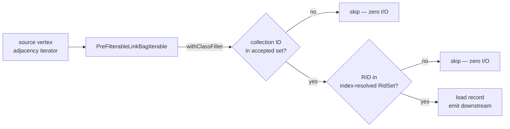
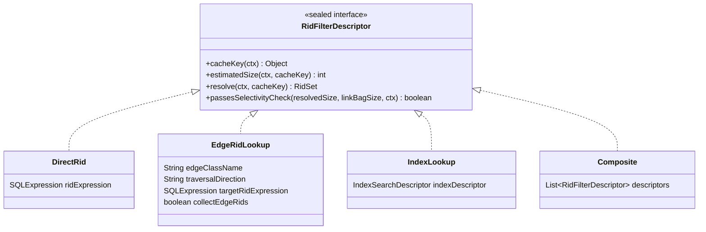

# Chapter 14 — Index-Assisted Traversal: Pre-Filtering Adjacency Lists

Chapter 13 showed how the hash-join variants eliminate full nested-loop scans for
back-reference patterns. This chapter covers the second optimisation layer — one that operates
at a finer grain. Instead of replacing an entire join, it makes each individual edge traversal
smarter: it lets the traverser skip adjacency-list entries that cannot possibly match the
target alias's `WHERE` clause, *before* loading any record from disk.

---

## The cost problem

Picture a social-media graph where a prolific user named Alice has written 40 000 posts. A
MATCH query asks for her recent ones:

```sql
MATCH {class: Person, where: (@rid = #10:0), as: alice}
      .out('Wrote') {class: Post, where: (timestamp > :lastWeek)}
RETURN post.title, post.timestamp
```

The nested-loop engine walks Alice's `Wrote` adjacency list. For each entry it loads the
`Post` record from disk, evaluates `timestamp > :lastWeek`, and either emits a row or
discards the record. Only 12 posts were written in the last week — so the engine performs
39 988 disk loads, evaluates the predicate on each one, and throws all 39 988 away. Every
record crosses the page cache boundary. Every cache line it evicts could have served a
useful read.

That waste scales with two independent factors: the fan-out of the edge (how many
neighbours the source vertex has) and the selectivity of the WHERE clause (how few
neighbours survive). When both are large, the cost is severe. For the LDBC benchmark query
IC2 ("most recent messages by friends"), which touches every message of every friend, this
is precisely the bottleneck.

The remedy is conceptually simple: resolve the set of matching `Post` RIDs *once* from an
index, then consult that set while scanning the adjacency list. A neighbour whose RID is
absent from the set is skipped without any record load. Non-matching entries cost nothing but
a set-membership test.

---

## From idea to mechanism

The key insight is that a RID encodes more information than just a record address. Its leading
integer — the *collection ID*, the `12` in `#12:0` — identifies the collection that stores the
record, and every collection belongs to exactly one class. The collection-to-class mapping is pure
schema metadata, available at plan time, requiring no I/O.

That observation enables a *class filter*: before even consulting an index, the traverser can
discard any adjacency-list entry whose collection ID does not belong to the target class. If the
target alias is `{class: Post}`, any RID with a collection ID that is not a Post collection is
eliminated in a single integer comparison — zero disk access.

An index filter adds the second layer. If the target alias has a `WHERE` clause that matches
an available index, the planner can materialise the set of matching RIDs at query start by
running one index scan. That set is then applied to the adjacency iterator: only RIDs that
survive the class check *and* appear in the set are passed downstream.

The diagram below shows how these two layers sit in the execution path:



**Figure 14.1 — Two independent pre-filter layers on a `PreFilterableLinkBagIterable`.**

Both layers are optional and orthogonal. Either can be present without the other.
The class filter is always applied when the target alias has a known class; the RID-set filter
is applied only when an index (or reverse-edge lookup) was found at plan time and passes
runtime size guards described later in this chapter.

---

## The descriptor: encoding the filter at plan time

The planner needs a way to record, at plan time, *how* to materialise the RID set at runtime.
That recording is a `RidFilterDescriptor` — a sealed interface with four permitted
implementations, each representing a different strategy for producing the set.



**Figure 14.2 — The four implementations of `RidFilterDescriptor`.**

The four methods on the interface divide the work:

- `cacheKey(ctx)` returns a key that uniquely identifies what the RID set will contain, so the
  same set can be reused across multiple source vertices. Returns `null` when caching is not
  worthwhile.
- `estimatedSize(ctx, cacheKey)` returns a cheap upper-bound estimate of the set size, used
  to decide whether materialisation is worthwhile *before* paying its cost. Returns `-1` when
  no estimate is available.
- `resolve(ctx, cacheKey)` materialises and returns the full `RidSet`, or `null` if
  materialisation should be skipped.
- `passesSelectivityCheck(resolvedSize, linkBagSize, ctx)` is the admission test: given the
  set size — estimated or actual — and the current vertex's link-bag size, it answers "is
  this pre-filter still worth applying?" The three non-trivial variants answer that question
  in different ways, and two of those answers are the two runtime admission paths that the
  second half of this chapter is built around.

`RidFilterDescriptor` is defined in
`core/src/main/java/com/jetbrains/youtrackdb/internal/core/sql/executor/RidFilterDescriptor.java:29`.

**`DirectRid`** (`RidFilterDescriptor.java:129`) covers the case where the WHERE clause is
simply `@rid = #12:5` — a literal or named-parameter RID. `resolve` evaluates the expression
and returns a singleton `RidSet`. `estimatedSize` is always 1. `cacheKey` returns `null`
because a singleton set is trivial to rebuild each time and caching is not worth the overhead.
Its `passesSelectivityCheck` always returns `true`: a single-RID filter is free to apply and
can never be counter-productive.

**`EdgeRidLookup`** (`RidFilterDescriptor.java:181`) covers back-reference intersection.
When the target alias's WHERE clause contains `@rid = $matched.X.@rid`, the set of matching
vertices is exactly the set of neighbours that alias `X` is connected to via the reverse
edge. `resolve` loads the target vertex (the already-bound `X`), reads its reverse link bag
for the given edge class — for `out('HAS_CREATOR')`, that is the `in_HAS_CREATOR` field on
the target — and collects vertex RIDs into a `RidSet`. A fourth record component,
`collectEdgeRids`, switches the collector between vertex RIDs (for `out()`/`in()`) and edge
RIDs (for `outE()`/`inE()`, where the adjacency iterator filters on the edge record itself).
`estimatedSize` reads the reverse link-bag size via
`TraversalPreFilterHelper.reverseLinkBagSize`, which is an O(1) stored-field read. `cacheKey`
returns the resolved target RID, so the cache entry is reused across all source vertices that
share the same `$matched.X` binding. Its `passesSelectivityCheck` (`RidFilterDescriptor.java:195`)
is an *overlap ratio* test — the first of the two admission paths — described in detail later.

**`IndexLookup`** (`RidFilterDescriptor.java:257`) covers field conditions that can be
served by an index — equality, range, membership. `resolve` calls
`TraversalPreFilterHelper.resolveIndexToRidSet`, which runs the index scan and accumulates
results. `estimatedSize` returns a histogram-based estimate from the index descriptor.
`cacheKey` returns a fingerprint of the index and its condition: because the query parameters
are literals or named parameters (never `$matched` references), the index result is the same
for every source vertex in the query, and a single resolve suffices for the entire execution.
Its `passesSelectivityCheck` (`RidFilterDescriptor.java:278`) is a *class-level selectivity*
test — the second admission path — which ignores the per-vertex link-bag size entirely.

**`Composite`** (`RidFilterDescriptor.java:335`) combines two or more descriptors by
intersecting their results. `resolve` resolves each child and intersects the resulting
`RidSet`s at the bitmap level via `TraversalPreFilterHelper.intersect`. `estimatedSize`
returns the minimum of child estimates, since an intersection is bounded by its smallest
input. `cacheKey` returns `null` if any child returns `null`, disabling caching for the
whole composite. Its `passesSelectivityCheck` returns `true` if *any* child passes: the
intersection is bounded by its most selective child, so one selective input is enough to
justify the work.

The following code snippet shows the exact shape of the interface as implemented, including
the `record` syntax used for each variant:

```java
// RidFilterDescriptor.java:29
public sealed interface RidFilterDescriptor {
  int estimatedSize(CommandContext ctx, @Nullable Object cacheKey);
  @Nullable RidSet resolve(CommandContext ctx, @Nullable Object cacheKey);
  @Nullable Object cacheKey(CommandContext ctx);
  boolean passesSelectivityCheck(int resolvedSize, int linkBagSize, CommandContext ctx);

  record DirectRid(SQLExpression ridExpression)
      implements RidFilterDescriptor { ... }

  record EdgeRidLookup(
      String edgeClassName, String traversalDirection,
      SQLExpression targetRidExpression, boolean collectEdgeRids)
      implements RidFilterDescriptor { ... }

  record IndexLookup(IndexSearchDescriptor indexDescriptor)
      implements RidFilterDescriptor { ... }

  record Composite(List<RidFilterDescriptor> descriptors)
      implements RidFilterDescriptor { ... }
}
```

---

## How the planner attaches the descriptor

Pre-filter attachment is a post-scheduling pass. After the planner's topological scheduler
returns the ordered list of `EdgeTraversal` objects (Chapter 10), the method
`MatchExecutionPlanner.optimizeScheduleWithIntersections` makes a single left-to-right sweep
over that list (`MatchExecutionPlanner.java:3254`). As it walks, it maintains a
`boundAliases` set — the aliases that have already been produced by earlier edges and are
therefore available to back-reference expressions.

The method returns a `boolean`, `hasIndexLookup`, which is `true` when at least one
`IndexLookup` descriptor was attached during the sweep (`MatchExecutionPlanner.java:3459`).
The caller (`MatchExecutionPlanner.java:1806`) uses that flag to gate a later forecast pass:
`IndexLookup` is the only descriptor whose runtime admission consults per-query row-count
forecasts, so when the sweep attached none, the planner skips that bookkeeping entirely.
What the sweep no longer does is *reject* a descriptor on an estimated hit count. An earlier
version compared the index's global hit estimate against a cap and refused to attach when it
was too large; that gate was deliberately removed, because a globally large index result can
still be highly selective once intersected with a single vertex's small link bag, and the
link-bag size is unknown at plan time. Admission is therefore a *runtime* decision now, made
per source vertex by the two paths described in the next section.

For each edge whose target alias carries a `WHERE` clause, the pass checks three cases in
sequence:

**Case 1 — RID equality in the WHERE clause.** The pass calls
`targetFilter.findRidEquality()` (`MatchExecutionPlanner.java:3303`). If the expression
references a bound alias via `$matched.X.@rid`, the pass checks whether the back-reference
pattern qualifies for the semi-join hash-table path described in Chapter 13. If it does, a
`SingleEdgeSemiJoin` descriptor is attached instead of a `RidFilterDescriptor`, and the
`EdgeRidLookup` path is skipped. If it does not qualify for a semi-join, an `EdgeRidLookup`
descriptor is attached to the producing edge (`MatchExecutionPlanner.java:3367`) so that the
forward adjacency list is intersected with the reverse-edge set of the referenced alias.
When the RID expression is a literal or parameter with no alias reference, a `DirectRid`
descriptor is attached directly to the current edge (`MatchExecutionPlanner.java:3399`).

**Case 2 — NOT IN anti-semi-join.** If no semi-join descriptor was attached in Case 1, the
pass calls `detectNotInAntiJoin` (`MatchExecutionPlanner.java:3414`). A pattern of the form
`$currentMatch NOT IN $matched.X.out('E')` produces an `AntiSemiJoin` descriptor, which is
the domain of the `BackRefHashJoinStep` covered in Chapter 13.

**Case 3 — Index-eligible field condition.** After the back-reference and anti-join checks,
the pass looks for an index. It calls `targetFilter.splitByMatchedReference()`
(`MatchExecutionPlanner.java:3435`) to isolate the portion of the WHERE clause that does not
reference `$matched` — only that portion can be served by a static index lookup. The
non-`$matched` fragment is handed to `TraversalPreFilterHelper.findIndexForFilter`
(`MatchExecutionPlanner.java:3444`), which normalises the clause and delegates to
`SelectExecutionPlanner.findBestIndexFor` to select the best available index. If a usable
index is found, an `IndexLookup` descriptor is attached via `addIntersectionDescriptor`
(`MatchExecutionPlanner.java:3447`).

When `addIntersectionDescriptor` is called a second time on the same edge, the existing
descriptor and the new one are folded into a single *flat* `Composite`
(`EdgeTraversal.java:429`). The flattening matters: if either side is already a `Composite`,
its children are spliced in rather than nested, so a later scan for the `IndexLookup` child
— which the runtime admission path needs — always finds every leaf in one pass:

```java
// EdgeTraversal.java:429
public void addIntersectionDescriptor(RidFilterDescriptor descriptor) {
  if (intersectionDescriptor == null) {
    intersectionDescriptor = descriptor;
    return;
  }
  var flattened = new ArrayList<RidFilterDescriptor>();
  appendFlattened(flattened, intersectionDescriptor);
  appendFlattened(flattened, descriptor);
  intersectionDescriptor = new RidFilterDescriptor.Composite(flattened);
}
```

The composition is always intersection. OR-combined predicates that cannot be expressed as a
single flat branch are not pre-filterable and fall back to post-load evaluation. This is a
deliberate simplification: an OR-based RID union across different index types can easily
become more expensive than the original adjacency scan.

The class filter is attached in a separate pass, `stampEdgeMetadata`
(`MatchExecutionPlanner.java:2604`), which walks the schedule once more and stamps two kinds
of plan-time metadata on each edge. For every edge whose target alias has a known class it
calls `TraversalPreFilterHelper.collectionIdsForClass(schemaClass)`
(`TraversalPreFilterHelper.java:90`), which collects all collection IDs owned by that class
and its subclasses via `SchemaClass.getPolymorphicCollectionIds()`, and stores the resulting
`IntSet` as `EdgeTraversal.acceptedCollectionIds`. The same pass also stamps the per-query
row-count forecasts that the index-lookup admission path consults — but only when the earlier
sweep reported `hasIndexLookup`, since no other descriptor reads them.

### Class inference: enabling both filters without explicit schema declarations

For the class filter and the index filter to engage, the target alias's class must be known at
plan time. The class may be stated explicitly (`class: Post`) or inferred from the edge
schema. Inference is performed by `MatchExecutionPlanner.inferClassFromEdgeSchema`
(`MatchExecutionPlanner.java:4974`):

- `out('X')` / `in('X')`: the target vertex class is read from the LINK-type property on
  edge class `X` — the `in` property for `out('X')`, the `out` property for `in('X')`.
- `outE('X')` / `inE('X')`: the alias class is the edge class `X` itself.
- `inV()` / `outV()`: the vertex class is looked up by reading the `in` or `out` LINK property
  on the preceding edge class.

When inference succeeds the alias is added to `aliasClasses`, making it eligible for both
the class filter and the index pre-filter. When inference fails — typically because the edge
class is absent from the schema, or because the LINK property has no declared type — neither
optimisation is applied, and execution falls back to standard post-load filtering.

---

## What happens at runtime

The class filter and the RID-set filter are applied inside
`MatchEdgeTraverser.applyPreFilter` (`MatchEdgeTraverser.java:557`), called immediately after
the graph method (`out()`, `in()`, `both()`) returns the raw adjacency object.

The method first checks whether the result is a `PreFilterableLinkBagIterable`. If it is not
— for example, when the traversal method does not produce a link-bag iterator — the method
returns the object unchanged. The pre-filter is silently a no-op in that case.

When the result is a `PreFilterableLinkBagIterable`, the class filter goes first, because it
is unconditional and free. If `edge.getAcceptedCollectionIds()` is non-null,
`pfli.withClassFilter(collectionIds)` is applied immediately (`MatchEdgeTraverser.java:566`).
This requires no descriptor and costs no I/O — the collection ID is embedded in the RID, so
narrowing the iterator to the target class is a single integer comparison per entry.

The RID-set filter is where the real decision happens, and it runs only when the edge carries
an `intersectionDescriptor`. Before any set is materialised, one guard stands in front of
everything else.

### The link-bag size guard

Walking five neighbours raw is cheaper than resolving an index and running five set-membership
tests. So the traverser reads the forward link-bag size and, if it is below
`TraversalPreFilterHelper.minLinkBagSize()`, records the skip and moves on
(`MatchEdgeTraverser.java:585`). The threshold is
`GlobalConfiguration.QUERY_PREFILTER_MIN_LINKBAG_SIZE`, default 50. Tiny adjacency lists never
reach the admission logic at all — there the optimisation would add overhead rather than
remove it.

### The absolute cap

Once the link bag is large enough, the traverser calls `EdgeTraversal.resolveWithCache`
(`EdgeTraversal.java:683`). Before it runs either admission test, it enforces one absolute
ceiling shared by both paths.

That ceiling is the **absolute cap**. `resolveWithCache` first obtains the cheap size estimate
and compares it against `TraversalPreFilterHelper.maxRidSetSize()` (`EdgeTraversal.java:769`).
Unlike the fixed 100 000 of earlier versions, this cap is now *heap-adaptive*: half a percent
of the maximum heap, clamped to the range [100 000, 10 000 000]
(`GlobalConfiguration.java:1351`). A larger heap tolerates a larger materialised set; a small
one is protected from a set that would dwarf it. When the estimate exceeds the cap the build
is abandoned before it starts, recorded as `CAP_EXCEEDED`, and the `null` is cached so later
vertices sharing the same key do not re-estimate. Because the estimate can under-count, the
same ceiling is re-checked *during* materialisation: both `resolveIndexToRidSet` and
`resolveReverseEdgeLookup` test their running count against the cap every 1024 elements
(bitmask `0x3FF`, `TraversalPreFilterHelper.java:79`; the checks sit at
`TraversalPreFilterHelper.java:138` and `:245`) and abort early if the intermediate result
outgrows it. An over-budget descriptor does not stall the query; it returns `null` and the
traverser falls back to post-load evaluation for that vertex.

### Two admission paths, one per expensive descriptor

Past the cap, the single ratio guard of earlier versions has been replaced by *two* distinct
admission tests — one for each kind of expensive descriptor. Which test runs is decided by the
descriptor's own `passesSelectivityCheck`, and the two answers are computed from entirely
different inputs.

#### Path A — the edge-lookup overlap ratio

An `EdgeRidLookup` produces the set of neighbours reachable from a bound alias through a
reverse edge. Its value depends entirely on how much of the *current* adjacency list that set
covers: if the reverse set already contains four out of every five forward neighbours,
intersecting the two barely narrows anything, and the membership tests are pure overhead.

So `EdgeRidLookup.passesSelectivityCheck` (`RidFilterDescriptor.java:195`) is an overlap
ratio. It keeps the filter only when

```
resolvedSize / linkBagSize <= edgeLookupMaxRatio()
```

where `edgeLookupMaxRatio()` is `GlobalConfiguration.QUERY_PREFILTER_EDGE_LOOKUP_MAX_RATIO`,
default 0.8 (`GlobalConfiguration.java:1362`). A reverse set covering more than 80 % of the
adjacency list is rejected. The test is cheap and per-vertex, so it runs twice: once inside
`resolveWithCache` against the estimated size, and once in `applyPreFilter`
(`MatchEdgeTraverser.java:607`) against the actual `ridSet.size()`, because the two inputs can
disagree — the real set may turn out larger than the estimate. A failure on the actual size is
recorded as `OVERLAP_RATIO_TOO_HIGH` (`MatchEdgeTraverser.java:620`).

#### Path B — the index-lookup amortization

An `IndexLookup` is a different animal. It scans an index once and produces the same RID set
for every source vertex in the query, so its cost is a *one-time build* amortised across all
the vertices that consult it. A per-vertex overlap ratio is the wrong question; the right
question is whether that build will pay for itself.

That reasoning lives in `EdgeTraversal.checkIndexLookupAmortization`
(`EdgeTraversal.java:1019`), and it runs in two stages. First, selectivity. The method reads
the index's class-level selectivity — the fraction of the class the condition matches. If that
statistic is unavailable it rejects immediately and records `STATS_UNAVAILABLE`
(`EdgeTraversal.java:1037`): without a known selectivity the build cost cannot be bounded, and
the design refuses to gamble. If the selectivity is known but exceeds
`TraversalPreFilterHelper.indexLookupMaxSelectivity()` — default 0.95, from
`GlobalConfiguration.QUERY_PREFILTER_INDEX_LOOKUP_MAX_SELECTIVITY`
(`GlobalConfiguration.java:1370`) — the index matches almost the whole class and cannot narrow
anything, so it is rejected as `SELECTIVITY_TOO_LOW` (`EdgeTraversal.java:1049`). Note that
this is a *class-level* selectivity, not a per-vertex ratio: `IndexLookup`'s
`passesSelectivityCheck` ignores the link-bag size entirely, because the set of matching
records is a property of the condition and the class, identical for every source vertex.

Second, break-even. When the selectivity clears the threshold, the method computes the minimum
number of neighbours that must be scanned before the build amortises, in
`computeMinNeighborsForBuild` (`EdgeTraversal.java:1174`):

```
m = estimatedSize / (loadToScanRatio · (1 − s))
```

Here `s` is the selectivity, `estimatedSize` the expected set size, and `loadToScanRatio` the
modelled cost of a random record load relative to a single set-scan entry —
`GlobalConfiguration.QUERY_PREFILTER_LOAD_TO_SCAN_RATIO`, default 100.0
(`GlobalConfiguration.java:1387`), reflecting that a cold random load is roughly two orders of
magnitude more expensive than a membership test. If the planner's row-count forecast for this
edge already exceeds `m`, the traverser commits to the build on the first vertex
(`BUILD_EAGER`). If it does not — or if the forecast is untrustworthy because the root sample
was too small — the traverser defers instead, accumulating observed link-bag sizes across
vertices and building only once the running total crosses the break-even (`DEFERRED_WITH_NET`).
While it is still deferring, the skip is recorded as `BUILD_NOT_AMORTIZED`
(`EdgeTraversal.java:1121`).

### The descriptor cache and the vocabulary of skips

`resolveWithCache` memoises successful resolutions in a fixed-capacity map keyed by
`descriptor.cacheKey()`. The capacity is 64 entries (`CACHE_CAPACITY`,
`EdgeTraversal.java:339`); once full, new entries are silently dropped, because the number of
distinct descriptor keys in a single query is small enough that no eviction policy is needed.
Rejections are cached too — a `CAP_EXCEEDED`, `STATS_UNAVAILABLE`, or `SELECTIVITY_TOO_LOW`
verdict stores a `null` under the key so later vertices short-circuit instead of re-deciding.
And if `resolve()` returns `null` after passing every up-front guard — a mid-materialisation
cap abort, or a missing reverse-edge target vertex — the traverser records `BUILD_FAILED`
(`EdgeTraversal.java:881`) and caches that too.

Each of those outcomes is a constant of the `PreFilterSkipReason` enum
(`core/src/main/java/com/jetbrains/youtrackdb/internal/core/sql/executor/match/PreFilterSkipReason.java`):
`NONE`, `CAP_EXCEEDED`, `SELECTIVITY_TOO_LOW`, `BUILD_NOT_AMORTIZED`, `LINKBAG_TOO_SMALL`,
`OVERLAP_RATIO_TOO_HIGH`, `BUILD_FAILED`, and `STATS_UNAVAILABLE`. Together they are the running
vocabulary the traverser uses to explain, per edge, why a pre-filter did or did not fire — and,
as Chapter 16 shows, they surface in `PROFILE` output (never in plain `EXPLAIN`), which is
exactly where you look when a filter you expected to fire did not.

---

## An end-to-end example

A single query illustrates how all three stages compose.

```sql
CREATE INDEX Post.timestamp ON Post(timestamp) NOTUNIQUE;

MATCH {class: Person, where: (@rid = #10:0), as: alice}
      .out('Wrote') {class: Post, where: (timestamp > :lastWeek)}
RETURN post.title
```

**Stage 1 — parsing and pattern graph.** The parser produces a `SQLMatchStatement`
with two pattern nodes (`alice` and an unnamed `Post` node) and one pattern edge (`Wrote`,
directed `out`). The planner's first two phases build the `PatternNode` and `PatternEdge`
objects and unify aliases across expressions (Chapter 6).

**Stage 2 — scheduling and descriptor attachment.** Root selection (Chapter 9) picks
`alice` as the root because the `@rid = #10:0` predicate makes it a singleton. The scheduler
(Chapter 10) emits a single `EdgeTraversal`: walk `out('Wrote')` from `alice` to the unnamed
`Post` node.

`optimizeScheduleWithIntersections` examines the `Post` node's filter
`(timestamp > :lastWeek)`. Case 1 finds no RID equality. Case 2 finds no NOT-IN pattern. Case
3 finds that `Post` has a `timestamp` index. `TraversalPreFilterHelper.findIndexForFilter`
returns an `IndexLookup` descriptor wrapping that index. The descriptor is attached to the
`EdgeTraversal` via `addIntersectionDescriptor`.

`stampEdgeMetadata` then calls `collectionIdsForClass` for the `Post` class and stores
the resulting `IntSet` as `acceptedCollectionIds` on the same `EdgeTraversal`.

**Stage 3 — runtime.** The traverser calls `out('Wrote')` on Alice's vertex. The result is a
`PreFilterableLinkBagIterable`. `applyPreFilter` first calls `withClassFilter(postCollectionIds)`,
narrowing the iterator to Post RIDs only. Alice's adjacency list may contain entries from
other classes if the `Wrote` edge class is not strictly typed; the class filter eliminates
them.

The link-bag size is, say, 40 000 — far above `minLinkBagSize()` of 50, so the guard passes
and the traverser calls `resolveWithCache`. The descriptor is an `IndexLookup`, so admission
runs down Path B. First the selectivity: `timestamp > :lastWeek` matches only a sliver of the
`Post` class, well under the 0.95 ceiling, so the index is not rejected as too broad. Then the
break-even: with a low selectivity and an expected result of a few dozen RIDs, the minimum
neighbour count `m` from `computeMinNeighborsForBuild` is tiny, and Alice's 40 000-strong link
bag dwarfs it — the build amortises immediately, so the traverser materialises the set on this
first vertex. The scan of `Post.timestamp` for entries after `:lastWeek` yields a `RidSet` of,
say, 12 matching posts, cached under the descriptor's fingerprint. `withRidFilter(ridSet)`
wraps the iterable.

The iterator now yields at most 12 RIDs. The traverser loads each, evaluates the full WHERE
clause (index predicates are permitted to be conservative, so the post-load check ensures
correctness), and emits the matching rows. Total disk loads: 12, down from 40 000.

---

## When the planner can apply this optimisation

The eligibility conditions reduce to three requirements:

1. **The target alias must have a known class.** Either stated explicitly in the MATCH pattern
   or inferred from the edge schema by `inferClassFromEdgeSchema`. Without a class, neither
   the class filter nor the index pre-filter can be constructed.

2. **The WHERE clause must be indexable or match one of the recognised RID-equality patterns.**
   Equality, range, and membership predicates on indexed fields produce `IndexLookup`
   descriptors. `@rid = literal` produces `DirectRid`. `@rid = $matched.X.@rid` produces
   `EdgeRidLookup` (when it does not qualify for a semi-join).

3. **The runtime admission must pass for the given source vertex.** Even when a descriptor
   exists at plan time, the filter is skipped at runtime if the link bag is smaller than
   `minLinkBagSize()`, if the estimated set exceeds the heap-adaptive cap, or if the
   descriptor's own admission test fails — the overlap ratio for an `EdgeRidLookup`, or the
   selectivity-and-amortization check for an `IndexLookup`.

---

## Limitations

A few cases fall outside the current scope of index pre-filtering:

**Recursive `WHILE` patterns.** Each depth of a recursive traversal is its own adjacency
read. The pre-filter helper does not attach per-depth descriptors; recursive patterns fall
back to post-load filtering at every depth.

**Small adjacency lists.** When the forward link-bag size is below `minLinkBagSize()` (default
50), the RID-set filter is skipped entirely. Loading a handful of records is cheaper than
resolving an index and performing membership tests.

**Non-indexed predicates.** A WHERE clause that references no indexed field produces no
`IndexLookup` descriptor. The predicate is evaluated as a post-filter after the record is
loaded. Adding an index on the field is sufficient to enable the optimisation.

**OR-combined index conditions.** `findIndexForFilter` rejects WHERE clauses that flatten to
more than one OR branch. Those predicates are not pre-filterable and fall back to post-load
evaluation. AND-combined conditions on multiple indexed fields are handled via `Composite`
intersection.

These are not bugs; they are the current scope of the optimisation, and the engine degrades
gracefully to standard post-load filtering in all these cases.

---

## Configuration knobs

Five `GlobalConfiguration` keys control the runtime thresholds. They mirror the structure of
the runtime section: one shared cap, one shared link-bag floor, and one knob for each of the
two admission paths (plus the cost ratio that Path B's break-even formula reads).

**Table 14.1 — The five pre-filter configuration keys.**

| Key | Default | Effect |
|---|---|---|
| `youtrackdb.query.prefilter.maxRidSetSize` | heap-adaptive: 0.5 % of max heap, clamped to [100 000, 10 000 000] | Absolute cap on RidSet entries; exceeding it (up front or mid-build) aborts materialisation |
| `youtrackdb.query.prefilter.minLinkBagSize` | 50 | Minimum adjacency-list size below which the RID-set filter is skipped entirely |
| `youtrackdb.query.prefilter.edgeLookupMaxRatio` | 0.8 | Path A: maximum `resolvedSize / linkBagSize` for an `EdgeRidLookup`; above this the overlap is too high to help |
| `youtrackdb.query.prefilter.indexLookupMaxSelectivity` | 0.95 | Path B: maximum class-level selectivity for an `IndexLookup`; above this the condition matches too much of the class |
| `youtrackdb.query.prefilter.loadToScanRatio` | 100.0 | Path B: modelled cost of a random record load relative to one set-scan entry, used in the amortization break-even `m` |

All five are declared in the pre-filter block of
`core/src/main/java/com/jetbrains/youtrackdb/api/config/GlobalConfiguration.java:1351`.

---

## Looking ahead

Parts I through VI have assembled the complete engine: the parser hands an AST to the planner,
the planner schedules an ordered list of `EdgeTraversal` objects, the executor chains them
into a pull-based step pipeline, and the two optimisation layers — hash joins and
index-assisted pre-filters — accelerate the cases where nested-loop iteration is most costly.

Chapter 15 draws all of these layers together. It walks nine queries in ascending complexity,
and for each one it traces exactly which planner phases, step types, and optimisation paths
are engaged — a spaced-repetition pass over the entire engine.

---

## Further reading

- `core/src/main/java/com/jetbrains/youtrackdb/internal/core/sql/executor/RidFilterDescriptor.java:29`
  — the sealed interface and its four implementations (`DirectRid` line 129, `EdgeRidLookup`
  line 181, `IndexLookup` line 257, `Composite` line 335), plus the `passesSelectivityCheck`
  admission test (line 123) whose per-variant bodies drive the two runtime paths.
- `core/src/main/java/com/jetbrains/youtrackdb/internal/core/sql/executor/TraversalPreFilterHelper.java`
  — centralised utilities: `maxRidSetSize` (line 33), `edgeLookupMaxRatio` (line 42),
  `indexLookupMaxSelectivity` (line 52), `minLinkBagSize` (line 62),
  `collectionIdsForClass` (line 90), `resolveIndexToRidSet` (line 114),
  `resolveReverseEdgeLookup` (line 184), `findIndexForFilter` (line 314).
- `core/src/main/java/com/jetbrains/youtrackdb/internal/core/sql/executor/match/EdgeTraversal.java`
  — `addIntersectionDescriptor` (line 429), `resolveWithCache` (line 683),
  `checkIndexLookupAmortization` (line 1019), `computeMinNeighborsForBuild` (line 1174), and
  the descriptor cache (`CACHE_CAPACITY = 64`, line 339).
- `core/src/main/java/com/jetbrains/youtrackdb/internal/core/sql/executor/match/MatchEdgeTraverser.java`
  — `applyPreFilter` (line 557), the link-bag guard (line 585), and the per-vertex overlap
  re-check (line 607).
- `core/src/main/java/com/jetbrains/youtrackdb/internal/core/sql/executor/match/MatchExecutionPlanner.java`
  — `optimizeScheduleWithIntersections` (line 3254), `stampEdgeMetadata` (line 2604),
  `inferClassFromEdgeSchema` (line 4974).
- `core/src/main/java/com/jetbrains/youtrackdb/internal/core/sql/executor/match/PreFilterSkipReason.java`
  — the eight-constant enum of per-edge skip reasons, surfaced in `PROFILE` output.
- `core/src/main/java/com/jetbrains/youtrackdb/internal/core/record/impl/PreFilterableLinkBagIterable.java`
  — the shared interface for filterable link-bag iterables.
- `core/src/main/java/com/jetbrains/youtrackdb/api/config/GlobalConfiguration.java:1351`
  — the pre-filter configuration block: `QUERY_PREFILTER_MAX_RIDSET_SIZE`,
  `QUERY_PREFILTER_EDGE_LOOKUP_MAX_RATIO` (line 1362),
  `QUERY_PREFILTER_INDEX_LOOKUP_MAX_SELECTIVITY` (line 1370),
  `QUERY_PREFILTER_MIN_LINKBAG_SIZE` (line 1379),
  `QUERY_PREFILTER_LOAD_TO_SCAN_RATIO` (line 1387).
- `core/src/test/java/com/jetbrains/youtrackdb/internal/core/sql/executor/MatchPreFilterComprehensiveTest.java`
  — end-to-end tests for the index-assisted traversal path.
- Chapter 8 — cost estimation and fan-out estimates that inform scheduling decisions made
  before this optimisation pass runs.
- Chapter 10 — topological scheduling: how the edge order is determined before
  `optimizeScheduleWithIntersections` is called.
- Chapter 13 — hash joins: the semi-join and anti-semi-join paths that take precedence over
  `EdgeRidLookup` for back-reference predicates.
