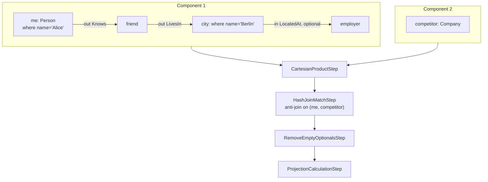

# Chapter 15 — Nine Queries, From Trivial to Hairy

You have spent the previous fourteen chapters inside individual mechanisms. You learned how the
parser turns text into an AST, how `buildPatterns()` stitches that AST into a pattern graph, how
`estimateRootEntries()` assigns cardinalities, how the scheduler walks the graph and chooses edge
directions, how the step pipeline pulls rows through, and how hash joins and index pre-filters
replace the slow parts. Each chapter narrowed the aperture to one mechanism at a time.

This chapter does the opposite. It zooms out and watches all the mechanisms fire together, on
nine real queries in ascending complexity. Each query adds exactly one feature to its predecessor,
so the mapping from syntax to engine behaviour is unambiguous. Think of it as a final rehearsal:
every concept you have learned re-appears here in the order the engine actually deploys it. By the
end you will be able to trace any MATCH query through the planner and executor from memory.

---

## 15.1 A single alias: the engine's minimum viable query

```sql
MATCH {class: Person, as: p} RETURN p
```

The new feature is the MATCH statement itself — no edges, no filters beyond the class name, no
projection beyond the alias. This is the degenerate case every later query builds on.

**Planner phase.** Phase 1 (`buildPatterns`, Chapter 6) produces a `Pattern` with one
`PatternNode` keyed `p` and no `PatternEdge` objects. Phase 3 (`estimateRootEntries`, Chapter 9)
queries `Person.approximateCount()` and stores the result plus one — the `+1` bias prevents an
unfiltered class node from beating a filtered node of the same class when competing for root. The
scheduler (phase 5, Chapter 10) terminates immediately: with zero edges there is nothing to
schedule.

**Execution steps.** Two steps only:

```text
[ MatchFirstStep(p, SELECT FROM Person) ]
[ ReturnMatch*Step                      ]
```

`MatchFirstStep` wraps a `SELECT FROM Person` sub-plan (Chapter 11) and emits one partial row
per record — `{p: Person#0:0}`, `{p: Person#0:1}`, and so on. `ReturnMatch*Step` projects `p`
into the final result row. There is no `MatchStep`, no `CartesianProductStep`, no NOT processing.

The prefetch decision is worth noting even in this minimal case: if the `Person` class count is
below the threshold of 100 (`MatchExecutionPlanner.java:336`), the planner will emit a
`MatchPrefetchStep` ahead of `MatchFirstStep`, pre-materialising all matching records before
the pull-based loop starts. For a full class scan this threshold is almost never met in
production, so the degenerate single-node query typically runs without a prefetch step.

**EXPLAIN.** `EXPLAIN MATCH {class: Person, as: p} RETURN p` shows exactly these two steps. If
you see more, something else has been added to the query.

---

## 15.2 One hop: forward traversal wakes up

```sql
MATCH {class: Person, where: (name='Alice'), as: me}
        .out('Knows') {as: friend}
RETURN me, friend
```

The new feature is a single edge. This is the first query where root selection matters and
`MatchStep` appears.

**Planner phase.** Phase 3 (Chapter 9) assigns `me` an estimate near 1 because the equality
filter `name='Alice'` is highly selective — `SQLWhereClause.estimate()` finds (or approximates)
very few matching records. `friend` has no `class:` declaration and receives no estimate at all,
making it ineligible as a root. Phase 3 therefore picks `me` without a contest.

Because `me`'s estimate is below the prefetch threshold of 100 (`MatchExecutionPlanner.java:336`),
phase 4 adds `me` to `aliasesToPrefetch` and emits a `MatchPrefetchStep`. The prefetch
materialises the matching records into memory so `MatchFirstStep` does not need to re-execute the
sub-plan for each downstream pull.

**Execution steps.**

```text
[ MatchPrefetchStep(me)                                        ]
[ MatchFirstStep(me, SELECT FROM Person WHERE name='Alice')    ]
[ MatchStep(me → friend, forward, out('Knows'))                ]
[ ReturnMatch*Step                                             ]
```

`MatchStep` (Chapter 11) delegates actual edge walking to a *traverser strategy* (Chapter 12).
Here the strategy is standard forward traversal: for each row arriving from upstream, retrieve
the `out('Knows')` adjacency list and emit one extended row per neighbour. The alias-keyed row
grows from `{me: Alice}` to `{me: Alice, friend: Bob}`, one entry at a time.

**EXPLAIN.** Look for the `MatchPrefetchStep` at the top. Its presence confirms the planner
committed to `me` as root before scheduling.

---

## 15.3 Two hops: the scheduler chooses an order

```sql
MATCH {class: Person, where: (name='Alice'), as: me}
        .out('Knows') {as: friend}
        .out('Knows') {as: fof}
RETURN friend.name, fof.name
```

The new feature is a second hop. Both edges are forward — there is no ambiguity here — but this
is the first query where the scheduler must produce an *ordering* over multiple edges rather than
placing a single one.

**Planner phase.** Phase 5 (Chapter 10) runs its cost-guided DFS over the pattern graph. With
`me` as root (cost ≈ 1), it greedily picks the cheapest unscheduled neighbour of each already-
scheduled node. `me → friend` is the only option from `me`, so it is scheduled first. Then
`friend → fof` is the only remaining edge. Both are traversed forward because reversing would
require starting from `fof`, which has no class or filter and is therefore unknown territory.

**Execution steps.**

```text
[ MatchPrefetchStep(me)                                          ]
[ MatchFirstStep(me, SELECT FROM Person WHERE name='Alice')      ]
[ MatchStep(me → friend, forward, out('Knows'))                  ]
[ MatchStep(friend → fof, forward, out('Knows'))                 ]
[ ProjectionCalculationStep(friend.name, fof.name)               ]
```

The row grows alias by alias: `{me}` → `{me, friend}` → `{me, friend, fof}` → projection
strips `me` and returns `{friend.name, fof.name}`. The nested-loop structure is now visible:
for each `me` row, every `friend` is explored; for each `friend` row, every `fof` is explored.
The output size is proportional to the product of the two fan-outs.

**EXPLAIN.** Two `MatchStep` entries, both forward. If you were to add a class or filter on
`fof`, the scheduler might reverse the second edge to start there instead — a concrete preview
of the root-flip behaviour Chapter 9 described.

---

## 15.4 Back-reference: cycle detection enters the pattern graph

```sql
MATCH {class: Person, where: (name='n1'), as: n1}
        .both('Friend') {as: common}
        .both('Friend') {class: Person, where: (name='n4'), as: n4}
RETURN common.name
```

The new feature is a *back-reference*: the target of the second hop (`n4`) is pinned by its own
equality filter, making it a second highly selective alias. When the scheduler reaches `n4` via
`common`, it realises `n4` is already bound — the traversal becomes a consistency check rather
than a free expansion.

**Planner phase.** Phase 3 (Chapter 9) assigns both `n1` and `n4` estimates near 1 (both carry
equality filters). `common` has no class declaration and receives no estimate. The scheduler
(Chapter 10) picks `n1` as root. It schedules `n1 → common` forward, then considers
`common → n4`. Because `n4` is already estimated and therefore a known alias, the scheduler
marks this edge as a ***back-reference*** dependency: the traverser must walk `common`'s
`both('Friend')` neighbours but *enforce equality* against the pre-bound `n4` record rather than
expanding freely. The structural reason this works — shared aliases in two expressions merging
into a single `PatternNode` — was covered in Chapter 6.

**Execution steps.**

```text
[ MatchPrefetchStep(n1)                                           ]
[ MatchFirstStep(n1, SELECT FROM Person WHERE name='n1')          ]
[ MatchStep(n1 → common, forward, both('Friend'))                 ]
[ MatchStep(common → n4, back-reference consistency check)        ]
[ ProjectionCalculationStep(common.name)                          ]
```

The consistency-check traverser (Chapter 12) walks `common`'s `both('Friend')` edges and keeps
only rows where the neighbour's RID matches the already-bound `n4`. Any row where the neighbour
is a different person is dropped. The result is the set of common friends of `n1` and `n4`.

**EXPLAIN.** The second `MatchStep` will name the traverser as a back-reference or consistency
strategy, not a plain forward traversal. That marker is the signal that a shared alias was
detected.

---

## 15.5 Optional node: rows survive a dead end

```sql
MATCH {class: Person, as: person}
        .out('ManagedBy') {as: boss, optional: true}
RETURN person.name, boss.name
```

The new feature is `optional: true` on a target node. The engine must emit one row per `person`
even when no `ManagedBy` edge exists, with `boss` set to `null`.

**Planner phase.** Phase 5 (Chapter 10) schedules this query identically to the one-hop case:
`person` as root, the single edge forward. The scheduler does not change behaviour for optional
nodes — the distinction surfaces at execution.

**Execution steps.**

```text
[ MatchFirstStep(person, SELECT FROM Person)                       ]
[ OptionalMatchStep(person → boss, out('ManagedBy'))               ]
[ RemoveEmptyOptionalsStep                                         ]
[ ProjectionCalculationStep(person.name, boss.name)                ]
```

`OptionalMatchStep` (Chapter 11) attempts the traversal. When no `ManagedBy` neighbours exist,
it emits the row anyway, setting alias `boss` to the `EMPTY_OPTIONAL` sentinel described in
Chapter 11. `RemoveEmptyOptionalsStep` (`MatchExecutionPlanner.java:564`) performs the final
sweep: it replaces every sentinel with actual `null`. The projection then sees `boss = null`
and emits `boss.name = null`.

The two-step sentinel design — detailed in Chapter 11 — matters here because a Cartesian
product or a hash join inserted between the two steps (as happens in section 15.9) can safely
multiply rows that carry an unresolved optional without converting the sentinel to `null` too
early.

**EXPLAIN.** An `OptionalMatchStep` always appears together with a downstream
`RemoveEmptyOptionalsStep`. If you see only one of the two, something is wrong with the plan.
If you see the `RemoveEmptyOptionalsStep` appearing *before* a `CartesianProductStep` or a
`HashJoinMatchStep`, the sentinel was discarded before the join could propagate it correctly —
a plan ordering bug.

---

## 15.6 Bounded recursion: the `while` condition and non-invertibility

```sql
MATCH {class: Person, where: (name='n1'), as: start}
        .out('Friend') {as: reached, while: ($depth < 3)}
RETURN reached
```

The new feature is a `while` condition on a target node. This turns the single `MatchStep` into
a depth-bounded recursive traversal, and it imposes a hard constraint on the scheduler: WHILE
edges are never invertible.

**Planner phase.** Phase 1 (`buildPatterns`) calls `collectAliasesFromWhilePatterns`
(`MatchExecutionPlanner.java:4854`) internally to mark `reached` as a WHILE alias. After Phase 3
(`estimateRootEntries`) completes the cardinality map, the planner inflates the estimate for every
WHILE alias to `Long.MAX_VALUE` (lines 511–515), which prevents it from winning the root
competition. The scheduler (Chapter 10) will therefore never attempt to reverse the WHILE edge
regardless of what the cost comparison says. The invertibility check (Chapter 10) explicitly
excludes WHILE edges because bounded recursion has no well-defined reverse traversal. With `start`
carrying an estimate near 1, it wins the root competition unopposed.

**Execution steps.**

```text
[ MatchPrefetchStep(start)                                          ]
[ MatchFirstStep(start, SELECT FROM Person WHERE name='n1')         ]
[ MatchStep(start → reached, WHILE $depth < 3, out('Friend'))       ]
[ ReturnMatch*Step                                                   ]
```

At runtime the `MatchStep` spawns a depth-first recursion anchored at `start` (Chapter 12). At
depth 0 it emits `{reached: start}` — the root is always included. It then traverses
`out('Friend')` edges, emitting each new node at depth 1, then recurses until `$depth < 3` fails
at depth 3. A `visited` bitmap maintained per-traversal deduplicates RIDs so that a diamond in
the graph emits each reachable node once. If a `depthAlias` is declared, each row carries the
depth value alongside the node RID; if a `pathAlias` is declared, deduplication is disabled
because each distinct path is a separate result.

**EXPLAIN.** The `MatchStep` will mention the WHILE predicate and the traversal strategy. A
WHILE step always appears in forward direction — if you ever see it reversed in an EXPLAIN, that
is a planner bug.

---

## 15.7 The `$matched` dependency: scheduling is not purely cost-driven

```sql
MATCH {class: Person, as: me, where: (name='n1')}
        .both('Friend') {}
        .both('Friend') {as: fof,
                         where: ($matched.me != $currentMatch)}
RETURN fof.name
```

The new feature is a WHERE clause on `fof` that references `$matched.me` — a context variable
that only exists once `me` has been bound. This is the first query where the scheduler is
*constrained by data flow*, not just by cardinality.

**Planner phase.** The `$matched.me` reference makes `fof` a *dependent* alias, and the planner
reacts to it in two separate places. When the scheduler builds its dependency map,
`getDependencies()` (`MatchExecutionPlanner.java:4382`) extracts the aliases each filter reaches
through `$matched`; for `fof` it records a dependency on `me`. The scheduler then only ever begins
a traversal pass from a node whose dependencies are already satisfied
(`MatchExecutionPlanner.java:2013`), so `fof` can never be the starting root — an alias whose
filter cannot be evaluated until another alias is bound has nowhere to start from. The same
reference also keeps `fof` out of the prefetch set: `dependsOnExecutionContext()`
(`MatchExecutionPlanner.java:651`), the helper that flags any filter touching `$matched.` or
`$parent`, is applied as a guard over the prefetch candidates (`MatchExecutionPlanner.java:521`),
and there is no point materialising `fof` before `me` is bound.

With `fof` ineligible, the cost competition runs only over `me` (estimate ≈ 1) and the anonymous
intermediate node (no estimate). `me` wins, the scheduler places the two edges in the only valid
topological order — `me → anon` first, `anon → fof` second — and the filter on `fof` fires at
runtime when `$matched.me` is already in scope.

**Execution steps.**

```text
[ MatchPrefetchStep(me)                                               ]
[ MatchFirstStep(me, SELECT FROM Person WHERE name='n1')              ]
[ MatchStep(me → anon, forward, both('Friend'))                       ]
[ MatchStep(anon → fof, forward, both('Friend'), filter $matched.me)  ]
[ ProjectionCalculationStep(fof.name)                                 ]
```

The `$matched` context variable is written by each `MatchStep` into the `CommandContext` before
the filter on the next step runs (Chapter 12). The variable `$currentMatch` holds the candidate
record being tested in the current traversal step. The filter `$matched.me != $currentMatch`
then compares the already-bound `me` record against the candidate `fof` record and drops the row
if they are the same person — that is, it filters out `n1` itself from the friends-of-friends
result. The filter evaluation happens inside `MatchStep` at traversal time, not as a separate
step in the pipeline, so there is no extra row allocation for the dropped rows.

Note the implication for query authoring: any alias whose filter text contains a `$matched.x`
reference to another alias is automatically excluded from the root competition, regardless of how
selective it might appear. If you write a query where the most selective alias also carries a `$matched`
reference, the planner cannot use it as root. In that case, add an explicit `class:` declaration
on the alias it references to ensure that alias is scheduled — and therefore bound — before the
dependent one.

**EXPLAIN.** The `MatchStep` for `fof` will show the filter expression. The absence of `fof`
from the prefetch list at the top of the plan confirms the dependency was detected correctly.

---

## 15.8 NOT with a hash anti-join: a second sub-plan runs in parallel

```sql
MATCH {class: Person, as: p}
NOT   {as: p}.out('Blocked'){class: Person, where: (name='admin')}
RETURN p
```

The new feature is a `NOT` clause. The engine must eliminate every `Person` that has a `Blocked`
edge leading to the admin record. This is the first query where a second independent sub-plan
runs alongside the main one — and their results are reconciled by a hash anti-join.

**Planner phase.** `manageNotPatterns()` (`MatchExecutionPlanner.java:681`) processes the
negative expression and runs `canUseHashJoin()`. The three guards (covered in full in
Chapter 13) all pass here: the NOT pattern has no `$matched` reference, the admin set is
tiny (cardinality ≈ 1), and the upstream `Person` scan is large. The planner wires a
`HashJoinMatchStep` in `ANTI_JOIN` mode.

**Execution steps.**

```text
[ MatchFirstStep(p, SELECT FROM Person)                               ]
[ HashJoinMatchStep(anti-join on p,                                   ]
    build: MatchStep(p → admin, out('Blocked'), name='admin'))        ]
[ ReturnMatch*Step                                                     ]
```

The build phase executes the NOT sub-plan once, collecting into a hash set every `p` RID that
has a `Blocked` path to admin (Chapter 13). The probe phase then streams the positive-pattern
rows and emits only those whose `p` RID is absent from the set. The cost profile is
`O(build) + O(probe)` rather than the `O(build × probe)` of a nested-loop approach.

**EXPLAIN.** A `HashJoinMatchStep` with mode `ANTI_JOIN` confirms the optimised path was taken.
If you see `FilterNotMatchPatternStep` instead, one of the three guards fired — check the
cardinality estimates and the presence of `$matched` references in the NOT clause.

---

## 15.9 Everything at once: a realistic LDBC-style query

```sql
MATCH {class: Person, as: me, where: (name='Alice')}
        .out('Knows')    {as: friend}
        .out('LivesIn')  {as: city, where: (name='Berlin')}
        .in('LocatedAt') {as: employer, optional: true},
      {class: Company,   as: competitor}
NOT   {as: me}.out('BlockedBy'){as: competitor}
RETURN me.name, friend.name, city.name, employer.name, competitor.name
```

The new feature is the composition of everything: a three-hop chain with an optional tail, a
disjoint second component, a back-reference between the two components through the shared alias
`competitor`, and a hash anti-join driven by a NOT clause. Every mechanism from sections 15.1
through 15.8 fires in a single plan.

**Pattern graph.**



**Figure 15.1 — Full pipeline for the composite query.**

**Cardinality map.** Phase 3 (Chapter 9) produces: `me` ≈ 1 (equality filter); `city` ≈ small
(equality filter); `competitor` = `Company.count + 1` (unfiltered class); `friend` and `employer`
absent (no class declaration).

**Split.** `splitDisjointPatterns()` (`MatchExecutionPlanner.java:4407`) detects two components:
`{me, friend, city, employer}` and `{competitor}`. It wraps both sub-plans in a
`CartesianProductStep` (Chapter 10). Neither component has an edge to the other in the positive
pattern, so the product is unavoidable. The NOT clause is the only relationship between them.

**NOT processing.** The NOT expression uses origin alias `me` (in component 1) and target alias
`competitor` (in component 2). Because both aliases are shared with the positive pattern,
`findSharedAliases()` returns `{me, competitor}` as the join key. The hash anti-join is built on
the pair `(me, competitor)`: it materialises the set of `(me, competitor)` pairs where a
`BlockedBy` edge exists, then drops any Cartesian-product row whose `(me, competitor)` pair
appears in the set.

**Full execution plan.**

```text
[ MatchPrefetchStep(me)                                                  ]
[ CartesianProductStep                                                   ]
    sub-plan 1:
      [ MatchFirstStep(me, SELECT FROM Person WHERE name='Alice')        ]
      [ MatchStep(me → friend, forward, out('Knows'))                    ]
      [ MatchStep(friend → city, forward, out('LivesIn'), name='Berlin') ]
      [ OptionalMatchStep(city → employer, in('LocatedAt'))              ]
    sub-plan 2:
      [ MatchFirstStep(competitor, SELECT FROM Company)                  ]
[ HashJoinMatchStep(anti-join on (me, competitor),                       ]
    build: MatchStep(me → competitor, out('BlockedBy')))                 ]
[ RemoveEmptyOptionalsStep                                               ]
[ ProjectionCalculationStep(me.name, friend.name, city.name,             ]
                             employer.name, competitor.name)             ]
```

Each step in the plan is owned by exactly one mechanism. `MatchPrefetchStep` materialises `me`
(section 15.2). The two forward `MatchStep` entries grow the row alias by alias (section 15.3).
`OptionalMatchStep` and `RemoveEmptyOptionalsStep` handle the optional `employer` (section 15.5).
`CartesianProductStep` joins the two disconnected components (section 15.4 covered the simpler
two-alias case; this is the same mechanism with a longer component 1). The hash anti-join
eliminates blocked pairs using the same three-guard decision the planner applied in section 15.8.

**Row evolution** (one row through the happy path):

```text
After MatchFirstStep(me):              {me: Alice}
After MatchStep(→friend):             {me: Alice, friend: Bob}
After MatchStep(→city):               {me: Alice, friend: Bob, city: Berlin#7}
After OptionalMatchStep(→employer):   {me: Alice, friend: Bob, city: Berlin#7, employer: Corp#3}
After CartesianProduct with
  {competitor: Company#1}:            {me: Alice, friend: Bob, city: Berlin#7,
                                       employer: Corp#3, competitor: Company#1}
After HashJoinMatchStep(anti):        (Alice, Company#1) not in blocked set → emit
After RemoveEmptyOptionalsStep:       (no sentinels on this row)
After ProjectionStep:                 {"me.name": "Alice", "friend.name": "Bob",
                                       "city.name": "Berlin", "employer.name": "Corp3",
                                       "competitor.name": "Company1"}
```

If `employer` had no `LocatedAt` edge, `OptionalMatchStep` would have set `employer` to
`EMPTY_OPTIONAL` instead of `Corp#3`, and `RemoveEmptyOptionalsStep` would have replaced it with
`null` before the projection.

**EXPLAIN.** A plan this complex rewards careful reading. Start at the top: confirm `me` is
prefetched and is the root of component 1. Identify the `CartesianProductStep` and note which
aliases belong to which sub-plan. Locate the `HashJoinMatchStep` and verify its join key matches
the shared aliases in the NOT clause. Confirm `RemoveEmptyOptionalsStep` appears after the join
and before the projection — the optional sentinel must outlive the anti-join probe so that rows
produced by the Cartesian product still carry the sentinel correctly.

---

## Closing reflection

You have now watched every layer of the engine deploy in sequence. A single-node scan becomes
a prefetched `MatchFirstStep`. Each edge grows the pipeline by one `MatchStep`. A highly
selective equality filter anchors the root; a `$matched` reference overrides that anchoring by
data-flow necessity. Optional nodes introduce a sentinel that lives until one dedicated cleanup
step converts it to `null`. Disjoint components fork into independent sub-plans and reunite at a
`CartesianProductStep`. Bounded recursion runs as a stateful depth-first walk inside a single
`MatchStep` that is never reversed. NOT patterns materialise a hash set once and probe it in
linear time. And all of these mechanisms compose cleanly because each step in the pipeline owns
exactly one semantic responsibility.

Chapter 16 takes this knowledge into the debugging context: how to read a real `EXPLAIN` output,
how to recognise when the planner has made the wrong choice, and what you can change in the
query — or in the engine — to correct it. Chapter 17 is the reference appendix: every class,
every configuration knob, the full glossary.

---

*Further reading*

- `core/src/main/java/com/jetbrains/youtrackdb/internal/core/sql/executor/match/MatchExecutionPlanner.java` — all eight planning phases; root selection at line 5192; prefetch threshold at line 336; hash-join guards at lines 345 and 355; `manageNotPatterns` at line 681; `splitDisjointPatterns` at line 4407
- `core/src/main/java/com/jetbrains/youtrackdb/internal/core/sql/executor/match/MatchFirstStep.java` — initial record scan
- `core/src/main/java/com/jetbrains/youtrackdb/internal/core/sql/executor/match/MatchStep.java` — edge traversal step and traverser delegation
- `core/src/main/java/com/jetbrains/youtrackdb/internal/core/sql/executor/match/OptionalMatchStep.java` — optional edge handling and `EMPTY_OPTIONAL` sentinel
- `core/src/main/java/com/jetbrains/youtrackdb/internal/core/sql/executor/match/HashJoinMatchStep.java` — hash anti-join, semi-join, and inner-join modes
- `core/src/main/java/com/jetbrains/youtrackdb/internal/core/sql/executor/match/FilterNotMatchPatternStep.java` — nested-loop NOT fallback
- `core/src/main/java/com/jetbrains/youtrackdb/internal/core/sql/executor/CartesianProductStep.java` — Cartesian join for disjoint components
- `core/src/test/java/com/jetbrains/youtrackdb/internal/core/sql/executor/MatchStatementExecutionTest.java` — richest source of working example queries
- Chapter 6 — pattern graph construction and shared-alias unification
- Chapter 9 — cardinality estimation and root selection
- Chapter 10 — scheduling, invertibility, and disjoint-component handling
- Chapter 11 — execution step catalogue and alias-keyed row mechanics
- Chapter 12 — traverser strategies including back-reference enforcement and WHILE recursion
- Chapter 13 — hash-join variants and the three-guard planning decision
- Chapter 14 — index pre-filter optimisation for selective target nodes
