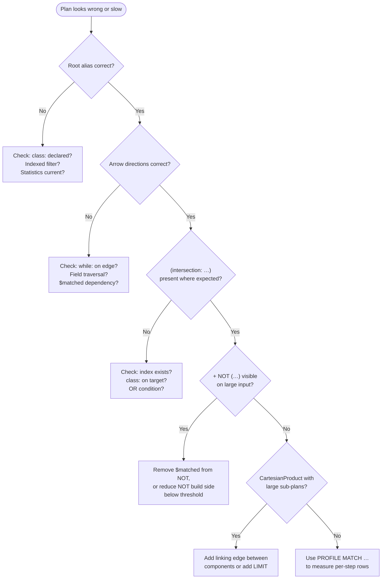

# Chapter 16 — Reading EXPLAIN: Diagnosing Plans in Practice

By the end of Part V you knew how the planner assembles a step pipeline
from a MATCH query: how it picks the root alias with the lowest cardinality
estimate, how it schedules edges cheapest-first through a depth-first search,
and how it replaces nested loops with hash joins when the build side is small
enough. Part VI showed you the two optimisation layers that sit on top of the
basic pipeline — hash joins and index-assisted traversal. What you still lack
is a way to go from "this query is slow" to "this is the plan the planner
chose, and here is why it is wrong." That is what this chapter gives you.

`EXPLAIN` is the lens. Run `EXPLAIN MATCH {…} RETURN …` and the database
returns a single result row with two properties: `executionPlanAsString`, a
multi-line text tree you can read as prose, and `executionPlan`, a structured
map that a program can traverse. Both are produced from the same
`prettyPrint` calls on the step objects the planner assembled
(`ExplainResultSet.java:57`). The text form is the one you will use while
debugging; the structured form is useful if you want to script plan
comparisons. This chapter focuses on the text form.

---

## 16.1 A first look at EXPLAIN output

Start with something small. This query finds Alice's friends and their home
cities:

```sql
EXPLAIN
MATCH {class: Person, where: (name = 'Alice'), as: me}
        .out('Knows')   {as: friend}
        .out('LivesIn') {as: city}
RETURN me.name, friend.name, city.name
```

The output below is illustrative — the exact text depends on database state
at plan time and may differ from what a live run produces. The structure and
token names are accurate; treat field contents and indentation as approximate:

```
+ PREFETCH me
   + SELECT FROM Person WHERE name = 'Alice'
+ SET
   me
  AS
   + SELECT FROM Person WHERE name = 'Alice'
+ MATCH      ---->
  {me}out('Knows'){friend}
+ MATCH      ---->
  {friend}out('LivesIn'){city}
+ ProjectionCalculationStep
```

Walk through it top to bottom. Each `+` introduces one execution step; the
tree is the runtime order. The first two lines say that the planner decided
`me` is small enough to prefetch — it runs `SELECT FROM Person WHERE name = 'Alice'`
before the main loop begins and caches the results under the alias name
(`MatchPrefetchStep.prettyPrint`, verified at `MatchPrefetchStep.java:111`).
The `+ SET me AS …` block is `MatchFirstStep`: it wraps each prefetched (or
freshly scanned) record into an alias-keyed row
(`MatchFirstStep.prettyPrint`, verified at `MatchFirstStep.java:125`). Below
it, two `+ MATCH` lines with `---->` arrows are `MatchStep` instances
traversing outward edges. The direction arrow tells you which way the
traverser walked: `---->` means forward (out), `<----` means reverse (in)
(`MatchStep.prettyPrint`, verified at `MatchStep.java:125`). The final line
is the projection that produces the RETURN columns.

That is the entire normal-path read. Everything the planner chose is there.
If you understand all five lines, you can evaluate whether the choice was
good.

> **EXPLAIN vs PROFILE.** `EXPLAIN` shows the shape of the plan without
> running it. To see runtime counts — rows produced by each step, actual time
> per step — use `PROFILE MATCH …` instead. `PROFILE` is covered briefly at
> the end of this chapter (§16.8). The recommended workflow: use `EXPLAIN`
> first to understand which plan the planner chose; switch to `PROFILE` when
> the plan looks correct but runtime behaviour surprises you.

---

## 16.2 The step catalogue in EXPLAIN text

Before getting to pathologies, here is what each token in EXPLAIN text
represents. Each label is produced by the `prettyPrint` method of the
corresponding class; all are verified against the source.

**`+ PREFETCH <alias>`** — `MatchPrefetchStep`. The planner decided this
alias has cardinality below the prefetch threshold (100 records by default,
`MatchExecutionPlanner.java:328`) and materialised it before the main loop.
Prefetching is a small optimisation: it avoids re-running the inner scan on
every outer row. It does not change the plan order.

**`+ SET <alias> AS …`** — `MatchFirstStep`. This is the root of the
pipeline: the step that turns raw records into alias-keyed rows. The alias
name tells you which alias the planner chose as the root. The sub-plan
indented under `AS` is the `SELECT` sub-plan that produces records for this
alias — typically a class scan with a `WHERE` clause. Reading this sub-plan
tells you what index (if any) the planner is using to enumerate the root set.

**`+ MATCH ----> {A}method{B}`** or **`+ MATCH <---- {A}method{B}`** —
`MatchStep`. One edge traversal. The alias on the left side of the arrow
(`A` for forward, `B` for reverse) is the alias that was already bound when
this step fires; the alias on the right is the one being resolved. The method
string (`out('Knows')`, `in('Knows')`, `both('Friend')`, `field.fieldName`)
is the traversal method the query specified, as written in the SQL. If you
see `<----` on an edge written as `.out()`, the planner inverted it — it is
walking the edge in the reverse direction from what the query says, because
the far endpoint was cheaper to start from. Chapter 10 covers the conditions
under which reversal is permitted.

If an index pre-filter was attached to this edge (Chapter 14), the line
carries a parenthesised suffix such as
`(intersection: index Post.timestamp selectivity=0.0025 estHits=5000)` or
`(intersection: out('Wrote'))` for a reverse-edge lookup. This annotation is
produced by `MatchStep.appendIntersectionDescriptor` (verified at
`MatchStep.java:168`). When you see it, the planner *attached* a descriptor —
but whether the traverser actually applies it is a per-vertex runtime decision
(§16.5.3). When it does apply, the traverser skips adjacency-list entries that
are absent from the resolved RID set before loading any record.

**`+ OPTIONAL MATCH ---->`** or `+ OPTIONAL MATCH <----` —
`OptionalMatchStep`. Structurally identical to `MatchStep` but semantically
a left join: when the traversal finds no neighbours, the row is kept with
the target alias set to the internal `EMPTY_OPTIONAL` sentinel rather than
dropped. The `+ REMOVE EMPTY OPTIONALS` step that follows later in the
plan converts sentinels to `null`.

**`+ REMOVE EMPTY OPTIONALS`** — `RemoveEmptyOptionalsStep`. Always appears
after one or more `OptionalMatchStep` instances. It makes the `EMPTY_OPTIONAL`
sentinels visible to the projection as `null` values. If you see optionals
in your query and this step is absent, something is wrong.

**`+ HASH ANTI_JOIN on [<alias>] (…)`** — `HashJoinMatchStep` in
`ANTI_JOIN` mode. This is what a `NOT` sub-pattern looks like when the planner
chose the hash path. The alias list in brackets is the set of shared aliases
that form the join key. The indented block inside the parentheses is the
build-side sub-plan: the steps that enumerate the rows to be excluded. Read
it exactly as you would any sub-plan — it is a complete pipeline ending with
a step that produces rows; those rows are loaded into a `HashSet` before the
upstream stream is probed. The `prettyPrint` output is verified at
`HashJoinMatchStep.java:416`.

**`+ HASH SEMI_JOIN on [<alias>] (…)`** — `HashJoinMatchStep` in
`SEMI_JOIN` mode. Used for back-reference branches whose intermediate aliases
are not referenced downstream. You will see this when the planner found a
branch that can be tested for existence without storing full rows.

**`+ HASH INNER_JOIN on [<alias>] (…)`** — `HashJoinMatchStep` in
`INNER_JOIN` mode. Used for back-reference branches whose intermediate
aliases are referenced downstream. Unlike SEMI_JOIN, the build side stores
full rows to be merged into the upstream.

**`+ NOT (…)`** — `FilterNotMatchPatternStep`. The nested-loop fallback for
`NOT` patterns that the planner could not hash-join: either the build-side
estimate was above the `QUERY_MATCH_HASH_JOIN_THRESHOLD` (10 000 by default),
the pattern referenced `$matched`, or the upstream cardinality was below the
minimum. The sub-steps inside the parentheses are re-executed once per
upstream row. Seeing this step on a large query is a performance warning.

**`+ CORRELATED OPTIONAL HASH JOIN probe → target (correlated: X, edge: E)`** —
`CorrelatedOptionalHashJoinStep`. The specialised step for a correlated
optional edge whose WHERE clause contains a `$matched` back-reference
equality test. It maintains an LRU cache of neighbour sets keyed by the
correlated vertex's RID, avoiding a full re-scan per row. Verified at
`CorrelatedOptionalHashJoinStep.java:216`.

**`+ INVERTED WHILE HASH JOIN on probe → target (anchor: C, edge: E)`** —
`InvertedWhileHashJoinStep`. Appears when the planner reversed a `WHILE`
recursive edge: it materialises the full reachability closure from the anchor
class once, then probes upstream rows against the resulting multimap. Verified
at `InvertedWhileHashJoinStep.java:343`.

**`+ BACK-REF HASH JOIN`** — `BackRefHashJoinStep`. The intersection path
for a back-reference equality filter resolved via an edge reverse-lookup.
The alias and edge class are shown inline. Verified at `BackRefHashJoinStep.java:675`.

**`+ CartesianProduct (…)`** — `CartesianProductStep`. Appears when the
query has two or more disjoint components with no shared alias. The step
renders its sub-plans side by side with ASCII connectors and a funnel shape at
the bottom. Reading the sub-plans separately and then considering the product
size is the key diagnostic move for disjoint-component queries.

**`+ RETURN $paths` / `+ RETURN $patterns` / `+ UNROLL $elements` /
`+ UNROLL $pathElements`** — the four return-projection step variants.
Which one appears depends on the RETURN clause form: `RETURN $paths`,
`RETURN $patterns`, `RETURN $elements`, or `RETURN $pathElements`. For named
alias projections (the most common case) the step is a
`ProjectionCalculationStep`, which renders its projection expressions inline.

---

## 16.3 Reading cost numbers

EXPLAIN does not print per-step cost estimates in the text output (`PROFILE` does; see §16.8). The cost
numbers that drove the plan live in the planner's `estimatedRootEntries` map
and the `estimateEdgeCost` calculation; they are consumed at plan time and
then discarded. What EXPLAIN shows you is the *result* of those calculations,
not the calculations themselves.

To understand why the planner made a particular choice you have to reason
backward from the plan structure. The root alias — the one in the `+ SET`
block — is the alias the planner estimated to have the fewest records.
"Fewest" is relative to all the other aliases that were eligible as root
candidates. Chapter 8 (this book's Chapter 8, *Counting Without Counting*)
gives the full algorithm; the relevant summary for diagnostics is this:

- An alias with an equality `WHERE` filter on an indexed property will
  typically have an estimated cardinality near 1. It almost always wins the
  root election.
- An alias with only a class constraint (no filter) gets an estimate of
  `classCount + 1`. It wins when the class is small; it loses when there is
  any filtered alias of the same or larger class.
- An alias with no `class:` declaration at all is absent from the cardinality
  map and is never a root candidate.
- An alias that references `$matched` in its WHERE clause is excluded from
  root candidacy regardless of its estimated cardinality.

These rules let you predict what root the planner should have chosen given
your schema statistics. When the plan disagrees with your prediction, one of
three things happened: statistics are stale or missing, the class constraint
was inferred (not explicit), or the filter was not recognised as selective.

The *edge ordering* after the root is similarly implicit in the plan text.
The scheduler traverses edges cheapest-first from the root outward. A step
that appears early in the plan was estimated to be cheap (small fan-out,
selective target). A step that appears late was estimated to be expensive or
was forced late by a `$matched` dependency.

Remember what Chapter 8 said: the cost model is a *ranking signal*, not a
measurement. An estimate of 1 does not mean there is exactly one matching
record; it means the planner found evidence strong enough to prefer this alias
or edge over all the alternatives. A wrong estimate produces a suboptimal
plan but never an incorrect result — the wrong plan is slower, not broken.

---

## 16.4 Annotated example: two-component query with hash anti-join

Here is a more complex example to annotate. The query finds Alice's colleagues
who are not blocked by Alice, paired with every active project:

```sql
EXPLAIN
MATCH {class: Person, where: (name = 'Alice'), as: me}
        .out('WorksWith') {as: colleague},
      {class: Project, where: (active = true), as: proj}
NOT   {as: me}.out('Blocks'){as: colleague}
RETURN me.name, colleague.name, proj.name
```

The output below is illustrative — token names and plan structure are accurate,
but field contents and ASCII box widths depend on database state and the exact
version of `prettyPrint` in use. Do not treat it as verbatim output from a live run:

```
+ PREFETCH me
   + SELECT FROM Person WHERE name = 'Alice'
+ CartesianProduct
  +-------------------------          +-------------------------
  |+ SET                              |+ SET
  |   me                             |   proj
  |  AS                              |  AS
  |   + SELECT FROM Person           |   + SELECT FROM Project
  |       WHERE name = 'Alice'       |       WHERE active = true
  |+ MATCH      ---->                +-------------------------
  |  {me}out('WorksWith'){colleague}
  +-------------------------
   V  V
+ HASH ANTI_JOIN on [me, colleague] (
   + SET
      me
     AS
      + SELECT FROM Person WHERE name = 'Alice'
   + MATCH      ---->
     {me}out('Blocks'){colleague}
  )
+ ProjectionCalculationStep
```

Reading this plan line by line:

1. **PREFETCH me** — `me` is a single record (`name='Alice'`), so it is
   materialised before the main loop.
2. **CartesianProduct** — two disjoint components. Component 1 starts from
   `me` and traverses `out('WorksWith')`. Component 2 scans `Project` with
   `active=true`. After the product, every `(colleague, proj)` combination
   is in the row.
3. **HASH ANTI_JOIN on [me, colleague]** — the `NOT` clause. The build side
   scans all pairs where Alice blocks the colleague. Those pairs are loaded
   into a `HashSet<JoinKey>`. For each `(me, colleague)` row from the
   upstream stream, the step probes the hash set and drops any row whose key
   is found. Because the join key is composite (`me` and `colleague`), the
   `JoinKey` uses the `RID_ARRAY` representation.
4. **ProjectionCalculationStep** — the three named projections.

The shape of this plan is correct: Alice is the cheapest root, the Cartesian
product is necessary because `proj` is genuinely independent, and the hash
anti-join is appropriate because the `NOT` sub-pattern has no `$matched`
reference and is expected to produce far fewer rows than the main stream.

---

## 16.5 Gallery of pathologies

Knowing what a correct plan looks like makes the wrong plans easy to spot.
Each pathology below is a named pattern you can match against an EXPLAIN
output.

### 16.5.1 The wrong root

**Symptom.** The `+ SET` block names an alias you did not expect — typically
a large class rather than the one with a tight equality filter. Or EXPLAIN
shows a root that your mental arithmetic says should lose the cost election.

**What the plan text shows.** A `+ SET <largeAlias> AS + SELECT FROM LargeClass`
at the top, with no `WHERE` clause or a non-selective one. The selective alias
appears later as a `MatchStep` target.

**Likely causes.**

- The selective WHERE clause is on a property with no index and no histogram.
  Without statistics, `estimateFilterSelectivity` falls back to
  `QUERY_STATS_DEFAULT_SELECTIVITY = 0.1` — 10 % of the class count. If
  the large class has 50 000 records, 10 % is 5 000, which may still be larger
  than the unfiltered small class. The fallback value is configurable
  (`youtrackdb.query.stats.defaultSelectivity`) but 0.1 is often wrong for
  equality predicates on selective keys.
- Statistics are stale. `approximateCount` returns the count at the last schema
  update, not the live count. A class that has grown significantly since its
  statistics were last refreshed will appear artificially cheap.
- The `class:` constraint is missing from the selective alias. Without a class
  declaration the alias is absent from the cardinality map and cannot be a
  root candidate — the planner is not ignoring your filter, it simply never
  saw the alias as a possibility.

**Fix.** Add or update an index on the filtered property. Ensure the alias
has an explicit `class:` declaration. If the statistics are stale, trigger a
schema refresh or rely on the next automatic statistics update.

### 16.5.2 Missing reversal

**Symptom.** EXPLAIN shows a `+ MATCH ----> {far}out('Edge'){near}` where
you expected `+ MATCH <---- {near}in('Edge'){far}`. The traversal is walking
from the expensive far endpoint to the cheap near endpoint, rather than the
reverse.

**What the plan text shows.** The root is `far` (or something in its
component), and the arrow points forward from `far` to `near` — meaning
`near` is the target being resolved, even though `near` was the selective
alias you wanted to start from.

**Likely causes.**

- The far alias has a `while:` clause. WHILE edges are never invertible
  (Chapter 10 §10.2.2); the planner cannot reverse them because
  reversal changes the depth semantics.
- The far alias uses a field traversal (`.fieldName` syntax) rather than an
  edge class. Field traversals are also non-invertible.
- The near alias has a `$matched` reference in its WHERE clause. An alias
  that depends on another alias cannot be scheduled before that alias, even
  if it is smaller.
- The schema does not declare the edge class's linked vertex classes. Without
  them, class inference for the far alias fails and the planner cannot compute
  a target-selectivity discount for the near side, leaving the near side at
  cost 1.0 (no discount) — which may not beat the far side's raw estimate.

**Fix.** If the reversal is blocked by `while:` semantics, consider whether
`InvertedWhileHashJoinStep` is being used instead (look for `+ INVERTED WHILE
HASH JOIN`). If it is not, and the query is slow, raising
`QUERY_MATCH_HASH_JOIN_THRESHOLD` may allow the planner to materialise the
anchor reachability set. If the problem is missing schema information, declare
the linked vertex class on the edge schema.

### 16.5.3 Missing pre-filter

**Symptom.** EXPLAIN shows a `+ MATCH ----> {src}out('Edge'){target}` with
no `(intersection: …)` suffix, on an edge where you expected an index
pre-filter to be active.

**What the plan text shows.** A plain MATCH step — no intersection
annotation. Because the annotation is emitted whenever a descriptor was
attached at plan time, its absence means the planner attached nothing: at
runtime every neighbour in the adjacency list is loaded and post-filtered by
the WHERE clause.

**Likely causes.**

- The index does not exist. `TraversalPreFilterHelper.findIndexForFilter`
  looks for an index on the target class that covers the leading condition in
  the WHERE clause. If no such index is present, no descriptor is attached and
  the plain traversal is the only option.
- The class of the target alias is unknown at plan time. Without a target
  class, `optimizeScheduleWithIntersections` (`MatchExecutionPlanner.java:3254`)
  cannot resolve the index because it does not know which class to search. Add
  an explicit `class:` declaration to the target alias or ensure class
  inference can work (the edge class must declare its linked vertex types).
- The WHERE clause uses an OR condition. `findIndexForFilter` rejects
  multi-branch OR (see Chapter 14, *Limitations* — "OR-combined index
  conditions"). A predicate like
  `status = 'active' OR priority > 3` is not pre-filterable in the current
  implementation.

**Fix.** Create a `NOTUNIQUE` index on the target property. Add `class:` to
the target alias. For OR conditions, consider rewriting as a `UNION` of two
simpler queries each with an equality or range predicate.

**A subtler variant: attached but not admitted.** The plan-time sweep no
longer rejects a descriptor on an estimated hit count — that gate was removed,
and admission is now a *runtime* decision made per source vertex (Chapter 14).
So EXPLAIN can show an `(intersection: …)` suffix — the descriptor *was*
attached — and yet the filter never fires, because one of the two runtime
admission paths rejected it: the source link bag fell below
`QUERY_PREFILTER_MIN_LINKBAG_SIZE`, the `EdgeRidLookup` overlap ratio was too
high, or the `IndexLookup` selectivity was above threshold or its build never
amortised. None of that is visible in plain EXPLAIN text. It surfaces only in
`PROFILE`, which prints the per-edge `PreFilterSkipReason` —
`LINKBAG_TOO_SMALL`, `OVERLAP_RATIO_TOO_HIGH`, `SELECTIVITY_TOO_LOW`,
`BUILD_NOT_AMORTIZED`, `CAP_EXCEEDED`, and the rest. When a filter you expected
is annotated but the query is still slow, switch from `EXPLAIN` to `PROFILE`.

### 16.5.4 Hash join explosion

**Symptom.** EXPLAIN shows a `+ HASH INNER_JOIN` or `+ HASH SEMI_JOIN` with
a build-side sub-plan that you estimate — or measure — to produce very many
rows. The query is slow despite being in the hash path.

**What the plan text shows.** A `HASH … on [aliases] ( … )` block whose
inner sub-plan contains multiple `+ MATCH` steps and no selective filter.

**Likely causes.**

The hash-join threshold (`QUERY_MATCH_HASH_JOIN_THRESHOLD`, default 10 000)
is a planning-time estimation guard, not a runtime limit. If the statistics
overestimated selectivity, the planner may have decided the build side was
small enough when in reality it produces far more rows. At runtime,
`HashJoinMatchStep.internalStart` materialises the build side eagerly; if the
actual row count exceeds the threshold, the step detects the overflow and
falls back to nested-loop per-row evaluation — but the planning-time decision
to use a hash join was made on bad data.

For `INNER_JOIN` mode the effective threshold is `threshold /
INNER_JOIN_MEMORY_WEIGHT`, which is `10000 / 7 ≈ 1428` rows. A build side
that appears safe at the class-count level (2 000 rows) may actually be well
above this tighter limit because of the memory-weight factor. The EXPLAIN
text does not distinguish INNER_JOIN from SEMI_JOIN's threshold calculation —
you need to count the aliases referenced downstream to know which limit
applies.

**Fix.** Lower `QUERY_MATCH_HASH_JOIN_THRESHOLD` globally, or restructure
the query to add a selective filter on the build side. If the build side is
genuinely large (no filter is possible), the nested-loop path via
`FilterNotMatchPatternStep` may be more predictable in memory usage even if
it is slower. Setting the threshold to 0 disables hash joins entirely.

### 16.5.5 Disjoint-component Cartesian explosion

**Symptom.** EXPLAIN shows a `+ CartesianProduct` with two or more sub-plans,
and the product of the sub-plan sizes is enormous. The query returns correct
rows but is catastrophically slow.

**What the plan text shows.** Two `+SET` blocks side by side inside the
CartesianProduct box. Neither component references any alias from the other.
The product is every row from component 1 paired with every row from
component 2.

**Cause.** The two MATCH expressions in the query have no shared alias and
no correlation between them. The planner correctly identifies this as two
disjoint components (`splitDisjointPatterns`, `MatchExecutionPlanner.java:4185`)
and cross-joins them. With 10 000 rows in component 1 and 5 000 in component
2, the product is 50 million rows before any further filtering.

This is almost always a query authoring bug: the programmer intended a
correlation but forgot to add the linking edge or alias. A typical example
is a query that lists "all persons paired with all projects" when the intent
was "all persons paired with *their* projects."

**Fix.** Add a linking edge between the two components, creating a shared
alias that ties them together. If the components are genuinely independent
and the product is intentional, add a `LIMIT` clause and verify the row count
is tractable. There is no planner-level mitigation for a true Cartesian
product of two large components — the data model must provide the correlation.

---

## 16.6 A debugging checklist

When a MATCH query is slower than expected, work through these questions
in order. Each question maps to one of the pathologies above.

1. **What is the root alias?** Read the `+ SET` block. Is that the alias you
   expected? If not, check whether it has an explicit `class:` declaration
   and a selective indexed filter. The root should almost always be the alias
   whose value is known most precisely before the traversal starts.

2. **Are any arrows reversed unexpectedly?** Scan the `+ MATCH` lines for
   `<----` arrows on edges your query wrote as `.out()`, or `---->` on
   edges written as `.in()`. If a reversal is absent where you expected one,
   check for `while:` clauses, field traversals, or `$matched` dependencies
   that block inversion.

3. **Are the pre-filter annotations present?** For each `+ MATCH` step on a
   large-fan-out edge where the target has a selective WHERE clause, look for
   an `(intersection: …)` suffix. If it is absent, verify that an appropriate
   index exists and that the target alias has a `class:` constraint.

4. **Is any `+ NOT (…)` visible?** That token is `FilterNotMatchPatternStep` —
   the nested-loop fallback. Each upstream row re-runs the sub-plan inside the
   parentheses. On large inputs this is expensive. Check whether you can
   restructure the NOT pattern to avoid `$matched` references, which would
   allow the planner to pick the hash path instead.

5. **Is `+ CartesianProduct` present with two large sub-plans?** Compute
   the rough product size from your schema statistics. If it is above, say,
   100 000 rows, look for a missing linking edge. If the product is
   intentional, add a `LIMIT`.

6. **Does the plan match the query you thought you wrote?** EXPLAIN shows the
   plan the planner built from the AST. Occasionally a query that looks
   correct in the editor has a subtly different AST — a missing `class:`, a
   typo in an alias name that creates an extra node, or an optional clause on
   the wrong node. Reading the EXPLAIN output character by character is the
   fastest way to catch these mismatches before reaching for the profiler.

---

## 16.7 The diagnostic decision tree

The following tree summarises the diagnostic path from "the plan is not what
I expected" to a concrete action.



**Figure 16.1 — Diagnostic decision tree for slow MATCH queries.**

---

## 16.8 What EXPLAIN does not tell you

EXPLAIN shows the plan the planner chose and the structural annotations the
planner attached to each step. It does not show:

- **Row counts at runtime.** You cannot see how many rows each step actually
  produced. For that, use `PROFILE MATCH …` instead of `EXPLAIN MATCH …`;
  PROFILE instruments the step pipeline to count rows and measure elapsed
  time per step. The `executionPlanAsString` property in the PROFILE output
  includes per-step timing.
- **Why the planner estimated what it estimated.** The cardinality map and
  edge cost values are plan-time intermediates that are discarded before
  execution. To see them you need to add temporary logging inside
  `MatchExecutionPlanner.estimateRootEntries()` or read the configuration
  values and histogram statistics manually.
- **Whether a runtime fallback fired.** The `HashJoinMatchStep` build phase
  can detect overflow at runtime and fall back to nested-loop evaluation
  without any change to the EXPLAIN text — the plan was built for hash join
  and the text reflects that. The fallback happens silently. Only PROFILE
  or application-level logging will reveal it.
- **Whether a pre-filter is admitted at runtime.** The
  `(intersection: index X selectivity=… estHits=…)` annotation names the index
  and, since both are computed at plan time, prints its class-level selectivity
  and estimated hit count. What it cannot show is the per-vertex admission
  decision: whether the source link bag cleared the minimum size, whether the
  `EdgeRidLookup` overlap ratio or the `IndexLookup` selectivity passed, and
  whether an index build amortised. Those are runtime outcomes, recorded as
  `PreFilterSkipReason` values and printed only by `PROFILE`.

These gaps are not omissions in the design; they are consequences of the
engine's architecture. The plan is built once and discarded; execution does
not consult it. If you need deeper visibility, PROFILE is the right tool and
the source — particularly `MatchEdgeTraverser.applyPreFilter` and
`HashJoinMatchStep.internalStart` — is readable enough to instrument
temporarily.

---

Chapter 17 is the reference appendix: the file-layout index, all
configuration knobs in one table, the end-to-end pipeline diagram, and the
complete glossary. Every term introduced across the sixteen preceding chapters
is defined there, cross-referenced to the chapter where it first appears.

---

## Further reading

- `core/src/main/java/com/jetbrains/youtrackdb/internal/core/sql/parser/SQLExplainStatement.java`
  — parses `EXPLAIN` and invokes `createExecutionPlan` on the inner statement.
- `core/src/main/java/com/jetbrains/youtrackdb/internal/core/sql/parser/ExplainResultSet.java:57`
  — produces `executionPlanAsString` via `executionPlan.prettyPrint(0, 3)` and
  `executionPlan` via `executionPlan.toResult(session)`.
- `core/src/main/java/com/jetbrains/youtrackdb/internal/core/sql/executor/SelectExecutionPlan.java:94`
  — `prettyPrint` concatenates each step's text in runtime order.
- `core/src/main/java/com/jetbrains/youtrackdb/internal/core/sql/executor/match/MatchStep.java:125`
  — `prettyPrint` for edge steps: direction arrow, alias names, intersection annotation.
- `core/src/main/java/com/jetbrains/youtrackdb/internal/core/sql/executor/match/MatchFirstStep.java:125`
  — `prettyPrint` for the root step: `SET <alias> AS <sub-plan>`.
- `core/src/main/java/com/jetbrains/youtrackdb/internal/core/sql/executor/match/HashJoinMatchStep.java:416`
  — `prettyPrint` for hash join steps: mode, shared alias list, build sub-plan.
- `core/src/main/java/com/jetbrains/youtrackdb/internal/core/sql/executor/match/FilterNotMatchPatternStep.java:123`
  — `prettyPrint` for the nested-loop NOT fallback.
- `core/src/main/java/com/jetbrains/youtrackdb/internal/core/sql/executor/match/CorrelatedOptionalHashJoinStep.java:216`
  — `prettyPrint` for the correlated optional hash join.
- `core/src/main/java/com/jetbrains/youtrackdb/internal/core/sql/executor/match/InvertedWhileHashJoinStep.java:343`
  — `prettyPrint` for the inverted-WHILE hash join.
- `core/src/main/java/com/jetbrains/youtrackdb/internal/core/sql/executor/match/BackRefHashJoinStep.java:675`
  — `prettyPrint` for back-reference hash join variants.
- `core/src/test/java/com/jetbrains/youtrackdb/internal/core/sql/executor/MatchStatementExecutionTest.java:2305`
  — `testExplainMatchQuery` and surrounding tests: the richest source of verified EXPLAIN
  output fragments.
- [Chapter 8 in this book](08-cardinality-selectivity-fanout.md) — the cost model and
  cardinality estimation that drive every planning decision visible in EXPLAIN.
- [Chapter 9 in this book](09-root-selection.md) — root selection algorithm and the
  eligibility rules that determine which aliases can be roots.
- [Chapter 10 in this book](10-scheduling.md) — edge scheduling and invertibility;
  when the planner can and cannot reverse an edge.
- [Chapter 13 in this book](13-hash-joins.md) — hash-join eligibility guards and
  the three join modes.
- [match-book/13-hash-joins.md](../../match-book/13-hash-joins.md) — authoritative
  source-level detail on hash-join thresholds and fallback paths.
- [match-book/14-index-assisted-traversal.md](../../match-book/14-index-assisted-traversal.md)
  — authoritative source-level detail on pre-filter attachment and runtime guards.
