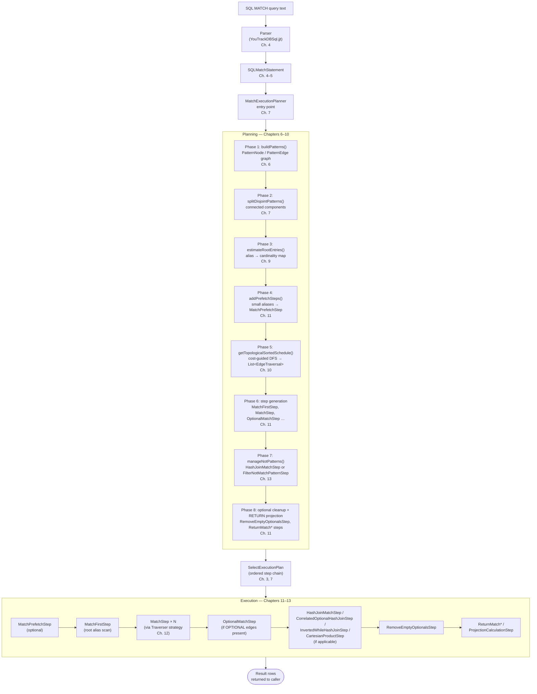

# Chapter 17 — Reference: Files, Classes, Configuration, Glossary

This chapter is not meant to be read from start to finish. It is a look-up
resource. When a class name slips your memory, when you want to know the
default value of a configuration property, or when you need to remind
yourself what "fan-out" means without re-reading Chapter 8 — this is the
place to check first.

Four sections follow. Section 17.1 indexes every source file the book
touches, sorted by package path. Section 17.2 catalogues the runtime
configuration knobs and the private planner constants. Section 17.3
presents the full pipeline as a single Mermaid diagram — the book's
one-page summary. Section 17.4 is the glossary: every term the book
introduces, in alphabetical order, with a one-sentence definition and the
chapter where it was first taught.

---

## 17.1 File layout index

All paths are relative to the repository root. The prefix `…/internal/core/`
abbreviates
`core/src/main/java/com/jetbrains/youtrackdb/internal/core/`.

**Table 17.1 — Source files of the MATCH implementation.**

| Source file | Role | Chapter |
|---|---|---|
| `core/src/main/grammar/YouTrackDBSql.jjt` | Grammar source; JavaCC generates the parser and all AST node classes from this file | Ch. 4 |
| `…/internal/core/sql/parser/SQLMatchStatement.java` | AST root for a MATCH query; returned by the parser to the planner entry point | Ch. 4 |
| `…/internal/core/sql/parser/SQLMatchExpression.java` | One `{…}.edge{…}` arm inside a MATCH statement | Ch. 4 |
| `…/internal/core/sql/parser/SQLMatchFilter.java` | Node filter block: `{class:, as:, where:}` fields | Ch. 4, 5 |
| `…/internal/core/sql/parser/SQLMatchFilterItem.java` | One key=value pair inside a filter block (generated class) | Ch. 4 |
| `…/internal/core/sql/parser/SQLMatchPathItem.java` | A single edge hop in the path | Ch. 4, 5 |
| `…/internal/core/sql/parser/SQLMatchPathItemFirst.java` | First (anchor) path item; uses function dispatch to determine traversal method | Ch. 4, 5 |
| `…/internal/core/sql/parser/SQLMultiMatchPathItem.java` | `.(sub1.sub2.…)` group: a multi-step path item | Ch. 5, 12 |
| `…/internal/core/sql/parser/SQLMultiMatchPathItemArrows.java` | Arrow-syntax variant of a multi-step path item (generated class) | Ch. 5, 12 |
| `…/internal/core/sql/parser/SQLFieldMatchPathItem.java` | `.fieldName` field-traversal path item | Ch. 5, 12 |
| `…/internal/core/sql/parser/SQLMatchesCondition.java` | The `MATCHES` keyword condition AST node (generated class) | Ch. 4 |
| `…/internal/core/sql/parser/SQLMatchAssertions.java` | Package-private assertion helpers for the parser package | Ch. 4 |
| `…/internal/core/sql/executor/match/MatchExecutionPlanner.java` | Eight-phase planning orchestrator: builds the pattern graph, estimates cardinalities, schedules edges, and assembles the step chain | Ch. 6, 7, 8, 9, 10 |
| `…/internal/core/sql/executor/match/PatternNode.java` | Alias node in the pattern graph; holds in/out adjacency sets | Ch. 6 |
| `…/internal/core/sql/executor/match/PatternEdge.java` | Directed edge in the pattern graph; records source node, target node, and path item | Ch. 6 |
| `…/internal/core/sql/executor/match/EdgeTraversal.java` | Scheduled edge step: wraps a `PatternEdge` with direction, filter, and optional optimisation descriptors | Ch. 10 |
| `…/internal/core/sql/executor/match/EdgeFanOutEstimator.java` | Fan-out lookup from schema statistics; used by the cost model | Ch. 8 |
| `…/internal/core/sql/executor/match/LazyRecursiveTraversalStream.java` | Pull-based DFS (pre-order) stream for WHILE (recursive) patterns | Ch. 12 |
| `…/internal/core/sql/executor/match/MatchFirstStep.java` | Seed step that opens the root alias's record source | Ch. 11 |
| `…/internal/core/sql/executor/match/MatchStep.java` | Main traversal step; delegates edge walking to a traverser strategy | Ch. 11, 12 |
| `…/internal/core/sql/executor/match/MatchPrefetchStep.java` | Eager materialisation step for small aliases | Ch. 11 |
| `…/internal/core/sql/executor/match/OptionalMatchStep.java` | OPTIONAL edge step; emits a sentinel row on traversal failure | Ch. 11 |
| `…/internal/core/sql/executor/match/RemoveEmptyOptionalsStep.java` | Post-join cleanup step: removes rows whose OPTIONAL alias resolved to the sentinel | Ch. 11 |
| `…/internal/core/sql/executor/match/FilterNotMatchPatternStep.java` | Nested-loop NOT fallback; used when hash join guards are not met | Ch. 11, 13 |
| `…/internal/core/sql/executor/match/MatchEdgeTraverser.java` | Standard forward traverser and base class for all traverser strategies | Ch. 12 |
| `…/internal/core/sql/executor/match/MatchReverseEdgeTraverser.java` | Reverse-direction traverser; walks an edge against its written direction | Ch. 12 |
| `…/internal/core/sql/executor/match/OptionalMatchEdgeTraverser.java` | Optional-edge traverser; emits a sentinel on empty traversal | Ch. 12 |
| `…/internal/core/sql/executor/match/MatchFieldTraverser.java` | Field-property traverser; walks a record field rather than a graph edge | Ch. 12 |
| `…/internal/core/sql/executor/match/MatchMultiEdgeTraverser.java` | Multi-step group traverser; executes a `.(sub1.sub2.…)` path item | Ch. 12 |
| `…/internal/core/sql/executor/match/HashJoinMatchStep.java` | Generic hash join for NOT/EXISTS/inner patterns | Ch. 13 |
| `…/internal/core/sql/executor/match/CorrelatedOptionalHashJoinStep.java` | Correlated OPTIONAL hash join with LRU neighbour cache | Ch. 13 |
| `…/internal/core/sql/executor/match/InvertedWhileHashJoinStep.java` | Inverted WHILE hash join: builds a reachable-RID set from anchor vertices, then probes upstream rows | Ch. 13 |
| `…/internal/core/sql/executor/match/JoinKey.java` | Pre-hashed join key value object; three shapes: `SINGLE_RID`, `RID_ARRAY`, `OBJECT_ARRAY` | Ch. 13 |
| `…/internal/core/sql/executor/match/JoinMode.java` | `ANTI_JOIN` / `SEMI_JOIN` / `INNER_JOIN` enum used by `HashJoinMatchStep` | Ch. 13 |
| `…/internal/core/sql/executor/match/MatchResultRow.java` | Layered row wrapper; each step adds one alias binding without copying the parent chain | Ch. 11 |
| `…/internal/core/sql/executor/match/PathNode.java` | Node in a returned path; used by the path-projection steps | Ch. 11 |
| `…/internal/core/sql/executor/match/ReturnMatchElementsStep.java` | RETURN projection: elements variant | Ch. 11 |
| `…/internal/core/sql/executor/match/ReturnMatchPathsStep.java` | RETURN projection: paths variant | Ch. 11 |
| `…/internal/core/sql/executor/match/ReturnMatchPatternsStep.java` | RETURN projection: patterns variant | Ch. 11 |
| `…/internal/core/sql/executor/match/ReturnMatchPathElementsStep.java` | RETURN projection: path-elements variant | Ch. 11 |
| `…/internal/core/sql/executor/match/MatchAssertions.java` | Assertion helpers for the executor package | Ch. 11 |
| `…/internal/core/sql/executor/match/SemiJoinDescriptor.java` | Sealed interface for back-reference semi-join descriptors attached to an `EdgeTraversal` | Ch. 10 |
| `…/internal/core/sql/executor/match/SingleEdgeSemiJoin.java` | Pattern A: single-edge back-reference semi-join descriptor | Ch. 10 |
| `…/internal/core/sql/executor/match/ChainSemiJoin.java` | Pattern B: `.outE('E').inV()` chain semi-join descriptor | Ch. 10 |
| `…/internal/core/sql/executor/match/AntiSemiJoin.java` | Pattern D: NOT IN anti-semi-join descriptor | Ch. 10 |
| `…/internal/core/sql/executor/match/BackRefHashJoinStep.java` | Back-reference semi-join step; builds a neighbour RID-set once and probes in O(1) | Ch. 10, 13 |
| `…/internal/core/sql/executor/match/PreFilterSkipReason.java` | Enum naming why an eligible edge was denied a pre-filter at runtime; surfaced in PROFILE output only, never in EXPLAIN | Ch. 14, 16 |
| `…/internal/core/sql/executor/CartesianProductStep.java` | Cross join between disjoint connected components | Ch. 7 |
| `…/internal/core/sql/executor/TraversalPreFilterHelper.java` | Index lookup helper that attaches a pre-filter to an `EdgeTraversal` | Ch. 14 |
| `…/internal/core/sql/executor/RidFilterDescriptor.java` | RID-set pre-filter descriptor attached to an `EdgeTraversal` | Ch. 14 |
| `…/internal/core/sql/executor/ProjectionCalculationStep.java` | Generic RETURN projection step used outside the MATCH pipeline | Ch. 3 |
| `…/internal/core/sql/executor/SelectExecutionPlan.java` | Plan container: the ordered step chain assembled by the planner | Ch. 3, 7 |
| `…/internal/core/sql/executor/CostModel.java` | Shared cost-arithmetic utility used by the scheduler | Ch. 8 |
| `…/internal/core/index/engine/SelectivityEstimator.java` | Selectivity estimation for WHERE predicates and class filters | Ch. 8 |
| `…/internal/core/sql/parser/YqlStatementCache.java` | Per-database LRU cache for parsed `SQLStatement` objects, keyed by raw SQL text; shared across all sessions on the same database | Ch. 4, 7 |
| `…/internal/core/sql/parser/YqlExecutionPlanCache.java` | Per-database LRU cache for assembled `SelectExecutionPlan` templates; copy-on-read guarantees per-caller isolation; invalidated on any schema, index, or configuration change | Ch. 7 |
| `…/internal/core/sql/executor/cache/QueryResultCache.java` | Entry point of the per-transaction query-result cache (one instance per `FrontendTransactionImpl`); caches result rows before the pipeline runs, reconciles hits against in-transaction mutations, and evicts under LRU. The rest of the `sql/executor/cache/` package holds its shape classifier, delta builder, and non-determinism detector. | Ch. 7 |
| `core/src/main/java/com/jetbrains/youtrackdb/api/config/GlobalConfiguration.java` | All runtime-configurable parameters; MATCH hash-join knobs at lines 863–892, query-result-cache knobs at 961–1009, and pre-filter knobs at 1351–1395 | Ch. 7, 13, 14 |

---

## 17.2 Configuration knobs

The runtime properties in Table 17.2 live in `GlobalConfiguration.java` and can be
adjusted without a server restart — they are read at query planning time,
not at startup. The two planner constants are `private static final` fields
of `MatchExecutionPlanner` and are not externally configurable.

**Table 17.2 — Runtime configuration properties.**

| `GlobalConfiguration` constant | System property key | Default | Role | Chapter |
|---|---|---|---|---|
| `STATEMENT_CACHE_SIZE` | `youtrackdb.statement.cacheSize` | `100` | Capacity (in entries) for both `YqlStatementCache` (parsed AST) and `YqlExecutionPlanCache` (assembled plan). Set to `0` to disable both caches. (`GlobalConfiguration.java:1011`) | Ch. 7 |
| `COMMAND_TIMEOUT` | `youtrackdb.command.timeout` | `0` (disabled) | Default query timeout in milliseconds. A change to this value at runtime immediately invalidates the entire plan cache, because cached plans embed a `TimeoutStep` whose threshold was fixed at planning time. (`GlobalConfiguration.java:843`) | Ch. 7 |
| `QUERY_TX_RESULT_CACHE_ENABLED` | `youtrackdb.query.txResultCache.enabled` | `false` | Master switch for the per-transaction query-result cache. When off (the default) the cache is never consulted and `FrontendTransactionImpl.getQueryResultCache()` returns `null`. Enabling it never changes result cardinality. (`GlobalConfiguration.java:961`) | Ch. 7 |
| `QUERY_TX_RESULT_CACHE_MAX_ENTRIES` | `youtrackdb.query.txResultCache.maxEntries` | `200` | Maximum number of cached results retained per transaction, under LRU eviction. Entries with a live result-set view are exempt, so the map may grow transiently above this bound. (`GlobalConfiguration.java:971`) | Ch. 7 |
| `QUERY_TX_RESULT_CACHE_MAX_RECORDS_PER_ENTRY` | `youtrackdb.query.txResultCache.maxRecordsPerEntry` | `10000` | Per-entry cap on the records a cached result may hold. Crossing it overflows the entry: its key is marked non-cacheable for the rest of the transaction while the consumer still receives every result from the live stream. (`GlobalConfiguration.java:980`) | Ch. 7 |
| `QUERY_TX_RESULT_CACHE_K0_NONE_INVALIDATION_THRESHOLD` | `youtrackdb.query.txResultCache.deltaUnreconcilableInvalidationThreshold` | `3` | Strike limit: how many times a delta-unreconcilable entry may be invalidated by an intervening mutation before its key is routed to the non-cacheable set for the rest of the transaction. Note the property key diverges from the constant name. (`GlobalConfiguration.java:991`) | Ch. 7 |
| `QUERY_TX_RESULT_CACHE_MULTI_INVALIDATION_THRESHOLD` | `youtrackdb.query.txResultCache.matchMultiInvalidationThreshold` | `3` | Strike limit for multi-alias MATCH entries, applied the same way as the delta-unreconcilable threshold. Note the property key diverges from the constant name. (`GlobalConfiguration.java:1001`) | Ch. 7 |
| `QUERY_MATCH_HASH_JOIN_THRESHOLD` | `youtrackdb.query.match.hashJoinThreshold` | `10000` | Maximum estimated build-side cardinality for hash-join eligibility. Build estimates above this value force a nested-loop fallback. Set to `0` to disable all hash joins. (`GlobalConfiguration.java:863`) | Ch. 13 |
| `QUERY_MATCH_HASH_JOIN_UPSTREAM_MIN` | `youtrackdb.query.match.hashJoinUpstreamMin` | `5` | Minimum probe-side (upstream) row count before hash join is considered. Below this threshold nested loops are already fast. Set to `0` to bypass both this guard and the cost comparison, leaving only the build-side cap. (`GlobalConfiguration.java:873`) | Ch. 13 |
| `QUERY_MATCH_CORRELATED_CACHE_SIZE` | `youtrackdb.query.match.correlatedCacheSize` | `16` | LRU cache capacity for `CorrelatedOptionalHashJoinStep`. Higher values reduce neighbour-set rebuilds when many distinct correlated vertices interleave in the upstream stream, at the cost of memory. (`GlobalConfiguration.java:884`) | Ch. 13 |
| `QUERY_STATS_DEFAULT_FAN_OUT` | `youtrackdb.query.stats.defaultFanOut` | `10.0` | Fallback fan-out value used by `EdgeFanOutEstimator` when the schema carries no edge-count statistics for the requested class and direction. (`GlobalConfiguration.java:1240`) | Ch. 8 |
| `QUERY_STATS_DEFAULT_SELECTIVITY` | `youtrackdb.query.stats.defaultSelectivity` | `0.1` | Fallback selectivity fraction used by `SelectivityEstimator` for non-indexed or unrecognised predicates. (`GlobalConfiguration.java:1233`) | Ch. 8 |
| `QUERY_PREFILTER_MAX_RIDSET_SIZE` | `youtrackdb.query.prefilter.maxRidSetSize` | heap-adaptive | Maximum number of RIDs collected from an index or reverse-edge lookup before the pre-filter build is aborted. Auto-scaled to ~0.5% of max heap, clamped to `[100000, 10000000]`: `(int) Math.min(10_000_000L, Math.max(100_000L, Runtime.getRuntime().maxMemory() / 200))`. Set explicitly to override the auto-scaling. (`GlobalConfiguration.java:1351`) | Ch. 14 |
| `QUERY_PREFILTER_EDGE_LOOKUP_MAX_RATIO` | `youtrackdb.query.prefilter.edgeLookupMaxRatio` | `0.8` | Admission bound for the reverse-edge `EdgeRidLookup` path: maximum ratio of collected RID-set size to link-bag size. Above this the overlap is too high for the filter to save I/O. (`GlobalConfiguration.java:1362`) | Ch. 14 |
| `QUERY_PREFILTER_INDEX_LOOKUP_MAX_SELECTIVITY` | `youtrackdb.query.prefilter.indexLookupMaxSelectivity` | `0.95` | Admission bound for the `IndexLookup` path: maximum selectivity (`estimateHits / totalCount`) of the target predicate. Above this the condition matches too many records to be worth a pre-filter. Independent of the edge-lookup ratio. (`GlobalConfiguration.java:1370`) | Ch. 14 |
| `QUERY_PREFILTER_MIN_LINKBAG_SIZE` | `youtrackdb.query.prefilter.minLinkBagSize` | `50` | Minimum adjacency-list (link bag) size below which pre-filtering is skipped entirely. Loading a small number of records directly is cheaper than building a RID set. (`GlobalConfiguration.java:1379`) | Ch. 14 |
| `QUERY_PREFILTER_LOAD_TO_SCAN_RATIO` | `youtrackdb.query.prefilter.loadToScanRatio` | `100.0` | Cost of a random record load relative to one RID-set scan entry, used in the `IndexLookup` build-amortisation formula. Calibrated for cold SSD storage; a higher value makes the amortisation check stricter. (`GlobalConfiguration.java:1387`) | Ch. 14 |

**Table 17.3 — Private planner constants (not runtime-configurable).**

| Constant | Location | Value | Role | Chapter |
|---|---|---|---|---|
| `THRESHOLD` | `MatchExecutionPlanner.java:336` | `100` | Prefetch cap: aliases whose estimated cardinality falls below this value are materialised by `MatchPrefetchStep` before the main traversal. Also used as the fallback `source_rows` estimate when no cardinality data is available. | Ch. 7, 11 |
| `INNER_JOIN_MEMORY_WEIGHT` | `MatchExecutionPlanner.java:366` | `7` | Divisor applied to `QUERY_MATCH_HASH_JOIN_THRESHOLD` for the `INNER_JOIN` mode eligibility check. Reflects that an inner-join map stores full `Result` payloads rather than lightweight keys, requiring approximately seven times more memory per entry. | Ch. 13 |

---

## 17.3 End-to-end pipeline

The diagram below traces the full journey from SQL text to result rows.
Each box names the code entity responsible; the chapter labels show where
the book teaches that phase.

**Figure 17.1 — End-to-end MATCH pipeline from SQL text to result rows.**

The left spine (Planning) runs once per query, before any row is produced.
The right spine (Execution) is pull-based: nothing moves until the caller
calls `next()` on the outermost step. Pre-filter attachment (Chapter 14)
is an optimisation applied inside Phase 5 — it annotates individual
`EdgeTraversal` objects and changes the behaviour of the traverser in the
Execution spine without adding a new step type.

---

## 17.4 Glossary

Every term the book formally introduces appears below, in alphabetical
order. Definitions are self-contained; a reader who has not read the book
can still understand each entry in isolation. Chapter citations point to
where each term was first taught.

---

**Alias** — A name the query author assigns to a pattern node via the
`as:` key inside a node filter block, for example `as: alice`. Every
result row carries one binding per alias; the binding holds the record
matched at that node. Aliases are the keys in `MatchResultRow` and in all
join key computations. (Ch. 1, 5)

---

**AST** (Abstract Syntax Tree) — The object tree the JavaCC parser
produces from the SQL text. For MATCH queries the root is
`SQLMatchStatement`, which holds a list of `SQLMatchExpression` objects.
The AST is a purely syntactic structure: it carries no cardinality
estimates, no index information, and no sense of which aliases are bound.
(Ch. 3, 4)

---

**Back-reference** — The reuse of an alias that was already bound earlier
in the same pattern. A back-reference is not a filter predicate; it is a
join condition. At runtime the engine verifies that the record produced by
the current traversal step has the same RID as the record already stored
under that alias in the current row. The pattern graph encodes
back-references as shared `PatternNode` instances (both uses of the alias
map to the same node object), so the planner can reason about them
structurally. (Ch. 1, 5, 6)

---

**`BackRefHashJoinStep`** — An execution step that implements the
back-reference semi-join: instead of checking a back-reference equality
condition for every traversal candidate row-by-row, the step builds a hash
set (or set of sets) once from a materialised neighbour list, then probes
it in O(1) per upstream row. Which neighbour list to build is determined by
the `SemiJoinDescriptor` attached to the associated `EdgeTraversal`. (Ch. 10)

---

**Cardinality** — The estimated number of records that satisfy a given
condition or are bound to a given alias. The planner uses cardinality
estimates to rank root alias candidates (small cardinality = cheaper root)
and to decide whether hash joins or prefetching are worthwhile. Estimates
are treated as ranking signals, not accurate counts; an incorrect estimate
produces a suboptimal but still correct plan. (Ch. 1, 8, 9)

---

**Cartesian product** — The cross join applied between two or more
disjoint connected components of a pattern graph. When a MATCH query
contains comma-separated pattern chains that share no alias,
`CartesianProductStep` wraps them: it buffers one component's rows and
replays them once for every row produced by the other component. If
component A produces M rows and component B produces N rows, the result has
M × N rows. (Ch. 7)

---

**Class inference** — The process of deriving an alias's record class from
the edge that leads to it, when the query does not supply an explicit
`class:` filter in the node block. Class inference is performed during
`estimateRootEntries()` (Phase 3). Inferred classes have their cardinality
estimate inflated to `Long.MAX_VALUE`, which prevents the scheduler from
selecting that alias as a root — because a root whose class is inferred
cannot be resolved without first binding its neighbour. (Ch. 9)

---

**Cost model** — The set of helper classes (`SelectivityEstimator`,
`EdgeFanOutEstimator`, and `CostModel`) that produce the numerical inputs
the topological scheduler uses to rank unscheduled edges. Each estimate is
a plan-ranking signal, not a guaranteed row count; the engine produces
correct results regardless of estimation accuracy. (Ch. 8)

---

**`CorrelatedOptionalHashJoinStep`** — A hash-join variant that handles
OPTIONAL edges whose target alias carries a back-reference to an already-bound
alias. Because the neighbour set to probe depends on which specific correlated
vertex is in the current row, the step maintains an LRU cache of recently
computed neighbour sets (keyed by the correlated vertex's RID) to avoid
rebuilding the same set for each upstream row. Cache capacity is controlled
by `QUERY_MATCH_CORRELATED_CACHE_SIZE`. (Ch. 13)

---

**DFS** (depth-first search) — The traversal strategy the scheduler uses
to explore the pattern graph when building the edge schedule. Starting from
the chosen root alias, it picks the cheapest available unscheduled edge
according to the cost model, visits that edge's far endpoint, and continues
until the entire connected component is scheduled. Greedy DFS is chosen
over exhaustive search because the pattern graphs that appear in practice
are small, and the first good schedule is usually good enough. (Ch. 10)

---

**Edge traversal** — A scheduled edge step, represented by the
`EdgeTraversal` class. An `EdgeTraversal` wraps a `PatternEdge` and records
the direction in which the scheduler decided to walk it, the edge's filter
predicates, and any optimisation descriptors attached during later planning
phases (a `RidFilterDescriptor` for pre-filtering, or a `SemiJoinDescriptor`
for back-reference semi-joins). The schedule produced by Phase 5 is a
`List<EdgeTraversal>`. (Ch. 10)

---

**Execution step** — One pull-based iterator node in the assembled
`SelectExecutionPlan`. Each step exposes a stream via `internalStart(ctx)`,
consumes the stream of the preceding step, and produces a transformed
stream. The chain is lazy: nothing executes until the caller invokes
`next()` on the outermost step. Concrete types in the MATCH pipeline
include `MatchPrefetchStep`, `MatchFirstStep`, `MatchStep`,
`OptionalMatchStep`, `HashJoinMatchStep`, `FilterNotMatchPatternStep`, and
the four `ReturnMatch*` projection variants. (Ch. 3, 11)

---

**Fan-out** — The average number of target vertices reachable by following
a given edge label and direction from a single source vertex. Estimated by
`EdgeFanOutEstimator` using schema statistics; falls back to
`QUERY_STATS_DEFAULT_FAN_OUT` (10.0) when statistics are absent. Used by
the scheduler to weight the cost of adding an edge to the schedule: high
fan-out means many intermediate rows, which increases the cost of all
subsequent steps. (Ch. 8)

---

**Field traversal** — A `.fieldName` path item, parsed as
`SQLFieldMatchPathItem`. Instead of following a graph edge, the traverser
reads a named field of the current record and treats each value it finds as
the next pattern node. Field traversals are never invertible: the scheduler
can only walk them in the written direction. The runtime delegate is
`MatchFieldTraverser`. (Ch. 5, 12)

---

**`FilterNotMatchPatternStep`** — The nested-loop fallback for NOT
patterns. For each upstream row, the step constructs a fresh sub-execution
plan containing a singleton-row source followed by the NOT-pattern step
chain, and asks whether that plan produces any result. If it does, the NOT
pattern matched and the upstream row is discarded; if it does not, the row
passes. Used when hash-join guards are not met, most commonly because the
NOT expression references `$matched`. (Ch. 11, 13)

---

**Hash join** — A two-phase join algorithm. The *build phase* executes the
inner (typically smaller) side once and loads all keys into a hash
structure. The *probe phase* checks each outer row against the hash
structure in O(1). Total cost is O(build + outer) rather than O(outer ×
inner). In the MATCH engine, hash joins are used for NOT patterns
(`HashJoinMatchStep`), correlated OPTIONAL patterns
(`CorrelatedOptionalHashJoinStep`), and inverted WHILE recursions
(`InvertedWhileHashJoinStep`). Memory cost is bounded by the build side;
the planner enforces this through `QUERY_MATCH_HASH_JOIN_THRESHOLD`. (Ch. 13)

---

**`HashJoinMatchStep`** — The generic hash-join step, parameterised by a
`JoinMode` enum. In `ANTI_JOIN` mode it implements NOT semantics: keep
upstream rows whose key is absent from the hash set. In `SEMI_JOIN` mode
it implements EXISTS semantics: keep upstream rows whose key is present. In
`INNER_JOIN` mode it merges matching build-side payloads into the upstream
row, implementing a correlated inner join. (Ch. 13)

---

**Intersection descriptor** — See *Pre-filter* / `RidFilterDescriptor`. The
EXPLAIN token form is `intersection: <source>` where `<source>` is an index
name or a class-cluster intersection. Chapter 14 covers attachment;
Chapter 16 shows the EXPLAIN token.

---

**`InvertedWhileHashJoinStep`** — A hash-join variant for WHILE
(recursive) edges that the planner wants to walk in the direction opposite
to the written one. Because a WHILE edge is not generally invertible
(reversing the direction changes which vertex is the recursion target), the
step materialises the answer: it finds all anchor vertices satisfying the
WHILE target's WHERE clause, runs a level-by-level BFS in the inverse
direction to collect all reachable descendant RIDs, and then probes
upstream rows against that set. (Ch. 13)

---

**`JoinKey`** — A value object that pre-computes and caches the hash of a
join key extracted from a result row. Supports three shapes: `SINGLE_RID`
(most common), `RID_ARRAY` (multiple RID aliases), and `OBJECT_ARRAY`
(arbitrary value aliases). Used by `HashJoinMatchStep` as the unit of
comparison in the hash set or map. (Ch. 13)

---

**`JoinMode`** — An enum with three values that determines how
`HashJoinMatchStep` behaves: `ANTI_JOIN` (keep rows whose key is absent),
`SEMI_JOIN` (keep rows whose key is present), and `INNER_JOIN` (merge
matching build-side payloads into the upstream row). (Ch. 13)

---

**`LazyRecursiveTraversalStream`** — A pull-based `ExecutionStream`
implementation that performs a depth-first, pre-order DFS for WHILE
(recursive) patterns. Results are yielded on demand rather than materialised
in full before the first row is emitted, keeping memory bounded for wide
recursive subgraphs. Used by `MatchEdgeTraverser` when the scheduled edge
carries a WHILE pattern. (Ch. 12)

---

**`MatchResultRow`** — A layered row wrapper where each `MatchStep` adds
exactly one new alias binding without copying the parent chain. Read-time
property lookup walks the linked parent chain until the requested key is
found. This makes row creation O(1) in both time and allocation, while
preserving full row semantics for downstream steps. (Ch. 11)

---

**Multi-step path item** — A `.(sub1.sub2.…)` group, parsed as
`SQLMultiMatchPathItem` (or `SQLMultiMatchPathItemArrows` for arrow syntax).
The sub-items form an internal sub-pipeline; their final output is treated
as the matched node. Multi-step path items are never invertible: the
scheduler can only walk them in the written direction. The runtime delegate
is `MatchMultiEdgeTraverser`. (Ch. 5, 12)

---

**Nested-loop join** — The default join strategy: for every upstream row,
re-evaluate the inner side (a sub-pattern or filter) from scratch and
collect its results. Cost is O(outer × inner). Used when hash-join
eligibility guards are not met (for example when the NOT expression
references `$matched`). Implemented by `FilterNotMatchPatternStep` for NOT
patterns. (Ch. 11, 13)

---

**Pattern graph** — The semantic representation of a MATCH pattern after
alias unification. Consists of `PatternNode` vertices and `PatternEdge`
directed edges. Because alias strings are used as map keys, the second
occurrence of an alias in the pattern simply retrieves the same
`PatternNode` object — back-references become shared nodes automatically.
Each connected component of the pattern graph is planned independently.
(Ch. 5, 6)

---

**Pre-filter** — A `RidFilterDescriptor` attached to an `EdgeTraversal`
by `TraversalPreFilterHelper`. At runtime the traverser checks each
adjacency-list RID against the descriptor's index-derived set before
loading the target record, eliminating the record I/O for non-matching
neighbours. Two admission paths qualify an edge: a reverse-edge
`EdgeRidLookup`, admitted when the overlap ratio between the collected RID
set and the link bag stays below `QUERY_PREFILTER_EDGE_LOOKUP_MAX_RATIO`;
and an `IndexLookup` on a selective indexed predicate, admitted when its
selectivity stays below `QUERY_PREFILTER_INDEX_LOOKUP_MAX_SELECTIVITY` and
the build cost amortises against the record loads it saves. Attachment
appears in EXPLAIN as `intersection: …`; the reason an eligible edge was
skipped surfaces only in PROFILE, via `PreFilterSkipReason`. (Ch. 14)

---

**Prefetch** — The eager materialisation of a small alias's entire record
set into a `MatchPrefetchStep` before the main traversal begins. Prevents
repeated full-class scans when the same small alias would otherwise be
re-scanned once per outer row in the nested loop. Aliases whose estimated
cardinality falls below the planner constant `THRESHOLD` (100) and that
carry no `$matched` dependency are prefetch-eligible. (Ch. 7, 11)

---

**Pull-based execution** — The execution model in which no step produces
output until the caller requests a row by invoking `next()` on the
outermost step. Each step calls `next()` on its predecessor only when it
needs another input row; the chain is driven entirely by downstream demand.
Consequences: memory use is bounded by pipeline depth rather than result
count, and early termination (LIMIT) is effectively free. (Ch. 3)

---

**Reverse traversal** — Walking an edge against its written direction. The
traverser `MatchReverseEdgeTraverser` implements this. Reverse traversal
is only legal for invertible edge patterns; WHILE patterns and field
traversals are never invertible. The scheduler performs an invertibility
check (verifying that the edge's path item is not a WHILE or field item
and that the target alias has no `$matched` dependency) before scheduling
an edge in reverse. (Ch. 10, 12)

---

**RID** (Record Identifier) — The physical-cum-logical address of a
record, written as `#clusterId:clusterPosition` (for example `#23:1`). A
RID is stable for the lifetime of the record. RIDs are used as adjacency
list entries, as join keys, and as the unit of comparison in pre-filter
sets. O(1) lookup by RID is the storage property the MATCH engine relies
on when loading vertices during traversal. (Ch. 2)

---

**Root alias** — The alias the scheduler selects as the starting point for
its DFS pass over the pattern graph. The scheduler ranks all aliases by
estimated cardinality and picks the one with the smallest estimate, subject
to the constraint that the chosen alias must be *directly resolvable* —
i.e., it must have an explicit class or filter that the engine can use to
open a record scan without first binding a neighbour. Aliases with inferred
classes are inflated to `Long.MAX_VALUE` to protect this constraint. (Ch. 7, 9)

---

**Schedule** — A total order over the pattern edges produced by
`getTopologicalSortedSchedule()` (Phase 5 of the planner). Each entry is
an `EdgeTraversal` that records the edge, the direction chosen by the
scheduler, and any attached optimisation descriptors. The schedule is the
direct input to Phase 6, where the planner converts it into an ordered list
of execution steps. (Ch. 10)

---

**Selectivity** — The fraction of records that survive a given predicate
or filter, expressed as a dimensionless value between 0.0 and 1.0. Lower
selectivity means fewer rows pass. Used by `SelectivityEstimator` to
compute a weight for each edge in the scheduler. Non-indexed predicates
fall back to `QUERY_STATS_DEFAULT_SELECTIVITY` (0.1). (Ch. 8)

---

**`SemiJoinDescriptor`** — A sealed interface implemented by
`SingleEdgeSemiJoin`, `ChainSemiJoin`, and `AntiSemiJoin`. The planner
attaches a `SemiJoinDescriptor` to an `EdgeTraversal` when a back-reference
pattern qualifies for the semi-join optimisation, signalling to the step
generator that a `BackRefHashJoinStep` should handle that edge instead of a
`MatchStep`. Mutually exclusive with a `RidFilterDescriptor` on the same
edge. (Ch. 10)

---

**Traverser** — A strategy object that `MatchStep` delegates actual edge
walking to. The traverser implements `ExecutionStream` and yields one
result row per matching neighbour. The six strategies are
`MatchEdgeTraverser` (standard forward), `MatchReverseEdgeTraverser`
(reverse direction), `OptionalMatchEdgeTraverser` (OPTIONAL edge),
`MatchFieldTraverser` (field traversal), `MatchMultiEdgeTraverser`
(multi-step group), and back-reference enforcement logic inside
`MatchEdgeTraverser`. (Ch. 12)

---

**`$matched` / `$currentMatch` / `$current`** — Context variables set and
read during traversal. `$matched` exposes the current row's alias bindings
to WHERE clauses and sub-pattern filters; it is set by `MatchFirstStep` at
the start of each row and refreshed by each `MatchStep` as new bindings are
added. `$currentMatch` and `$current` are transient bindings that the
traverser flips during neighbour evaluation to make the candidate record
available to inline WHERE predicates without committing it to the row. (Ch. 11, 12)

---

## 17.5 A closing note

Five ideas carry the weight of this book.

The first is **pull-based streaming**. YouTrackDB does not compute a query
answer and then deliver it; it wires together a chain of lazy iterators and
lets the caller drive the pipeline one row at a time. This model — described
in Chapter 3 with a plain SELECT and then relied upon across every execution
chapter — is what makes early termination free and memory use proportional to
pipeline depth rather than result count. Every execution step in the MATCH
engine is an `ExecutionStream`; every optimisation keeps that contract intact.

The second is **cost-ranked planning**. The planner does not ask "what is
the correct traversal order?" It asks "which order is likely cheapest?"
Those are different questions. Chapter 8 showed that the numerical inputs —
cardinality estimates, selectivity fractions, fan-out values — are
acknowledged approximations built from schema statistics and configurable
defaults. The right mental model is not precision but direction: the
estimates tell the scheduler which alias is cheaper to start from and which
edges multiply the row count the least. An estimate that is off by a factor
of ten still produces a plan that is within a constant factor of optimal for
most graph shapes.

The third is **two optimisation grafts on a nested-loop base**. Chapters 13
and 14 sit apart from the rest of the book for good reason. The base engine
is a nested-loop machine: for every upstream row, re-walk the inner
sub-pattern. That machine is correct, complete, and simple to reason about.
The hash-join variants (Chapter 13) replace the inner re-execution with a
O(1) hash probe when the build side is small enough to hold in memory. The
index pre-filter (Chapter 14) replaces full adjacency-list scans with
index-derived RID-set membership checks when the target alias has a
selective indexed predicate. Both optimisations leave the surrounding
pipeline unchanged; they are local substitutions, not architectural rewrites.

The fourth is **the pattern graph as the shared language**. The parser
produces a flat list of expressions. Every subsequent phase — cardinality
estimation, root selection, scheduling, step generation, optimisation
attachment — operates on the `Pattern` graph of `PatternNode` and
`PatternEdge` objects. Back-references become structurally visible as shared
nodes. Connected components become obvious. Invertibility is a property of
an edge's path item, readable without re-parsing the SQL. When you are
debugging a slow query or extending the planner, start with the pattern
graph: `MatchExecutionPlanner.buildPatterns()` is where the flat AST becomes
the object the planner can actually reason about.

The fifth is that the code repays direct reading. The MATCH engine is built
from small, single-responsibility classes whose names announce their purpose.
The eight phases of `createExecutionPlan()` map one-to-one onto the chapters
of this book. The traverser strategies mirror the six edge cases Chapter 12
enumerates. The hash-join guards follow from first principles. A reader who
has reached this page can open `MatchExecutionPlanner.java`, find the phase
they need, and navigate forward into the execution steps and traversers
without holding more context than fits on a screen. That is where the book
ends and the code begins.

---

## Summary

Chapter 17 collects the reference material the rest of the book distributes
across fourteen chapters: a complete annotated file index (§17.1), a table
of runtime configuration properties and private planner constants (§17.2),
the single-page end-to-end pipeline diagram (§17.3), and the full glossary
with self-contained definitions cross-referenced to the chapter of first
introduction (§17.4). The closing note (§17.5) restates the book's five
load-bearing ideas.
