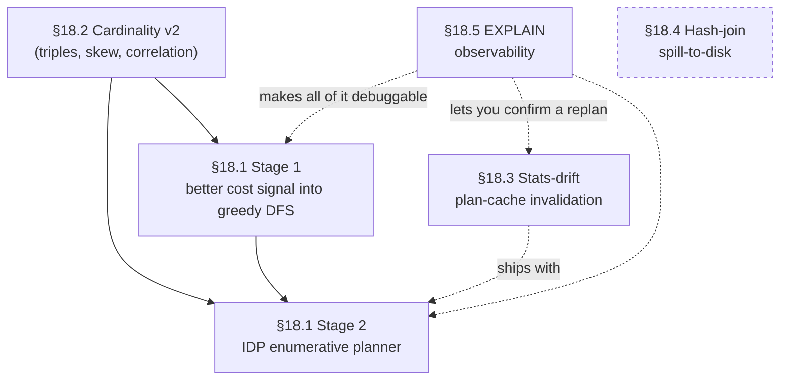

# Chapter 18 — Open Problems: A Contributor's Map

The seventeen chapters behind you describe an engine that works. It parses a
MATCH query into a pattern graph, estimates how many records each alias will
match, picks a root, schedules the edges cheapest-first, replaces the worst
nested loops with hash joins, and prunes adjacency lists with index
pre-filters before loading a single target record. That machinery is real,
it ships, and JetBrains applications are built on it today. It is also
*generation one*.

Generation one means correct-and-fast on the common case, and coarse
everywhere else. Every estimate the planner makes is a ranking signal, not a
measurement. The plan it builds is the first plausible order a greedy search
stumbles into, and every guard it applies was tuned by hand against one fixed
picture of the hardware underneath. None of that is a defect to
apologise for. It is the honest state of a young cost-based planner — and it
is exactly where a new contributor can do the most good.

This chapter is a map of the gaps. For each one it describes what a second
generation looks like, why it matters, and which class you open first to
start building it. Read it as a set of on-ramps, not a specification: the
team's design direction is sketched here in prose, but the authoritative,
continuously-updated version lives in the issue tracker, and the chapter
closes with how to find it. What the chapter fixes in place is the shape of
each problem and the name of the code that holds it — enough to get from "I
understand the problem" to "I have the file open" without a hunt.

The opportunities are not independent. Some are foundations that others stand
on; one is a genuine standalone. The diagram below maps those *dependencies* —
which work has to land before which — not the order this chapter reads in, and
not the order you should tackle them. If you want the single best place to
start, it is §18.5: the EXPLAIN observability work is the lowest-risk change in
the chapter, and it makes every other item here easier to measure.



**Figure 18.1 — The dependency arc among the five remaining opportunities.
Arrows point from prerequisite to dependant; dotted edges are "recommended
companion, not hard requirement". Cardinality v2 (§18.2) feeds both stages of
the join-ordering work; the two IDP stages ship in order; the EXPLAIN and
stats-drift work are companions that make the arc debuggable and durable; the
hash-join spill work (dashed box) stands apart from the arc.**

---

## 18.1 Enumerating join orders: from greedy DFS to IDP

Picture a query that hunts for posts in one niche forum written by people who
live in a huge country:

```sql
MATCH {class: Country, as: c, where: (name = :bigCountry)}
      .in('LIVES_IN')   {class: Person, as: person}
      .in('HAS_CREATOR'){class: Post,   as: post, where: (forumId = :nicheForum)}
RETURN post
```

Two aliases carry a filter, so two aliases are eligible to be the root: the
single country `c`, whose estimate is one record, and the niche forum's posts
`post`, whose estimate is three hundred. The planner picks the cheaper root,
and one is a great deal cheaper than three hundred, so it starts from `c` and
expands the only direction that root allows. Watch the intermediate row count
climb as it walks:

```
c                            →  1
c.in('LIVES_IN')  → person   →  1 × 50,000,000 = 50,000,000
person.in('HAS_CREATOR')     →  filter to the niche forum
```

Fifty million people live in the country. The planner materialises every one
of them before the niche-forum filter — the single selective thing in the
whole query — ever runs.

Now walk the same pattern from the other end. Start at the three hundred
niche-forum posts and traverse backward:

```
post                         →  300
post.out('HAS_CREATOR')      →  300 × 1 = 300   (each post has one creator)
person.out('LIVES_IN')       →  300 × 1 = 300   (each person lives in one country)
                             →  keep those whose country is :bigCountry
```

Nine hundred intermediate rows against fifty million. Same answer, same
pattern, opposite direction — a plan that touches roughly one fifty-thousandth
of the data. The planner cannot find it, and the reason is structural.

Chapter 10 showed how the planner turns a pattern graph into an ordered list
of edge traversals — one `EdgeTraversal` per edge. The mechanism is a
two-level greedy depth-first search: an outer loop picks the cheapest
dependency-free root, and an inner loop expands from it by always emitting the
locally cheapest ready edge, running to completion without ever reconsidering
a choice. The class Javadoc calls it "a cost-driven, dependency-aware,
depth-first graph traversal", and the method that implements it is
`getTopologicalSortedSchedule`; the per-edge ranking it consults comes from
`estimateEdgeCost`. Chapter 10 §10.11 named the limitation without flinching: the greedy DFS never
backtracks. Once it commits to an edge, the schedule stands.

The niche-forum query is one instance of a specific disease. Greedy picks the
root that minimises the *starting* cardinality, but the cheapest plan is the
one that keeps the *running* cardinality smallest across every hop — and those
two goals can point at different roots. A root of cardinality one that fans
out to fifty million is worse than a root of cardinality three hundred that
never leaves the low hundreds, but greedy sees only one against three hundred,
picks the one, and lives with the explosion. It commits to the cheapest root
and expands forward; it cannot discover that starting from the tiny far-end
set and walking the whole pattern in reverse would touch orders of magnitude
fewer rows.

Two more shapes share the pathology, and both are worth seeing in miniature.

**The first is an edge that should have waited.** Ask for your friends who live
in your own — heavily populated — home country:

```sql
MATCH {class: Person, as: me, where: (id = :personId)}
      .out('LIVES_IN'){class: Country, as: home}
      .in('LIVES_IN') {class: Person,  as: friend},
   {as: me}.out('KNOWS'){as: friend}
RETURN friend
```

Only `me` carries a filter, so the root is forced and correct — there is no
wrong end to start from this time. Greedy loses anyway, one hop later. From `me`
two edges are ready: `out('LIVES_IN')` to your country, fan-out one, and
`out('KNOWS')` to your friends, fan-out thirty. Greedy ranks them by that
immediate fan-out, takes the country edge because one beats thirty, and — because
the inner search runs each branch to the bottom before trying another — is left
standing on `home` with only its expensive edge remaining:

```
me                             →  1
me.out('LIVES_IN')   → home    →  1 × 1 = 1
home.in('LIVES_IN')  → friend  →  1 × 50,000,000 = 50,000,000   (every resident)
friend  =?=  me.out('KNOWS')   →  keep the ~30 you actually know
```

Fifty million residents materialised to find thirty friends. The edge that
explodes — walking a country back to its inhabitants — is exactly the one that
should have waited until `KNOWS` had shrunk the set to thirty, at which point it
collapses to a membership check:

```
me                             →  1
me.out('KNOWS')      → friend  →  1 × 30 = 30
me.out('LIVES_IN')   → home    →  30 × 1 = 30
friend.out('LIVES_IN') =?= home →  keep those whose country is home
```

Thirty rows against fifty million — and greedy cannot see it, because the
ruinous edge is one hop past the one it is scoring. Nor can you dodge it by
rewriting the query: a plain edge traverses either way, so spelling the
residents step in the opposite direction hands greedy the very same explosion.

**The second is two independent questions asked in the wrong order.** Find the
replies to your posts and, separately, your friends who live in one small
country:

```sql
MATCH {class: Person, as: me, where: (id = :personId)}
      .in('HAS_CREATOR'){class: Post,    as: myPost}
      .in('REPLY_OF')   {class: Comment, as: reply},
   {as: me}.out('KNOWS'){class: Person, as: friend}
      .out('LIVES_IN')  {class: Country, as: home, where: (name = :smallCountry)}
RETURN reply, friend
```

Nothing links the two branches; the answer is every reply paired with every
qualifying friend. Greedy expands the cheaper first edge — your ten posts beat
your thirty friends — and, depth-first, runs that whole branch out before it
touches the other:

```
me                              →  1
me.in('HAS_CREATOR')  → myPost  →  1 × 10 = 10
myPost.in('REPLY_OF') → reply   →  10 × 10 = 100      (branch one, in full)
{me}.out('KNOWS')     → friend  →  100 × 30 = 3,000   (branch two, piled on top)
friend.out('LIVES_IN')→ home    →  keep the 2 in :smallCountry → 200
```

The cheaper plan interleaves: run the friends branch first, let the
small-country filter cut thirty down to two, and only then multiply in the
hundred replies:

```
me                              →  1
{me}.out('KNOWS')     → friend  →  1 × 30 = 30
friend.out('LIVES_IN')→ home    →  keep the 2 in :smallCountry → 2
me.in('HAS_CREATOR')  → myPost  →  2 × 10 = 20
myPost.in('REPLY_OF') → reply   →  20 × 10 = 200
```

Two hundred answers either way, but greedy's peak intermediate is fifteen times
larger — and it cannot reach the cheaper plan, because committing to the cheap
first edge means running that branch to the bottom before the filter on the
other branch ever gets a turn.

These are not contrived corners. They are the everyday shape of heavy,
multi-hop analytical traversals: one branch fans out through a broad middle
while the single selective filter sits at the far end, and greedy commits to an
order before that filter ever gets a turn.

None of this means greedy is a mistake. When the locally cheapest next edge is
also the globally best one — the common case for small patterns — greedy
produces the optimal plan in polynomial time, and most queries are small
patterns. The damage is confined to the shapes above. But those shapes are
precisely the heavy analytical queries where a bad plan hurts most, so the
confinement is cold comfort.

The plan is a two-stage arc, and the staging is deliberate so that each stage's
payoff can be measured on its own.

**Stage one keeps the greedy algorithm exactly as it is and changes only what
it reads.** Today `estimateEdgeCost` prices an edge through the shared
`CostModel`: `edgeTraversalCost` multiplies source-row count by average fan-out
by a random-page-read weight, and the planner then adjusts that result with
`applyTargetSelectivity` for the target's filter and `applyDepthMultiplier` for
recursive edges. Every input to that formula is a coarse approximation that
hides the skew which sinks the analytical queries. The plan is to sharpen those
inputs — richer statistics, with the cardinality work of §18.2 feeding straight
in — while leaving the DFS shape, the root ordering, and the dependency
resolution untouched. The engine already reasons in `CostModel`'s abstract
page-read units, where one sequential page read is 1.0, so stage one needs no
new cost currency; it needs better numbers fed into the currency that already
exists. Whether page-read units stay the right long-term basis, or eventually
give way to measured time, is a separate question stage one does not have to
answer: any honest improvement to the inputs is a win the same greedy search
can bank, and it ships in weeks rather than the multi-month horizon of the
algorithmic work.

**Stage two replaces the greedy search itself** with Iterative Dynamic
Programming. Instead of committing to the first plausible order, the planner
enumerates plan alternatives for small subsets of the pattern, keeps the
cheapest per subset, locks it as a virtual unit, and iterates over the rest.
Enumerative dynamic programming is the standard escape from greedy's blind
spots — a well-worn technique in the query-optimization literature — and it
spends planning time to price the alternatives greedy never generates,
including the reverse-direction walk the worked example needed.
What makes the extra search affordable is the plan cache of Chapter 7 §7.9:
planning runs once per cache miss, not once per execution, so a planning
budget of tens of milliseconds is money well spent. Under IDP the
optimisations you met as separate mechanisms — the hash-join substitution of
Chapter 13, the index-assisted traversal of Chapter 14 — stop being post-hoc
rewrites and become plan alternatives the search prices directly against
nested loops.

The two stages make very different first contributions. Stage one is contained
and measurable: it rewires the internals of `estimateEdgeCost` and its
companion `getHashJoinThreshold` — the two heuristics that turn statistics into
decisions — while treating the schedule that flows out of
`getTopologicalSortedSchedule` as fixed, so the change carries a clean
before/after benchmark and a short blast radius. That makes it a strong first
contribution. Stage two is the opposite. It rewrites the DFS loop inside
`getTopologicalSortedSchedule` itself, and it must consume the
pattern-structure records — `PatternNode`, `PatternEdge`, and the scheduled
`EdgeTraversal` — exactly as they stand today. It is a multi-month effort at
the heart of the planner, gated the whole way on LDBC benchmark evidence, and
best attempted only after stage one has landed and the cost signal it consumes
is trustworthy.

---

## 18.2 Cardinality estimation, version two

A query that runs in milliseconds for every forum in your database can fall off
a cliff for exactly one of them — the busiest — and the planner never sees it
coming. The reason is that the numbers it plans with are averages, and an
average is a lie about a skewed distribution.

Take a query that pulls every comment written in reply to a post in one named
forum:

```sql
MATCH {class: Forum, as: f, where: (title = :forumTitle)}
      .out('CONTAINER_OF'){class: Post,    as: post}
      .in('REPLY_OF')     {class: Comment, as: reply}
RETURN reply
```

The planner sizes the middle of this query as
`|f| × avg(CONTAINER_OF) × avg(REPLY_OF)`. One forum matches the title, so `|f|`
is one. Across the whole dataset a forum holds about five hundred posts, and a
post draws about ten replies, so the planner budgets for `1 × 500 × 10 = 5,000`
intermediate rows and picks a plan sized for five thousand.

Now aim the same query at the site's busiest forum. That one forum holds two
million posts — four thousand times the average — and at ten replies each, the
middle of the query swells to `1 × 2,000,000 × 10 = 20,000,000` rows. The plan
that was fine on the median forum walks straight off a cliff on this one, four
thousand times over its budget, and it does so silently: nothing told the
planner that its "five hundred posts" was an average assembled almost entirely
from tiny forums, with one celebrity forum sitting far above the crowd.

That is skew, and it is the pathology worth internalising.

Chapter 8 introduced the three numbers the planner reasons with — cardinality,
selectivity, and fan-out — and was candid that each is allowed to be wrong.
Fan-out is the culprit here. `EdgeFanOutEstimator.estimateFanOut` divides an
edge class's total count by its source class's total count and hands back one
number, so a source class whose degree distribution is long-tailed gets planned
as though every source vertex were the average vertex.

Selectivity carries a quieter version of the same disease. `SelectivityEstimator`
scores one predicate at a time; when a filter is a conjunction, the planner's
`estimateFilterSelectivity` multiplies those per-predicate numbers together
under an independence assumption, which understates how tightly correlated
predicates filter when they travel together. Both approximations are cheap, and
both are biased in ways a stronger cost model will amplify rather than absorb.

The tempting fix — "notice this is the busiest forum and replan just for it" —
is deliberately off the table. The plan cache is keyed by query shape, not
parameter value, so every binding of `:forumTitle` shares one cached plan
(Chapter 7 §7.9). The fix therefore cannot be a plan tuned to one forum; it has
to be a plan that is *robust* to the skew — one that behaves whether the
parameter lands on the busiest forum or the smallest.

The fix is to make the estimator skew-aware at the edge-class level and richer
at the endpoints, in four increments ordered by return on investment.

The first replaces a proportional guess with a point estimate. Caching the edge
count for each `(source class, edge class, target class)` triple lets a pattern
with class constraints on both ends of an edge — the `Forum`-to-`Post`
`CONTAINER_OF` hop above, say — read an exact count instead of dividing one
global total by another.

The second is the piece the estimator most conspicuously lacks, and the one that
would have caught the busy forum: a degree-distribution histogram per
`(source class, edge class, direction)`. Reusing the existing `EquiDepthHistogram`
machinery, the cost model can consume a *quantile* of fan-out — a p99, say —
instead of an average, and prefer a cost-bounded algorithm like a hash join
precisely when a class's degree distribution is long-tailed. The average said
five hundred posts; a p99 would have come back orders of magnitude higher,
carrying the long tail the mean erases — not the single busiest forum's two
million, but high enough to stop the planner sizing every forum for five
hundred.

The third dampens the independence assumption for conjunctive filters. Raising
the multiplied selectivity to a sub-one power keeps correlated predicates from
shrinking the estimate too aggressively — a small correction that stops the
estimator from compounding its own optimism.

The fourth is cheap insurance: a small per-hop pessimism multiplier on multi-hop
traversals, so that variance compounding across a long pattern biases the
estimate upward rather than letting each optimistic hop multiply into a wildly
low total.

The entry point is `EdgeFanOutEstimator.estimateFanOut` — that single division
is where a fan-out quantile would replace the average, and where the triple
counts would plug in.

The correlation-damping change belongs at the conjunction step,
`estimateFilterSelectivity`, where those per-predicate selectivities are
multiplied; the per-hop pessimism multiplier rides alongside it. Both are close
to one-line arithmetic changes plus benchmarking, which makes them genuine
starter tasks — a way to move a real number without first standing up a
subsystem.

The two statistics-bearing increments are larger. The triple counts and the
degree histograms have to be gathered when data is ingested and kept fresh as it
changes, the way `SchemaClassInternal.approximateCount` already keeps class
counts current, and that ingestion-time collection is where the real design work
waits. This work sharpens the raw statistics the planner reads; §18.1's Stage
one sharpens the formula that weighs them, and it consumes these numbers
directly — which is why the statistics come first. The more the planner trusts
them, the more the skew they smooth over would otherwise flip its decisions.

---

## 18.3 Teaching the plan cache to notice stale statistics

A query can be planned perfectly in January and be running a disastrous plan by
June — with no schema touched, no index changed, and no character of the query
text altered. All that moved is the data underneath it, and the plan cache has
no idea.

Picture a query first planned the week a server went live. At that moment the
`Comment` class held one million records and the `Person` class held two
million, so the planner rooted the traversal at `Comment` — the smaller set at
the time — and built a schedule sized for a million rows. Six months of traffic
later the `Comment` class has grown to eighty million while `Person` has barely
moved. The cheaper root is now `Person` by a wide margin, but the cached plan
still starts at `Comment`: it materialises eighty million rows where the other
root would touch two million — forty times the work, from a decision that was
correct the day it was made. Nothing in the cache noticed the crossover.

Chapter 7 §7.9 walked through the `YqlExecutionPlanCache` and every event that
clears it: a schema change, an index-manager update, a function- or
sequence-library change, a storage-configuration update, and — checked lazily on
read — a change to the global command timeout. Read that list again and notice
what is missing: nothing on it fires when the *data* changes.

This gap does no harm yet, and that is exactly why it is easy to miss. A plan is
built from a snapshot of cardinality estimates and index histograms, then reused
for the whole lifetime of its cache entry — until it is evicted or a DDL event
clears it. On a long-lived server whose data grows continuously, a plan chosen
when a class held a thousand records keeps running unchanged after that class has
grown to ten million. Today the damage stays masked: the greedy planner's
estimates are coarse enough that drifting statistics rarely flip which plan it
would choose.

The moment §18.1's cost-based planner lands, the mask comes off. A cost model
that reasons sharply also reacts sharply to wrong inputs, so a plan cache that
never notices its statistics have moved will keep serving the
forty-times-too-expensive plan from above long after the crossover that made it
wrong.

The target shape is a cross-session, per-database plan cache that refreshes its
statistics in the background and still keeps no parameter-specific plans — one
plan per query shape, but a plan that knows when the ground beneath it has
shifted. The mechanism is a divergence check: record what a plan depended on —
the specific statistics it consumed, or a coarser global "statistics epoch" —
and when a tracked statistic drifts past a threshold relative to its cached
value, rebuild the plan on the next request.

Several facts make this a clean fit. The invalidation bus already exists, so a
stats-drift signal follows the same pattern as the events that clear the cache
today; histograms already refresh in the background; class counts are already
O(1) to read; and plans are cached as full physical plans, so a replan is a
clean rebuild with no partial reuse to reason about. The two hazards are
ordinary rather than deep: concurrency, because the cache is shared and any
per-entry snapshot state must be cheap and safe to read from many threads at
once, and thrash, because a hot query sitting near a drift threshold must not
replan on every statistics tick — a minimum replan interval settles that.

The place to start is `YqlExecutionPlanCache`, read end to end: its existing
listener methods — `onSchemaUpdate` and its siblings — are the working template
a stats-drift trigger imitates, down to how they are wired onto the invalidation
bus.

The first statistic to watch is the one already cheapest to sample —
`SchemaClassInternal.approximateCount`, the O(1) class count — with the richer
estimators of §18.2 following once they exist. This is medium-scoped work with
an unusually clean fit to the architecture already in place, and it belongs with
or just before the cost-based planner rather than after it. Its natural
companion is the observability work of §18.5, which is what lets an operator
confirm that a plan was in fact rebuilt because its statistics had drifted.

---

## 18.4 When a hash join outgrows memory: spill to disk

Chapter 13 taught you the hash-join idea: rather than re-run a sub-plan once per
outer row, build a hash table from the inner side once and probe it in O(1) per
row, trading memory for time. It also taught you the safety net every hash-join
step keeps — when a build side turns out larger than the planner estimated, the
step does not crash; it falls back to per-row nested-loop evaluation and keeps
producing correct results, only slower.

Chapter 13 also introduced the fourth of those steps, `BackRefHashJoinStep` —
the required back-reference semi-join and anti-join step. It handles the shapes
where a traversal target is compared to an already-bound alias, such as
`where: (@rid = $matched.person.@rid)` or
`$currentMatch NOT IN $matched.person.out('LIKES')`, and rather than re-check
that comparison row by row it builds a hash set from the back-referenced
vertex's link bag once and probes it in O(1). This section is not about how the
step works — Chapter 13 covered that — but about what its safety net costs when
the build side outgrows memory: the spill-to-disk gap. `BackRefHashJoinStep` is
where the fallback cliff is steepest, and it is worth being precise about what
the engine does and does not do at the edge of that cliff, because it is easy to
assume a database throws or spills when it does neither.

Here is the honest picture. There is no hard memory cap that aborts a hash join.
Past the build-side estimate governed by `QUERY_MATCH_HASH_JOIN_THRESHOLD`
(default 10,000), the planner simply does not choose the hash path, and at
runtime an oversized build degrades to nested loops rather than failing.

The fallback is not a guess about the code; it is written into it. The step's
class Javadoc says that past the threshold it "falls back to per-row
nested-loop traversal", and `nestedLoopFallback` is the method that runs when a
build fails. What the code does *not* contain is any spill to disk: search the
tree for the primitives a spill-to-disk design would build on — a `SpillFile`,
a `SpillPartitionManager`, a `SpillRowSerializer` — and nothing comes back.
They do not exist yet.

Why it bites: consider a MATCH with an anti-join over a popular vertex's
outgoing edges — `$currentMatch NOT IN $matched.person.out('LIKES')` — where
that person has 200,000 `LIKES` edges and 50,000 rows flow into the step. The
nested-loop fallback re-scans the 200,000-entry link bag once per upstream row:
fifty thousand times two hundred thousand is ten billion comparisons for what a
single hash build and fifty thousand O(1) probes would resolve. Typical
friend-degree (`KNOWS`) patterns stay under the threshold and rarely hit this,
but high-fan-out edge classes — likes, memberships, replies, tags — reach it
routinely on their celebrity vertices.

This is therefore a *two-layer* gap, and framing it honestly matters for anyone
deciding where to start. The lower layer is the spill infrastructure that does
not exist: the on-disk file format, a partition manager, and a row serializer
that a build side too large for memory can overflow into. The upper layer is
wiring that infrastructure into the fallback so an oversized build partitions to
disk instead of degrading to per-row re-scans. The recommended sequencing
splits the upper layer into two phases even before full spill: first, replace the blunt
entry-count threshold with a memory-budget guard — a 4 MB budget already holds
on the order of a hundred thousand of the RID entries a back-reference build
stores, enough to eliminate the fallback for the vast majority of real
workloads — and only then add true build-side spill as the safety net for the
extreme, million-edge vertices.

The class to open is `BackRefHashJoinStep`. Its Javadoc describes today's
threshold behaviour, its `nestedLoopFallback` is what the cliff costs, and its
`BUILD_FAILED` and `CachedBuild` build-state markers are exactly what a
memory-budget or spilled state would extend. The memory-budget phase is the
high-value, low-effort way in — a contained change to one step's guard.
Building the spill primitives from scratch and wiring them in is a substantially
larger, storage-touching effort, and it is genuinely standalone: it depends on
neither the planner nor the cost-model arc, and nothing in that arc depends on
it.

---

## 18.5 Making the planner's reasoning visible in EXPLAIN

Chapter 16 taught you to read `EXPLAIN` output and diagnose a slow query from
its plan shape — the root alias, the arrow directions, the intersection
annotations, the hash-join prefixes. It also told you, in §16.3, the frustrating
limit: `EXPLAIN` shows the *result* of the planner's cost calculations, not the
calculations themselves. The cardinality map and the edge costs are plan-time
intermediates, discarded before execution. You can see *that* the planner chose
`Person` as the root; you cannot see the number it believed made `Person`
cheapest, and you certainly cannot compare that number to what actually
happened at runtime.

The step contract is closer to solving this than it looks. `ExecutionStep`
already carries a cost, `getCost` returns it in nanoseconds, and `toResult`
surfaces it as a `cost` property on the structured plan. But that number is the
*actual measured* wall-time, populated only when profiling is on; there is no
field for the planner's *estimate*. The single most useful number for debugging
a regression — the ratio of estimated to actual rows per step — cannot be
computed, because one half of it is never recorded.

You can see the gap in a single line of `PROFILE` output. Today a fetch step
prints only what it measured:

```
# today — PROFILE prints the measured cost only
+ FETCH FROM CLASS Person (1,234μs)
```

The `1,234μs` is real wall-clock time. What it cannot tell you is whether the
planner expected this step to touch five thousand rows or five million — and
that difference is the whole story behind a slow query. The proposed surface
adds the estimate next to the measurement, so the ratio is right there to read:

```
# proposed — same line, plus the planner's estimate and the est/act ratio
+ FETCH FROM CLASS Person (1,234μs)  [est.rows=5,000  act.rows=5,000,000  est/act=0.001]
```

Everything in brackets is new; the estimate half has never been recorded, which
is exactly the point. `est/act = 0.001` names the step whose estimate was most
wrong, turning "why is this query slow?" from an open-ended investigation into a
lookup.

The proposed extension adds those missing estimates to the step's structured
output. The immediately useful, well-defined one is rows: estimated rows in and
out, and — once profiling is on — the estimated-versus-actual row ratio above. An
estimated-*cost* field can follow, but only once §18.1's open question of whether
cost stays in page-read units or moves to measured time is settled; until then
there is no honest way to line a page-read estimate up against a nanosecond
measurement, so the row ratio is the number worth surfacing first. At the plan
level the same surface would carry the planner's own wall-time, whether the
plan came from the cache fresh or was replanned,
and — tied to the stats-drift work of §18.3 — the statistics epoch the plan was
built under. Once the IDP planner of §18.1
exists, this is also where its rejected alternatives would surface: the plans the
search considered and priced higher, so a contributor can confirm the upgrade is
actually finding the reverse-direction and hash-join alternatives it was built to
find. The output is additive by design — new properties on a `Result` object
that already tolerates arbitrary keys — so existing consumers are unaffected.

The place to start is the step contract itself, `ExecutionStep`: `getCost` and
`toResult` are where the estimate fields attach, alongside the per-step
`prettyPrint` implementations Chapter 16 catalogued. This is incremental,
additive, low-risk work with an immediate diagnostic payoff, and it is the best
first contribution in the chapter: it touches a small, well-understood contract,
it makes every other item here easier to verify, and it can land early and in
parallel with the rest of the arc.

---

## 18.6 Smaller starters

Not every contribution needs to be a planner rewrite. The following are
smaller, self-contained pieces of debt — each one an afternoon to a few days,
each one a clean way to learn a corner of the codebase without taking on a
foundational subsystem. Unlike the sections above, these are genuinely a list
of independent cases:

- **Relax the NOT-pattern restrictions.** `manageNotPatterns` in
  `MatchExecutionPlanner` rejects three legal-looking NOT shapes with "not
  supported (yet)" exceptions: a NOT whose origin alias is not already present
  in the positive pattern, a NOT that puts a `WHERE` filter on its initial
  alias, and a NOT containing a multi-hop path item. Each `TODO` there is a
  bounded feature with a clear test surface.

- **Remove the vestigial `ridRangeConditions` field — or make its Javadoc
  true.** `QueryPlanningInfo` declares a `ridRangeConditions` field that is
  copied faithfully in the plan-info copy constructor and assigned by
  `SelectExecutionPlanner` when it extracts RID ranges from a WHERE clause. A
  Javadoc there claims the field narrows the collection scan range in
  `FetchFromClassExecutionStep` — but nothing ever reads the field back. It is
  written, copied, and documented as load-bearing, yet dead. Either wire it
  into the scan as the Javadoc promises, or delete it and the misleading
  comment.

- **Retire the dead `QUERY_PARALLEL_*` configuration knobs.** Three
  `GlobalConfiguration` entries — `QUERY_PARALLEL_AUTO`,
  `QUERY_PARALLEL_MINIMUM_RECORDS`, and `QUERY_PARALLEL_RESULT_QUEUE_SIZE` —
  have no readers anywhere in the tree. They advertise a parallel-query feature
  the engine does not have. Removing them, with the appropriate deprecation
  courtesy, tidies the configuration surface.

- **Rename or document `ParallelExecStep`.** The step named `ParallelExecStep`
  executes its sub-plans strictly *sequentially* — its own class Javadoc admits
  the name reflects only "logical parallelism" and that execution runs
  sequentially through a `MultipleExecutionStream`. A reader who trusts the
  name will misjudge the engine's concurrency. Renaming it — or, less
  disruptively, hardening the Javadoc — removes a standing trap.

---

## 18.7 How to engage

Every problem in this chapter has a home in the issue tracker, where the team's
current thinking, the assigned priorities, and the discussion that supersedes
this snapshot all live. That is the YouTrackDB project on YouTrack —
`https://youtrack.jetbrains.com/issues/YTDB`. Start there: search for the
subsystem you want to work on, read the open issues, and comment before you
build, because the design direction sketched here is a moving target and the
tracker is the source of truth.

When you have a change, you need a way to prove it helps, and the engine ships
one. The `jmh-ldbc/` module is a JMH benchmark harness built on the LDBC Social
Network Benchmark — twenty read queries from the Interactive workload, most of
them MATCH queries, split into throughput tiers. Two command-line entry points
matter day to day: `LdbcDatabaseTool` loads and manages a benchmark database,
and `LdbcExplainTool` prints the plan the engine chose for each LDBC query —
exactly the before/after evidence the planner and cost-model work is gated on.
Every one of the larger opportunities above names the LDBC suite as its landing
gate; this is the harness that decides whether your change is an improvement.

As for the contribution path itself: this book *is* it. The repository's root
`README.md` has a short "Contributing" section, and it points at exactly one
place — *Inside the YouTrackDB Query Engine*, the book you are finishing. There
is deliberately no separate contributor handbook; the chapters before this one
are the onboarding, and this chapter is the map of where they lead.

So pick an on-ramp. If you want the gentlest first step, start with the EXPLAIN
observability of §18.5. For a contained, high-value change, take the
correlation-damping or per-hop increments of §18.2, or the memory-budget guard
of §18.4. The join-ordering and stats-drift work of §18.1 and §18.3 are the
deeper commitments, best attempted once that groundwork is in. Whichever you
choose, open the class the section named, read it against the problem it holds,
and start there.

---

> **A snapshot, not a fixture.** This chapter describes the backlog as of
> source baseline `a9b05e3f56`. Every class and method named here was verified
> against that tree, but open problems are by nature in motion — some will be
> solved, re-scoped, or reprioritised by the time you read this. Treat the
> class names, not any line number, as your reliable starting point, and the
> YTDB issue tracker as the current truth.

---

## Further reading

- `core/src/main/java/com/jetbrains/youtrackdb/internal/core/sql/executor/match/MatchExecutionPlanner.java`
  — the greedy planner: `getTopologicalSortedSchedule`, `estimateEdgeCost`,
  `getHashJoinThreshold`, and `manageNotPatterns`.
- `core/src/main/java/com/jetbrains/youtrackdb/internal/core/sql/executor/match/EdgeFanOutEstimator.java`
  and `core/src/main/java/com/jetbrains/youtrackdb/internal/core/index/engine/SelectivityEstimator.java`
  — the estimators of §18.2, with `EquiDepthHistogram`
  (`core/src/main/java/com/jetbrains/youtrackdb/internal/core/index/engine/EquiDepthHistogram.java`)
  and `SchemaClassInternal.approximateCount`
  (`core/src/main/java/com/jetbrains/youtrackdb/internal/core/metadata/schema/SchemaClassInternal.java`).
- `core/src/main/java/com/jetbrains/youtrackdb/internal/core/sql/parser/YqlExecutionPlanCache.java`
  — the plan cache and its invalidation listeners; no statistics-drift trigger
  exists (§18.3).
- `core/src/main/java/com/jetbrains/youtrackdb/internal/core/sql/executor/match/BackRefHashJoinStep.java`
  — the back-reference hash join and its `nestedLoopFallback`; no spill
  infrastructure exists (§18.4).
- `core/src/main/java/com/jetbrains/youtrackdb/internal/core/query/ExecutionStep.java`
  — `getCost` and `toResult`: the nanosecond cost surface the observability
  work extends (§18.5).
- `core/src/main/java/com/jetbrains/youtrackdb/internal/core/sql/executor/QueryPlanningInfo.java`
  and `core/src/main/java/com/jetbrains/youtrackdb/internal/core/sql/executor/SelectExecutionPlanner.java`
  — the vestigial `ridRangeConditions` field (§18.6).
- `core/src/main/java/com/jetbrains/youtrackdb/internal/core/sql/executor/ParallelExecStep.java`
  — the sequentially-executing step with the misleading name (§18.6).
- `core/src/main/java/com/jetbrains/youtrackdb/api/config/GlobalConfiguration.java`
  — `QUERY_MATCH_HASH_JOIN_THRESHOLD` and the dead `QUERY_PARALLEL_*` knobs
  (`QUERY_PARALLEL_AUTO`, `QUERY_PARALLEL_MINIMUM_RECORDS`,
  `QUERY_PARALLEL_RESULT_QUEUE_SIZE`).
- `jmh-ldbc/src/main/java/com/jetbrains/youtrackdb/benchmarks/ldbc/LdbcDatabaseTool.java`,
  `jmh-ldbc/src/main/java/com/jetbrains/youtrackdb/benchmarks/ldbc/LdbcExplainTool.java`
  — the LDBC benchmark harness a contributor uses to verify a change (§18.7).
- [Chapter 7 in this book](07-eight-phase-planner.md) — §7.9, the plan cache
  whose invalidation §18.3 extends.
- [Chapter 8 in this book](08-cardinality-selectivity-fanout.md) — cardinality,
  selectivity, and fan-out; the numbers §18.2 sharpens.
- [Chapter 10 in this book](10-scheduling.md) — the greedy scheduling DFS that
  §18.1 upgrades.
- [Chapter 13 in this book](13-hash-joins.md) — the hash-join idea and its
  four variants; §18.4 examines the spill gap in the fourth,
  `BackRefHashJoinStep`.
- [Chapter 14 in this book](14-index-assisted-traversal.md) — index-assisted
  traversal; the alternative §18.1's IDP search would price directly against
  nested loops.
- [Chapter 16 in this book](16-reading-explain.md) — reading EXPLAIN, the
  surface §18.5 enriches.
