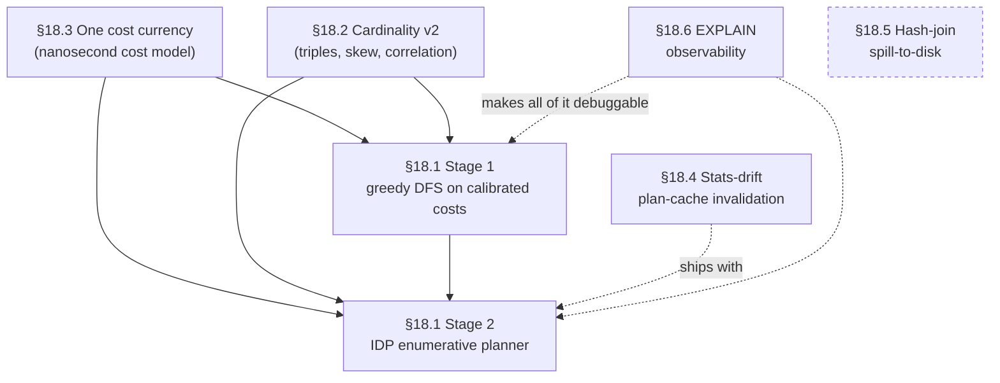

# Chapter 18 — Open Problems: A Contributor's Map

The seventeen chapters behind you describe an engine that works. It parses a
MATCH query into a pattern graph, estimates how many records each alias will
match, picks a root, schedules the edges cheapest-first, replaces the worst
nested loops with hash joins, and prunes adjacency lists with index
pre-filters before loading a single target record. That machinery is real,
it ships, and it is fast enough to run YouTrack in production. It is also
*generation one*. Every estimate it makes is a coarse ranking signal; every
plan it builds is the first plausible plan a greedy search stumbles into;
every cost it compares is denominated in units that cannot be added to the
units the operator next to it uses. None of this is a defect to apologise
for — it is the honest state of a young cost-based planner, and it is exactly
where a new contributor can do the most good. This chapter is a map of the
gaps: what the second generation of each optimisation layer looks like, why
it matters, and which class you open first to start building it.

Read it as a set of on-ramps, not a specification. The team's design
direction for each item is described here in prose; the authoritative,
continuously-updated version lives in the issue tracker (this chapter closes
with how to find it). What this chapter fixes in place is the *code*: the
exact file and line where each problem lives today, verified against the
source tree, so that the distance between "I understand the problem" and "I
have the file open" is one click.

The opportunities are not independent. Some are foundations others stand on;
one is a genuine standalone. The diagram below is the order the rest of the
chapter follows and the order the team recommends approaching them.



**Figure 18.1 — The dependency arc among the six opportunities. Arrows point
from prerequisite to dependant; dotted edges are "recommended companion, not
hard requirement". The hash-join spill work (dashed box) stands apart from
the arc.**

---

## 18.1 Enumerating join orders: from greedy DFS to IDP

Chapter 10 taught you how the planner turns a pattern graph into an ordered
`List<EdgeTraversal>`. The mechanism is a two-level greedy depth-first search:
the outer loop picks the cheapest dependency-free root, the inner loop expands
from it by always emitting the locally cheapest ready edge, and the whole thing
runs to completion without ever reconsidering a choice. The class Javadoc says
so in as many words — "a cost-driven, dependency-aware, depth-first graph
traversal" — and the method that implements it is
`getTopologicalSortedSchedule`
(`core/src/main/java/com/jetbrains/youtrackdb/internal/core/sql/executor/match/MatchExecutionPlanner.java:1976`),
with the per-edge ranking supplied by `estimateEdgeCost`
(`MatchExecutionPlanner.java:2322`). Chapter 10 §10.11 named the limitation
plainly: the greedy DFS never backtracks. Once it commits to an edge, the
schedule stands.

Greedy is right often enough. When the locally cheapest next edge is also the
globally best next edge — the common case for small patterns — the plan it
produces is optimal, and it produces it in polynomial time. The trouble is a
specific family of pattern shapes where the local choice and the global
optimum diverge. Consider a three-hop analytical query that starts from a
large class and narrows only at the far end: `Person` → `KNOWS` → `KNOWS`
→ a friend-of-a-friend constrained to one country. Greedy commits to the
cheapest *root* and expands *forward* from it; it cannot discover that
starting from the tiny far-end set and walking the whole pattern in reverse
would touch an order of magnitude fewer intermediate rows. The LDBC
Interactive Complex queries IC10 and IC11 have exactly this shape, and
greedy starts them from the wrong end. Two further shapes exhibit the same
pathology: a pattern where an expensive edge should be *deferred* until a
downstream filter has shrunk the intermediate cardinality (greedy takes the
locally cheap edge now and pays for it later), and a pattern of two
independent sub-patterns whose cheapest interleaving greedy cannot see
because it commits to one ordering and lives with it.

The team's direction here is a two-stage arc, and the staging is deliberate
so that each stage's payoff can be measured in isolation. **Stage one keeps
the greedy algorithm exactly as it is and changes only what it reads.** Today
`estimateEdgeCost` scores edges in the dimensionless units of the legacy cost
model (§18.3); the plan is to swap those internals for calibrated
nanosecond costs while leaving the DFS shape, the root ordering, and the
dependency resolution untouched. Same search, better signal — a measurable
plan-quality win that ships in weeks rather than the multi-month horizon of
the algorithmic work, and one that de-risks it by putting the new cost data
into production first. **Stage two replaces the greedy search itself** with
Iterative Dynamic Programming: instead of committing to the first plausible
order, the planner enumerates plan alternatives for small subsets of the
pattern, keeps the cheapest per subset, locks it as a virtual unit, and
iterates over the rest. Bottom-up dynamic programming is the industry
consensus for cost-based graph planners; greedy is the outlier. Crucially, the
plan cache (Chapter 7 §7.9) makes the extra search affordable — planning runs
once per cache miss, not once per execution, so a planning budget of tens of
milliseconds is acceptable. Under IDP, the optimisations you met as separate
mechanisms — the hash-join substitution of Chapter 13, the index-assisted
traversal of Chapter 14 — stop being post-hoc rewrites and become plan
alternatives the search costs directly against nested loops.

A contributor starting on stage one reads `estimateEdgeCost`
(`MatchExecutionPlanner.java:2322`) and `getHashJoinThreshold`
(`MatchExecutionPlanner.java:345`) — the two decision points whose heuristic
internals get rewired — and studies how the schedule flows out of
`getTopologicalSortedSchedule` (`MatchExecutionPlanner.java:1976`) so as not
to disturb it. A contributor eyeing stage two reads the same schedule method,
because that DFS loop is what IDP replaces, together with the pattern-structure
records the search must consume unchanged: `PatternNode`
(`.../match/PatternNode.java`), `PatternEdge` (`.../match/PatternEdge.java`),
and the scheduled-edge record `EdgeTraversal` (`.../match/EdgeTraversal.java`).
Scope honestly: stage one is a focused, well-bounded change with a clear
before/after benchmark — a strong first contribution. Stage two is a
multi-month effort touching the heart of the planner, gated behind LDBC
benchmark evidence and best attempted only after stage one has landed and the
cost signal it consumes is trustworthy.

---

## 18.2 Cardinality estimation, version two

A query that runs in milliseconds for every project in your database can fall
off a cliff for exactly one of them — the largest — and the planner never sees
it coming. The reason is that the numbers it plans with are averages, and an
average is a lie about a skewed distribution.

Chapter 8 introduced the three numbers the planner reasons with — cardinality,
selectivity, and fan-out — and was candid that each is allowed to be wrong.
Fan-out in particular is a *global average*: `EdgeFanOutEstimator.estimateFanOut`
(`core/src/main/java/com/jetbrains/youtrackdb/internal/core/sql/executor/match/EdgeFanOutEstimator.java:74`)
divides an edge class's total count by its source class's total count and hands
back a single number. Selectivity for a compound `WHERE` clause multiplies
per-predicate selectivities under an independence assumption, computed by
`SelectivityEstimator`
(`core/src/main/java/com/jetbrains/youtrackdb/internal/core/index/engine/SelectivityEstimator.java:82`).
Both approximations are cheap, and both are systematically biased in ways that
a stronger cost model — and certainly an IDP search — will amplify rather than
absorb.

The pathology worth internalising is skew. Take the query that finds every
comment on every issue of one named project:

```sql
MATCH {class: Project, as: p, where: (name = :projectName)}
      .out('HasIssue')  {class: Issue,   as: i}
      .out('HasComment'){class: Comment, as: c}
RETURN c
```

The planner estimates the intermediate size as
`|p| × avg(HasIssue) × avg(HasComment)`. But project issue counts differ by
orders of magnitude — the IntelliJ IDEA project versus a three-person team's
project share the same edge class and nothing else. A global average is
dominated by the many small projects, so the estimate for `name = 'IntelliJ
IDEA'` undershoots reality by orders of magnitude. The planner picks a plan
that is fine on the median project and cliffs catastrophically on the celebrity
one. Because parameter-specific plans are deliberately off the table — the
plan cache is keyed by query shape, not parameter value — the fix cannot be
"replan for this project." It has to be a plan that is *robust* to the skew.

The team's direction is to make the estimator skew-aware at the edge-class
level and richer at the endpoints, in four increments ordered by return on
investment. First, cache the edge count for each `(source class, edge class,
target class)` triple, so a pattern with class constraints on both ends of an
edge gets a point estimate instead of a proportional guess. Second — the piece
the current estimator most conspicuously lacks — maintain a degree-distribution
histogram per `(source class, edge class, direction)`, reusing the existing
`EquiDepthHistogram`
(`core/src/main/java/com/jetbrains/youtrackdb/internal/core/index/engine/EquiDepthHistogram.java`)
machinery, so the cost model can consume a *quantile* of fan-out (a p99, say)
rather than an average, and prefer a cost-bounded algorithm like a hash join
precisely when a class's degree distribution is long-tailed. Third, dampen the
independence assumption for conjunctive filters — raise the multiplied
selectivity to a sub-one power so correlated predicates stop shrinking the
estimate too aggressively. Fourth, apply a small per-hop pessimism multiplier
to multi-hop traversals, cheap insurance against compounding variance.

A contributor reads `EdgeFanOutEstimator`
(`.../match/EdgeFanOutEstimator.java:74`) — the extension point for
quantile-aware fan-out — and `SelectivityEstimator`
(`.../index/engine/SelectivityEstimator.java:82`) for the correlation-damping
change. The degree histograms lean on `EquiDepthHistogram`
(`.../index/engine/EquiDepthHistogram.java`) and follow the auto-refresh
pattern of `SchemaClassInternal.approximateCount`
(`core/src/main/java/com/jetbrains/youtrackdb/internal/core/metadata/schema/SchemaClassInternal.java:51`).
On scope: the correlation-damping and multi-hop-pessimism increments are
close to one-line changes plus benchmarking — genuine starter tasks. The
triple counts and degree histograms are larger, because they add statistics
that must be collected at ingestion time and refreshed as data changes, which
is where the real design work lives.

---

## 18.3 One cost currency: unifying two incompatible cost systems

Chapters 8 and 14 each introduced a cost model, and here is the awkward truth
the two chapters never reconciled: they are describing *different, incompatible*
cost conventions, and the engine runs both at once. Chapter 8's `CostModel`
(`core/src/main/java/com/jetbrains/youtrackdb/internal/core/sql/executor/CostModel.java:38`)
is the legacy one. Its class Javadoc states the unit plainly — "costs are
expressed in abstract units where one sequential page read = 1.0" — and its
`edgeTraversalCost` method (`CostModel.java:150`) returns `sourceRows ×
avgFanOut × randomPageReadCost`, a dimensionless weighted score. Chapter 14's
pre-filter amortization decision speaks a *different* dimensionless currency.
Its break-even test — is building a pre-filter RidSet worth more than it costs?
— is `estimatedSize / (loadToScanRatio × (1 − selectivity))`, computed by
`EdgeTraversal.evaluateIndexLookupAmortization`
(`.../match/EdgeTraversal.java:957`). The `loadToScanRatio` in that formula is
not a measurement; it is a static constant, `DEFAULT_LOAD_TO_SCAN_RATIO = 100.0`
(`EdgeTraversal.java:143`), overridable by a configuration knob whose default is
likewise `100.0`, documented as "calibrated for cold SSD storage"
(`GlobalConfiguration.java:1387`). It encodes a human's guess that a random
record load costs about a hundred times one in-memory RidSet scan entry.
`currentLoadToScanRatio` (`EdgeTraversal.java:994`) simply returns that
override-or-default; nothing about it is live.

There *is* a real nanosecond counter in this code, and it is a trap for anyone
skimming. `preFilterBuildTimeNanos` (`EdgeTraversal.java:316`) accumulates
genuine wall-clock time spent building pre-filter RidSets — but it feeds only
the `PROFILE` pretty-printer, which prints it as a human-readable `buildTime`
(`MatchStep.java:240`). It is diagnostic output, never an input to the
amortization decision above. Neither cost system in the engine today is
nanosecond-denominated, and neither adapts to live measurements; both are
dimensionless formulas over fixed, hand-tuned coefficients.

The problem is not that either formula is wrong; it is that a number in
page-read units and a number in load-to-scan-ratio units cannot be compared.
Ask the question an IDP planner must answer constantly — "is applying this
index pre-filter here worth more than the edge traversal I would otherwise do
next?" — and the engine has no way to answer it, because the pre-filter
decision is denominated in one dimensionless currency and the traversal cost in
another, and neither can be converted into the other. The two decisions sit
side by side and speak different languages. Worse, both currencies rest on
coefficients baked in at development time — `CostModel`'s "a random read costs
4× a sequential one", the pre-filter path's "a load costs 100× a scan" —
guesses that cannot track the hardware and cache state actually in front of the
query.

The team's direction is to converge on a single cost currency, and the currency
of choice is calibrated nanoseconds — because nanoseconds add, whereas
dimensionless weighted scores tied to drifting coefficients do not compose, and
because a cost that is measured rather than assumed can adapt to the hardware it
runs on. The pre-filter path already demonstrates the *discipline* the
unification needs, even though its currency is the wrong one: a pure static cost
function of its inputs, a cold-start default, and a configuration override to
tune it. The work is to give every operator the planner reasons about — edge
traversal, class and alias prefetch, index seek, hash-join build and probe,
adjacency-list intersection, filter evaluation, and the depth-multiplied WHILE
traversal — a cost function in that one shared currency, backed where possible
by a live metric instead of a hand-tuned constant. Once every operator speaks
it, the legacy `CostModel` can be retired one caller at a time, `estimateEdgeCost`
can be rewritten in the new currency (this is precisely what stage one of §18.1
consumes), and the hash-join threshold can become a calibrated cost comparison
rather than the node-count cutoff it is today.

A contributor starts by reading `CostModel`
(`.../executor/CostModel.java:38`) to see every dimensionless formula that
needs a single-currency counterpart, then reads
`EdgeTraversal.evaluateIndexLookupAmortization`
(`.../match/EdgeTraversal.java:957`) — the break-even formula and its static
`loadToScanRatio` — as the worked example of the cost-function shape to imitate.
This is foundational, medium-sized work: no single formula is hard, but there
are many of them, each ideally backed by a metric wired through the profiler,
and the whole set is a prerequisite for both stages of the planner upgrade. It
is the kind of change that is easy to start and demands discipline to finish.

---

## 18.4 Teaching the plan cache to notice stale statistics

A query can be planned perfectly on Monday and be running a disastrous plan by
Friday — with no schema touched, no index changed, and no line of the query
altered. All that changed is the data underneath it, and the plan cache has no
idea.

Chapter 7 §7.9 walked through the `YqlExecutionPlanCache` and every event that
clears it: a schema change, an index-manager update, a function- or
sequence-library change, a storage-configuration update, and — checked lazily
on read — a change to the global command timeout. Each is a listener method on
the cache — `onSchemaUpdate`, `onIndexManagerUpdate`, `onFunctionLibraryUpdate`,
`onSequenceLibraryUpdate`, and `onStorageConfigurationUpdate`
(`core/src/main/java/com/jetbrains/youtrackdb/internal/core/sql/parser/YqlExecutionPlanCache.java:149–171`) —
alongside a lazy command-timeout drift check (`YqlExecutionPlanCache.java:122`).
Read that list again and notice what is missing: nothing on it fires when the
*data* changes.

That gap is invisible today and load-bearing tomorrow. A plan is built from a
snapshot of cardinality estimates and index histograms, then reused for the
whole lifetime of its cache entry — until it is evicted or a DDL event clears
it. On a long-lived server whose data grows continuously, a plan chosen when a
class held a thousand records keeps running unchanged after the class has grown
to ten million. The current greedy planner tolerates this because its cost
model is coarse enough that stale statistics rarely flip a decision. The moment
the planner becomes genuinely cost-based — the moment §18.1 and §18.3 land —
that tolerance evaporates: a sharper cost model amplifies the impact of stale
inputs, and without stats-based invalidation a cost-based planner is
effectively guaranteed to serve progressively-worse plans the longer a server
runs.

The team's direction takes Neo4j as the closest architectural match — a
cross-session, per-database cache with background statistics refresh and no
parameter-specific plans — and gives the cache a way to notice that its inputs
have moved. The shape is a divergence check: record what a plan depended on (or
a coarser global "statistics epoch"), and when a tracked statistic drifts past
a threshold relative to its cached value, rebuild the plan on the next request.
The favourable facts are that the invalidation bus already exists (adding a
stats signal follows the same pattern as the DDL listeners above), histograms
already auto-refresh in the background, class counts are O(1), and plans are
cached as full physical plans so a replan is a clean rebuild with no partial
reuse to reason about. The hazards are concurrency (the cache is shared, so
per-entry snapshot state must be cheap and safe to read concurrently) and
avoiding thrash (a minimum replan interval, so a hot query is not re-planned
on every statistics tick).

A contributor reads `YqlExecutionPlanCache`
(`.../sql/parser/YqlExecutionPlanCache.java`) end to end — the existing
listener methods are the template a new stats-drift trigger imitates — and the
statistics consumers it would watch: `SchemaClassInternal.approximateCount`
(`.../metadata/schema/SchemaClassInternal.java:51`) and the estimators of §18.2.
This is medium-scoped work with an unusually clean fit to the existing
architecture, and it should ship with or before the cost-based planner rather
than after it. Its natural companion is the observability work of §18.6, which
is what lets an operator confirm that a plan was in fact replanned because its
statistics drifted.

---

## 18.5 When a hash join outgrows memory: spill to disk

Chapter 13 taught you the hash-join idea: rather than re-run a sub-plan once per
outer row, build a hash table from the inner side once and probe it in O(1) per
row, trading memory for time. It also taught you the safety net every hash-join
step keeps — when a build side turns out larger than the planner estimated, the
step does not crash; it falls back to per-row nested-loop evaluation and keeps
producing correct results, only slower.

This section is about a fourth hash-join step that Chapter 13 did not open up,
and about what that safety net costs when it fires. The step handles
*back-reference* edges — the shapes where a traversal target is compared to an
already-bound alias, such as `where: (@rid = $matched.person.@rid)` or
`$currentMatch NOT IN $matched.start.out('LIKES')`. Instead of walking a link
bag once per upstream row, it builds a hash table from the back-referenced
vertex's link bag, caches it per binding, and probes it per row in O(1). That
step is `BackRefHashJoinStep`
(`core/src/main/java/com/jetbrains/youtrackdb/internal/core/sql/executor/match/BackRefHashJoinStep.java`),
and it is where the fallback cliff is steepest. It is worth being precise about
what the engine does and does not do at the edge of that cliff, because it is
easy to assume a database throws or spills when it does neither.

Here is the honest picture. There is no hard memory cap that aborts a hash
join. Past the build-side estimate governed by `QUERY_MATCH_HASH_JOIN_THRESHOLD`
(`core/src/main/java/com/jetbrains/youtrackdb/api/config/GlobalConfiguration.java:863`,
default 10,000), the planner simply does not choose the hash path, and at
runtime an oversized build degrades to nested loops. For this step the fallback
is spelled out in the code: its class Javadoc states that past the threshold
"the step falls back to per-row nested-loop traversal"
(`BackRefHashJoinStep.java:39`), and the fallback itself is the
`nestedLoopFallback` method (`BackRefHashJoinStep.java:420`), reached from the
probe paths on a failed build (`BackRefHashJoinStep.java:292` and `:358`). And
there is no spill to disk anywhere — searching the tree for the spill
primitives a spill-to-disk design would build on (`SpillFile`,
`SpillPartitionManager`, `SpillRowSerializer`) returns nothing; they do not
exist yet.

Why it bites: consider a MATCH with an anti-join over a popular vertex's
outgoing edges — `$currentMatch NOT IN $matched.person.out('LIKES')` — where
that person has 200,000 `LIKES` edges and 50,000 rows flow into the step. The
nested-loop fallback re-scans the 200,000-entry link bag once per upstream row:
fifty thousand times two hundred thousand is ten billion comparisons for what a
single hash build and fifty thousand O(1) probes would resolve. `KNOWS`-degree
patterns stay under the threshold even at LDBC scale factor 100 and rarely hit
this, but high-fan-out edge classes — likes, memberships, replies, tags — reach
it routinely on their celebrity vertices.

This is therefore a *two-layer* gap, and framing it honestly matters for a
contributor deciding where to start. The lower layer is the spill
infrastructure that does not exist: the on-disk file format, a partition
manager, and a row serializer that a build side too large for memory can
overflow into. The upper layer is wiring that infrastructure into
`BackRefHashJoinStep`'s fallback so an oversized build partitions to disk
instead of degrading to per-row re-scans. The team's direction sequences the
upper layer as two phases even before full spill: first, replace the blunt
entry-count threshold with a memory-budget guard — a 4 MB budget already holds
hundreds of thousands of the fixed-width RID entries a back-reference build
stores, which alone eliminates the fallback for the vast majority of real
workloads — and only then add true build-side spill as the safety net for the
extreme, million-edge vertices.

A contributor reads `BackRefHashJoinStep`
(`.../match/BackRefHashJoinStep.java`): the class Javadoc at line 39 for the
current threshold behaviour, the `nestedLoopFallback` method at line 420 for
what the cliff costs, and the `BUILD_FAILED` / `CachedBuild` build-state
markers at lines 54 and 61 that a memory-budget or spilled state would replace.
Scope: the memory-budget phase is high-value and comparatively low-effort — a
contained change to one step's guard. Building the spill
primitives from scratch and then wiring them in is a substantially larger,
storage-touching effort, and it is genuinely standalone: it does not depend on
the planner or cost-model arc, and nothing in that arc depends on it.

---

## 18.6 Making the planner's reasoning visible in EXPLAIN

Chapter 16 taught you to read `EXPLAIN` output and diagnose a slow query from
its plan shape — the root alias, the arrow directions, the intersection
annotations, the hash-join prefixes. It also told you, in §16.3, the frustrating
limit: `EXPLAIN` shows the *result* of the planner's cost calculations, not the
calculations themselves. The cardinality map and the edge costs are plan-time
intermediates, discarded before execution. You can see *that* the planner chose
`Person` as the root; you cannot see the number it believed made `Person`
cheapest, and you certainly cannot compare that number to what actually
happened at runtime.

The step contract is closer to solving this than it looks. `ExecutionStep`
already carries a `cost` field, and it is already denominated in nanoseconds —
`getCost` returns "the absolute cost (in nanoseconds) of the execution of this
step"
(`core/src/main/java/com/jetbrains/youtrackdb/internal/core/query/ExecutionStep.java:30`),
surfaced through `toResult` (`ExecutionStep.java:35`, which sets the `cost`
property at line 40). But that number is the *actual measured* wall-time,
populated only when profiling is on; there is no field for the planner's
*estimate*. The single most useful number for debugging a regression — the
ratio of estimated to actual cardinality per step — cannot be computed because
one half of it is never recorded.

The team's direction is to extend the step's structured output with the missing
estimates: estimated cost, estimated rows in and out, and — once profiling is
on — the estimate-versus-actual ratios that turn "why is this query slow?" from
an open-ended investigation into a scan for the step whose estimate was most
wrong. At the plan level, the same surface would carry the planner's own
wall-time, whether the plan came from the cache fresh or replanned, and (tied
to §18.4) the statistics epoch the plan was built under. Once the IDP planner
of §18.1 exists, this is also where its rejected alternatives would surface —
the plans the search considered and priced higher — so that a contributor can
confirm the algorithmic upgrade is actually finding the reverse-direction and
hash-join alternatives it was built to find. The output is additive by design:
new properties on a `Result` object that already tolerates arbitrary keys, so
existing consumers are unaffected.

A contributor reads the step contract `ExecutionStep`
(`.../core/query/ExecutionStep.java`) — `getCost` at line 30 and `toResult` at
line 35 are where the estimate fields attach — alongside the per-step
`prettyPrint` implementations Chapter 16 catalogued. This is incremental,
additive, and low-risk work with immediate diagnostic payoff, and it is the
best on-ramp of the six: it touches a small, well-understood contract, it
makes every other item in this chapter easier to verify, and it can land early
and in parallel with the rest of the arc.

---

## 18.7 Smaller starters

Not every contribution needs to be a planner rewrite. The following are
smaller, self-contained pieces of debt — each one an afternoon to a few days,
each one a clean way to learn a corner of the codebase without taking on a
foundational subsystem. Unlike the sections above, these are genuinely a list
of independent cases:

- **Relax the NOT-pattern restrictions.** `manageNotPatterns`
  (`.../match/MatchExecutionPlanner.java:681`) rejects three legal-looking NOT
  shapes with "not supported (yet)" exceptions: a NOT whose origin alias is not
  already present in the positive pattern (`MatchExecutionPlanner.java:691`), a
  NOT that puts a `WHERE` filter on its initial alias
  (`MatchExecutionPlanner.java:697`), and a NOT containing a multi-hop path item
  (`MatchExecutionPlanner.java:708`). Each `TODO` is a bounded feature with a
  clear test surface.

- **Remove the vestigial `ridRangeConditions` field — or make its Javadoc
  true.** `QueryPlanningInfo` declares a `ridRangeConditions` field
  (`.../executor/QueryPlanningInfo.java:195`) that is copied faithfully in the
  plan-info copy constructor (`QueryPlanningInfo.java:229`) and assigned by
  `SelectExecutionPlanner` when it extracts RID ranges from a WHERE clause
  (`.../executor/SelectExecutionPlanner.java:1592`). A Javadoc there claims the
  field is "used to narrow the collection scan range in
  `FetchFromClassExecutionStep`"
  (`SelectExecutionPlanner.java:1657`) — but nothing ever reads the field back.
  It is written, copied, and documented as load-bearing, yet dead. Either wire
  it into the scan as the Javadoc promises, or delete it and the misleading
  comment.

- **Retire the dead `QUERY_PARALLEL_*` configuration knobs.** Three
  configuration entries — `QUERY_PARALLEL_AUTO`
  (`.../api/config/GlobalConfiguration.java:894`),
  `QUERY_PARALLEL_MINIMUM_RECORDS` (`GlobalConfiguration.java:900`), and
  `QUERY_PARALLEL_RESULT_QUEUE_SIZE` (`GlobalConfiguration.java:906`) — have no
  readers anywhere in the tree. They advertise a parallel-query feature the
  engine does not have. Removing them (with the appropriate deprecation
  courtesy) tidies the configuration surface.

- **Rename or document `ParallelExecStep`.** The step named
  `ParallelExecStep` (`.../executor/ParallelExecStep.java:40`) executes its
  sub-plans strictly *sequentially* — its own class Javadoc admits the name
  reflects only "logical parallelism" and that execution is sequential via a
  `MultipleExecutionStream` (`ParallelExecStep.java:14`). A reader who trusts
  the name will misjudge the engine's concurrency. Renaming it (or, less
  disruptively, hardening the Javadoc) removes a standing trap.

---

## 18.8 How to engage — and what you have become

Every problem in this chapter has a home in the issue tracker, where the team's
current thinking, the assigned priorities, and the discussion that supersedes
this snapshot all live. That is the YouTrackDB project on YouTrack —
`https://youtrack.jetbrains.com/issues/YTDB`. Start there: search for the
subsystem you want to work on, read the open issues, and comment before you
build, because the design direction sketched here is a moving target and the
tracker is the source of truth.

When you have a change, you need a way to prove it helps, and the engine ships
one. The `jmh-ldbc/` module is a JMH benchmark harness built on the LDBC Social
Network Benchmark — twenty read queries from the Interactive workload, most of
them MATCH queries, split into throughput tiers. Two command-line entry points
matter for day-to-day work: `LdbcDatabaseTool`
(`jmh-ldbc/src/main/java/com/jetbrains/youtrackdb/benchmarks/ldbc/LdbcDatabaseTool.java`)
loads and manages a benchmark database, and `LdbcExplainTool`
(`jmh-ldbc/src/main/java/com/jetbrains/youtrackdb/benchmarks/ldbc/LdbcExplainTool.java`)
prints the plan the engine chose for each LDBC query — which is exactly the
before/after evidence the planner and cost-model work is gated on. Every one of
the larger opportunities above names the LDBC suite as its landing gate; this
is the harness that decides whether your change is an improvement.

As for the contribution path itself: this book *is* it. The repository's root
`README.md` has a short "Contributing" section (line 133) and it points at
exactly one place — *Inside the YouTrackDB Query Engine*, the book you are
finishing. There is deliberately no separate contributor handbook, no
`CONTRIBUTING.md`, no `docs/agents/` directory to hunt for; the seventeen
chapters before this one are the onboarding, and this chapter is the map of
where they lead.

Which brings the book to its close. You began not knowing what a pattern graph
was. You now know how a MATCH query is parsed into one, how the planner
estimates its way to a root and a schedule, how the step pipeline pulls rows
through traversers, how hash joins and index pre-filters replace the parts of
the nested-loop machine that would otherwise melt, and how to read all of it
back out of an `EXPLAIN`. That is enough — more than enough — to open any file
named in this chapter, understand the problem it holds, and start closing the
gap. You are no longer a reader of this engine. You are equipped to be one of
the people who improves it.

---

> **A snapshot, not a fixture.** This chapter describes the backlog as of
> source baseline `a9b05e3f56`. Every code citation was verified against that
> tree, but open problems are by nature in motion — some of these will be
> solved, re-scoped, or reprioritised by the time you read this. Treat the
> file-and-line pointers as a reliable starting point and the YTDB issue
> tracker as the current truth.

---

## Further reading

- `core/src/main/java/com/jetbrains/youtrackdb/internal/core/sql/executor/match/MatchExecutionPlanner.java`
  — the greedy planner: `getTopologicalSortedSchedule` (line 1976),
  `estimateEdgeCost` (line 2322), `getHashJoinThreshold` (line 345),
  `manageNotPatterns` (line 681).
- `core/src/main/java/com/jetbrains/youtrackdb/internal/core/sql/executor/CostModel.java:38`
  — the legacy dimensionless cost model (§18.3).
- `core/src/main/java/com/jetbrains/youtrackdb/internal/core/sql/executor/match/EdgeTraversal.java`
  — the pre-filter build-amortization model (a dimensionless load-to-scan
  ratio, not a live nanosecond cost): `evaluateIndexLookupAmortization`
  (line 957); the static `DEFAULT_LOAD_TO_SCAN_RATIO = 100.0` (line 143)
  returned by `currentLoadToScanRatio` (line 994); and the PROFILE-only
  diagnostic counter `preFilterBuildTimeNanos` (line 316), printed by
  `MatchStep.java:240`.
- `core/src/main/java/com/jetbrains/youtrackdb/internal/core/sql/executor/match/EdgeFanOutEstimator.java:74`
  and `core/src/main/java/com/jetbrains/youtrackdb/internal/core/index/engine/SelectivityEstimator.java:82`
  — the estimators of §18.2, with `EquiDepthHistogram`
  (`core/src/main/java/com/jetbrains/youtrackdb/internal/core/index/engine/EquiDepthHistogram.java`)
  and `SchemaClassInternal.approximateCount`
  (`core/src/main/java/com/jetbrains/youtrackdb/internal/core/metadata/schema/SchemaClassInternal.java:51`).
- `core/src/main/java/com/jetbrains/youtrackdb/internal/core/sql/parser/YqlExecutionPlanCache.java`
  — the plan cache and its invalidation listeners (lines 149–171) and timeout
  drift check (line 122); no statistics-drift trigger exists (§18.4).
- `core/src/main/java/com/jetbrains/youtrackdb/internal/core/sql/executor/match/BackRefHashJoinStep.java`
  — nested-loop fallback (`nestedLoopFallback`, line 420; class doc, line 39);
  no spill infrastructure exists (§18.5).
- `core/src/main/java/com/jetbrains/youtrackdb/api/config/GlobalConfiguration.java`
  — `QUERY_MATCH_HASH_JOIN_THRESHOLD` (line 863),
  `QUERY_PREFILTER_LOAD_TO_SCAN_RATIO` (line 1387, default 100.0), and the dead
  `QUERY_PARALLEL_*` knobs (lines 894, 900, 906).
- `core/src/main/java/com/jetbrains/youtrackdb/internal/core/query/ExecutionStep.java`
  — `getCost` (line 30) and `toResult` (line 35): the nanosecond cost surface
  the observability work extends (§18.6).
- `core/src/main/java/com/jetbrains/youtrackdb/internal/core/sql/executor/QueryPlanningInfo.java:195`
  and `core/src/main/java/com/jetbrains/youtrackdb/internal/core/sql/executor/SelectExecutionPlanner.java:1592`
  — the vestigial `ridRangeConditions` field (§18.7).
- `core/src/main/java/com/jetbrains/youtrackdb/internal/core/sql/executor/ParallelExecStep.java:40`
  — the sequentially-executing step with the misleading name (§18.7).
- `jmh-ldbc/src/main/java/com/jetbrains/youtrackdb/benchmarks/ldbc/LdbcDatabaseTool.java`,
  `jmh-ldbc/src/main/java/com/jetbrains/youtrackdb/benchmarks/ldbc/LdbcExplainTool.java`
  — the LDBC benchmark harness a contributor uses to verify a change (§18.8).
- [Chapter 8 in this book](08-cardinality-selectivity-fanout.md) — cardinality,
  selectivity, and fan-out; the numbers §18.2 and §18.3 sharpen.
- [Chapter 10 in this book](10-scheduling.md) — the greedy scheduling DFS that
  §18.1 upgrades.
- [Chapter 13 in this book](13-hash-joins.md) — the hash-join idea and its
  three variants; §18.5 concerns a fourth, `BackRefHashJoinStep`, and its
  spill gap.
- [Chapter 14 in this book](14-index-assisted-traversal.md) — index-assisted
  pre-filtering and its load-to-scan-ratio amortization: the second of the two
  cost conventions §18.3 sets out to unify.
- [Chapter 7 in this book](07-eight-phase-planner.md) — §7.9, the plan cache
  whose invalidation §18.4 extends.
- [Chapter 16 in this book](16-reading-explain.md) — reading EXPLAIN, the
  surface §18.6 enriches.
