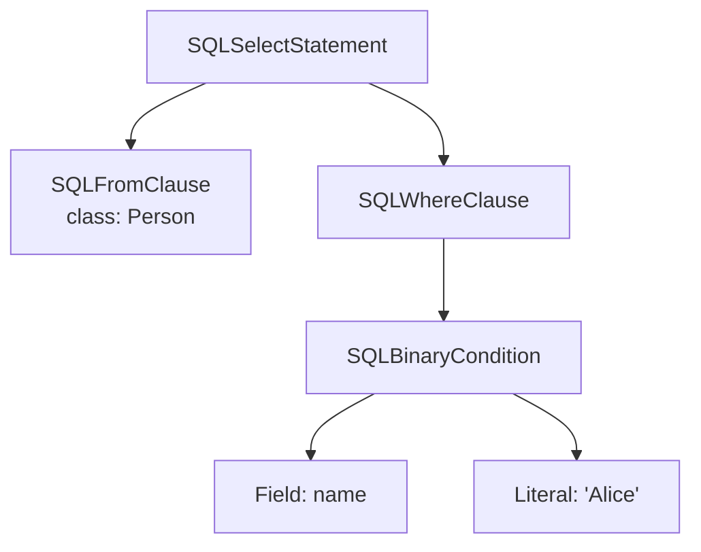
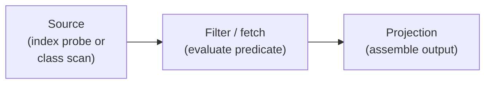
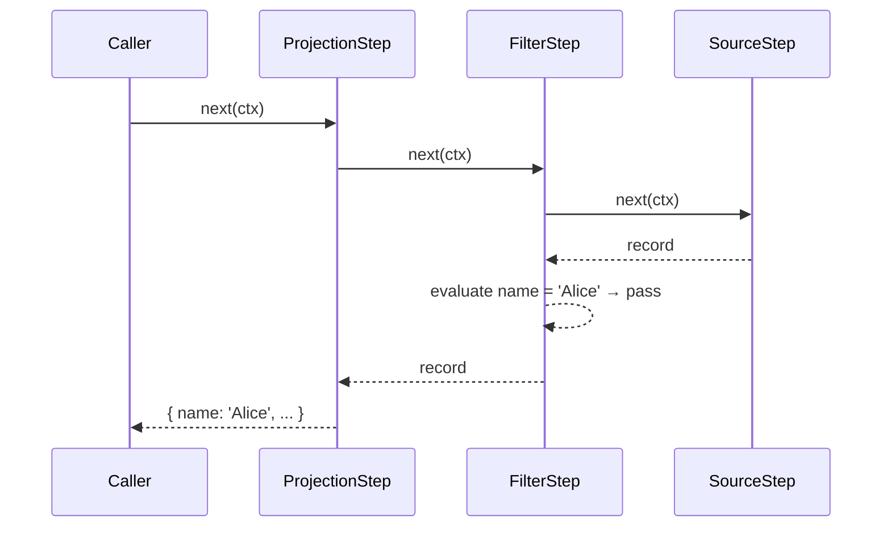

# Chapter 3 — The Life of a Query: A Bird's-Eye Tour

Chapter 2 left you with a concrete picture of how YouTrackDB stores data: records identified by RIDs, vertices with adjacency lists embedded directly in the record, and O(1) hops because there is no secondary index to consult. You now have the nouns. This chapter introduces the verbs — the pipeline every SQL statement travels before a single result row appears.

We are going to follow one query, from the moment the engine receives the SQL text to the moment it hands back data. The query is deliberately plain:

```sql
SELECT FROM Person WHERE name = 'Alice'
```

No graph traversal, no joins, no aggregation. That simplicity is the point. By the end of this chapter you will have a mental map of the four pipeline stages — parse, plan, execute, return — that every subsequent chapter fills in. MATCH introduces extra complexity on top of this same pipeline; Chapter 5 takes it up once we have this foundation in place.

---

## 3.1 Parse: turning text into a tree

The engine first needs to understand the *structure* of the query. It does not yet care what `Person` is or whether a field called `name` exists — it is reading grammar, not schema.

YouTrackDB generates its parser from a grammar file (`core/src/main/grammar/YouTrackDBSql.jjt`) using **JavaCC**, a parser generator that turns grammar rules into Java classes. Each grammar rule becomes a node type in a tree. The tree is called an *Abstract Syntax Tree* — **_AST_** for short — and it represents the query as a hierarchy of named parts rather than as flat text.

For our query, the parse step produces a tree that looks like this:



**Figure 3.1 — AST for `SELECT FROM Person WHERE name = 'Alice'`. Each node corresponds directly to one grammar rule in `YouTrackDBSql.jjt`. The actual generated Java class names carry the `SQL` prefix (e.g. `SQLSelectStatement`, `SQLFromClause`).**

The tree has no knowledge of indexes, no estimate of how many `Person` records exist, and no idea whether `name` has a value. Parsing is purely syntactic. If the query is grammatically ill-formed — a missing keyword, an unclosed parenthesis — the parse step throws an error and the pipeline stops here. Otherwise the AST is passed, intact and unevaluated, to the planner.

Chapter 4 opens the AST up and shows what it really contains: how the grammar rules map to Java classes, how the visitor pattern walks the tree, and why the planner deep-copies the AST before it starts work.

---

## 3.2 Plan: making the decisions

The AST tells the planner *what* was asked. The planner's job is to decide *how* to answer it.

Think of the planner as the decision-maker. It reads the AST once, consults the schema and any available index statistics, and emits an *execution plan* — an ordered list of small, self-contained steps. Once planning is finished, no further decisions are made. Execution is purely mechanical.

For our query, the planner asks one important question: is there an index on `Person.name`? The answer changes the plan.

**With an index on `name`:** the planner produces three steps. First, an index lookup step that probes the index with the value `'Alice'` and returns the matching RIDs. Second, a fetch step that loads the full records for those RIDs. Third, a projection step that assembles the output columns from those records.

**Without an index:** the planner replaces the index lookup with a full-class scan — a step that iterates all clusters belonging to `Person` — followed by a filter step that evaluates `name = 'Alice'` against each record, and then the same projection step at the end.

Both plans have the same three-box shape:



**Figure 3.2 — The three-step execution plan for `SELECT FROM Person WHERE name = 'Alice'`. The source step changes depending on whether an index is available; the shape does not.**

*Planning is where the engine decides which index to use.* Nothing in the execution stage revisits that decision. If the planner chose the index path, the executor uses the index. If it chose the scan path, the executor scans. This clean separation — all decisions in planning, all mechanics in execution — is what makes the planner the most interesting part of the system to study and extend.

Chapters 8, 9, and 10 cover the cost-based machinery the planner uses when the query is a MATCH pattern and the decisions are harder. For a plain SELECT like this one, the logic is simpler, but the principle is identical.

---

## 3.3 Execute: pulling rows through the chain

The execution plan is a chain of steps. Each step is a small Java object. The chain is *pull-based*: nothing moves until someone asks for a row.

When the executor starts the plan, it calls `start()` on the last step in the chain. That step does not immediately produce any output. Instead it asks the step before it for a row. That step asks the step before *it*, and so on, all the way back to the source. Only when the source step has a record ready does data begin to flow forward.

The interaction looks like this:



**Figure 3.3 — Pull-based execution for our three-step plan. The caller's single `next(ctx)` call drives the entire chain. (The actual signature is `next(CommandContext)` on the `ExecutionStream` interface.)**

This model has a practical consequence that matters from day one: *memory consumption is bounded by the depth of the pipeline, not by the number of results*. The source step does not load all `Person` records into memory before the filter runs. It loads one, passes it up, and only when the projection step has returned that row to the caller does it reach back down for the next one. A query that matches a million records uses no more memory than one that matches ten, as long as the caller consumes results one at a time.

The pull-based model also makes early termination essentially free. If the client adds `LIMIT 10`, the caller simply stops asking for rows after ten. No step below is notified; they just stop being called. The source step never scans beyond what is needed.

Chapter 11 covers the full catalogue of execution steps and shows exactly how each one transforms the stream it receives from its predecessor.

---

## 3.4 Return: handing the rows back

When a query specifies an explicit column list, the final step in the plan is a projection step. It takes the internal result row — a record object with all its raw fields — and assembles the output the caller actually requested. For `SELECT FROM Person WHERE name = 'Alice'` with no explicit column list the planner may omit this step entirely and return the full record directly; when columns are specified, the projection step converts the internal representation into the `Result` objects the API exposes.

This stage is architecturally trivial. It is worth naming only so the pipeline is complete: parse, plan, execute, return. Every query goes through all four.

---

## 3.5 The mental model

Here is the map you should carry into the rest of the book. Parse is purely syntax: the parser
emits a tree of grammar nodes and makes no decisions about schema, statistics, or execution.
Plan is where every decision lives: the planner reads the AST once, consults index statistics,
and produces an ordered step chain; nothing is re-decided during execution. Execute is
mechanics: steps pull rows from each other lazily, keeping memory proportional to pipeline
depth and making early termination free. Return is projection: when a column list is present,
a final step shapes the raw records into the format the caller expects; otherwise the full
record is returned directly.

This four-stage pipeline applies equally to a simple `SELECT` and to a complex MATCH pattern. The difference is that MATCH forces the planner to make far more decisions — which alias to start from, in what order to walk the edges, whether any of those edges can be reversed. But the pipeline stages themselves do not change. Chapter 5 introduces MATCH, after Chapter 4 has opened the AST up. We want to see the simpler pipeline clearly before adding the graph-specific complexity on top.

---

## Summary

`SELECT FROM Person WHERE name = 'Alice'` passes through four stages. The JavaCC-generated parser reads the SQL text and produces an AST whose nodes correspond one-to-one with grammar rules — no schema, no semantics. The planner reads the AST, consults index statistics, and emits an ordered chain of execution steps; all decisions, including which index to use, are made here. The executor runs the chain pull-style: each step requests one row from its predecessor, keeping memory proportional to pipeline depth rather than result count. A final projection step shapes the output for the caller.

The same pipeline handles every SQL statement in YouTrackDB, including MATCH. What changes is what the planner must decide and how many steps it emits, not the four-stage shape itself.

---

## Further reading

**Source code**

- `core/src/main/grammar/YouTrackDBSql.jjt` — the JavaCC grammar; the source of truth for all SQL syntax.
- `core/src/main/java/com/jetbrains/youtrackdb/internal/core/sql/executor/SelectExecutionPlan.java` — the container that holds the ordered step chain; see the class-level Javadoc for the pull-based execution model and plan caching behaviour.

**Next chapter**

Chapter 4 — *The Parser and the AST* — opens the parse stage fully: how grammar rules become Java classes, how a visitor pass walks the tree, and why the planner deep-copies the AST before it begins work.
